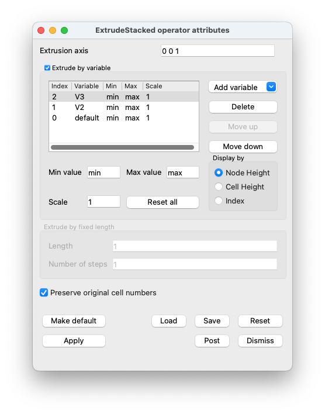

.. _ExtrudeStacked operator:

ExtrudeStacked operator
~~~~~~~~~~~~~~~~~~~~~~~

The ExtrudeStacked operator uses one or more scalar fields on a 2D mesh to extrude each node in the input mesh, resulting in a 3D height field.
The ExtrudeStacked operator can also extrude higher dimensional meshes that have been sliced producing a 2D mesh.
The resulting extruded mesh can be displayed by the extrusion height or an index (see: :numref:`Figure %s <extrude>`).

.. _extrude:

.. figure:: images/extrude.png

   ExtrudeStacked operator example: A simple structured grid extruded by a single scalar cell value.

Using the ExtrudeStacked operator
"""""""""""""""""""""""""""""""""

The ExtrudeStacked operator can be used to create 3D height field plots by applying the operator to a plot that accepts scalar values.
The ExtrudeStacked operator is quite flexible as it can extrude by more than one variable and be displayed different ways.

The most useful feature of the ExtrudeStacked operator is its ability to extrude a mesh using multiple arbitrary scalar variables along an arbitrary **Extrusion axis**.
By **default**, the ExtrudeStacked operator uses the plot's current variable to extrude the mesh.
This only works when the plotted variable is a scalar variable.
When one applies the ExtrudeStacked operator to plots that do not accept scalar variables, the ExtrudeStacked operator will fail unless a specific scalar variable is chosen in the **Add Variable** variable menu in the **ExtrudeStacked attributes window** (see :numref:`Figure %s <extrudeWindow>`).

.. _extrudeWindow:

.. figure:: images/extrudeWindow.png

   ExtrudeStacked operator window.

When a variable is added, it is added to the top of the stack and given the next largest index.
That is the bottom of the stack is the variable with index 0.
It is possible to reorder and delete variables via the **Move up** or **Move down** and **Delete** buttons in the **ExtrudeStacked attributes window**.

(see :numref:`Figure %s <extrudeWindowStacked>`).

.. _extrudeWindowStacked:

   ExtrudeStacked operator window multiple variables.

As the ExtrudeStacked operator uses a scalar variable to extrude all of the points in the mesh, one can set the minimum and maximum values as well as scale for each scalar variable.
This allows one to eliminate data that might otherwise cause the extruded mesh to be stretched undesirably.
To set the minimum and maximum values and scale for the ExtrudeStacked operator, one first selects the variable, then sets the **Min** or **Max** or **Scale** in the **ExtrudeStacked attributes window** (see :numref:`Figure %s <extrudeWindowScaled>`).
The values will automatically be updated in the variable table and then applied to the mesh (see :numref:`Figure %s <extrudeScaled>`).

.. _extrudeWindowScaled:

   ExtrudeStacked operator window with the values scaled.

.. _extrudeScaled:

.. figure:: images/extrudeScaled.png

   ExtrudeStacked operator used to create a scaled plot using one variable.
   The left image used node based scalar values to extrude the mesh, the right image scaled the scalar values by two.
   Both are displayed by the node based scalar values (see the next section).

It is possible to **Display by** the resulting field via the **Index** of the variable in the stack or by the scalar values used to extrude the mesh.
If cell based scalar values are used then the **Node Height** and the **Cell Height** will be same.
If node based scalar values are used then the **Node Height** will relfect the scalar value while the **Cell Height** will be average scalar value for that cell.
(see: :numref:`Figure %s <extrudeStacked>`).
Note: when extruding by a single variable it is possible to **Display by** the resulting field via the **Original Data**.
Thus making it possible to extrude by one variable and **Display by** a different variable

.. _extrudeStacked:

.. figure:: images/extrudeStacked.png

   ExtrudeStacked operator used to create a stacked plot using two variables.
   The left image is displayed using cell based scalar values used to extrude the mesh, the right image is displayed by using the variable index.

It is also possible to extrude by a fixed **Length** while dividing the resulting mesh into a **Number of Steps**.
When extruding by a fixed **Length** the **Extrusion axis** will be used.
