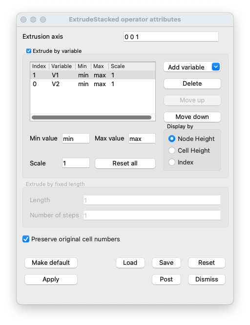

.. _ExtrudeStacked operator:

ExtrudeStacked operator
~~~~~~~~~~~~~~~~~~~~~~~

The ExtrudeStacked operator uses a scalar field on a 2D mesh to
extrude each node in the input mesh, resulting in a 3D mesh. The The
ExtrudeStacked operator can also extrude plots whose input data was
produced from higher dimensional data that has been
sliced. Furthermore, the ExtrudeStacked operator allows you to display
multiple scalar fields in a single plot such as when a Pseudocolor
plot of scalar variable A is extrudes by scalar variable B (see:
:numref:`Figure %s <extrude>`).

.. _extrude:

.. figure:: images/extrude.png

   ExtrudeStacked operator example: A simple structured grid extruded
   by the cell number.

Using the ExtrudeStacked operator
"""""""""""""""""""""""""""""""""

The ExtrudeStacked operator can be used to create 3D height field
plots by applying operator to a plot that accepts scalar values. The
ExtrudeStacked operator is quite flexible because it can extrude by
more than one variable and coloring by the same variable.

Since the ExtrudeStacked operator uses a scalar variable to extrude
all of the points in the mesh, the ExtrudeStacked operator has a
number of controls related to scaling scalar data. For example, the
ExtrudeStacked operator allows you to artificially set minimum and
maximum values for the scalar variable so you can eliminate data that
might otherwise cause your extruded plot to be stretched undesirably
in the Z direction. To set minimum and maximum values for the
ExtrudeStacked operator, set the **Min** or **Max** check boxes in the
**ExtrudeStacked attributes window** (see :numref:`Figure %s
<extrudeWindow>`) and type new values into the adjacent text
fields.

.. _extrudeWindow:

   ExtrudeStacked operator window

The most useful feature of the ExtrudeStacked operator is its ability
to extrude using multiple arbitrary scalar variables. By default,
the ExtrudeStacked operator uses the plotted variable to extrude the
plot's mesh. This only works when the plotted variable is a scalar
variable. When you apply the ExtrudeStacked operator to plots that do
not accept scalar variables, the ExtrudeStacked operator will fail
unless you choose a specific scalar variable using the **Extrude by
Variable** variable menu in the **ExtrudeStacked attributes window**.
(see: :numref:`Figure %s <extrudeStacked>`).

.. _extrudeStacked:

.. figure:: images/extrudeStacked.png

   ExtrudeStacked operator used to created a stacked plot using two
   variables. The left image is colored based on scalar values, the
   right image is color based on the variable index.

Changing extrusion scaling
""""""""""""""""""""""""""

The ExtrudeStacked operator uses a scalar variable's data values as
the Z component when converting a mesh's 2D coordinates into 3D
coordinates. When the scalar variable's data extents are small/large
relative to the mesh's X and Y extents then you often get what appears
to be a flat 2D version or line in 3D space. It is sometimes necessary
to scale the scalar variable's data extents relative to the spatial
extents in order to produce a visualization where the Z value differs
noticeably. If you want to exaggerate the Z values that the scalar
variable contributes to make differences more obvious, you can click
on the **Scale Factor** check box in the **ExtrudeStacked attributes
window**. (see: :numref:`Figure %s <extrudeScaled>`).

.. _extrudeScaled:

   Effect of scaling relative to XY limits
