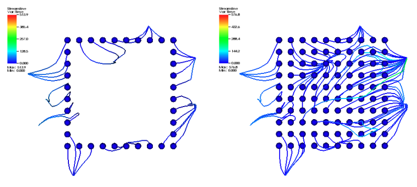

.. _Integral Curve operator:

Integral Curve operator
~~~~~~~~~~~~~~~~~~~~~~~

The Integral Curve Operator allows the user to compute an integral curve from a
seed point through a vector field without any analysis of its structure.

Source
^^^^^^

The set of points that seed the integral curves. In addition to the
:ref:`common ICS source` attributes common to all ICS operators, the
Integral Curve operator supports the following attributes:

Source type
"""""""""""

The source type controls how the seeds for the curves are created. There are
various options, the names of which are self-descriptive such as creating them
along a *line* or around a *sphere*. Only those options that require further
clarification are described further here. 
   
Point List
    Seed from a list of points. In addition to *Add Point*, *Delete Point*, and
    *Delete All Points*, the user can *Read Text File* that is formatted with
    one point per each line either as "X Y Z" or "X, Y, Z".
   
Selection
    Seed with a named selection.
    
Field Data
    The seed points are defined by another operator and passed to the Integral
    Curve operator. The name of the array containing the seed points must begin
    with the string "Seed Points".

Up Axis
    The "up axis" serves as the "Y" axis embedded in the plane or circle.

Sampling type
"""""""""""""

For samples taken from a geometric object, there is an option to generate
uniform or random samples from the specified region. Random samples can be
reproduced by supplying a random number seed.

Boundary vs Interior Samples
""""""""""""""""""""""""""""

Samples from a geometric object can be taken either from the boundary or the
interior. For example, when sampling a plane, the samples can
either lie along the edges of the planar region or within the bounded
rectangle, as shown below.

Integration
^^^^^^^^^^^

Specify settings for numerical integrators. In addition to the
:ref:`common ICS integration` attributes common to all ICS operators, the
Integral Curve operator supports the following attributes.

Integration Direction
"""""""""""""""""""""

Sets the integration direction through time. The user can choose from a
combination of forward, backward, and directionless. Eigen vectors are an
example of a directionless vector field. In order to integrate using a
directionless field, any orientation discontinuity must be corrected prior to
linear interpolation. That is, all vectors must be rotated to match the
orientation of the trajectory. The ICS code will do this processing for
standard fields (e.g non-higher order elements).

Termination
"""""""""""

Integral curve termination can be controlled in several different ways. The
termination is based on the most conservative criteria, so only one criteria
must be met for termination. The options are:

Maximum number of steps
    The maximum number of integration steps that will be allowed. 

Appearance
^^^^^^^^^^

The appearance tab specifies how the integral curve will be rendered. In
addition to the :ref:`common ICS appearance` attributes common to all ICS
operators, the Integral Curve operator supports the following attributes:

Coloring
""""""""

There are various coloring options, the names of which are self-descriptive
such as coloring the curves with a *solid* color or according to a *seed*. Only
those options that require further clarification are described further here.

Average Distance from seed
    Each curve is colored according to the average distance of all the points
    in the curve from the seed.

Variable
    Each curve's color varies by the value of a scalar variable.

Cleanup
"""""""

Allows the user to remove points along the integral curve according to
difference schemes. Options are self-descriptive, with additional information
provided here as needed.

Delete points before
    Delete all points that come before a critical point defined by a velocity
    threshold. This cleaning will reveal when an integral curve may stop
    advecting because of some other reason than the critical point (i.e. the
    advection continues temporally but not spatially), so this cleaning will
    remove all duplicate points leaving the last temporal value. If the last
    point's temporal value is different than the value as dictated by the elapsed
    time or max steps, then the advection may have reached a critical point but
    terminated because of some other reason.

Delete points after
    Delete all points that come after a critical point defined by a velocity
    threshold. This cleaning will reveal when an integral curve reaches a
    critical point (i.e. the advection continues temporally but not spatially,
    so this cleaning will remove all duplicate points leaving the first
    temporal value).

.. warning::

    Cleanup will always be called if the user displays integral curves using
    tubes or ribbon regardless of the settings here because they cannot contain
    duplicate points.

Crop the integral Curve (for animations)
""""""""""""""""""""""""""""""""""""""""

Integral curves can be cropped so that they appear to grow over time. This
option is useful for creating animations. Users can crop the curves based on
several criteria and within a desired time range.

Advanced
^^^^^^^^

In addition to the :ref:`common ICS advanced` attributes common to all ICS
operators, the Integral Curve operator supports the following attributes:

Warnings
""""""""

Issue warning if the advection limit is not reached
    If the maximum time or distance is not reached, issue a warning.

Issue warning if the spatial boundary is reached
    If the integral curve reaches the spatial domain boundary, issue a warning.
