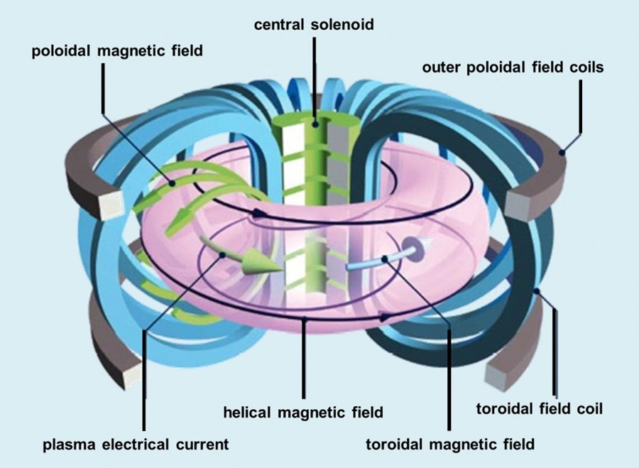

.. _Poincare operator:

Poincaré operator
~~~~~~~~~~~~~~~~~

The Poincaré operator constructs a Poincaré section for toroidal geometry. The
basis of constructing a connected plot is to accurately determine the number of
toroidal and poloidal windings (i.e. the winding pair). The image below is
helpful for visually understanding what is meant by toroidal and poloidal:

This process is
iterative, starting with a minimum number of puncture points through a Poincaré
section and continuing until the toroidal and poloidal windings are known or
the maximum number of punctures is reached. If an accurate winding pair is
determined, then the puncture points are connected based on it. For more
information, refer to the following resources:

:download:`A.R. Sanderson, G. Chen, X. Tricoche, E. Cohen. “Understanding Quasi-Periodic
Fieldlines and Their Topology in Toroidal Magnetic Fields,” In Topological
Methods in Data Analysis and Visualization II, Edited by R. Peikert and H.
Carr and H. Hauser and R. Fuchs, Springer, pp. 125--140. 2012. <pdfs/Fusion_topo11.pdf>`

:download:`A.R. Sanderson, G. Chen, X. Tricoche, D. Pugmire, S. Kruger, J. Breslau.
“Analysis of Recurrent Patterns in Toroidal Magnetic Fields,” In Proceedings
Visualization / Information Visualization 2010, IEEE Transactions on
Visualization and Computer Graphics, Vol. 16, No. 4, pp. 1431-1440. 2010. <pdfs/Fusion_vis10.pdf>`

Source
^^^^^^

The set of points that seed the integral curves that reveal the Poincaré section.
In addition to the :ref:`common ICS source` attributes common to all ICS
operators, the Poincaré operator supports the following attributes:

Source Type
"""""""""""

The source type controls how the seeds for curves are created. There are
various options, the names of which are self-descriptive such as creating them
along a *line*. Only those options that require further clarification are
described further here. 

Point List
    Seed from a list of points. In addition to *Add Point*, *Delete Point*, and
    *Delete All Points*, the user can *Read Text File* that is formatted with
    one point per each line either as "X Y Z" or "X, Y, Z".

.. warning::

    If the Field is set to M3D-C1 integrator the point locations will be
    converted from Cartesian to Cylindrical coordinates. In the 2D case, phi
    will be set to 0. 

Integration
^^^^^^^^^^^

Specify settings for numerical integrators. In addition to the
:ref:`common ICS integration` attributes common to all ICS operators, the
Poincaré operator supports the following attributes.

Punctures
"""""""""

While integrating the integral curve to be used the for Poincaré plot, the user
has the option to require a minimum number of initial punctures through the
Poincaré section for the analysis. The user may limit the integration
in case of run-a-way integral curve that cannot be fully analyzed.

Puncture plot type
    The type of the puncture plot. Options are:

    * Single - the analysis is based on the standard double periodic system
      (toroidal-poloidal periodicity)
    * Double - the analysis is based on the double Poincaré plot. In addition
      to the toroidal-poloidal periodicity a third periodicity exists that is
      based on the integration time. 

    When selecting double, Poincaré plot puncture points are accepted if and
    only if the period is within the tolerance of the period (the period is
    set as part of the Poincaré Pathline Options). 

       * Period tolerance - when an integral curve punctures the plane, the
         period must be within the tolerance value. 

.. warning::

    When selecting “Toroidal” the “Analysis” must also be set to “Punctures
    only” as there is currently no analysis in the toroidal plane.

Analysis
^^^^^^^^

The user may adjust settings for how Poincaré analysis is to be done. Some
options include:

None - Puncture only
    This will result in constructing a traditional Poincaré plot using only
    points.

Full
    This will analyze each curves' geometry and attempt to reconstruct the
    cross sectional profile of the surface which the curve lies on.
    Further, the analysis attempts to identify the topology of the surface. 

Maximum toroidal winding
    Limit the search of the toroidal winding to lower order values. Zero
    indicates no limit.

Override toroidal winding
    In some cases, such as debugging, it may be informative to force the
    toroidal winding to have a set value. Zero indicates no override. 

Override poloidal winding
    In some cases such as debugging, it may be informative to force the
    poloidal winding to have set value. Zero indicates no override.

Winding pair confidence (Range 0-1, Default 0.9)
    Sets the limit for the number of mismatches in the consistency in the
    winding pairs.

Detect Rational Surface
    Allows for the construction of rational surfaces via an iterative process.
    Typically, they can be constructed with 5-10 iterations. 

.. danger::
    The rational surface construction is experimental code and does not
    always work.

Detect O Points
    Allows for the detection of O points in “island chains” via an iterative
    process. Typically, they can be detected with 5 iterations. 

.. danger::
    The critical point detection is experimental code and does not always work.

Perform O-Line Analysis
    Calculate the poloidal winding relative the O-Line (central axis) which
    provides a more accurate winding value.

    * O-Line toroidal windings (Default 1) – sets the toroidal winding value,
      i.e. the period (for the central axis the period is 1). 
    * O-Line Axis Point File - allows the user to select a text file containing
      the points along the axis from 0 to 360 degrees (note there is no overlap
      P(0) != P(n)).

Show chaotic fieldlines as points
    Because chaotic curves cannot be classified, they are not displayed
    unless this is checked. 

Show islands only
    Culls the results so that only island chains are displayed. 

Show ridgelines
    Displays the 1D plots of the distance and ridgeline samples.

Verbose
    Dumps information regarding the analysis to the terminal. The final summary
    may be useful. For example,

:: 
   
   Surface id = 0 < 2.35019 0 0.664124 > 121:11 121:11 (11) flux surface with 4 nodes (Complete) 
   Surface id = 0 
   seed location < 2.35019 0 0.664124 > 
   the winding pair 121:11 
   the toroidal:poloidal periods (as a winding pair) 121:11 
   the multiplication faction (11) i.e. diving by this number will give the base winding values, in this case 11:1. 
   surface type: flux surface 
   number of nodes in each winding group: with 4 nodes 
   analysis state: complete. 

Appearance
^^^^^^^^^^

The appearance tab specifies how the integral curve will be rendered. In addition
to the :ref:`common ICS appearance` attributes common to all ICS operators, the
Poincaré operator supports the following attributes.

Coloring
""""""""

The various coloring options are:

None
    Solid color from the single color 

Safety Factor Q
    Use the safety factor 

Safety Factor P
    Use the safety factor as defined when there are two possible choices for
    the magnetic axis 

Safety Factor Q == P
    Render the surfaces on if the safety factor Q is equal to the safety factor P 

Safety Factor Q != P
    Render the surfaces on if the safety factor Q is not equal to the safety
    factor P 

Toroidal Windings Q
    Use the toroidal winding value used in the calculation of Q 

Toroidal Windings P
    Use the toroidal winding value used in the calculation of P 

Poloidal Windings
    Use the poloidal winding value 

Fieldline Order
    Use input order of the seeds used to generate the integral curves. 

Point Order
    Use the puncture point index 

Plane
    Use the plane value (integer from 0 to N where N is the number of planes) 

Winding Group Order
    Use the winding group order (integer from 0 to T where T is the toroidal
    winding) 

Winding Point Order
    Use the index of the puncture points within each winding group 

Winding Point Order Modulo Order
    Use the order of the punctures within each winding group modulo the
    toroidal windings (useful for islands in islands) 

Display
"""""""

Allows the users to display the results in a single plane or multiple planes.
Further, one can reconstruct the 3D surface that the curves lies on.

Overlapping Curve Sections
""""""""""""""""""""""""""

When displaying the data in a connected manner the raw data will often overlap
itself. As such, for visually pleasing results it may be preferable to remove
the overlaps.

Raw
    Display all of the punctures points in a connected fashion. 

Remove
    Display all of the punctures points in a connected fashion, removing the
    overlapping sections. 

Merge
    Display all of the punctures points in a connected fashion, merging the
    overlapping sections. Experimental. 

Smooth
    Display all of the punctures points in a connected fashion, removing the
    overlapping sections while smoothing between points.

.. danger::
    Smooth is experimental and does not always work.

Advanced
^^^^^^^^

See :ref:`common ICS advanced` attributes that are common to all ICS
operators.
