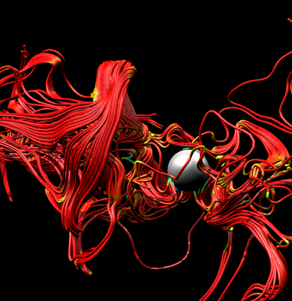

.. _Integral_Curve_System:

Integral Curve System
=====================

Within the VisIt_ infrastructure is the ability to generate integral curves. An
integral curve is a curve that begins at a seed
location and is tangent at every point in a vector field. It is computed by
numerical integration of the seed location through the vector field. For
example, the image below shows integral curves through the magnetic field of a
core-collapse supernova simulation from the GenASiS code.

The generation of integral curves forms the basis of VisIt_'s Integral Curve
System (ICS), made up of the :ref:`Integral Curve operator`, the :ref:`LCS
operator`, the :ref:`Limit Cycle operator`, and the :ref:`Poincare operator`.
Much of the underlying infrastructure and interface is the same for each
operator: the user selects a series of seed locations where curves are
generated, which are then visualized and analyzed.

The ICS allows for the computation of Lagrangian Coherent Structures (LCS)
using a variety of techniques developed by `George Haller
<http://georgehaller.com/>`_ and his group at ETH Zürich. For more information
on LCS, see :download:`K. Onu, F. Huhn, & G. Haller, LCS Tool: A Computational
platform for Lagrangian coherent structures, J. of Computational Science, 7
(2015) 26-36 <pdfs/lcstool.pdf>`.

Many of the terms used in the ICS are familiar to experts in dynamical systems
but may be new to many users. Users can refer to a :download:`glossary
<pdfs/terms_glossary.pdf>` sepcific to dynamical systems and can reference
VisIt_'s :ref:`Glossary` for some terms that are specific to VisIt_'s ICS. Any
additional terms can be defined through a simple online search.

.. toctree::
    :maxdepth: 1

    IntegralCurve_operator
    LCS_operator
    LimitCycle_operator
    Poincare_operator

Parameters
----------

Common to all ICS operators is a four tab GUI: Source, Integration,
Appearance, and Advanced (the Poincaré operator also has an Analysis tab).
These tabs contain many functions that are common across all four operators.
The following is a description of those common features.

.. _common ICS source:

Source
^^^^^^

The set of points that seed the integral curves. See each operator for varied
settings.

Field
"""""

Sets the field type so that the native elements are used when interpolating the
vector fields. Each operator provides the following options:

.. warning::

    Each option below besides "Default" requires the respective third party
    library.

Default
    Use VisIt_'s native VTK mesh structure to perform linear interpolation on
    the vector field.
    
Flash
    Evaluates the velocity field via the Lorentz force. Parameters are:

    * Constant - A constant multiple applied to the velocity.
    * Velocity - When combined with Leap-Frog integration, this sets the
      initial velocity used in the integration.
   
M3D-C1 2D
    Evaluates the 3D magnetic field via a 2D poloidal 6th order polynomial.
    Parameters are:

    * Constant - A constant multiple applied to the perturbed part of the
      field.
   
M3D-C1 3D
    Evaluates the 3D magnetic field via a 2D poloidal 6th order polynomial and
    1D toroidal 4th order Bezier spline.
    
Nek5000
    Evaluates the 3D vector field using `Nek5000 <https://nek5000.mcs.anl.gov/>`_
    spectral elements.
    
Nektar++
    Evaluates the 3D vector field using `Nektar++ <https://www.nektar.info/>`_
    spectral elements.

.. _common ICS integration:

Integration
^^^^^^^^^^^

Specify settings for the numerical integrator. See each operator for varied
settings.

Integrator
""""""""""

Sets the integration scheme. There are various options common among numerical
integration packages, such as *Leap Frog* and *Runge-Kutta*. More details on
the different schemes can be found through a simple online search.

Step Length
"""""""""""

Most integrators use a fixed step length. Runge-Kutta-Dormand-Prince (RKDP)
uses adaptive step size, which can be clipped by the step length.

Tolerances
""""""""""

RKDP, Adams-Bashforth, and MD3-C1 make use of the tolerance options.
    
RKDP
    The step size adapts to ensure that the maximum error at each step is less
    than the maximum between the absolute tolerance and the relative tolerance
    times the value of the vector field at the current point. The absolute
    tolerance can be truly absolute or relative to the bounding box.

Termination
"""""""""""

The criteria for terminating the integration. See specific operator for
details.

.. _common ICS appearance:

Appearance
^^^^^^^^^^

Specify appearance settings for the curves. See each operator for varied
settings.

Streamlines vs Pathlines
""""""""""""""""""""""""

The user may select the integral curve to be based on an instantaneous or
time-varying vector field producing streamlines or pathlines, respectively. A
streamline is a path rendered by an integrator that uses the same vector field
for the entire integration. A pathline uses the vector field that is in-step
with the integrator, so that as the integrator steps through time, it uses data
from the vector field at each new time step. Pathline options are:
    
Override starting time
    Instead of starting with the current time step, utilize another time for
    the start time.
      
Interpolation over time
    Interpolate the integral curve with a static mesh for all time or with a
    varying mesh at each time step. The mesh is typically static, but this
    cannot always be assumed and should be verified for each dataset before
    use.

.. _common ICS advanced:

Advanced
^^^^^^^^

Parallel integration
""""""""""""""""""""

The user may select one of four different parallelization options when
integrating curves in parallel:

Parallelize over curves
    Distribute the curves between the processors. Parameters are:

    * Domain cache size - number of blocks to hold in memory for level of
      details. 
   
Parallelize over domains
    Distribute the domains between the processors. Parameters are:

    * Communication threshold - number of integral curve to process before
      communication occurs. 
   
Parallelize over curves and domains
    Distribute both the curves and domains between the processors.
   
Have VisIt_ select the best algorithm
    VisIt_ automagically selects the best parallelization algorithm.

Warnings
""""""""

Alerts for various conditions that may occur during the integration or
analysis.

Issue warning when the maximum number of steps is reached
    The maximum number of steps limits run-a-way integration.

Issue warning when a step size underflow is detected
    If the step size goes to zero, issue a warning.

Issue warning when stiffness is detected
    Stiffness refers to one vector component being so much larger than another
    that tolerances can't be met. 

Issue warning when a curve doesn't terminate at a critical point
    For example, the curve may circle around a critical point without
    converging.
