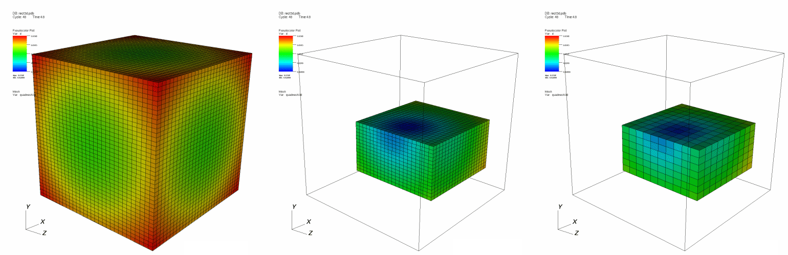
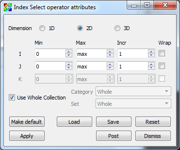
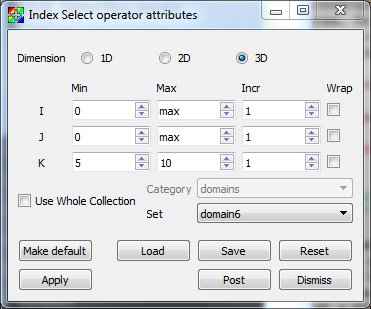

.. _Index Select operator:

Index Select operator
~~~~~~~~~~~~~~~~~~~~~

The Index Select operator selects a subset of a 2D or 3D structured mesh based 
on ranges of cell indices. Structured meshes have an implied connectivity that 
allows each cell in the mesh to be specified by an i,j or i,j,k index depending 
on the dimension of the mesh. The Index Select operator allows you to specify 
different ranges for each mesh dimension. The ranges are used to select a brick 
of cells from the mesh. In addition to indices, the Index Select operator uses 
stride to select cells from the mesh. Stride is a value that allows the operator
to count by 2's, 3's, etc. when iterating through the range indices. Stride is 
set to 1 by default. When higher values are used, the resulting mesh is more 
coarse since it contains fewer cells in each dimension. The Index Select 
operator attempts to preserve the size of the mesh when non-unity stride values 
are used. An example of the Index Select operator appears in :numref:`Figure %s <indexselect>`.

.. _indexselect:

   Index Select operator example: original plot; index selected (stride=1); index selected (stride=2)

Setting a selection range
"""""""""""""""""""""""""

The **Index Select attributes window**, shown in 
:numref:`Figure %s <indexselectwindow>`, contains nine spin boxes that allow 
you to enter minimum and maximum ranges for i,j,k. To select all cells in the 
**X** dimension whose index is greater than 10, you would enter 10 into the 
spin box in the **I** row and **Min** column. Then you would enter max into the 
spin box in the **Max** column in the **I** row. Finally, you would enter a 
stride of 1 into the spin box in the **Incr** column in the **I** row. If you 
wanted to sub-select cell ranges for the Y dimension, you could follow a similar 
procedure using the spin boxes in the **J** row and so forth.  To set a range, 
first select the maximum number of dimensions to which the Index Select operator
will apply. To set the dimension, click on the **1D** , **2D** , **3D** radio 
buttons. Note that if the chosen number of dimensions is larger than the number 
of dimensions in the database, the extra dimension ranges are ignored. It is 
generally best to select the same number of dimensions as the database. The 
three range text fields are listed in i,j,k order from top to bottom. To 
restrict the number of cells in the X-dimension, use spin boxes in the **I** 
row. To restrict the number of cells in the Y-dimension, use the spin boxes in 
the **J** row. To restrict the number of cells in the Z-dimension, use the spin 
boxes in the **K** row.  

.. _indexselectwindow:

   Index Select attributes window 

Restricting to a subset of the whole database
"""""""""""""""""""""""""""""""""""""""""""""

Some databases are composed of multiple groups of meshes, which are often 
called groups or blocks.  Some databases are composed of multiple meshes, often 
called blocks or domains.  Some are composed of both groups and domains.
When examining a database, you might want to look at only one block or group 
at a time.  By default, the Index Select operator is applied to all blocks in 
the database.  This means that each index range is applied to each block in the
database and will probably result in an image featuring several small chunks of 
cells. When the Index select operator is set to apply to just one block or 
group, the index ranges are relative to the specified block or group.

To make the Index Select operator apply to just one block or group, uncheck the 
**Use Whole Collection** check box. The **Category** and **Set** combo boxes
will be filled according to how the database has named the groups or sub-meshes.
Choose the correct category from the **Category** combo box, and the desired 
set from the **Set** combo box.  
:numref:`Figure %s <indexselect_categoryselection>` shows a single mesh 
selection for a multiple mesh database whose sub-meshes are called domains.

.. _indexselect_categoryselection:

   Setting the category for index selection
