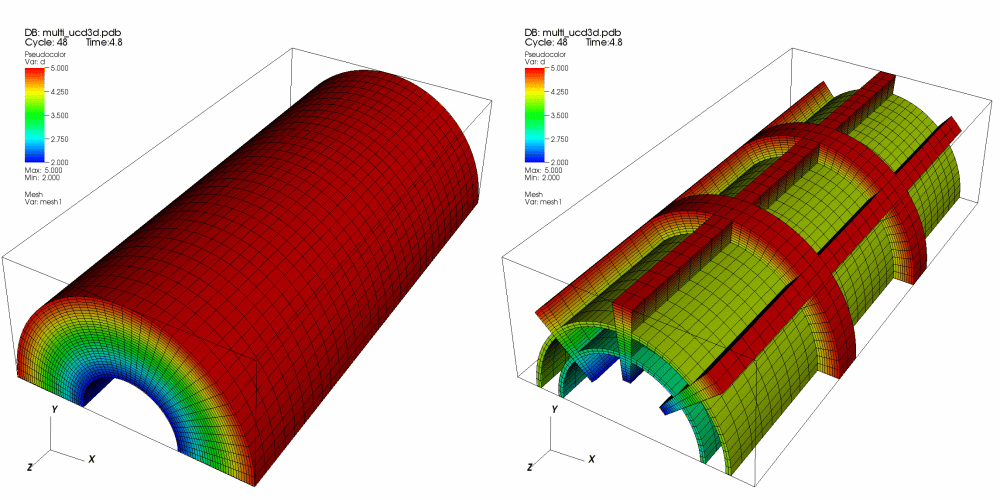
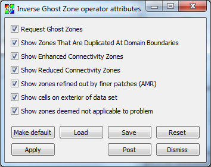

.. _InverseGhostZone operator:

InverseGhostZone operator
~~~~~~~~~~~~~~~~~~~~~~~~~

The InverseGhostZone operator makes ghost cells visible and removes real
cells from the dataset so plots to which the InverseGhostZone operator have
been applied show only the mesh's ghost cells. Ghost cells are a layer of
cells around the mesh that usually correspond to real cells in an adjacent
mesh when the whole mesh has been decomposed into smaller domains. Ghost
cells are frequently used to ensure continuity between domains for operations
like contouring. The InverseGhostZone operator is useful for debugging ghost
cell placement in simulation data and for database reader plugins under
development.

.. _inverseghostzone:

   InversetGhostZone example

The InverseGhostZone operator's attributes window 
(:numref:`Figure %s <inverseghostzonewindow>`) has various **Show** options
allowing you to select which types of ghost cells are returned.  By default
all options are turned on.

.. _inverseghostzonewindow:

   InversetGhostZone window
