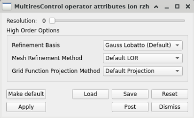

.. _MultiresControl operator:

MultiresControl operator
~~~~~~~~~~~~~~~~~~~~~~~~

The MultiresControl operator provides a way to select and manage the resolution level that will be used when rendering data with multiple refinement levels.
It provides additional options for working with high-order data (see :ref:`High_Order_Options`) from the `Conduit Blueprint <https://llnl-conduit.readthedocs.io/en/latest/blueprint.html>`_ and `MFEM <https://mfem.org/>`_ database readers.
The resolution control setting is more widely applicable to multiple plugins, including but not limited to the *Blueprint*, *Chombo*, *Enzo*, *FMS*, *MFEM*, and *STAR* database plugins.
Typically, rendering meshes at higher refinement resolution is more computationally expensive, but it yields a higher level of detail in mesh topology.

.. _multirescontrol:

   The MultiresControl operator attributes

.. _High_Order_Options:

High Order Options
""""""""""""""""""

The High Order Options apply to high order data from the *MFEM* and *Blueprint* plugins.
Not every control in the window has an effect on every kind of data provided by both plugins.

In general, the **Refinement Basis** option applies to all high order data from these plugins.
The choices are *Gauss Lobatto*, which is the default, and *Closed Uniform*.

The **Mesh Refinement Method** option applies to all high order data from these plugins other than quadrature function meshes.
There are three choices: *Default LOR*, *Continuous LOR*, and *Discontinuous LOR*.
*LOR* stands for *Low Order Refinement*.

* *Discontinuous LOR* results in a disconnected mesh; that is to say, between adjacent zones, shared mesh vertices are duplicated.
* *Continuous LOR* results in a connected mesh; that is to say, between adjacent zones, shared mesh vertices remain shared.
* *Default LOR* prefers *Continuous LOR* in all cases other than *L2* finite element spaces, because periodic meshes are always *L2*, there is no way to check for periodic meshes specifically, and periodic meshes only render properly in VisIt using discontinuous refinement.

The **Grid Function Projection Method** option only applies to grid functions from the *Blueprint* and *MFEM* plugins.
There are three choices: *Default Projection*, *Zonal Projection*, and *Nodal Projection*.
This option affects how grid functions are projected onto refined meshes.

* *Zonal Projection* projects grid functions onto the zones of a mesh.
* *Nodal Projection* projects grid functions onto the nodes of a mesh.
* *Default Projection* makes choices for how to project grid functions depending on their Finite Element Space basis.
  Data belonging to Finite Element Spaces that are *H1* and *NURBS* are projected onto mesh nodes, while data belonging to Finite Element Spaces that are *L2*, *Hdiv*, and *Hcurl* are projected onto mesh zones.
