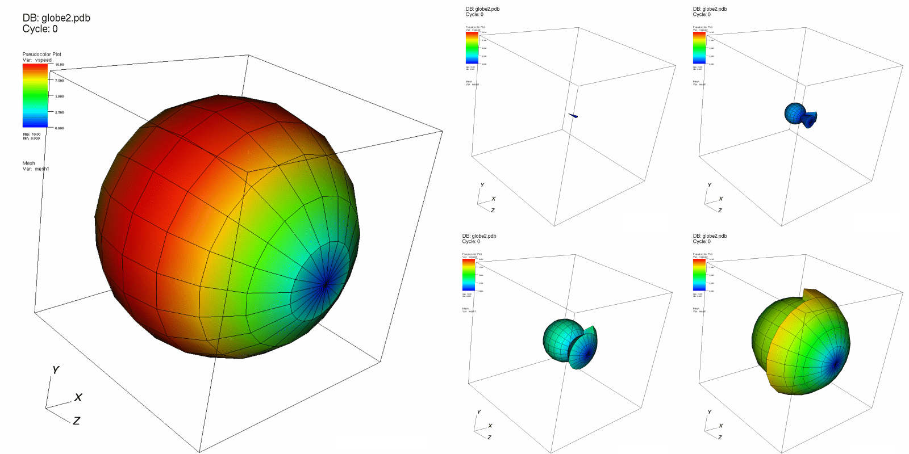

.. _MultiresControl operator:

MultiresControl operator
~~~~~~~~~~~~~~~~~~~~~~~~

The MultiresControl operator TODO
when do things apply
resolution control is widely applicable
high order options are just for mfem and blueprint high order data

quad function mesh - no resolution, no mesh ref, no projection, yes basis type
quad function field - no resolution, no mesh ref, no projection, yes basis type
normal mesh - yes resolution, yes mesh ref, no projection, yes basis type
gf field - yes resolution, no mesh ref, yes projection, yes basis type

basis choices (always applies to all mfem)
   gauss lobatto (default)
   closed uniform

mesh refinement is 
   discontinuous LOR
   continuous LOR

field projection is
   default (it depends on finite element type)
   zonal (only continuous)
   nodal (discontinuous or continuous mesh refinement)

.. _multirescontrol:

   image caption

Setting the seed
""""""""""""""""

bungus
