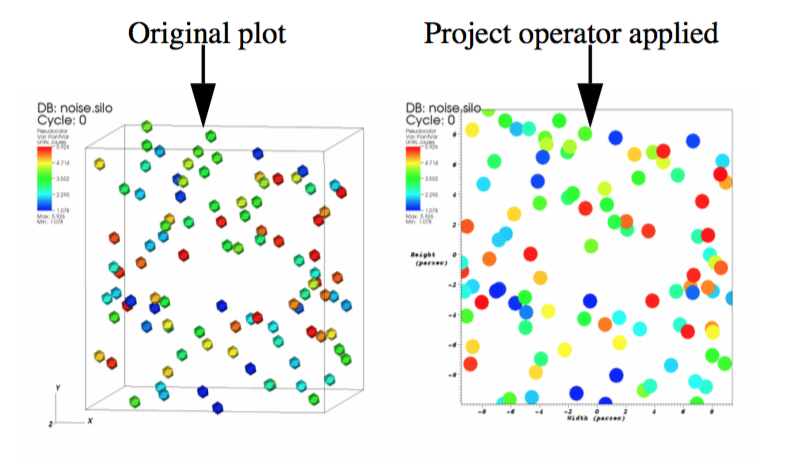
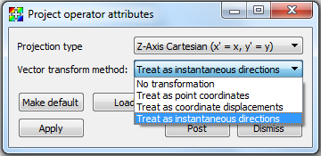

.. _Project operator:

Project operator
~~~~~~~~~~~~~~~~

The Project operator sets all of the Z values in the coordinates of a 3D mesh
to zero and reduces the topological dimension of the mesh by 1. The Project
operator is, in essence, an operator to make 2D meshes out of 3D meshes. An
example of the Project operator is shown in :numref:`Figure %s<project_operator_example>`.

.. _project_operator_example:

   
   Project Operator Example

Setting the projection type
"""""""""""""""""""""""""""

The Project operator can project 3D down to 2D using either Cartesian or 
Cylindrical transforms, which can be performed along the X, Y or Z
axis, as shown in (see :numref:`Figure %s<project_projection_type>`).
To specify which of these transforms you want to use when using the Project 
operator, choose the appropriate option from the **Projection type** combo box.
**Z-Axis Cartesian** is the default option.

.. _project_projection_type:

.. figure:: images/project_projectiontype.png
   :width: 60%
   :align: center
   
   Project Attributes Window showing available projection types

Choosing how vectors are treated
""""""""""""""""""""""""""""""""

The Project operator can treat vectors as instantaneous directions, as
coordinate displacements or as point coordinates.  The Project operator can
also ignore the vectors and not transform them at all.  To specify how you
wish vectors to be treated during the projection transform, choose the
appropriate option from the **Vector transform method** combo box.
(see :numref:`Figure %s<project_vector_transform>`) The default is 
**Treat as instantaneous directions**.

.. _project_vector_transform:

   
   Project Attributes Window showing available vector treatments
