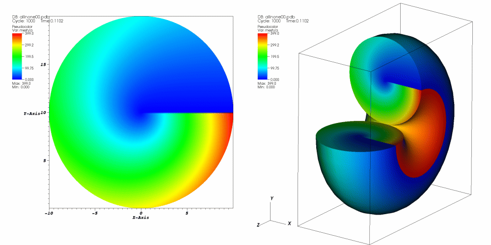
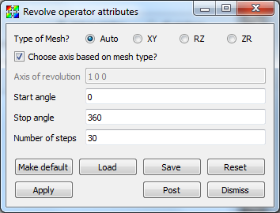

.. _Revolve operator:

Revolve operator
~~~~~~~~~~~~~~~~

The **Revolve operator** is for creating 3D geometry from 2D geometry by revolving the 2D about an axis.
The **Revolve operator** is useful for incorporating 2D simulation data into a visualization along with existing 3D data.
An example of the **Revolve operator** is shown in :numref:`Figure %s <revolve>`.

.. _revolve:

  **Revolve operator** example

Using the Revolve operator
""""""""""""""""""""""""""

To use the **Revolve operator**, the first thing to do is pick an axis of revolution.
The axis of revolution is specified as a 3D vector in the **Axis of revolution** text field (see :numref:`Figure %s <revolvewindow>`) and serves as the axis about which your 2D geometry is revolved.
If you want to revolve 2D geometry into 3D geometry without any holes in the middle, be sure to pick an axis of revolution that is incident with an edge of your 2D geometry.
If you want 3D geometry where the initial 2D faces do not meet, be sure to specify start and stop angles in degrees in the **Start angle** and **Stop angle** text fields.
Finally, the number of steps determines how many times the initial 2D geometry is revolved along the way from the start angle to the stop angle.
You can specify the number of steps by entering a new value into the **Number of steps** text field.

By default, VisIt will choose the axis of revolution based on mesh type, which is also determined automatically.
You can specify the mesh type manually by selecting a radio button other than **Auto**.
To specify the axis of revolution manually, uncheck the **Choose axis based on mesh type** checkbox.  

.. _revolvewindow:

  **Revolve operator** attributes window

RZ, ZR and other Mesh Types
"""""""""""""""""""""""""""

The **Revolve operator** is used most often to revolve ``RZ`` type meshes.
