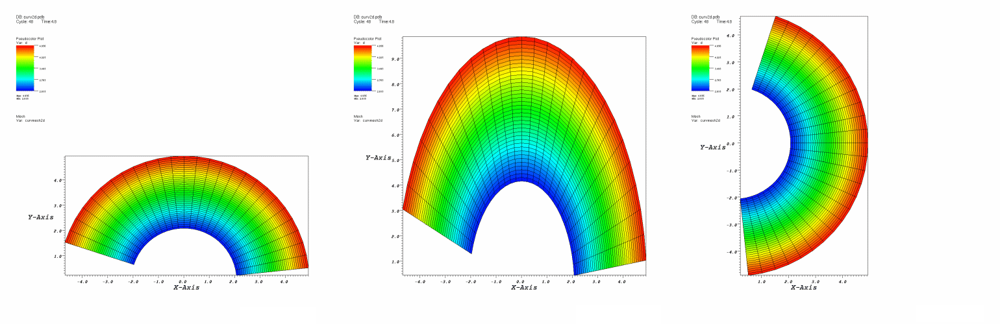
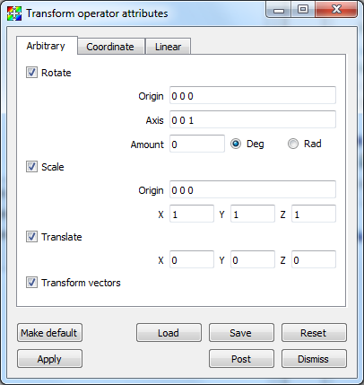
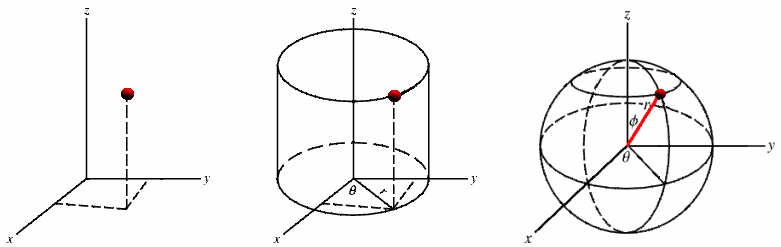

.. _Transform operator:

Transform operator
~~~~~~~~~~~~~~~~~~

The Transform operator manipulates a 2D or 3D database's coordinate field by 
applying rotation, scaling, and translation transformations. The operator's 
transformations are applied in the following order: rotation, scaling, 
translation. The Transform operator is applied to databases before they are 
plotted. You might use the Transform operator to rotate database geometry to a
more convenient orientation or to scale database geometry to make better use of
the visualization window. You can also use the Transform operator to make 
objects rotate and move around the visualization window during animations. 
This works well when only one part of the visualization should move while other
parts and the view remain fixed. An example of the Transform operator is shown 
in :numref:`Figure %s <transform>`.

.. _transform:

   Transform operator example

Rotation
""""""""

You can use the Transform operator to rotate plots around an arbitrary axis in 
3D and around the Z-axis in 2D. To apply the rotation component of the 
Transform operator, be sure to check the **Rotate** check box in the 
**Transform attributes window** (:numref:`Figure %s <transformwindow>`). 
An origin and normal are needed to specify the axis of rotation. The origin 
serves as a reference point for the object being rotated. The axis of rotation 
is a 3D vector that, along with the origin, determines the 3D axis that will 
serve as the axis of rotation. You must supply an origin and an axis vector to 
specify an axis of rotation. To change the origin, type a new 3D vector into 
the top **Origin** text field. To change the 3D axis, type a new 3D vector into 
the **Axis** text field. Both the origin and the axis are represented by three 
space-separated floating point numbers.

.. _transformwindow:

   Transform attributes window

When applying the Transform operator to plots, you probably want to make the 
origin the same as the center of the plot extents which can be found by looking 
at the axis annotations. When the Transform operator is applied to 3D plots, the
axis of rotation can be set to any unit vector. When the Transform operator is
applied to 2D plots, the axis of rotation should always be set to the Z-axis 
(0 0 1).

Once you specify the axis of rotation, you must supply the angle of rotation. 
The default angle of rotation is zero degrees, which gives no rotation. To 
change the angle of rotation, enter a number in degrees or radians into the
**Amount** text field and click the **Deg** radio button for degrees or the
**Rad** radio button if the angle is measured in radians.

Scale
"""""

You can use the Transform operator to scale plots. Each dimension can be scaled 
independently by entering a new scale factor into the **X, Y, Z** text fields. 
Each scale factor is a multiplier so that a value of 1 scales plots to their 
original size while a value of 2 scales plots to twice their original size. To 
apply the scale component of the Transform operator, be sure to check the 
**Scale** check box in the **Transform attributes window** . 
All dimensions are scaled relative to a scaling origin which can be changed by 
typing a new origin into the middle lower **Origin** text field.

Translation
"""""""""""

You can use the Transform operator to translate plots. To apply the translation 
component of the Transform operator, be sure to check the **Translate** check 
box in the **Transform attributes window** . To translate plots in the X dimension, replace the default value of zero in the **X** translation text 
field. Translations in the Y and Z dimensions are handled in the same manner.

Coordinate system conversion
""""""""""""""""""""""""""""

In addition to being able to rotate, scale, and translate plots, the Transform 
operator can also perform coordinate system conversions. A plot's coordinates 
can be specified in terms of Cartesian, Cylindrical, or Spherical coordinates 
(illustrated in :numref:`Figure %s <coordsystems>`). Ultimately, when a plot is 
rendered in the visualization window, its coordinates must be specified in 
terms of Cartesian coordinates due to the implementation of graphics hardware. 
If you have a database where the coordinates are not specified in terms of 
Cartesian coordinates, you can apply the Transform operator to perform a 
coordinate system transformation so the plot is rendered correctly in the 
visualization window.

.. _coordsystems:

  
    Cartesian, Cylindrical, Spherical coordinate systems 

:numref:`Figure %s <transform2>` shows a model of an airplane that is specified 
in terms of spherical coordinates. When it is rendered initially, VisIt assumes 
that the coordinates are Cartesian, which leads to the plot getting stretched 
and tangled. The Transform operator was then applied to convert the plot's 
spherical coordinates into Cartesian coordinates, which allows VisIt to draw the
plot as it is intended to look.

.. _transform2:

    Coordinate system conversion using the Transform operator

The Transform operator allows coordinate system transformations between any of 
the three supported coordinate systems, shown in 
:numref:`Figure %s <transformwindow2>` . To pick a coordinate system 
transformation, you must first pick the coordinate system used for the input 
geometry. Next, you must pick the desired output coordinate system. In the 
example shown in :numref:`Figure %s <transform2>`, the input coordinate system 
was Spherical and the output coordinate system was Cartesian. Note that if you 
use the Transform operator to perform a coordinate system transformation then 
you cannot also perform rotation, scaling, or translation. If you must perform 
any of those operations, add a second Transform operator to your plots.

.. _transformwindow2:

  Supported coordinate systems

Linear (Affine) transforms 
""""""""""""""""""""""""""

Linear, or Affine, transforms can be specified via a 4x4 matrix as shown in :numref:`Figure %s<transformwindow3>`.
This represents a class of operations often used for coordinate system transformations known as `spatial transformation matrices <http://www.massmind.org/Techref/method/math/spatial-transformations.htm>`_.
Why is the matrix 4x4 instead of 3x3?
Typically, the 4th row of the matrix is left unchanged but the 4th column permits the inclusion of *translation* in the same linear matrix operator used to support other things like rotation and scaling.

Vectors will be transformed by default, uncheck the **transform vectors** checkbox if this is not desired.
The inverse transform can be applied by selecting **Invert linear transform**.

.. _transformwindow3:

    Linear transformation options

.. _transform_linear:

    Linear transformation example

