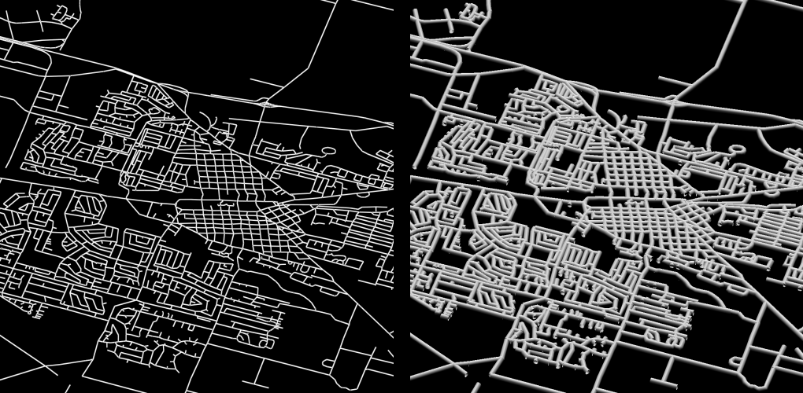
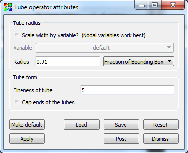
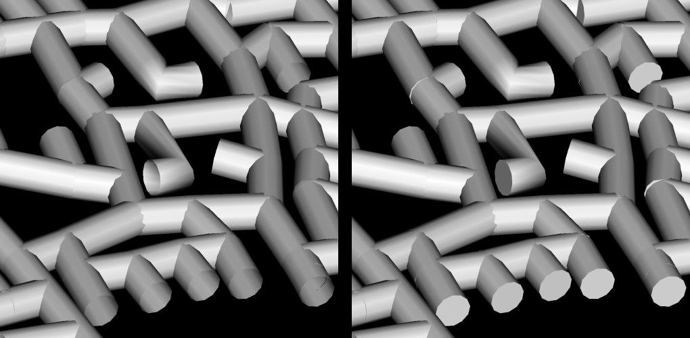

.. _Tube operator:

Tube operator
~~~~~~~~~~~~~

The Tube operator is an operator that turns line geometry into tubes, making 
the lines appear fatter and shaded.

.. _tube:

Changing tube appearance
""""""""""""""""""""""""

The Tube operator provides a few knobs that control the appearance of the 
generated tubes.  First of all, the tube radius can be set by typing a new 
radius into the **Radius** text field in the **Tube attributes window** 
(:numref:`Figure %s <tubewindow>`).  The specified radius can either be a
**Fraction of Bounding Box** (default) or **Absolute** by changing the combo 
box option next to the **Radius** text box.  If you want the radius scaled by a
variable instead, check the **Scale width by variable?** checkbox, and choose a
variable from the **Variable** menu.

.. _tubewindow:

   Tube attributes window

The number of polygons used to make up the circumference of the tube can be 
altered by typing a new number of sides into the **Fineness of tube**
text field. Finally, the ends of tubes can be capped instead of remaining open 
by turning on the **Cap Tubes** check box.  See :numref:`Figure %s <tube2>` 
for result of capping.

.. _tube2:

   Uncapped and capped tubes

