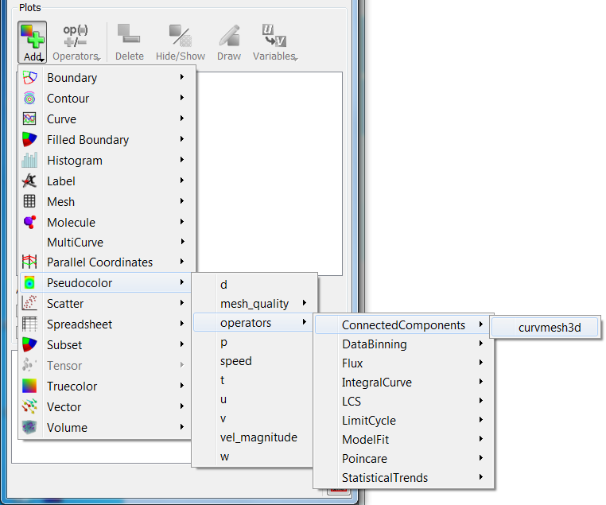

.. _Operators that Generate New Variables:

Operators that Generate New Variables
~~~~~~~~~~~~~~~~~~~~~~~~~~~~~~~~~~~~~

Some of VisIt's operators act more like expressions in that they generate
new variables that can be plotted. The variable type they output does not
necessarily match the variable type they accept as input. For example, the
IntegralCurve operator accepts a Vector and outputs a Scalar, while the
ConnectedComponents operator accepts a Mesh and outputs a Scalar.

Most of the operators that generate new variables are best applied using
the **operators** submenu of a particular plot's **variable** menu. See
:numref:`Figure %s <Operators-OperatorsInVariableMenu>`,

.. _Operators-OperatorsInVariableMenu:

   The menu for applying an operator that generates a new variable.

It is probably best after applying an operator in this fashion to open the
Operator's attributes window to ensure good settings for your data before
clicking **Draw**.

Operators that generate Scalars:

#.  Connected Components
#.  DataBinning
#.  Flux
#.  :ref:`Integral Curve operator`
#.  :ref:`LCS operator`
#.  :ref:`Limit Cycle operator`
#.  ModelFit
#.  :ref:`Poincare operator`
#.  StatisticalTrends

Operators that generate Vectors:

#.  :ref:`LCS operator`
#.  SurfaceNormal

Operators that generate Curves:

#.  DataBinning
#.  Lagrangian
#.  LimitCycle
#.  Lineout