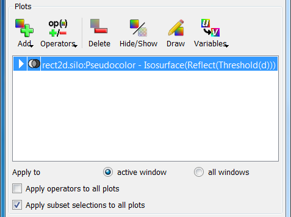
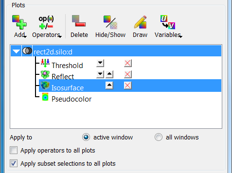

.. _Working with Operators:

Working with Operators
----------------------

An operator is a filter applied to a database variable before the compute
engine uses that variable to generate a plot. VisIt provides several standard
operator types that allow various operations to be performed on plot data.
The standard operators perform data restriction operations like planar
slicing, spherical slicing, and thresholding, as well as more sophisticated
operations like peeling off mesh layers. All of VisIt's operators are plugins
and new operators can be written to extend VisIt in new ways. For help
creating new operator plugins contact us via our
`getting help <https://visit-dav.github.io/visit-website/support/>`_ page.

Managing operators
~~~~~~~~~~~~~~~~~~

When an operator is applied to a plot, it modifies the data that the plot uses
to generate a visualization. Any number of operators can be applied to a plot.
Each operator added to a plot restricts or modifies the data that is supplied
to the plot. Very sophisticated visualizations can be created by using a
series of operators.

The controls for the operators are found in the same location as the plot
controls. The plot list, which displays the list of plots found in the
current visualization window, also displays the operators applied to each
plot. Each entry in the plot list displays the database name (when there is
more than one open source), the plot type, the variable, and all operators
that are applied to the plot. When an operator is applied to a plot, the
name of the operator is inserted in front of the plot variable. If multiple
operators are applied to a plot, the most recently added operator appears
first when reading left to right while the operator that was applied first
appears just to the left of the variable name. Plot list entries can also
be expanded to allow the user to add, remove, reorder, and change the
attributes of operators.

.. _Operators-Plots:

   The plots area

Adding an operator
""""""""""""""""""

Operators are added by selecting an operator from the **Operators** menu,
shown in :numref:`Figure %s <Operators-OperatorsMenu>`. If an operator listed
in this chapter is not listed in the **Operators** menu then the operator
might not be loaded by default. To enable additional operators, use the
:ref:`Plugin Manager Window`. When an operator is added, it applies the
operator to the selected plots in the plot list unless the 
**Apply operators to all plots** check box is checked, in which case, the 
selected operator is applied to all plots in the plot list. By default, 
operators are applied to all plots in the plot list.  

.. _Operators-OperatorsMenu:

   The operators menu 

When an operator is added to a plot, the name of the operator appears in
the plot list entry to the left of the variable or any previously applied
operator. When an operator is added to an already generated plot, the plot
is reset back to the new state to allow the user an opportunity to set the
operator's attributes before the plot is regenerated. To regenerate the
plot with the newly added operator, press the **Draw** button. It is also
possible to apply an operator by clicking an operator attributes window's
**Apply** button. When this occurs, a dialog window appears asking the user
if the operator should be applied to the selected plots (see
:numref:`Figure %s <Operators-ApplyOperatorDialog>`). 

.. _Operators-ApplyOperatorDialog:

   The add operator dialog

Expanding plots
"""""""""""""""

Plot list entries are normally collapsed by default with the operators
applied to the plots shown in the plot list as a series of nested operators,
which finally take a variable as an argument. The plot list allows plot
list entries to be expanded on a per-plot basis so the user can get to each
individual operator that is applied to a plot. To expand a plot list entry,
click on its expand button, shown in
:numref:`Figure %s <Operators-PlotExpanded>`. When a plot list entry is
expanded, the plot's database (if there is more than one open source), the 
variable, all the operators, and finally the plot get their own line in the
plot list entry. This is significant because it allows operators to have
additional controls to let you reposition them in the pipeline or remove
them from the middle of the pipeline without having to first remove other
operators.

.. _Operators-PlotExpanded:

   A plot list entry before and after being expanded 

Changing the order of operators
"""""""""""""""""""""""""""""""

Sometimes with several operators applied, it is useful to change the order
of the operators. For example, the user might want to apply a Slice operator
before a Reflect operator instead of after it to reduce the amount of data
that VisIt must process in order to draw your plot. The order in which
operators are applied often has a significant impact on the visualization.
Using the previous example, suppose a plot is sliced before it is reflected. 
The resulting visualization is likely to have a reflected slice of the original 
data. If the order of the operators was reversed so that the Reflect operator
came first, the Slice operator's slice plane might not intersect the reflected
data in the same way, which could result in a totally different looking
visualization.

The plot list entry must be expanded in order to change the order of its
operators. Once the plot list entry is expanded, each operator is listed in
the order in which they were applied and each operator has small buttons to
the right of its name that allow the operator to be moved up or down in the
pipeline. To move an operator closer to the database so it is executed
before it would have been executed before, click on the **Up** button next
to an operator's name. Moving the operator closer to the database in the
pipeline is called demoting the operator. Clicking the **Down** button next
to an operator's name moves the operator to a later stage of the pipeline.
Moving an operator to a later stage of the pipeline is known as promoting
the operator since the operator appears closer to the plot in the expanded
plot entry. Operators in the plot list entry that can only be moved in one
direction have only the **Up** button or the **Down** button while operators
in the middle of the pipeline have both the **Up** button and the **Down**
button.  

.. _Operators-OperatorsReordered:

   The controls for changing operator order

Removing operators
""""""""""""""""""

There are two ways to delete an operator from a plot. The last two entries
in the **Operators** menu have options that remove one or more operators.
To remove only the last applied operator, select the **Remove last** option
from the **Operators** menu. To remove all the operators applied to a plot,
select the **Remove all** option from the **Operators** menu. Unless the 
**Apply operator to all plots** check box is checked, operators are only 
removed from selected plots. When an operator is removed in this manner and
the plot has already been generated, it is immediately regenerated.

The **Operators** menu has controls that allow the last operator applied to
a plot to be removed or all of a plot's operators to be removed. VisIt also 
provides controls that let you remove specific operators from the middle of
a plot's operator list. First expand the plot list entry by clicking its 
**Expand** button and then click on the red **X** button next to the operator 
to be deleted. When an operator is deleted using the red **X** buttons, the
plot is reset back to the new state so the **Draw** button must be clicked
to regenerate the plot. See :numref:`Figure %s <Operators-OperatorDeleted>`
for an example of deleting an operator from the middle of a plot's operator
list.  

.. _Operators-OperatorDeleted:

.. figure:: images/Operators-OperatorDeleted.png

   After removing an operator from the middle of the pipeline

Setting operator attributes
"""""""""""""""""""""""""""

Each operator type has its own attributes window used to set attributes for 
that operator type. Operator attribute windows are brought up by selecting
the operator type from the **OpAtts** (Operator attributes) menu shown in 
:numref:`Figure %s <Operators-OpAttsMenu>`.

.. _Operators-OpAttsMenu:

   The operator attributes menu

When there is only one operator of a given type in a plot's operator list, 
setting the attributes for that operator type will affect that one operator. 
When there are multiple instances of the same type of operator in a plot's 
operator list, only the active operator's attributes are set if the active 
operator is an operator of the type whose attributes are being set. The
active operator is the operator whose attributes are set when using an
operator attributes window and can be identified in an expanded plot entry
by the highlight that is drawn around it (see
:numref:`Figure %s <Operators-ActiveOperator2>`). To set the active operator,
expand a plot entry and then click on an operator in the expanded plot
entry's operator list.

.. _Operators-ActiveOperator2:

.. figure:: images/Operators-ActiveOperator2.png

   Setting the active operator

Setting the active operator is useful when there are multiple operators of
the same type applied to the same plot. For example, there might be two
Transform operators applied to a plot in order to scale a plot with one
operator and then rotate the plot with the second Transform operator. In
this case the user could add two Transform operators, make the first
Transform operator active, set the scaling attributes, make the second
Transform operator active, and set the rotation attributes.
