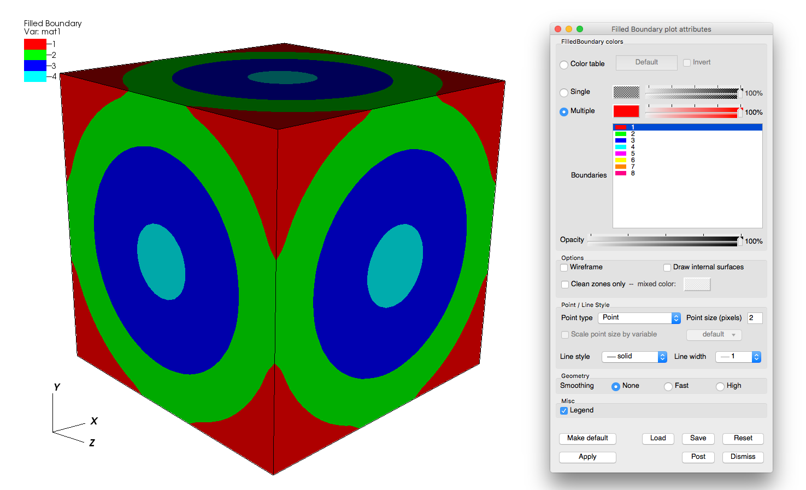
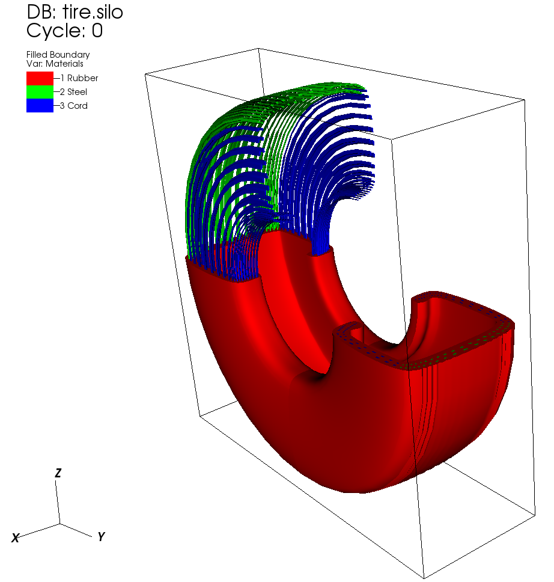
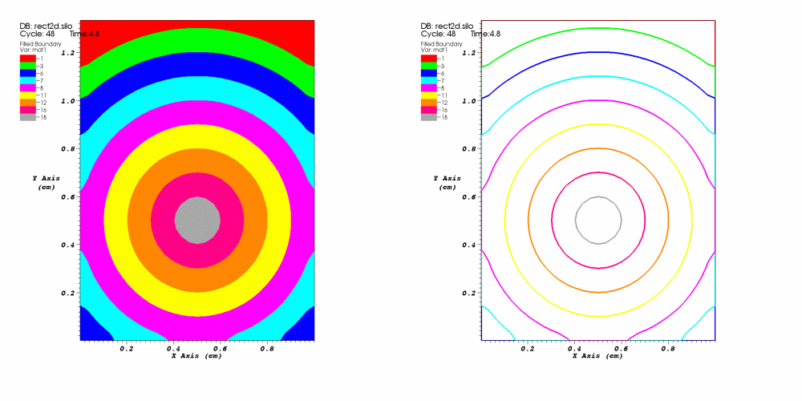
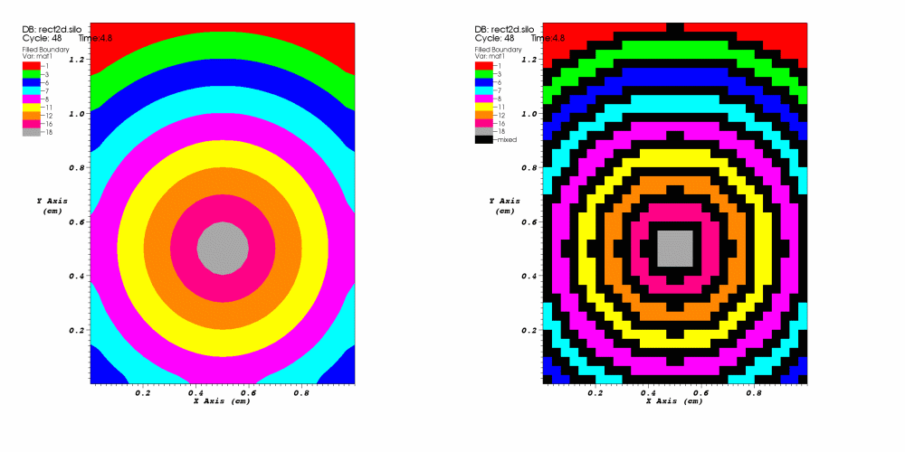
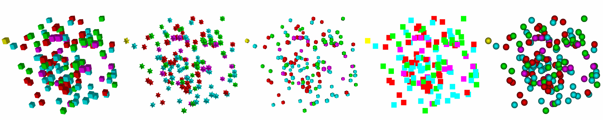

.. _boundary_plot_head:

Boundary and FilledBoundary Plots
~~~~~~~~~~~~~~~~~~~~~~~~~~~~~~~~~

The Boundary plot and FilledBoundary plot are discussed together because
of their similarity. Both plots concentrate on the boundaries between
materials but each plot shows the boundary in a different way. The
Boundary plot, shown in :numref:`Figure %s <boundarystuff>`, displays the surface or lines that separate materials.

.. _boundarystuff:

.. figure:: ../images/boundarystuff.png

   Boundary plot and its plot attributes window

.. _filledboundarystuff:

   FilledBoundary plot and its plot attributes window

The FilledBoundary plot (see :numref:`Figure %s <filledboundarystuff>`) shows
the entire set of materials, each using a different color. Both plots perform
material interface reconstruction on materials that have mixed cells,
resulting in the material boundaries used in the plots.

.. _filledboundarysubsets:

   FilledBoundary plot combined with subsets

Combining the FilledBoundary plot with subsets (see :numref:`Figure %s <filledboundarysubsets>`) 
can provide a insight into where each material is inside the mesh by turning off
materials in a particular domain. For more information about subsets, see the **Subsetting**
chapter.
.

Changing colors
"""""""""""""""
The main portion of the **Boundary plot attributes window** and
**FilledBoundary plot attributes window**, also known as the
**Boundary colors area**, is devoted to setting material boundary
colors. The **Boundary colors area** contains a list of material names with
an associated material color. Boundary plot and FilledBoundary plot colors
can be assigned three different ways, the first of which uses a color table.
A color table is a named palette of colors that you can customize to suite
your needs. When the Boundary plot or FilledBoundary plot use a color table
to color subsets, they selects colors that are evenly spaced through the
color table based on the number of subsets. For example, if you have three
materials and you are coloring them using the "xray" color table, three
colors are picked out of the color table so your material boundaries are
colored black, gray, and white. To color a Boundary plot or FilledBoundary
plot with a color table, click on the **Color table radio button**
and choose a color table from the **Color table menu** to right of the
**Color table radio button**.

If you want all subsets to be the same color, click the **Single**
radio button at the top of the **Boundary plot attributes window**
and select a new color from the **Popup color menu** that is activated by
clicking on the **Single color button**. The opacity slider next to the
**Single color button** sets the opacity for the single color.

Clicking the **Multiple** radio button causes each material boundary to
be a different, user-specified color. By default, multiple colors are set
using the colors of the discrete color table that is active when the
Boundary or FilledBoundary plot is created. To change the color for any
of the materials, select one or more materials from the list of materials
and click on the **Color button** to the right of the **Multiple** radio
button and select a new color from the **Popup color menu**. To change
the opacity for a material, move **Multiple** opacity slider to the left
to make the material more transparent or move the slider to the right to
make the material more opaque.

The **Boundary plot attributes window** contains a list of material names
with an associated color. To change a material's color, select one or more
materials from the list, click the color button and select a new color from
the popup color menu.  

Opacity
"""""""

The Boundary plot's opacity can be changed globally as well as on a per
material basis. To change material opacity, first select one or more
materials in the list and move the opacity slider next to the color button.
Moving the opacity slider to the left makes the selected materials more
transparent and moving the slider to the right makes the selected materials
more opaque. To change the entire plot's opacity globally, use the **Opacity**
slider near the bottom of the window.

Wireframe mode
""""""""""""""

The Boundary plot and the FilledBoundary plot can be modified so that they
only display outer edges of material boundaries. This option usually leaves
lines that give only the rough shape of materials and where they join other
materials as seen in. To make the Boundary or FilledBoundary plots display
in wireframe mode, check the **Wireframe** check box near the bottom of the
window.

.. _filledboundarywireframe:

   Filled mode and wireframe mode

Geometry smoothing
""""""""""""""""""

Sometimes visualization operations such as material interface reconstruction
can alter mesh surfaces so they are pointy or distorted. The Boundary plot
and the FilledBoundary plot provide an optional Geometry smoothing option to
smooth out the mesh surfaces so they look better when the plots are visualized.
Geometry smoothing is not done by default, you must click the **Fast** or
**High** radio buttons to enable it. The **Fast** geometry smoothing setting
smooths out the geometry a little while the **High** setting works produces
smoother surfaces.

Drawing only clean zones
""""""""""""""""""""""""

The FilledBoundary plot, since it deals almost exclusively with plotting
materials, has an option to only draw clean zones, which are zones that contain
a single material. When only clean zones are drawn, all clean cells are drawn
normally but all zones that contained more than one material are drawn with
a color that can be set to match the vis window's background color (see).
Drawing clean zones is primarily used to examine how materials mix in 2D
databases. To make VisIt draw only the clean zones, click the
**Clean zones only** check box. After that, you can set the mixed color by
clicking on the **Mixed color** color button and selecting a new color from
the popup color palette.

.. _filledboundarymixedzones:

   All zones and clean zones

Setting point properties
""""""""""""""""""""""""

Albeit rare, the Boundary and FilledBoundary plots can be used to plot points
that belong to different materials. Both plots provide controls that allow you
to set the representation and size of the points. You can change the points'
representation using the different **Point Type** radio buttons. The available
options are: 

  - **Box** 
  - **Axis**
  - **Icosahedron**
  - **Octahedron**
  - **Tetrahedron**
  - **Point**
  - **Sphere**

The default point type is **Point** because that is the fastest to draw,
followed by **Sphere**. The other point types create additional geometry and
can take longer to appear on the screen and subsequently draw. To change the
size of the points when the point type is set to **Box**, **Axis**, or
**Icosahedron**, you can enter a new floating point value into the
**Point size** text field. When the point type is set to **Point** or
**Sphere**, the **Point size** text field becomes the **Point size (pixels)**
text field and you should enter your point size in terms of pixels. Finally,
you can opt to scale the points' glyphs using a scalar expression by turning
on the **Scale point size by variable** check box and by selecting a scalar
variable from the **Variable** button to the right of that check box. Note
that point scaling does not occur when the point type is set to **Point**
or **Sphere**.

.. _pointtypes:

   Point types (left-to-right): Box, Axis, Icosahedron, Point, Sphere
