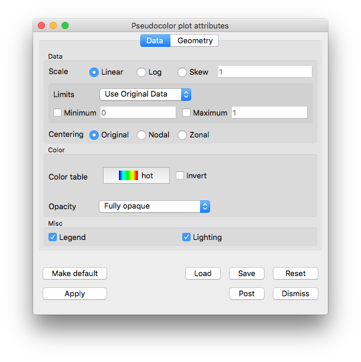

Common Controls
~~~~~~~~~~~~~~~

There are a number of attributes of plots that are common to many, if not all plots.
These include such things as **Color table**, **Foreground** and **Background** colors, **Opacity**, **Line width** and **Point type**, **Log** or **Linear** scaling, the **Legend** checkbox, the **Lighting** checkbox and others.
These common plot attributes are described here first using the **Pseudocolor plot** as an example.

.. _pseudocolorwindow_1:

   Example of **Pseudocolor plot attribute window**

Then, attributes specific to each plot type are described in the
remaining sections.

Plot buttons
""""""""""""

All plot attribute windows have several buttons at the bottom for
common operations. Use the **Apply** after you have changed one or
more attributes of a plot to make the new settings take effect.
The **Make default** button is used to take the current settings
and make those the default for the remainder of the VisIt_ session.
Each time a new plot of that type is created, it will be created
with whatever the current defaults are for that plot. If you want
these settings to persist across VisIt_ sessions, you can either
**Save session**, and then restart from this saved session later,
or **Save settings** and then all VisIt_ sessions will use those
defaults. For more about saving sessions and settings, see
:ref:`How to Save Settings`. The **Save** and
**Load** buttons give you the option of saving and loading plot
attributes using their own separate XML. This allows users to
easily share individual plot attributes. The reset button will
return the plot's attributes to whatever the current defaults are.
The **Dismiss** button will dismiss the window. The **Post** 
button will place the window in the **Notepad area**
(see :ref:`Intro_Posting_a_window`).

Plot colors
"""""""""""

By default, VisIt_ uses the **Hot** color table which maps values at
the minimum of the data range to blues, values at the maximum of
the data range to reds with transitions from blue to violet, to
green, to yellow in between. However, many plots offer the option of
selecting a specific color table. In the picture of the
**Pseudocolor plot attributes** window, above, the color table may
be changed by selecting the currently named table. A pull-down list
will appear from which you can select a different table.
For more information about
**Color tables**, see :ref:`Color_tables`.

In addition, many plots have options to control colors and
transparency (opacity) of individual plot elements such as lines on
the **Mesh plot** or contours on the **Contour plot**.

.. _plot_point_type_and_size:

Point type and size
"""""""""""""""""""

The **Pseudocolor**, **Mesh** and **Scatter** plots can use eight different
point types for drawing point meshes (see :numref:`Figure %s <glyphtypes>`).
The default option of **Point** is fastest and forces the plot to draw all of
its points as tiny points.  The **Sphere** option applies textures to the
points so it is nearly as fast as **Point**. Any of the other options place a
glyph at each point, taking longer to render.  To set the point type choose an
option from the **Point type** menu.  Setting the **Point type** to anything
other than **Point** will have no effect if the plotted mesh is not a point
mesh.

If you choose any of the point types except **Point**, then you can also
specify a point size by typing a new value into the **Point size** text field.
The point size is used to determine the size of the glyph. For example, if you
choose **Box**, and you enter a **Point size** of 0.1, then the length of all 
of the edges on the Box glyphs will be 0.1. If you use **Point**, then the
**Point size** text field becomes the **Point size (pixels)** text field 
and you can set the point size in terms of pixels.

.. _glyphtypes:

.. figure:: ../images/glyph_types2.png

   Point types: Box, Axis, Icosahedron, Octahedron, Tetrahedron, Sphere Geometry, Point, Sphere

.. _pointtypecombo:

   Point type menu, expanded

For **Mesh** and **Pseudocolor** plots, the point size can also be scaled by a
scalar variable if you check the **Scale point size by variable** check box and
select a new scalar variable from the **Variable** menu. The value ``default``
must be replaced with the name of another scalar variable if you want VisIt_ to
scale the points with a variable other than the one being plotted.

Lighting
""""""""

Various plots include a **Lighting** checkbox.
When the box is checked, it means the plot will obey all *active* :ref:`light sources <Lighting>`.
When the box is **not** checked, this does not mean the plot will not be lit at all.
Instead, it means that the plot will be lit by **Ambient** lighting only.
