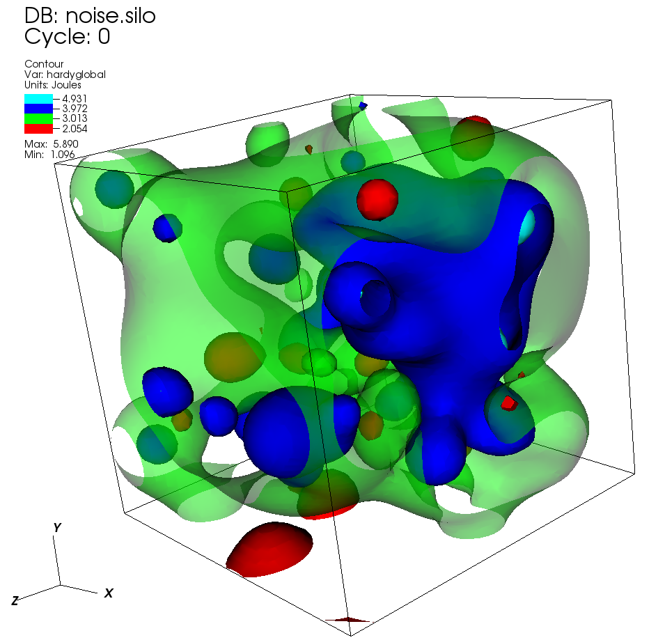
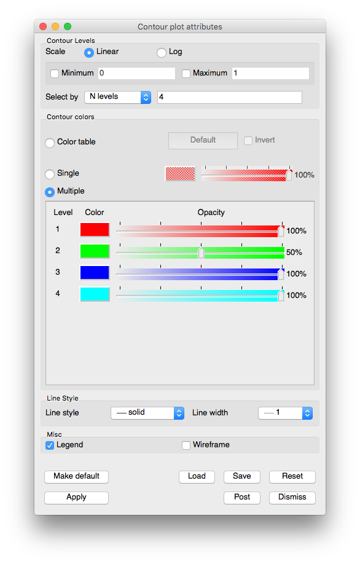

.. _contour_plot_head:

Contour Plot
~~~~~~~~~~~~

This plot, shown in :numref:`Figure %s <contourplot>`, displays the
location of values for scalar variables like density or pressure using
lines for 2D plots and surfaces for 3D plots. In visualization terms,
these plots are isosurfaces. VisIt's Contour plot allows you to specify
the number of contours to display as well as the colors and opacities
of the contours.

.. _contourplot:

   Example of Contour plot

.. _contourwindow:

   **Contour plot attributes window**

Setting the number of contours
""""""""""""""""""""""""""""""

By default, VisIt constructs 10 levels into which the data fall. These
levels are linearly interpolated values between the data minimum and data
maximum. However, you can set your own number of levels, specify the
levels you want to see or indicate the percentages for the levels.

To choose how levels are specified, make a selection from the **Select by**
menu. The available options are: **N levels, Levels**, and **Percent**.
**N levels**, the default method, allows you to specify the number of
levels which will be generated, with 10 being the default.  **Levels**
requires you to specify floating point numbers for the levels you want to see.
**Percent** takes a list of percentages like 50.5, 60, and 40.0. Using the
numbers just mentioned, the first contour would be placed at the value
which is 50.5% of the way between the minimum and maximum data values.
The next contour would be placed at the value which is 60% of the way
between the minimum and maximum data values, and so forth. You specify
all values for setting the number of contours by typing into the text
field to the right of the **Select by** menu.

Setting Limits
""""""""""""""

The **Contour plot attributes window** provides controls that allow you
to specify artificial minima and maxima for the data in the plot. This is
useful when you have a small range of values that are of interest and you
only want the contours to be generated through that range. To set the minimum
value, click the **Min** check box to enable the **Min** text field and then
type a new minimum value into the text field. To set the maximum value, click
the **Max** check box to enable the **Max** text field and then type a new
maximum value into the text field. Note that either the min, max or both can
be specified. If neither minimum nor maximum values are specified, VisIt
uses the minimum and maximum values in the database.  

Scaling
"""""""

The Contour plot typically creates contours through a range of values by
linearly interpolating to the next value. You can also change the scale to
a logarithmic function to get the list of contour values through the specified
range. To change the scale, click either the **Linear** or **Log**
radio buttons in the **Contour plot attributes window**.

Setting contour colors
""""""""""""""""""""""

The main portion of the **Contour plot attributes window**, also known as the
**Contour colors area**, is devoted to setting contour colors. Contour plot
colors can be assigned three different ways, the first of which uses a color
table. A color table is a named palette of colors that you can customize to
suite your needs. When the Contour plot uses a color table to color the levels,
it selects colors that are evenly spaced through the color table based on the
number of levels. For example, if you have five levels and you are coloring
them using the "rainbow" color table, the Contour plot picks five colors out
of the color table so your levels are colored magenta, blue, cyan, green,
yellow, and red. The colors change when increasing or decreasing the number of
levels when you use a color table because VisIt uses the new number of levels
to sample different locations in the color table. As a rule, increasing the
number of levels results in coloration that is closer to the color table
because more colors from the color table are represented. To color a Contour
plot with a color table, click on the **Color table radio button** and choose
a color table from the **Color table menu** to right of the
**Color table radio button**.

If you want all levels to be the same color, click the **Single** radio button
at the top of the **Contour plot attributes window** and select a new color from
the **Popup color menu** that is activated by clicking on the
**Single color button**. The opacity slider next to the **Single **color button**
sets the opacity for the single color.

Clicking the **Multiple** radio button causes each level to be a different,
user-specified color. By default, multiple colors are set using the colors of the
discrete color table that is active when the Contour plot is created. To change
the color for any of the levels, click on the level's **Color button** and select
a new color from the **Popup color menu**. To change the opacity for a level,
move its opacity slider to the left to make the level more transparent or move
the slider to the right to make the level more opaque.  

Wireframe view
""""""""""""""

The **Contour plot attributes window** provides a **Wireframe** toggle button
used to draw only the lines along the edges of the contour. This option only
has an effect on 3D Contour plots.
