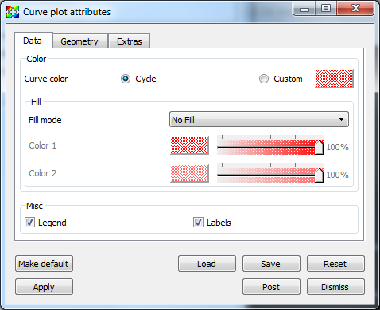
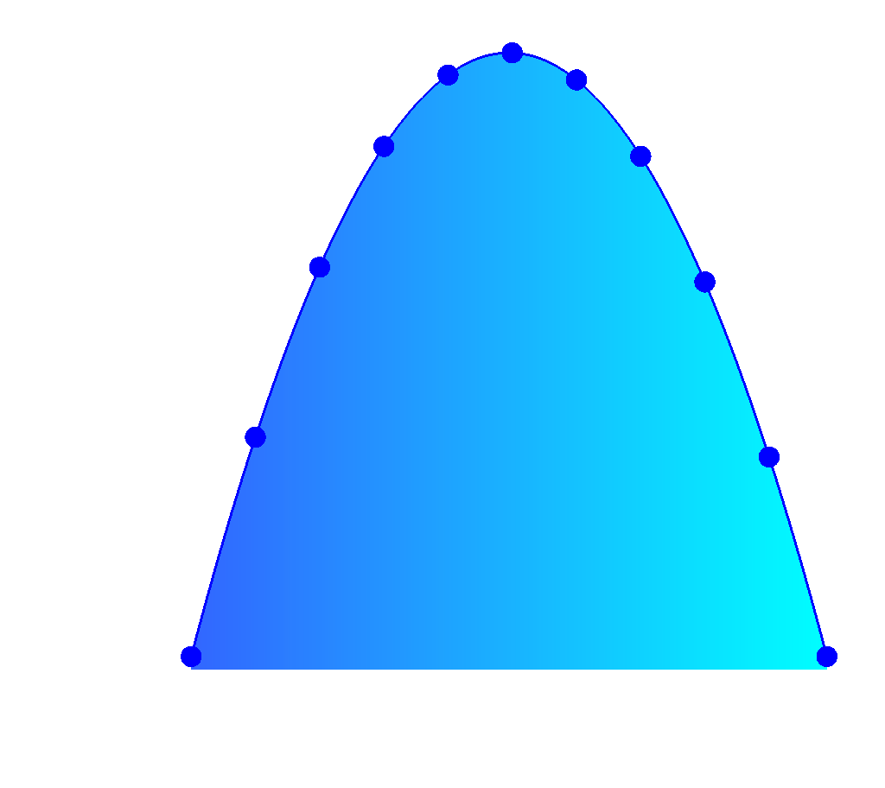

.. _Curve plot:

Curve Plot
~~~~~~~~~~

The Curve plot, shown in :numref:`Figure %s <curveplot>`, displays a simple
group of X-Y pair data such as that output by 1D simulations or data produced
by Lineouts of 2D or 3D datasets. Curve plots are useful for visualizations
where it is useful to plot 1D quantities that evolve over time.

.. _curveplot:

   Curve plot

Setting curve color
"""""""""""""""""""

The Curve plot's color is set up to **Cycle** by default.  In other words, each new curve created will be a different color.  This can be turned off by selecting the **Custom** radio button, and a new color can be chosen by clicking on the 
**Color button** and making a selection from the **Popup color menu**.

.. _curvewindow:

   Curve plot attributes, data tab

Showing curve labels
""""""""""""""""""""

Curve plots have a label that can be displayed to help distinguish one Curve 
plot from other Curve plots. Curve plot labels are on by default, but if you 
want to turn the label off, you can uncheck the **Labels** check box.

Space-filled curves
"""""""""""""""""""

The space below a curve can be filled with color by changing **Fill mode**
to either **Solid, Horizontal Gradient or Vertical Gradient**, then choosing 
one or two colors based upon the mode chosen.

.. _curvefill:

   Curve, space-filled with points

Setting line style and line width
"""""""""""""""""""""""""""""""""

Several Curve plots are often drawn in the same visualization window so it is
necessary that Curve plots can be distinguished from each other. Fortunately,
VisIt provides controls to change the line style and line width so that Curve
plots can be told apart. Line style is a pattern used to draw the line and it
is solid by default but it can also be dashed, dotted, or dash-dotted. You
choose a new line style by making a selection from the **Line Style** combo box
on the **Geometry tab** (see :numref:`Figure %s <curvewindow2>`). The
line width, which determines the boldness of the curve, is set by making a
selection from the **Line Width** combo box.

.. _curvewindow2:

   Curve plot attributes, geometry tab

Drawing points on the Curve plot
""""""""""""""""""""""""""""""""

The Curve plot is composed of a set of (X,Y) pairs through which line segments
are drawn to form a curve. To make VisIt draw a point glyph at the location of
each (X,Y) point, click the **Show points** check box on the **Geometry** tab. 
You can control the size of the points by typing a new point size into the 
**Point size** text field.  You can choose the type of symbol used to represent
the points by using the **Symbol** combo box.

The number of points drawn can be controlled by the **Static** or **Dynamic** 
radio buttons.  For **Static** mode, points are drawn at regular intervals 
controlled by the value of the **Point stride** text box.  For **Dynamic** 
mode, the number of points drawn is view-dependent, with density controlled by
the **Point density** text box.

Adding Time Cues
""""""""""""""""
Time cues are most often used in conjunction with movie making. They allow
for markers to be placed at certain positions along a curve, and/or for the 
curve to be cropped at the specified position.  Time cues make it easier
to see the current time position along a curve.  Though most often
created and controlled via scripting, the **Extras** tab in the **Curve
attributes** window can also be used (see :numref:`Figure %s<curvewindow3>`).
There are two types of markers: Ball and Line.  They are controlled by the
**Add Ball** and **Add Line** check boxes.  They have separate color and
size controls.  To crop the line, select the **Crop** check box.  The
**Position of cue** text box controls the location along the curve where the
ball and line are placed and where the cropped curve ends. 
:numref:`Figure %s<curvetimecues>` shows examples of curves created using
different time cue settings.

.. _curvewindow3:

.. figure:: ../images/curvewindow3.png
   :width: 50%

   Curve plot attributes, extras tab

.. _curvetimecues:

   Curve plot with time cues added at different positions, both uncropped and cropped.

Polar coordinate system conversion
""""""""""""""""""""""""""""""""""

If the curve data is in Polar instead of Cartesian coordinates, you can tell
VisIt to convert by selecting the **Polar to Cartesian** option on the 
**Extras** tab.  You can choose the **Order** to be **R_Theta** or **Theta_R** 
and choose **Radians** or **Degrees** for the **Units**.
:numref:`Figure %s<curve_polar>` shows an example.

.. _curve_polar:

   Curve plot before and after Polar coordinate transform (R-theta, radians)
