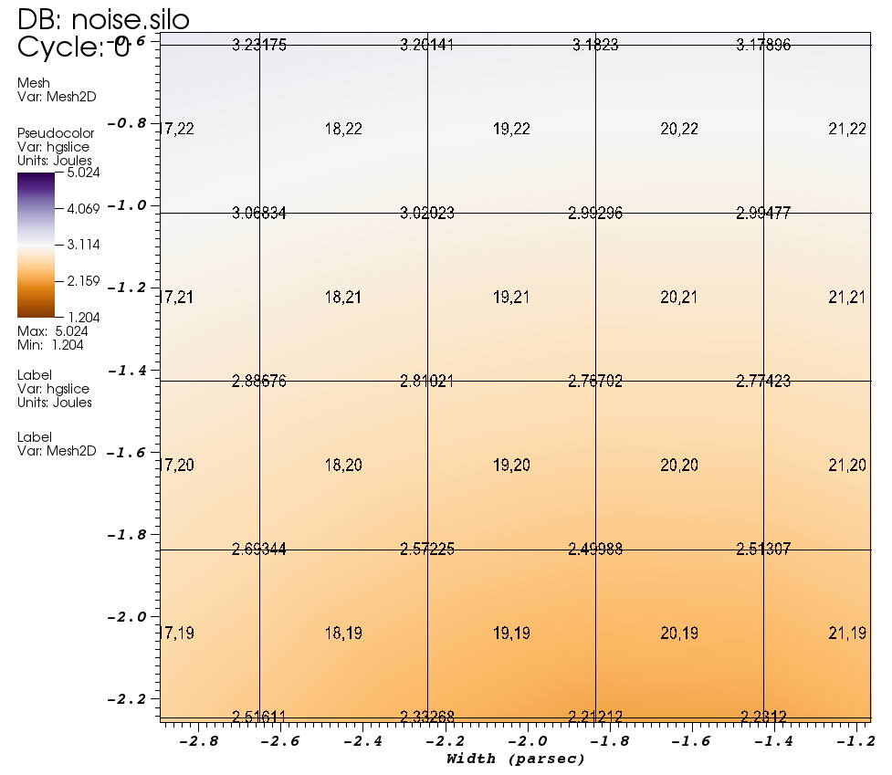
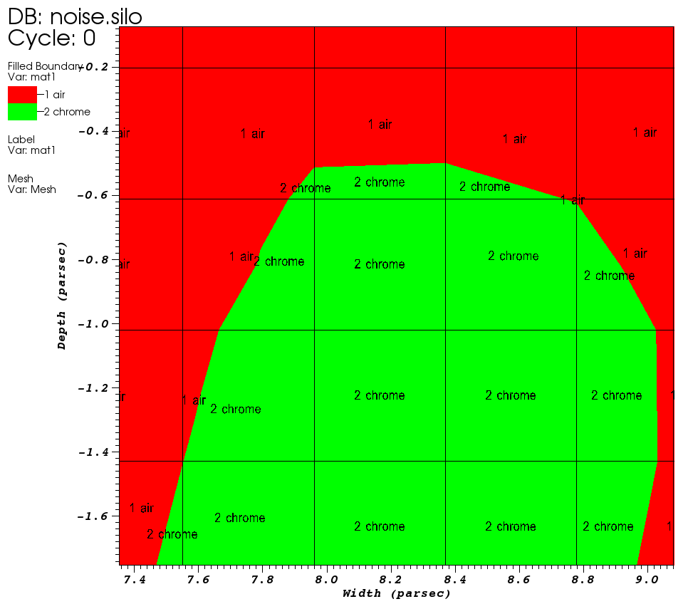

Label Plot
~~~~~~~~~~

The Label plot, shown in :numref:`Figure %s <labelplot>`, can display mesh
information, scalar fields, vector fields, tensor fields, array variables,
subset names, and material names. The Label plot is often used as a
debugging device for simulation codes since it allows the user to see
labels containing the exact values at the computational mesh's nodes or
cell centers. Since the **Label** plot's job is to display labels representing
the computational mesh or the fields defined on that mesh, it does not convey
much information about the actual mesh geometry. Since having a **Label** plot
by itself does not usually give enough information to understand the
plotted dataset, the **Label** plot is almost always used with other plots.

.. _labelplot:

    Label plot of the mesh overlayed on Pseudocolor and Mesh plots

.. _labelplotwindow:

   Label plot attributes window

Choosing the Label plot's variable
""""""""""""""""""""""""""""""""""

You can choose the **Label** plot's variable using the **Variable** menu under
the **Plot list** the same way as you would with any other type of plot. One
special property that distinguishes the **Label** plot from some of VisIt_'s
other plots is that it can plot multiple types of variables. The **Label** plot
can display information for meshes, scalars, vectors, tensors, array variables,
subsets, and materials so you will typically find more variables available for
the **Label** plot than you would for other plots. When you choose a mesh
variable for the **Label** plot, you can display both the mesh node numbers and
cell numbers otherwise you are limited to displaying only the variable being
plotted.

Showing node and zone numbers
"""""""""""""""""""""""""""""

The **Label** plot can display the node and cell numbers for the computational
mesh if you have selected a mesh variable to plot. By default, the **Label**
plot will display cell numbers only. The cell numbers will be displayed in the
format most natural to the underlying mesh representation, which means that
unstructured meshes will have cell numbers that are displayed as single
integers while structured meshes will be displayed in i,j,k format when
possible. If you want the **Label** plot to show a mesh's node numbers in
addition to its cell numbers, you can click on the **Show nodes** check box. If
you no longer want the **Label** plot to show the mesh's cell numbers, you can
turn off the **Show cells** check box.

Restricting the number of labels
""""""""""""""""""""""""""""""""

Most computational meshes contain many thousands, millions, or even billions of
nodes and cells. Adding that many labels would quickly become burdensome on the
computer and would result in a **Label** plot so dense that individual labels
could no longer be read or even associated with their cell or node.

VisIt_'s **Label** plot restricts the number of labels by default to some
user-settable number of labels that can comfortably fit on the screen. The
method used to restrict the number of labels differs for 2D and 3D plots. For
2D plots, the viewable portion of world space is periodically subdivided, based
on the zoom level, into some number of bins to which labels are then assigned.
As you zoom in on the **Label** plot, labels that go beyond the viewport are no
longer drawn and new labels that were previously hidden take their place. This
allows the **Label** plot to efficiently draw many labels without crowding the
labels on top of each other. For 3D plots, the **Label** plot divides up the
screen into a user-settable number of bins. All label coordinates are
transformed so that they can be assigned to a screen bin and the label wins
the screen bin if it is closer than the label that was previously in the bin.
This ensures that a small subset of all possible labels is drawn and that
they do not usually overlap on the screen. If you find that the labels appear to
be from the back of the mesh instead of from the front, it's quite possible that
the normals generated for your mesh were inverted for some reason. To combat
this problem, select **Back** or **Front or Back** from the
**Draw labels that face** menu.

If you want to set the number of labels that the **Label** plot will draw, you
can type in a new value into the spin box next to the
**Restrict number of labels to** check box or use the up and down arrows on the
spin box. If you want to force the **Label** plot to draw all labels, you can
turn off the **Restrict number of labels to** check box. Sometimes making the
**Label** plot draw all of the labels can be faster than drawing a subset of
labels.

Depth testing for 3D Label plots
""""""""""""""""""""""""""""""""

When VisIt_ draw plots in the visualization window, the plots' geometries often
correspond to only the outer surfaces of the originating datasets when those
datasets are 3D. This means that the majority of plots consist of convex
geometry and the normal test for only drawing labels that face front is often
adequate to remove any labels that appear on faces that point away from the
current camera. Some plots have geometries that consist of many concave regions,
which the afore-mentioned test does not handle well. Plots with concave
geometries will often have various pieces be incorrectly visible because though
the surfaces may face the camera, they may be obscured by other geometry. When
VisIt_'s **Label** plot draws 3D geometry, it tries to enable additional depth
testing to prevent front-facing labels in back of other surfaces from being
drawn. Depth testing can degrade performance so, by default, it is allowed only
when you are running VisIt_ on your local workstation. You can set the **Label**
plot's depth test mode to tell VisIt_ when to enable depth testing. To change
the values for the depth test mode, click on one of the **Auto**, **Always**,
**Never** radio buttons to the right of the **Depth test mode** label. If VisIt_
wants to use depth testing but is not allowed to then a warning message will be
issued and you can set the depth test mode to **Always**.

.. _labelplotdepthtest:

   Removing extra labels (left) with depth test (right) 

Formatting labels
"""""""""""""""""

The **Label** plot provides several options for setting label format. First and
foremost, you can set the label display format, which is how mesh node and cell
numbers are displayed. By default, the **Label** plot will display labels in
their most appropriate format with cell and node numbers for structured meshes
displayed as logical i,j,k indices. Setting the label format is only possible
for **Label** plots of structured meshes. To change the label format, select a
new option from the **Label display format** menu.

The **Label** plot's default behavior is to use the vis window's foreground
color but if you want labels to be a specific color, you can turn off the
**Use foreground color** check box and select a new label color by clicking on
the **Label color** color button.

The **Label** plot also allows control over the font used for the labels.
**Font name** menu allows you to choose from among **Arial**, **Courier** and
**Times** options.  The labels can be **bold** or *italic* by checking the
appropriate check boxes.  **Font scale** is used to control the font size.

Note that when you are plotting a mesh variable, VisIt_ will make more controls
in the **Label plot attributes window** so you can set color and font options
for cells and nodes independently (see :numref:`Figure %s <labelplot2>`).

.. _labelplot2:

   Displaying cell and node labels with different colors

.. _labelplotwindow2:

   The Label plot attributes window specifying different colors for cell and node labels

Finally, the **Label plot attributes window** provides controls to determine the
horizontal and vertical text justification used when drawing each label. To
change the horizontal text justification, select a new value from the
**Horizontal justification** menu. To change the vertical text
justification, select a new value from the **Vertical justification** menu.

Labeling subset names and material names
""""""""""""""""""""""""""""""""""""""""

The **Label** plot can label subset names and material names in addition to
meshes and fields defined on those meshes. To add subset names or material
names to your visualization, be sure to create a **Label** plot using a
variable of either of those types. An example of a **Label** plot of material
names is presented in :numref:`Figure %s <labelplotmats>`.

.. _labelplotmats:

   Label plot of materials 

