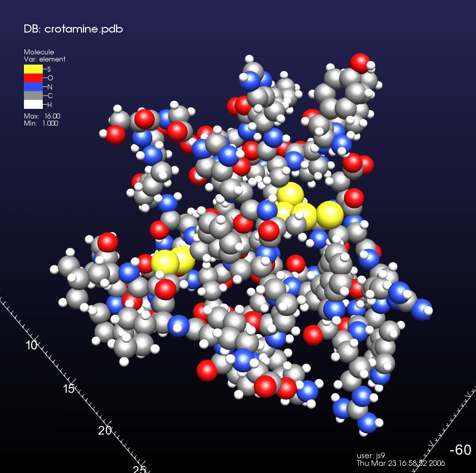
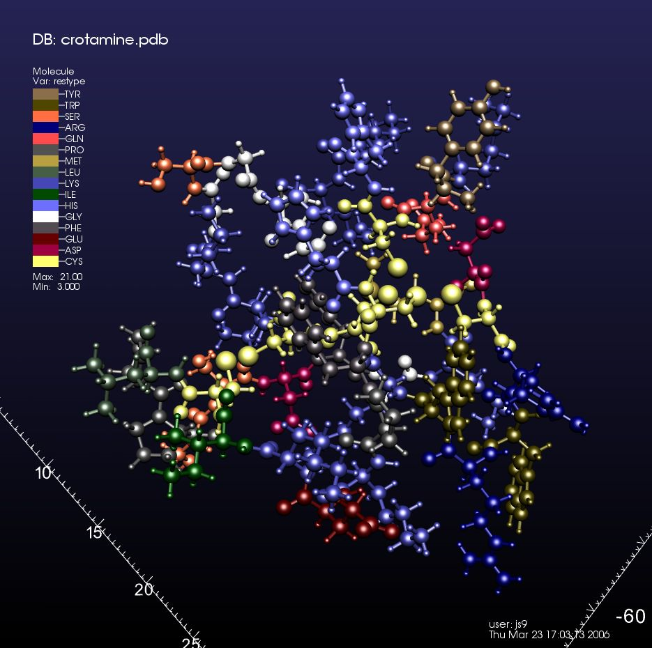
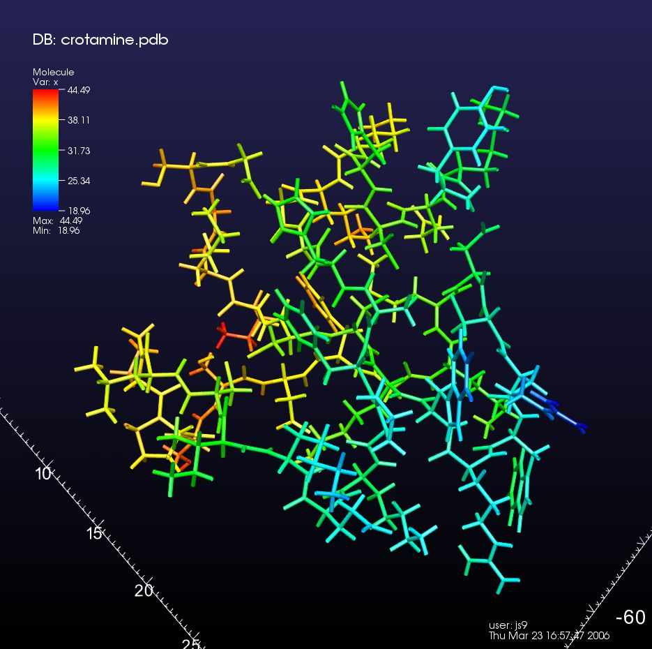
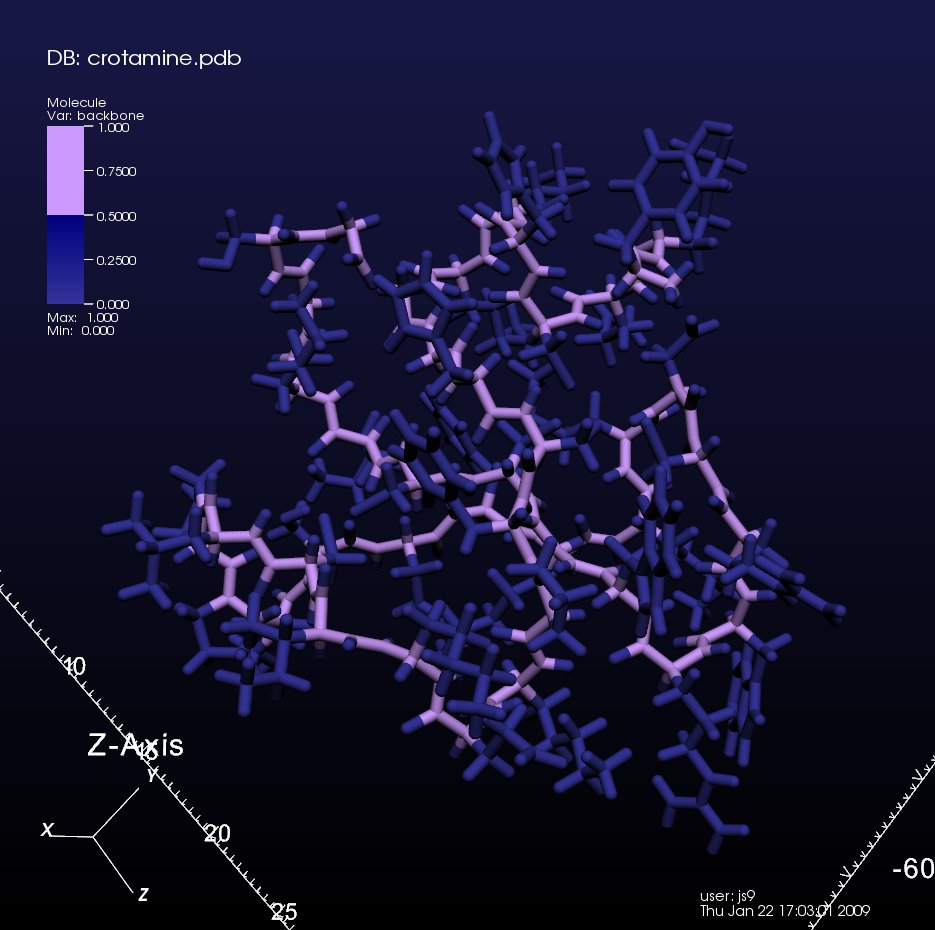
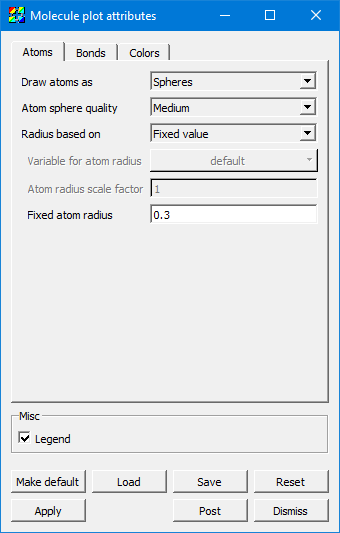
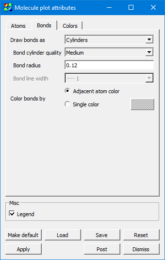
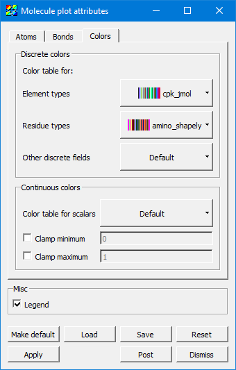

.. _molecule_plot_head:

Molecule Plot
~~~~~~~~~~~~~

The **Molecule** plot takes as input data with atoms and bonds (stored 
internally as Vertices and Lines in a VTK PolyData structure) and renders it 
as spheres and lines/cylinders

  Molecule plot of crotamine, colored by element type, atoms shown with covalent radius, and no bonds.

  Molecule plot of crotamine, colored by residue type, atoms proportional to covalent radius emulating the CPK syle, bonds colored with adjacent atom color.

  Molecule plot of crotamine, colored by a scalar quantity, no atoms shown, and bonds drawn as cylinders. 

  Molecule plot of crotamine, colored by *backbone*, atom at same width as thicker cylinder-shaped bonds.

Controlling how atoms are drawn
"""""""""""""""""""""""""""""""

.. _molecule_atoms:

   Molecule plot window Atoms tab

The value *Spheres* for **Draw atoms as** means to draw spheres using 3D 
geometry.  *Sphere Impostors* means to draw them using a single flat polygon 
with an image of a sphere -- this requires support from graphics hardware and 
can introduce some minor graphical artifacts, but it is very fast. The value 
*None* means that you are only interested in seeing the bonds, and you would 
like the atoms themselves not to be drawn.

When rendering *Spheres*, **Atom sphere quality** determines the number of 
polygons used to draw the atom geometry. *Low* corresponds to about a dozen 
polygons per sphere, *Medium* is several dozen, *High* a couple hundred, and 
*Super* is about a thousand.

**Radius based on** determines how the atoms are sized. *Scalar variable* uses 
a nodal variable on the data set to determine radius.  *Covalent radius* and 
*Atomic radius* are the atomic properties, and they are calculated using a 
built-in lookup table in VisIt_. *Fixed value* simply uses the value in the 
text field below as the radius. Note that *Covalent radius* and *Atomic radius* 
require a discrete nodal field called *element* to exist and contain the atomic 
number. Also, note that some default values are set due to much molecular data 
being in units of Angstroms. Depending on your data, you may need to change the 
atomic/bond radii.

When **Radius based on** is set to *Scalar variable*, the 
**Variable for atom radius** field becomes active and determines which variable 
shall be used (and multiplied by the scale factor below) as the value for the 
radius of the rendered atoms.

**Atom radius scale factor** applies when **Radius based on** is not set to 
*Fixed value*. This value multiplies the other value used for radius, whether 
it is the atomic/covalent radius or based on a scalar variable. Note that the 
atomic and covalent radii used are in Angstroms, so if your data is in other 
units, you should apply the appropriate conversion factor here.

**Fixed atom radius** only applies when **Radius based on** is set to 
*Fixed value*. It is the actual radius you want to use to draw the atoms in 
world coordinate units. 

Controlling how bonds are drawn
"""""""""""""""""""""""""""""""

.. _molecule_bonds:

   Molecule plot window Bonds tab

The value *None* for **Draw bonds as** means you are only interested in seeing 
the atoms and would like any bonds to be hidden. *Lines* uses geometric lines 
with no 3D shading, and *Cylinders* uses 3D geometry with 3D shading. 
*Lines* is much faster but *Cylinders* looks better.

When **Draw bonds as** is set to *Cylinders*, **Bond cylinder quality** 
determines the number of polygons used to draw the bonds. *Low* is about three 
polygons, and *High* is about twenty.

When **Draw bonds as** is set to *Cylinders*, **Bond radius** determines the 
thickness of the cylinder in world coordinate units. Note that defaults for 
these values were chosen due to molecular data commonly being in units of 
Angstroms. Depending on your data, you may need to change the radius used 
for rendering atoms and bonds.

When **Draw bonds as** is set to *Lines*, **Bond line width** determines the 
thickness of the line used to draw the bonds in terms of a number of pixels.

**Color bonds by** can be set to *Adjacent atom color*, which means that each 
half of the bond is drawn using the color of the atom to which it is attached. 
Or, it can be set to a *Single color* chosen at the color selector just to the 
right of this checkbox. 

Controlling colors 
""""""""""""""""""

.. _molecule_colors:

   Molecule plot window Colors tab

The **Discrete colors group** is for values which take on integral values. 
When VisIt_ encounters a discrete-valued variable, it determines which one of 
these color tables to use based on the variable name (*element* and *restype*, 
specifically).

**Element types** and **Residue types** are specific examples, and they are separate 
because there are conventional color tables widely used. VisIt_ provides some 
of these color tables.  **Other discrete fields** catches anything which is not 
an element or residue type. 

The **Continuous colors group** is for values which take on real values.  
**Color table for scalars** can be set to any color table, typically a 
continuous one.  The **Clamp minimum** and **Clamp maximum** check boxes, 
along with their values, toggle whether to clamp the continuous field to narrow 
the range to a specific range of values of particular interest, making full use 
of the color table within that range and clamping anything outside that range 
to the colors at the min/max extrema of the selected color table. 

Examples in use
"""""""""""""""

See :ref:`moleculardatafeatures_head` for examples of the Molecule plot in use.
