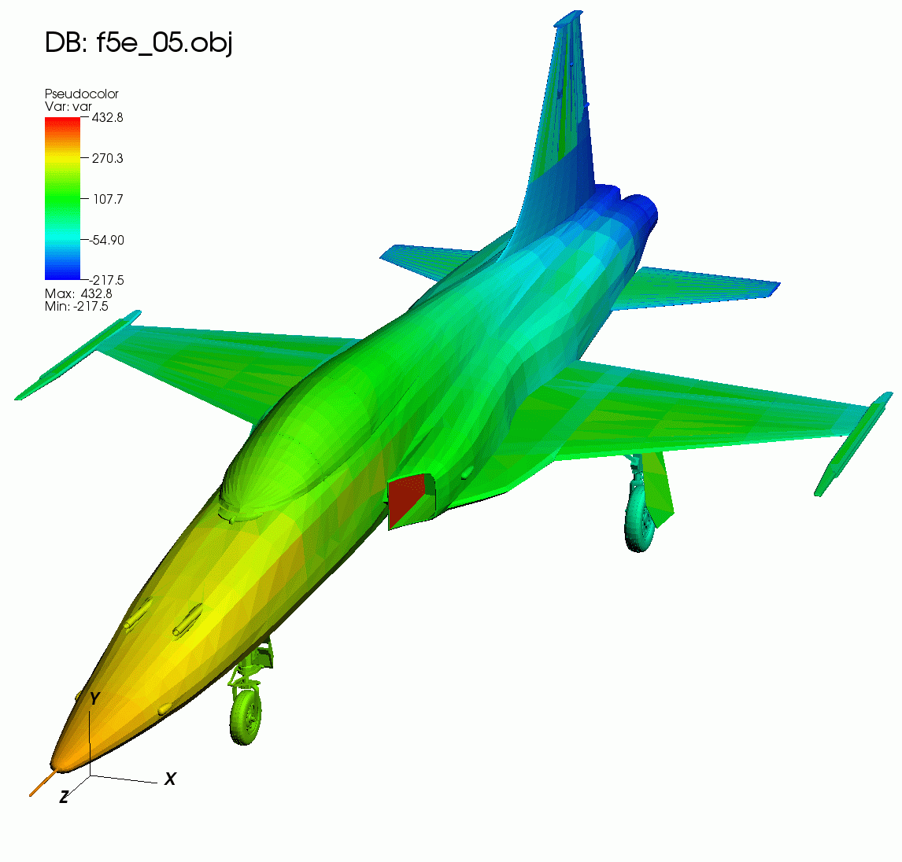
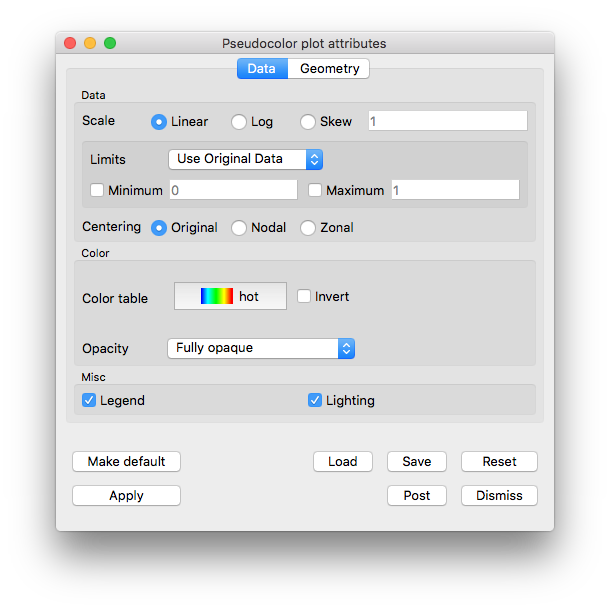
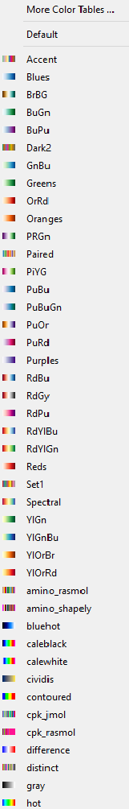
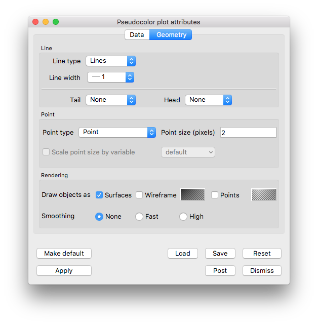

.. _pseudocolor_plot_head:

Pseudocolor plot
~~~~~~~~~~~~~~~~

The **Pseudocolor** plot, shown in :numref:`Figure %s <pseudocolorplot2>`, maps
a scalar variable's data values to colors and uses the colors to "paint" values
onto the variable's computational mesh.
The result is a clear picture of the database geometry painted with variable values that have been mapped to colors.
You might try this plot first when examining a scientific database for the first time since it reveals so much information about the plotted variable.

.. _pseudocolorplot2:

   Pseudocolor plot

Data tab options
""""""""""""""""

VisIt_'s **Pseudocolor plot attributes window Data tab** allows you to change the data scaling, limits and centering, as well as change colors, opacity and control the plot Legend and lighting.  
(shown in :numref:`Figure %s <pseudocolorwindow2>`)

.. _pseudocolorwindow2:

   Pseudocolor plot attributes window Data tab

Scaling the data
''''''''''''''''

The scale maps data values to color values.
VisIt_ provides three scaling options: **Linear**, **Log**, and **Skew**.
**Linear**, which is the default, uses a linear mapping of data values to color values.
**Log** scaling is used to map small ranges of data to larger ranges of color.
**Skew** scaling goes one step further by using an exponential function based on a skew factor to adjust the mapping of data to colors.
The function used in skew scaling is **(s^d-1)/(s-1)** where **s** is a skew factor greater than zero and **d** is a data value that has been mapped to a range from zero to one.
The mapping of data to colors is changed by changing the skew factor.
A skew factor of one is equivalent to linear scaling but values either larger or smaller than one produce curves that map either the high or low end of the data to a larger color range.
To change the skew factor, choose **Skew** scaling and type a new skew factor into the **Skew factor** text field.

Limits
''''''

Setting limits for the plot imposes artificial minima and maxima on the plotted variable.
This effectively restricts the range of data used to color the **Pseudocolor** plot.
You might set limits when you are interested in only a small range of the data or when data limits need to be maintained for multiple time steps, as when playing an animation.
In fact, we recommend setting the limits when producing an animation so the colors will correspond to the same values instead of varying over time with the range of the plotted variable.
Setting limits often highlights a certain range in the data by assigning more colors to that data range.

To set the limits for the **Pseudocolor** plot, you must first select the limit mode.
The limit mode determines whether the original data extents (data extents before any portions of the plot are removed), are used or the actual data extents (data extents after any portions of the plot are removed), are used.
To select the limit mode, choose either **Use Original Data** or **Use Actual Data** from the **Limits** menu.

The limits for the **Pseudocolor** plot consist of a minimum value and a maximum value.
You may set these limits, and turn them on and off, independently of one another.
That is, the use of one limit does not require the use of the other.
To set a limit, check the **Min** or **Max** check box next to the **Min** or **Max** text field and type a new limit value into the **Min** or **Max** text field.

Variable centering
''''''''''''''''''

Variables in a database can be associated with a mesh in various ways.
Databases supported by VisIt_ allow variables to be associated with a mesh's zones (cells) or its nodes.
When a variable is associated with a mesh's zones, the variable field consists of one value for each zone and is said to be :term:`Zone-centered`.
When a variable is associated with a mesh's nodes, there are values for each vertex making up the zone and the variable is said to be :term:`Node-centered`.

There are three settings for variable centering: **Natural**, **Nodal**, and **Zonal**.
**Natural** variable centering displays the data according to the way the variable was centered on the mesh.
This means that node-centered data will be displayed at the nodes with colors being linearly interpolated between the nodes, and zone-centered data will be displayed as zonal values, giving a slightly "blocky" look to the picture.
If **Nodal** centering is selected, all data is displayed at the nodes regardless of the variable's natural centering.
This will produce a smoother picture, but for variables which are actually zone-centered, you will lose some data (local minima and maxima).
If you select **Zonal** centering, all data is displayed as if they were zone-centered.
This produces a blockier picture and, again, it blurs minima/maxima for node-centered data.

Changing the color table
''''''''''''''''''''''''

.. _colortablebutton:

   Color table button

The **Pseudocolor** plot can specify which VisIt_ color table is used for colors.
To change the color table, click on the **Color table** button, shown in :numref:`Figure %s <colortablebutton>`, and select a new color table name from the list of color tables.
If you do not care which color table is used, choose the **Default** option to use VisIt_'s active continuous color table.
The color tables available in the list can be controlled using VisIt_'s **Color table window** which is described in the :ref:`Color_tables` section, and can be opened via the **More Color Tables ...** option at the top of the list. 

Opacity
'''''''

You can make the **Pseudocolor** plot transparent by changing its opacity using the **Opacity** menu.
There are four options: 

1. **Fully opaque:** (the default), no transparency is applied.
2. **From color table:**, opacity values are obtained from the active color table for the plot.
   If the color table doesn't support opacities, the plot will be fully opaque.
3. **Constant:**  A constant opacity is applied everywhere.
   A slider is provided to modify the opacity value.
   Moving the opacity slider to the left makes the plot more transparent while moving the slider to the right makes the plot more opaque.
4. **Ramp:**   Opacity is applied on a sliding scale ranging from fully transparent (applied to the lowest values), to the opacity value chosen on the slider.
   If the the slider is fully to the right, then the maximum values being plotted will be fully opaque.

Legend Behavior
'''''''''''''''

The legend for the **Pseudocolor** plot is a color bar annotated with tick marks and numerical values.
Below the color bar the minimum and maximum data values are also displayed.
Setting the limits for the plot changes *only* the color-bar portion of the plot's legend.
It *does not change* the *Min* and *Max* values printed just below the color bar.
Those values will always display the original data's minimum and maximum values, regardless of the limits set for the plot or the effect of any operators applied to the plot.

Lighting
''''''''

Lighting adds detail and depth to the **Pseudocolor** plot, two characteristics that are important for animations.
The **Lighting** check box in the lower part of the **Pseudocolor plot attributes window** turns lighting on and off.
Since lighting is on by default, uncheck the **Lighting** check box to turn lighting off.

Geometry tab options
""""""""""""""""""""

VisIt_'s **Pseudocolor plot attributes window Geometry tab** allows you to modify the appearance of lines and points, and change rendering options (shown in :numref:`Figure %s <pseudocolorgeometrytab>`)

.. _pseudocolorgeometrytab:

   Pseudocolor plot attributes window, geometry tab

Lines
'''''

The lines section can be useful when visualizing the results from an :ref:`Integral_Curve_System` operation.

There are three options for **Line type**: **Lines** (default), **Tubes**, and **Ribbons**.

The width of **Lines** can be changed by choosing an option from the **Line width** menu.
The **Tubes** type has a **Resolution** option which represents the roundness of the tube.
The higher the resolution, the rounder the tube. 

Both the **Tubes** and **Ribbons** type have various methods for affecting the radius.
The **Radius** option can be expressed either as an **Absolute** quantity or **Fraction of the Bounding Box** (default) by choosing one of these via the menu. 
A Variable can be chosen for the radius by checking the **Variable radius** checkbox, and choosing a variable from the menu.

Lines can also have glyphs at their head and tail.
Glyph options are **None** (default), **Sphere**, and **Cone**.
You can also specify **Resolution** and **Radius** for the glyphs.

Point
'''''

Controls for points are described in :ref:`plot_point_type_and_size`.

Representation
''''''''''''''

By default, the **Pseudocolor** plot renders as a **Surface**.
It can also render in **Wireframe** or **Points** mode.
Choose the representation by checking one or any combination of the three.
**Wireframe** and **Points** will be rendered in the color specified by their corresponding Color buttons.  

Geometry smoothing
''''''''''''''''''

Sometimes visualization operations such as material interface reconstruction can alter mesh surfaces so they are pointy or distorted.
The **Pseudocolor** plot provides an optional Geometry smoothing option to smooth out the mesh surfaces so they look better when the plot is visualized.
Geometry smoothing is not done by default, you must click the **Fast** or **High** radio buttons to enable it.
The **Fast** geometry smoothing setting smooths out the geometry a little while the **High** setting produces smoother surfaces.

