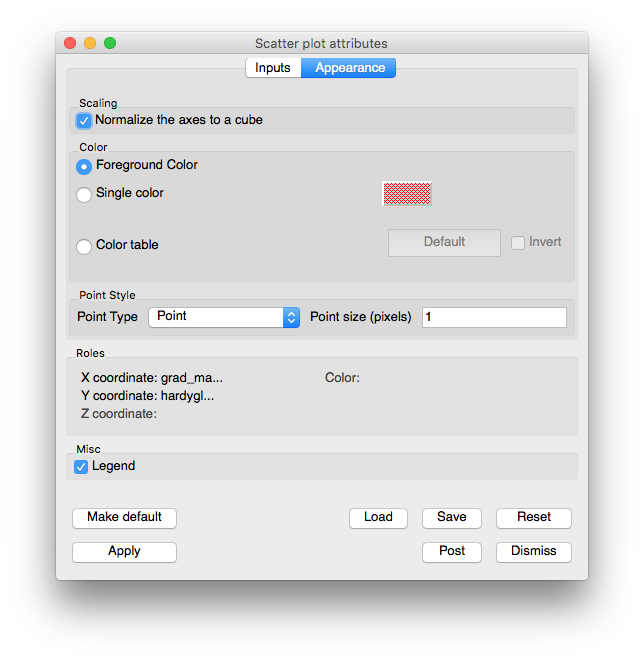

Scatter Plot
~~~~~~~~~~~~

The **Scatter** plot (see :numref:`Figure %s <scatterplot>`) allows you to
combine multiple scalar fields into a point mesh so you can investigate the
relationships between multiple input variables. You might, for example, want to
see the behavior of pressure vs. density colored by temperature. The **Scatter**
plot can take up to four scalar fields as input and can use up to three of
them as coordinates for the created point mesh while one input variable can be
used to assign colors to the point mesh. The **Scatter** plot provides
individual controls for setting the limits of each input variable and also
allows each input variable to be scaled so that all of the resulting points
from disparate data ranges fit in a unit cube.

.. _scatterplot:

   Example of Scatter plot

.. _scatterplotwindow:

   Scatter plot attributes window

The **Scatter plot attributes window** is divided into two tabs: **Inputs**
and **Appearance**. The **Inputs** tab is further subdivided into tabs for each
input variable. Each tab for an input variable contains controls that pertain
to selecting the input variable, settings its limits, or setting the role that
the input variable will perform within the **Scatter** plot. Each input variable
can have one of five roles that will be covered later. The **Appearance** tab
contains controls for changing the **Scatter** plot's appearance. Under the two
main tabs, the **Scatter plot attributes window** features a small section that
lists the roles that are used in the plot and which input variables are assigned
to each role.

Scatter plot wizard
"""""""""""""""""""

.. _scatterwizard:

   Example of the Scatter plot wizard

Plots are typically created in VisIt when you choose a variable from one of the
**Plot menus**. Since the **Scatter** plot takes as input up to four input
variables and typical plot creation only initializes one variable, you can
imagine that if a **Scatter** plot was created the usual way, only one of its
many input variables would be initialized. Furthermore, to initialize the plot,
you would have to open the **Scatter plot attributes window** and select the
other variables. Since that would not be a very straightforward way to create a
**Scatter** plot, VisIt now has support for plot wizards. A plot wizard is a
simple dialog window that pops up when you select a variable to plot. A plot
wizard leads you through a series of questions that allow VisIt to more fully
initialize a new plot. The **Scatter plot wizard** prompts you for the scalar
variable to use for the Y-Axis, the variable to use for the Z-Axis (optional),
and the variable to use for the plot's colors (optional).

Selecting a variable
""""""""""""""""""""

Three of the **Scatter** plot's four input variables can be set in the
**Scatter plot attributes window**. The first input variable cannot be changed
from within the **Scatter plot attributes window** because that is the default
variable used by the plot. If you want to change the first input variable, you
can use the **Variables** menu under the **Plot list** . If you want to select
a different variable for any of the other input variables, you would first
click on the input variable's tab and then you would select a new variable by
making a selection from the tab's **Variable** button. Note that any
combination of nodal and cell-centered variables can be chosen. The **Scatter**
plot will recenter any input variables whose centering does not match the first
input variable's centering.  

Setting an input variable's role
""""""""""""""""""""""""""""""""

Each of the **Scatter** plot's input variables has a role that you can set which
determines how the input variable is used by the **Scatter** plot. An input
variable can be used for the X, Y, Z coordinates, for the color, or it can
have no role. The role of the input variable is not fixed because you might
want to change roles many times and it is much less work to change only the
roles instead of reselecting variables, limits, and scaling for an input
variable. The flexibility of selecting a role for an input variable makes it
convenient to turn off colors or the Z coordinate with little effort. To
change the role for an input variable, select a new role from the input
variable's **Role** combo box. If you select a role that is already played by
another input variable, VisIt will give the current input variable the selected
role and set the input variable that previously had the selected role so that
it has no role.

Each of the **Scatter** plot roles and their associated input variables are
listed in the bottom of the **Scatter plot attributes window** . Roles that
have an input variable have the name of the input variable printed next to the
name of the role so looking through all of the input variable tabs to determine
what the **Scatter** plot should look like is not required. Roles that have no
assigned input variable are grayed out.

Setting the minimum and maximum values
""""""""""""""""""""""""""""""""""""""

The **Scatter** plot allows you to set minimum and maximum limits on the values
considered for inclusion into the created point mesh. If an input variable's
data value does not lie in the specified minimum/maximum value data range then
the point is not included in the created point mesh. Note that setting limits
does not cause points to be removed when data values in the color role fall
outside of the specified limits. To set the minimum value to be allowed in the
created point mesh, click on the **Min** check box and type a new minimum value
into the **Min** text field. To set the maximum value to be allowed in the
created point mesh, click on the **Max** check box and type a new value into the
**Max** text field.

Scaling an input variable
"""""""""""""""""""""""""

Sometimes input variable data values are clustered in a certain range of the
data. When this is the case, the points in the **Scatter** plot will bunch up in
one or more dimensions. For more uniformly spaced points, you might try
scaling one or more input variables. Each input variable can be scaled in the
three common ways: Linear, Log, and Skew. To set the scaling method used for the
input variable, click on the **Linear**, **Log**, or **Skew** radio buttons. If
you choose the Skew scaling method then you should also enter a value greater
than zero into the **Skew factor** text field to determine the function used for
skew scaling.

Since the **Scatter** plot's input variables are likely to have wildly different
data ranges, the **Scatter** plot provides an option to independently scale each
input variable so it is in the range [0,1] so the resulting plot fits entirely
in a cube. If you prefer to see the **Scatter** plot without this corrective
scaling, you can turn off the Scale to cube check box on the
**Scatter plot attribute window's Appearance** tab.

.. _scatterplot_appearance:

   Scatter plot attributes window's Appearance tab 

Setting the colors
""""""""""""""""""

The **Scatter** plot can map scalar values to colors like the Pseudocolor plot
(:ref:`pseudocolor_plot_head`) does or it can color all points using a single
color. If you have set one of the input variables to have a color role then the
**Scatter** plot will map that input variable's data values to colors using the
specified color table. To change the color table used by the **Scatter** plot,
click on the **Color table** button and select a new color table from the list
of available color tables. If the **Scatter** plot has been configured such that
none of the input variables is playing the color role then the **Scatter**
plot's points will be drawn using one color. When the **Scatter** plot draws
its points using a single color, its default behavior is to color the points
using the vis window's foreground color. If you want to instead use a different
color, turn off the **Use foreground** check box and click on the
**Single color** color button to select a new color.

Setting point properties
""""""""""""""""""""""""

Controls for points are described in :ref:`plot_point_type_and_size`.
