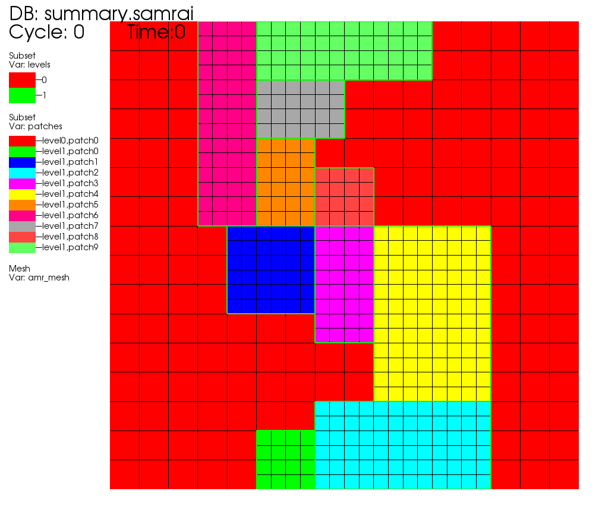
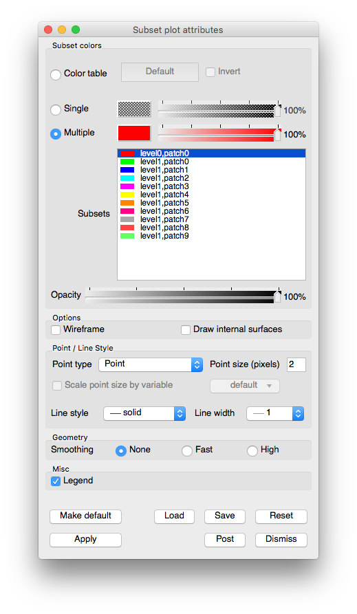

Subset Plot
~~~~~~~~~~~

The Subset plot (example in :numref:`Figure %s <subsetplot>`) is used to display subsets.
The typical scientific database can be decomposed into many different subsets.
Frequently a database is decomposed into non-material subsets such as domains or groups.
In AMR meshes, subsets can consist of levels or patches.
The Subset plot draws the database with its various subsets color coded so they
can be distinguished. For more information about subsets, see the **Subsetting**
chapter.

.. _subsetplot:

   Example of Subset plot of an AMR Mesh

.. _subsetplotwindow:

   Subset plot attributes window

Changing colors
"""""""""""""""

The main portion of the **Subset plot attributes window** , also known as the
**Subset colors area**, is devoted to setting subset colors. The
**Subset colors area** contains a list of subset names with an associated subset
color. Subset plot colors can be assigned three different ways, the first of
which uses a color table. A color table is a named palette of colors that you
can customize to suite your needs. When the Subset plot uses a color table to
color subsets, it selects colors that are evenly spaced through the color table
based on the number of subsets. For example, if you have three subsets and you
are coloring them using the "xray" color table, the Subset plot picks three
colors out of the color table so your levels are colored black, gray, and white.
To color a Subset plot with a color table, click on the
**Color table radio button** and choose a color table from the
**Color table menu** to right of the **Color table radio button**.

If you want all subsets to be the same color, click the **Single** radio button
at the top of the **Subset plot attributes window** and select a new color from
the **Popup color menu** that is activated by clicking on the
**Single color button**. The opacity slider next to the **Single color button**
sets the opacity for the single color.

Clicking the **Multiple** radio button causes each subset to be a different,
user-specified color. By default, multiple colors are set using the colors of
the discrete color table that is active when the Subset plot is created. To
change the color for any of the subsets, select one or more subsets from the
list of subsets and click on the **Color button** to the right of the
**Multiple** radio button and select a new color from the
**Popup color menu**. To change the opacity for a subset, move **Multiple**
opacity slider to the left to make the subset more transparent or move the
slider to the right to make the subset more opaque.

The **Subset plot attributes window** contains a list of subset names with an
associated subset color. To change a subset's color, select one or more subsets
from the list, click the color button and select a new color from the popup
color menu.

Opacity
"""""""

The Subset plot's opacity can be changed globally as well as on a per subset
basis. To change subset opacity, first select one or more subsets in the subset
list and move the opacity slider next to the color button. Moving the opacity
slider to the left makes the selected subsets more transparent and moving the
slider to the right makes the selected subsets more opaque. To change the
entire plot's opacity globally, use the **Opacity** slider near the bottom of
the window.

Setting point properties
""""""""""""""""""""""""

Albeit rare, the Subset plot can be used to plot points that belong to different
subsets so the **Subset plot attributes window** provides controls that allow you
to set the representation and size of the points. You can change the points'
representation using the **Point Type** combo box. The available options are:
**Box**, **Axis**, **Icosahedron**, **Point**, and **Sphere**. To change the
size of the points, you can enter a new floating point value into the
**Point size** text field. Finally, you can opt to scale the points' glyphs
using a scalar expression by turning on the **Scale point size by variable**
check box and by selecting a scalar variable from the **Variable** button to
the right of that check box.

Wireframe mode
""""""""""""""

The Subset plot can be modified so that it only displays outer edges of subsets.
This option usually leaves lines that give only the rough shape of subsets and
where they join other subsets. To make the Subset plot display in wireframe
mode, check the **Wireframe** check box near the bottom of the
**Subset plot attributes window**.

Drawing internal surfaces
"""""""""""""""""""""""""

When you make one or more subsets transparent, you might want to make the Subset
plot draw internal surfaces. Internal surfaces are normally removed from Subset
plots to make them draw faster. To make the Subset plot draw internal surfaces,
check the **Draw internal surfaces** check box near the bottom of the
**Subset plot attributes window**.

Geometry smoothing
""""""""""""""""""

Sometimes visualization operations such as material interface reconstruction can
alter mesh surfaces so they are pointy or distorted. The Subset plot provides an
optional Geometry smoothing option to smooth out the mesh surfaces so they look
better when the plot is visualized. Geometry smoothing is not done by default,
you must click the **Fast** or **High** radio buttons to enable it. The **Fast**
geometry smoothing setting smooths out the geometry a little while the **High**
setting works produces smoother surfaces.
