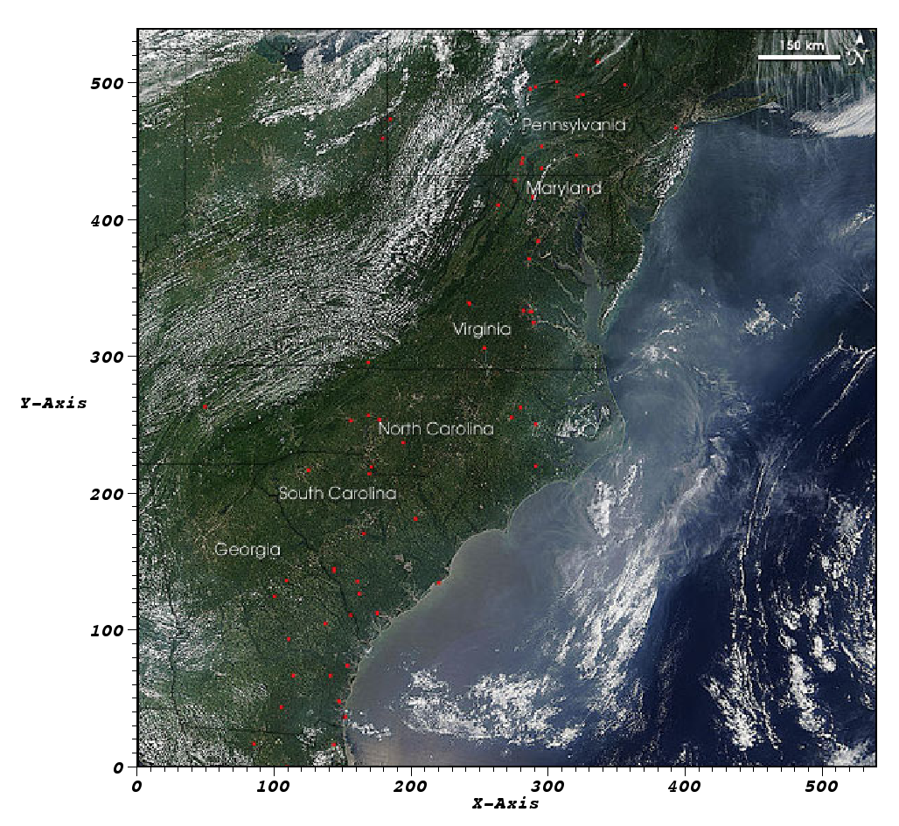
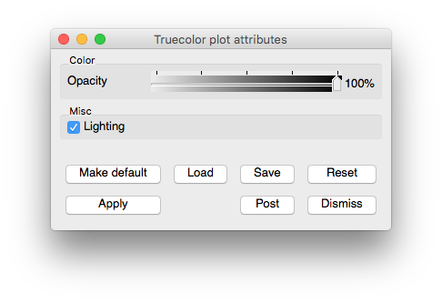

Truecolor plot
~~~~~~~~~~~~~~

.. _truecolor_plot:

   Truecolor Plot

   
   Truecolor Plot Attributes

The Truecolor plot, shown in :numref:`Figure %s<truecolor_plot>`, is used to
plot images of observational or experimental data so they can be compared to
other plots, possibly of related, simulated data, in the same visualization
window. The Truecolor plot takes in a color variable, represented in VisIt
as a three or four component vector, and uses the vector components as the
red, green, blue, and alpha values for the plotted image. This allows you
access to many more colors than other plots like the Pseudocolor plot, which
can be used only to plot a single color component of an image.

