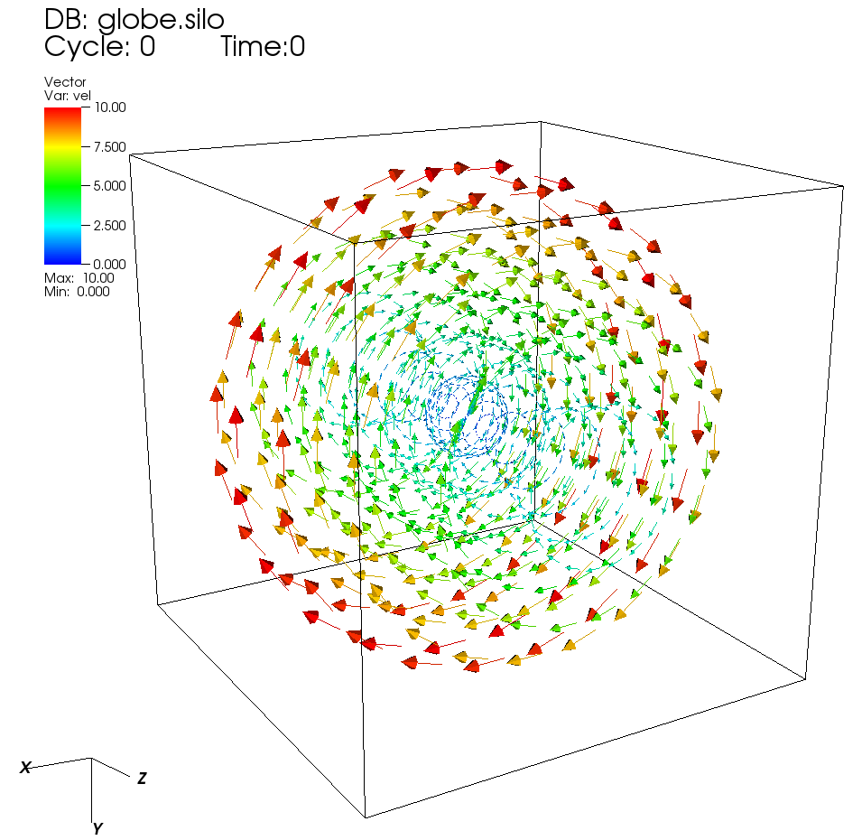
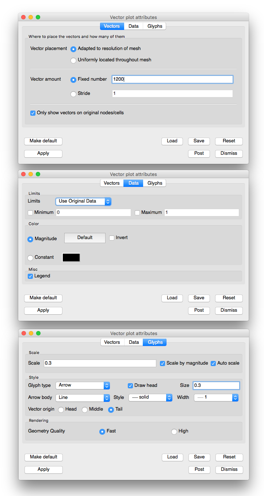

.. _vector_plot_head:

Vector plot
~~~~~~~~~~~

.. _vector_plot:

   An example vector plot

   
   The corresponding Vector plot attributes

The Vector plot (example shown in :numref:`Figure %s<vector_plot>`) displays
vector variables using glyphs that indicate the direction and magnitude of
vectors in a vector field.

Setting vector color
""""""""""""""""""""

The vectors in the Vector plot can be colored by the magnitude of the vector
variable or they can be colored using a constant color. Choose the coloring
method by clicking on either the **Magnitude** radio button or the **Constant**
color button. When vectors are colored by a constant color, you can change the
color by clicking on the color button next to the **Constant** radio button and
choosing a new color from the **Popup color menu**. When vectors are colored
by magnitude, the color is determined by one of VisIt's color tables, which can
be chosen from the **Color table** button next to the **Magnitude** radio
button.

If you choose to color the vectors by their magnitudes, you have the option of
also specifying minimum and maximum values to aid in the mapping of vector
magnitude to color. The options that are used to aid coloring are collectively
known as limits. Limits can apply to all vectors that exist in the dataset or
just the vectors that have been drawn by the Vector plot. To specify which,
choose the appropriate option from the **Limits** combo box. When you specify
a minimum value all vectors with magnitudes less than the minimum value are
colored using the color at the bottom of the color table. When you specify a
maximum value all vectors with magnitudes larger than the maximum value are
colored using the color at the top of the color table. To provide a minimum
value, check the **Min** check box and type a new minimum value into the
**Min** text field. To provide a maximum value, check the **Max** check box
and type a new maximum value into the **Max** text field.

Vector scaling
""""""""""""""

The size of the vector glyphs has a tremendous effect on the Vector plot's
readability. VisIt uses an automatically computed scaling factor based on the
diagonal of the bounding box as the size for the largest vector. You can
augment this size by entering a new scale factor in to the **Scale** text
field. It is also possible to turn off automatic scaling by turning off the
**Auto scale** check box. When automatic scaling is turned off, the vectors in
the Vector plot are the length specified in the **Scale** text field.

If you want each vector to be further scaled by its own magnitude, you can
turn on the **Scale by magnitude** check box. When the **Scale by magnitude**
check box is off, all vectors are the same length as determined by the
automatically computed scale factor and the user-specified scale.

Heads on the vector glyph
"""""""""""""""""""""""""

You can control the vector head size by typing a new value into the
**Head size** text field, which is the fraction of the entire vector's length
that will be devoted to the vector's head. Vectors in the Vector plot can be
drawn without vector heads so that only the line part of the vector glyph is
drawn. This results in cleaner plots, but the vector direction is lost. To turn
off vector heads, uncheck the **Draw head** check box at the bottom of the
**Vector Attributes Window**.

Tails on the vector glyph
"""""""""""""""""""""""""

The length of the tails on the vector glyph are determined by the vector
scaling factors that have been enabled. You can also set properties that
determine the location and line properties used to draw a vector glyph's tail.
First of all, you can set the line style used to draw the vector glyph's tail
by choosing a line style from the **Line style** combo box. You can choose a
new line width for the vector glyph's tail by choosing a new line width from the
**Line width** combo box. Finally, you can determine where the origin of the
vector is on the vector glyph. The vector origin is a point along the length
of the vector that is aligned with the node or cell center where the vector
glyph will be drawn. The available options are: Head, Middle, and Tail.
You can choose a new Vector origin by clicking on one of the **Head**,
**Middle**, or **Tail** radio buttons.

Setting the number of vectors
"""""""""""""""""""""""""""""

When visualizing a large database, a Vector plot will often have too many
vectors. The Vector plot becomes incomprehensible with too many vectors. VisIt
provides controls to thin the number of vectors to a number that looks
appealing in a visualization. You can accomplish this reduction by setting a
fixed number of vectors or by setting a stride. To set a fixed number of
vectors, select the **Fixed vectors** radio button and enter a new number of
vectors into the corresponding text field. To reduce the number of vectors
by setting the stride, select the **Stride** radio button and enter a new
stride value into the **Stride** text field.
