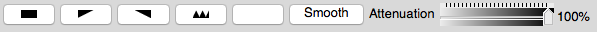

.. _volume_plot_head:

Volume plot
~~~~~~~~~~~

.. _volume_plot_example:

   Type Ia Supernova (Image Credit: Blue Waters visualization staff, Rob Sisneros and Dave Semeraro)

The Volume plot uses a visualization technique known as volume-rendering, which
assigns color and opacity values to a range of data values.
The colors and opacities are collectively known as a volume transfer function.
The volume transfer function determines the colors of the plot and which parts are visible.
The plot shown in (:numref:`Figure %s<volume_plot_example>`) uses volume-rendering for the magnitude of vorticity.
The magnitude of vorticity is a measure of turbulence that helps identify a *bubble* within the supernova.

The **Volume Plot Attributes Window**, shown in (:numref:`Figure %s<volume_plot_atts_window>`), is divided into two main tabs.
The **Rendering Options** tab controls the rendering setting.
Each volume rendering method has a different set of inputs.
Additionally, the **Rendering Options** tab contains controls for lighting.
**Transfer function** tab controls how the data is mapped onto colors and the opacities to use for different scalar values.

.. _volume_plot_atts_window:

   The rendering attributes for the Volume plot

.. _volume_plot_atts_window2:

.. figure:: ../images/volumewindow2.png

   The transfer function editor for the Volume plot

Rendering Options
"""""""""""""""""

The volume plot uses hardware-accelerated graphics by default (Serial).
Though this mode is faster the image resolution is typically lower.
Images drawn by software volume rendering, Parallel, Compositing, Integration, SLIVR typically have a higher resolution and thus are more accurate.
Note software volume rendering can be a compute intensive process if the database or the visualization window is large.
Shrinking the size of the visualization window before using a software rendering method will reduce the time and resources required to draw the plot.

It is worth noting that if the dataset is large with intricate details, the software volume rendering method is preferred because it scales well in parallel.
Using a parallel compute engine can greatly speed up the rate at which software volume rendering operates as long as the dataset is domain-decomposed into roughly equal-sized pieces.

The software volume rendering modes use a technique called ray-casting.
In ray-casting, a ray is followed in reverse from the computer screen into the dataset.
As a ray progresses through the dataset, sample points are taken and the sample values are used to determine a color and opacity value for the sample point.
Each sample point along the ray is composited to form a final color for the screen pixel.
Rays are traced from closest to farthest to allow for early ray termination which stops the sampling process when the pixel opacity gets above a certain threshold.
This method of volume-rendering yields superior pictures at the cost of speed and memory use.

**Rendering Method: Serial Rendering** (:numref:`Figure %s<serial_rendering_atts_window>`).

.. _serial_rendering_atts_window:

   Serial Rendering options

**Rendering Method: Parallel Rendering** (:numref:`Figure %s<parallel_rendering_atts_window>`).

.. _parallel_rendering_atts_window:

   Parallel Rendering options

Serial and Parallel Rendering Options:

When rendering in Serial and Parallel the data must be on rectilinear grid which often requires the data to be resampled.
The user may select one the following options:

``No Resampling``: Do not resample the data.

``Only if required``: Automatically resample the data but only if needed.

``Single Domain``: Resample the data on to a single rectilinear grid on rank zero (0).

``Parallel Redistribute``: Resample the data over all ranks on to a rectilinear grid and redistribute the results over all rank.

``Parallel Per Rank``: Resample the data on each rank on to a rectilinear grid. Does not account for multiple samples on boundaries.

Two other resampling options:

``Number of Samples``: The number of samples, may be over all ranks or per rank.

``Centering``: Native, Nodal, or Cell.
Resample on a native, nodal or cell basis.
The centering should typically be Native.
Note: when using an opacity variable it must have the same centering as the color data.

The user may also select OSPRay rendering <https://www.ospray.org>`_ which is an Open source, Scalable, and Portable Ray tracing engine for volume rendering on Intel Architecture CPUs.

``Rendering Type``: Sets rendering type to be either "scivis" or "path traced" photo-realism.

``AO Samples``: determines the number of rays per sample to compute ambient occlusion.

``AO Distance``: determines the maximum distance to consider for ambient occlusion.

``Minimum Contribution``: The minimum sample contribution.

``Maximum Contribution``: The maximum sample contribution.

The volume plot can use lighting to enhance the look of the plot.
Lighting is enabled by default but the user can disable it by unchecking the **Lighting** check box near the bottom of the window.

``Ambient``: ambient light weight in [0-1]

``Diffuse``: diffuse reflection weight in [0-1]

``Specular``: specular reflection/transmission weight in [0-1]

``Shininess``: Phong exponent, usually in [2-10^4]

**Rendering Method: Compositing** (:numref:`Figure %s<compositing_atts_window>`)

.. _compositing_atts_window:

   Compositing options

**Rendering Method: Integration (grey scale)** (:numref:`Figure %s<integration_atts_window>`)

.. _integration_atts_window:

   Integration (grey scale) options

**Rendering Method: SLIVR** (:numref:`Figure %s<slivr_atts_window>`)

.. _slivr_atts_window:

   SLIVR options

Transfer Function
"""""""""""""""""

You can design the color component of the volume transfer function using the controls in **Transfer function** tab of the **Volume Plot Attributes Window**.
The controls are similar to the controls for the **Color Table Window**.
There is a color spectrum that has color control points which determine the final look of the color table.
Color control points are added and removed using the ``+`` and ``-`` buttons.
Dragging control points with the mouse moves them and changes their order.
Right-clicking on a color control point displays a popup color menu from which a new control point color can be chosen.

The **Transfer function** tab provides controls for setting the limits of the variable being plotted.
Limits are artificial minima or maxima that are specified by the user.
Setting the limits to a smaller range of values than present in the database cause the plot's colors to be distributed among a smaller range of values, resulting in a plot with more color variety.

To set the limits are set by first clicking the **Min** or **Max** check box next to the **Min** or **Max** text field.
Clicking a check box enables a text field into which the user can type a new minimum or maximum value.

Like VisIt_'s other plots that map scalar values to colors, the Volume plot allows for the data values to be scaled using Linear, Log, and Skew functions.
To select a scaling function other than linear where values in the data range are mapped 1:1 to values in the color range, click on the **Log** or **Skew** radio buttons.

Setting opacities
"""""""""""""""""

The **Transfer function** tab provides several controls that allow the user to define the opacity portion of the volume transfer function.
The opacity portion of the volume transfer function determines what can be seen in the volume-rendered image.
Data values with a lower opacity allow more to be seen and give the plot a gel-like appearance, while data values with higher opacity appear more solid and occlude objects behind them.
The controls for setting opacities are located at the button of the window in the **Opacity** area.

.. _volume_plot_opacity:

   Volume Plot Opacity Options

You can set opacity three ways.
You can hand-draw an opacity map, create it by designing curves that specify the opacity when they are added together, or use the opacities in the color table, if present.
All methods use the controls shown in :numref:`Figure %s<volume_plot_atts_window>`.

The interaction mode determines how opacity is set.
Clicking on the **Freeform** or **Gaussian** radio buttons selects the interaction mode.
If the interaction mode switches from **Gaussian** to **Freeform**, the shape constructed by the **Gaussian** controls is copied to the **Freeform** control.
Both controls pretend that the plot's data range is positioned horizontally such that the values on the left of the control correspond to the low data values while the values on the right of the control correspond to high data values.
In addition to the color map, there is a histogram of the current data to aide in setting opacity of interesting values.
The vertical direction corresponds to the opacity for the given data value.
Taller curves are more opaque while shorter curves are more transparent.

.. _volume_plot_freeform:

   Volume Plot Freeform Opacity Options

To design an opacity map using the **Freeform** control, position the mouse over it and click the left mouse button while moving the mouse.
The shape traced by the mouse is entered into the **Freeform** control so that the user can draw the desired opacity curve.
Immediately under the **Freeform** control, there are four buttons, shown in (:numref:`Figure %s<volume_plot_freeform>`), which can be used to manipulate the curve.
The first three buttons initialize a new curve.
The black button makes all data values completely transparent.
The ramp button creates a linear ramp of opacity that emphasizes high data values.
The white button makes all data values completely opaque.
The **Smooth** button smooths out small bumps in the opacity curve that occur when drawing the curve by hand.

.. _volume_plot_gauss_controls:

   Volume Plot Gaussian Opacity Options

The **Gaussian** control used during Gaussian interaction mode is complex but it provides precise control over the shape of a curve.
The basic paradigm followed by the **Gaussian** control is that new curves are added and reshaped to yield the desired opacity curve.
You add new curves by clicking and dragging in the control.
Right clicking with the mouse on an existing curve removes the curve.
Each curve has five control points which can change the curve's position and shape.
The control points are shown in along with the shapes that a curve can assume.
A control point changes color when it becomes active so there the user knows which control point is used.
Curves start as a smooth Gaussian shape but they can change between the shapes shown in by moving the shape control point up and down or left and right.
Opacity maps are typically created by adding several curves to the window and altering their shapes and sizes until the desired image is obtained in the visualization window.
The **Attenuation slider**, the final control involved in creating an opacity map, controls the opacity of the entire opacity map defined by the **Freeform** or **Gaussian** controls.
It provides a knob to scale all opacities without having to modify the opacity map.

Changing the opacity variable
"""""""""""""""""""""""""""""

The variable used to determine opacity does not have to be the plotted variable.
Having a different opacity variable than the plotted variable is useful for instances in which the user wants to determine the opacity using a variable like density while coloring the plot by another variable such as pressure.
To change the opacity variable, select a new variable from the **Opacity variable** variable menu.
By default, the plotted variable is used as the opacity variable.
This is implied when the **Opacity variable** variable button contains the word default.
Even when "default" is chosen, it is possible to set artificial data limits on the opacity variable by entering new values into the **Min** or **Max** text fields.

Controlling image quality
"""""""""""""""""""""""""

When the Volume plot is drawn with graphics hardware, the database is resampled onto a rectilinear grid that is used to place the polygons that are drawn to produce the image.
You can control the coarseness of the resampled grid with the **Number of samples** text field.
To increase the number of sample points, enter a larger number into the **Number of samples** text field.

When the Volume plot is drawn in ray casting mode, the number of samples along each ray that is cast through the data becomes important.
Having too few sample points along a ray gives rise to sampling artifacts such as rings or voids.
The user should adjust this number until satisfied with the image.
More samples generally produce a better image, though the image will take longer to produce.
To change the number of samples per ray, enter a new number of samples per ray into the **Samples per ray** text field.

When using lighting, the gradient calculation method that the Volume plot uses influences the quality of the images that are produced.
By default, VisIt_ uses the Sobel operator, which uses more information from adjacent cells to calculate a gradient.
When the Sobel operator is used to calculate the gradient, lighting usually looks better.
The alternative gradient calculation method is centered-differences and while it is much less compute intensive than the Sobel operator, it also produces lesser quality gradient vectors, which results in images that are not lit as well.
To change the gradient calculation method, click on either the **Centered diff** or **Sobel** radio buttons.

