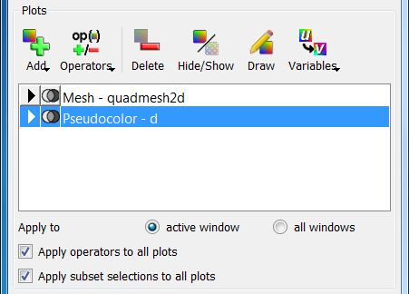
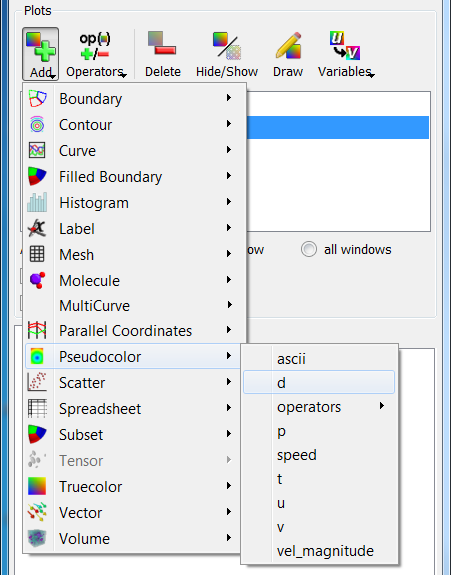
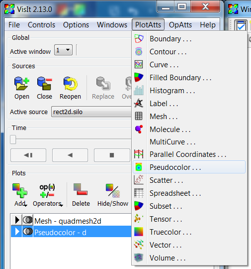
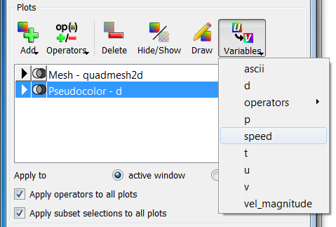

.. _Working with Plots:

Working with Plots
------------------

A plot is a viewable object, created from a database, that can be displayed
in a visualization window. VisIt provides several standard plot types that
allow you to visualize data in different ways. The standard plots perform
basic visualization operations like contouring, pseudocoloring as well as
more sophisticated operations like volume rendering. All of VisIt's plots
are plugins so you can add new plot types by writing your own plot plugins.
For information on creating new plot plugins contact us via
`Getting help <https://visit-dav.github.io/visit-website/support/>`_.

Managing Plots
~~~~~~~~~~~~~~

To visualize your data, you will iteratively create and modify many plots
until you achieve the end result. Since plots may be created and deleted
many times, VisIt provides controls in its **Main Window** to handle these
functions. The **Plots** area, shown in :numref:`Figure %s <Plots-PlotsArea>`,
contains the controls for managing plots.

.. _Plots-PlotsArea:

   The active plots area

The most prominent feature of the **Plots** area, the plot list contains a
list of the plots that are in the active visualization window. The entries
in the plot list contain the plot name and variable. Plot list entries change
colors depending on the state of the plot. When plots are initially created,
their plot list entries are green indicating that they are new and have not
been submitted to the compute engine for processing. When a plot is being
created on the compute engine, its plot list entry is yellow. When a plot
has finished generating on the compute engine, its plot list entry turns
black to indicate that the plot is done. If the compute engine cannot
generate a plot, the plot's plot list entry turns red to indicate an error
with the plot.

The plot list displays more then just the names of the visualization
window's plots. The plot list also allows you to set the active plots, that
is, those plots that can be modified. Highlighted plot entries are active.

The **Add** menu, an important part of the **Plots** area, contains the
options that create new plots.

Creating a plot
"""""""""""""""

To use any of VisIt's capabilities, you must know how to create a plot. First,
make sure you have opened a database. Once you have an open database, use
the **Add** menu to create a plot.

.. _Plots-AddMenu:

   The Add menu

Selecting the **Add** menu pops up a list of VisIt plot types. Plots for which
the open database has no data are disabled. If a plot type is enabled, pulling
the mouse toward the right while holding down the left button shows which
variables can be plotted. Release the mouse button when the mouse cursor is
over the variable that you want to plot, and a new plot list entry will appear
in the plot list. The new plot list entry will be colored green in the plot
list until VisIt is told to draw when you click the **Draw** button. The
**Add** menu is disabled until a database is open.

Deleting a plot
"""""""""""""""

VisIt deletes all the selected plots when you click the **Delete** button.
If the plot list has keyboard focus, you can also delete a plot using the
**Delete** key.

Selecting a plot
""""""""""""""""

Since VisIt will only let you modify active plots, you must be able to select
plots. To select a plot, click on its entry in the plot list. Multiple plots
can be selected by holding down the ``Ctrl`` key and clicking plot entries
one at a time. Alternatively, groups of plot entries can be selected by
clicking on a plot entry and then clicking another plot entry while holding
down the ``Shift`` key.

Drawing a plot
""""""""""""""

When you add a plot to the plot list, it won't be drawn until you click the
**Draw** button. Once you do, the new plot's plot list entry switches from
green to yellow in the plot list to indicate that its results are pending
and the compute engine starts generating the plot. Clicking the **Draw**
button causes all new plots to be drawn.

Hiding a plot
"""""""""""""

When you are visualizing your data, you will often have many different plots
in the same visualization window. Sometimes you might want to temporarily
hide plots from view to more easily view the other plots in the window. To
hide the selected plots, click the **Hide/Show** button in the **Plots**
area. When a plot is hidden, its plot list entry is gray and contains the
word ``hidden`` to indicate that the plot is hidden. To show a hidden plot,
select the hidden plot and click the **Hide/Show** button again. Note that
plots must exist for the **Hide/Show** button to be enabled.

Setting plot attributes
"""""""""""""""""""""""

Each plot type has its own plot attributes window used to set attributes
for that plot type. Plot attributes windows are activated by double-clicking
a plot entry in the plot list. You can also open a plot attribute window
by selecting a plot type from the **PlotAtts** (Plot Attributes) menu shown
in :numref:`Figure %s <Plots-PlotAttsMenu>`,

.. _Plots-PlotAttsMenu:

   The PlotAtts menu

Changing plot variables
"""""""""""""""""""""""

.. _Plots-VariablesMenu:

   The Variables menu

When examining a plot, you might want to look at another variable. For
example, you might want to switch from looking at density to pressure.
VisIt allows the plot variable to be changed without having to delete
and recreate the plot. To change the plot variable, first make sure the
plot is active, then select a new variable from the available variable
names in the **Variables** menu. The **Variables** menu contains only the
variables from the database that are compatible with the plot.
