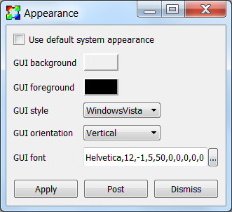

.. _Appearance Window:

Appearance Window
-----------------

The **Appearance** window is responsible for setting preferences for
the appearance of the GUI windows. The **Appearance** window shown in
:numref:`Figure %s<Preferences-Appearance>` is brought up by selecting
**Appearance** from the main window's **Options** menu. It can be used
to set the GUI colors as well as other attributes such as the style and
orientation. In order to change any of the appearance attributes, the
user must first uncheck the **Use default system appearance** check box.

.. _Preferences-Appearance:

   The appearance window

Changing GUI colors
~~~~~~~~~~~~~~~~~~~

To change the GUI colors using the **Appearance** window, click on the color
button next to the color to be changed. To change the background color (the
color of the GUI's windows), click on the **GUI background** color button
and select a new color from the **Popup color** menu. To change the
foreground color (the color used to draw text), click the **GUI foreground**
color button and select a new color from the **Popup color** menu.

VisIt_ will issue an error message if the colors chosen for both the
background and foreground colors are close enough that they cannot be
distinguished so that the user does not accidentally get into a situation
where the controls in VisIt_'s GUI become too difficult to read. Some
application styles, such as Aqua, do not use the background color so
setting the background has no effect unless an application style like
Windows is chosen, which does use the background color.

Changing GUI Style
~~~~~~~~~~~~~~~~~~

VisIt_'s GUI adapts its look and feel, or application style, to the
platform on which it is running. It is also possible to make the GUI use
other application styles, although for the most part they look fairly
similar.

To change the style select a new style from the **GUI style** menu. It is
frequently necessary to change the GUI font by either changing the font
description in the **GUI font** text box or selecting a new font from the
font selection window, which is brought up by clicking on the **...**
button to the right of the **GUI font** text field.

Changing GUI Orientation
~~~~~~~~~~~~~~~~~~~~~~~~

By default, VisIt's **Main** window appears as a vertical window to the
left of the visualization windows. The default configuration often makes
the best use of the display with wide aspect ratio screens. It has become
very rare to encounter screens where the horizontal orientation makes
better use of the display, so it is not recommended and will most likely
be deprecated in future versions of VisIt_.
