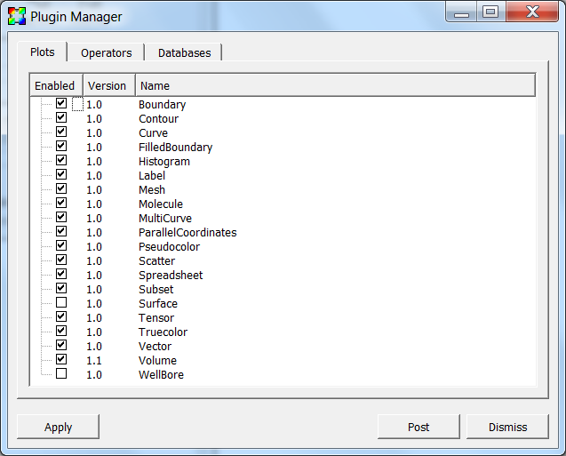

.. _Plugin Manager Window:

Plugin Manager Window
---------------------

The **Plugin Manager** window , shown in
:numref:`Figure %s<Preferences-PluginManager>`, allows the user to see which
plugins are available for plots, operators, and databases.  Not all plugins
have to be loaded, in fact, many operator plugins are not loaded by default.
The **Plugin Manager** window allows the user to specify which plugins are
loaded when VisIt_ is started. The **Plugin Manager** window is brought up by
selecting **Plugin Manager** from the **Main** window's **Options** menu.

.. _Preferences-PluginManager:

   The plugin manager window
   
.. _Preferences_Enabling_Plugins:

Enabling and Disabling Plugins
~~~~~~~~~~~~~~~~~~~~~~~~~~~~~~

All of VisIt_'s plots, operators, and database readers are implemented as
plugins that are loaded when VisIt_ first starts up. Some plugins are not
likely to be used by most people so they should not be loaded. The
**Plugin Manager** window provides a mechanism to turn plugins on and off.
The window has three tabs: **Plots** , **Operators** , and **Databases**.
Each tab displays a list of plugins that can be loaded by VisIt_. If a
plugin is enabled, it has a check by its name.

Plugins can be turned on and off by checking or unchecking the check box
next to a plugin's name. Plugins are loaded at startup, so enabling or
disabling plugins will not take effect unless the preferences are saved
and VisIt_ is restarted.

If plots or operators are disabled, they will not appear in the **Add**,
**Operator**, **PlotAtts** and **OpAtts** menus. Similarly, disabled
databases will not show up in the list of **Open file type as** menu in
the **File open** window.
