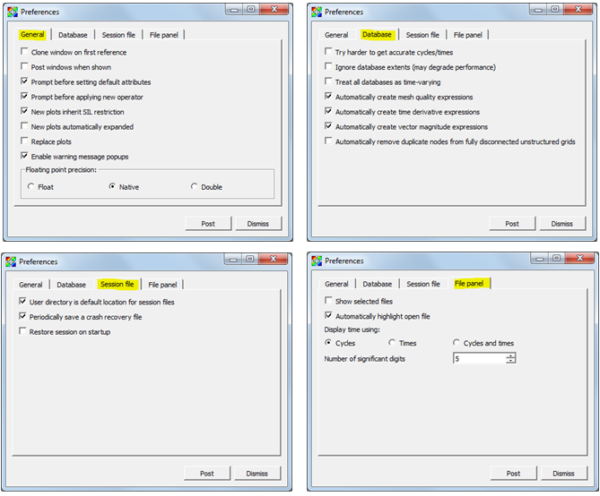

.. _Preferences Window:

Preferences Window
------------------

The **Preferences** window, shown in
:numref:`Figure %s<Preferences-Preferences>`, contains controls that allow
setting global options that influence VisIt_'s behavior. The **General** tab 
contains a collection of miscellaneous options. This is followed by options 
that are grouped by functionality. The groups are contained in the 
**Database**, **Session file** and **File panel** tabs.

.. _Preferences-Preferences:

   The preferences window

Copying Plots On First Reference
~~~~~~~~~~~~~~~~~~~~~~~~~~~~~~~~

The **Clone windows on first reference** option clones all attributes of
the active window to a new window when a window is made active for the
first time. To control this behavior check or uncheck the
**Clone window on first reference** check box.

Posting Windows By Default
~~~~~~~~~~~~~~~~~~~~~~~~~~

When a postable window, such as a plot attributes window is brought up,
the window manager is free to show the window wherever it likes.  When
using VisIt_ on a large display where the windows might pop up very
far away from VisIt_'s **Main** window, it is sometimes convenient to
make sure that windows that can be posted to the **Notepad** area are
initially posted to the **Notepad** area instead of popping up wherever
the window manager puts them. To make postable windows post to the
**Notepad** area by default when they are shown, check the 
**Post windows when shown** check box.

Reading Accurate Cycles and Times From Databases
~~~~~~~~~~~~~~~~~~~~~~~~~~~~~~~~~~~~~~~~~~~~~~~~

Many of the file formats that VisIt_ reads contain a single time state,
making accurate cycles and times unavailable in VisIt_'s metadata for
all but the open time state. To get accurate times and cycles for these
types of files, VisIt_ would have to open each file in the database,
which can be a costly operation. VisIt_ does not go to this extra effort
unless **Try harder to get accurate cycles/times** option is enabled.
This option allows VisIt_ to create meaningful cycle or time-based
database correlations for groups of single time state databases. Note
that databases that are already open will need to be reopened in order
for VisIt to retrieve updated cycles and times.

File Panel Properties
~~~~~~~~~~~~~~~~~~~~~

The **File panel** is a deprecated feature that will be removed in a
future release of VisIt_. The **File panel** is enabled by checking the
**Show selected files** check box. It is not recommended for use.
