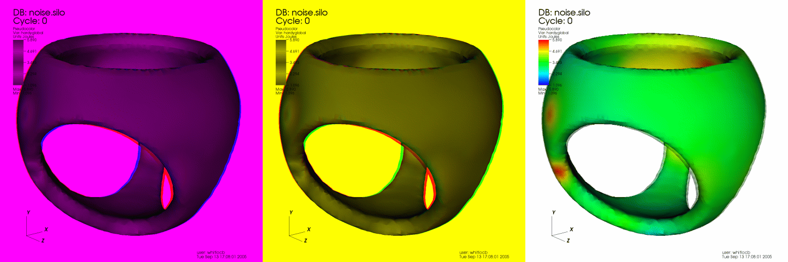
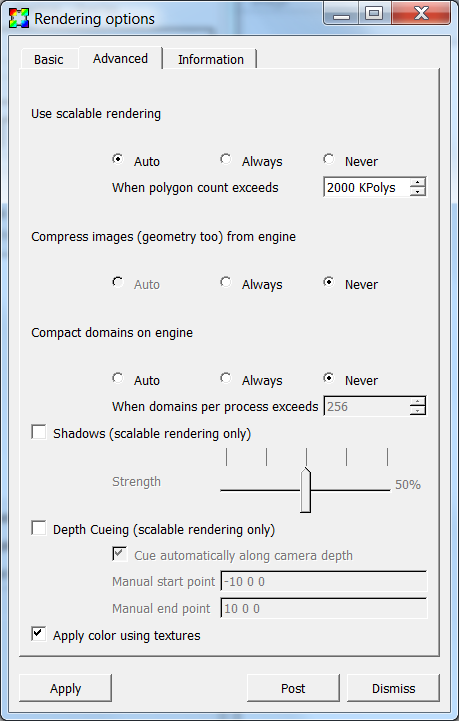
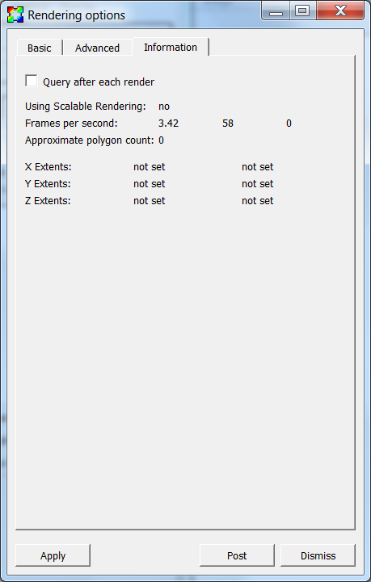

.. _Rendering Options Window:

Rendering Options Window
------------------------

The **Rendering options** window (shown in 
:numref:`Figure %s<Preferences-RenderingOptionsBasic>`) contains controls
that set global options that affect how the plots in the active visualization
window are drawn, as well as, look at information related to the performance
of the graphics hardware VisIt_ is running on. The **Rendering options**
window can be brought up by selecting **Rendering** from the **Main** window's
**Preferences** menu. The **Rendering options** window contains three tabs.
The **Basic** tab contains basic rendering options, the **Advanced** tab
contains advanced rendering options, and the **Information** tab contains
information about the rendering performance of the graphics hardware VisIt_
is running on.

Basic Rendering Options
~~~~~~~~~~~~~~~~~~~~~~~

The **Antialiasing**, and **Specular lighting** options are covered in the
:ref:`Making It Pretty<Rendering Options>` chapter.

.. _Preferences-RenderingOptionsBasic:

.. figure:: images/RenderingOptionsBasic.png

    The basic rendering options

Changing surface representations
""""""""""""""""""""""""""""""""

Sometimes when visualizing large or complex databases, drawing plots with
all of their shaded surfaces can take too long to be interactive, even for
fast graphics hardware. To combat this problem, VisIt_ provides an option
to view all of the plots in the visualization window as wireframe outlines
or point clouds instead of as shaded surfaces (see
:numref:`Figure %s<Preferences-SurfaceRepresentations>`). While being less
visually informative, plots drawn as wireframe outlines or as clouds of
points can still be useful for visualizations since it is possible to do
the setup work like setting the view before switching back to a surface
representation that is more costly to draw. To change the surface
representation used to draw plots click on either the **Surfaces**,
**Wireframe** or **Points** radio buttons below the **Draw objects as**
label.

.. _Preferences-SurfaceRepresentations:

.. figure:: images/SurfaceRepresentations.png

    The different surface representations

Using display lists
"""""""""""""""""""

VisIt_ benefits from the use of hardware accelerated graphics and one of the
concepts central to hardware accelerated graphics is the display list. A
display list is a sequence of simple graphics commands that are stored in
a computer's graphics hardware so the hardware can draw the object described
by the display list several times more quickly than it could if the graphics
commands were issued directly. VisIt_ tries to make maximum use of display
lists when necessary so it can draw plots as fast as possible.

By default, VisIt_ decides when to and when not to use display lists.
Typically, when running VisIt_ on a local workstation with plots that result
in fewer than a couple million graphics primitives, VisIt_ does not use
display lists because the cost of creating them is more expensive than just
drawing the graphics primitives without display lists. When running on a
Unix version of VisIt_ on a remote computer and displaying the results
back to a workstation using an X-server, it is almost always advantageous
to create display lists for plot geometry. Without display lists, VisIt_
must transmit the plot geometry over the network to the X-server every time
it renders an image. VisIt_ can be set to either use or not use display
lists all the time. To change the way VisIt_ uses display lists click on
either the **Auto**, **Always** or **Never** radio buttons below the
**Use display lists** label.

Stereo images
"""""""""""""

Stereo images, which are composites of left and right eye images, can
convey additional depth information that cannot be expressed by images
that are generated using a single eye point. VisIt_ provides four forms
of stereo images: red/blue, red/green, interlace, and crystal eyes. A
red/blue stereo image (see :numref:`Figure %s<Preferences-Stereo>`) is
similar to frames from early 3D movies in that it appears stereo only
when using red/blue stereo glasses. Unfortunately, red/blue stereo images
are not very useful for visualization because colors are lost since most
of the color ends up in the magenta range when the red and blue color
channels are merged. Red/green stereo suffers a similar color loss. Interlaced
images alternate lines in the image with left and right eye views so that
squinting makes the image look somewhat 3D. VisIt_'s crystal eyes option
requires the use of special virtual reality goggles for images to appear
to be 3D but this option is by far the best since it allows interactive
frame rates with images that really appear to stand out from the computer
monitor. VisIt_ does not use stereo imaging by default since it makes
images draw slower because an image must be drawn for both the left eye
and the right eye. To enable stereo images, check the **Stereo** check
box. To change the type of stereo images generated, click on either the
**Red/Blue**, **Interlace**, **Crystal Eyes** or **Red/Green** radio boxes
under the **Stereo** check box.

.. _Preferences-Stereo:

    Some various stereo image types

Advanced Rendering Options
~~~~~~~~~~~~~~~~~~~~~~~~~~

The **Shadows**, and **Depth Cueing** options are covered in the
:ref:`Making It Pretty<Rendering Options>` chapter.

.. _Preferences-RenderingOptionsAdvanced:

    The advanced rendering options

Scalable rendering
""""""""""""""""""

VisIt_ typically uses graphics hardware on the local computer to very
quickly draw plots once they have been generated by the compute engine.
This becomes impractical for very large databases because the amount of
memory needed to store the graphics commands that draw the plots quickly
exceeds the amount of memory in the graphics hardware. Large sets of
graphics commands can also degrade performance when they must be shipped
over slow networks from the compute engine to the VisIt_'s viewer. VisIt_
provides a scalable rendering option that can improve both of these
situations by creating the actual plot images, in parallel, on the compute
engine, compressing them, and then transmitting only an image to the
viewer where the image can be displayed.

Scalable rendering can be orders of magnitude faster for large databases
than VisIt_'s conventional image drawing strategy because large databases
are typically processed using a parallel compute engine. When using scalable
rendering with a parallel compute engine, VisIt_ is able to draw small
pieces of the plot on each processor in parallel and then glue the image
together before sending it to the viewer to be displayed. Not only has the
image likely been created faster, but the size of the image is usually on
the order of a megabyte instead of the tens or hundreds of megabytes needed
to transmit graphics commands, which results in faster transmission of the
image to the viewer. The drawback of scalable rendering is that it is
usually not as interactive as graphics hardware because each time the view
is changed or some other change is made to the plots, the image must be
resent to the viewer over the network.

VisIt_ can automatically determine when to stop sending geometry to the
viewer in favor of sending scalably rendered images. The scalable rendering
threshold determines when VisIt_ switches between sending geometry and
doing scalable rendering. The threshold is based on the number of polygons
to be rendered. The scalable rendering threshold can be changed by entering
a new number of polygons into the **When polygon count exceeds** spin box.
The number is specified in thousands of polygons.

It is also possible to have VisIt_ always or never use scalable rendering.
To change the scalable rendering mode, click on either the **Auto**,
**Always** or **Never** radio boxes under the **Use scalable rendering**
label.

Rendering Information
~~~~~~~~~~~~~~~~~~~~~

.. _Preferences-RenderingOptionsInformation:

    The rendering information

Scalable rendering
""""""""""""""""""

The scalable rendering indicates if the compute engine used scalable
rendering to render the image displayed in the viewer. The use of scalable
rendering is indicated next to the **Use Scalable Rendering:** label.

Frames per second
"""""""""""""""""

The frames per second refers to the number of times that VisIt_ can draw
the plots in the visualization window in the course of a second. VisIt_
displays the minimum, average, and maximum frame rates achieved during the
last draw operation, like rotating the image with the mouse. They are
displayed next to the **Frames per second:** label. Some actions that
force a redraw do not cause the information to update. An example of this
is resizing the visualization window. To make VisIt_ update the frame rate
information after each time it draws the plots in the visualization window,
check the **Query after each render** check box.

Polygon count
"""""""""""""

The polygon count refers to the number of polygons used to represent the
plots in the visualization window. VisIt_ displays the polygon count next
to the **Approximate polygon count:** label.

Plot extents
""""""""""""

The plot extents are the minimum and maximum locations of the plot in each
spatial dimension. The plot extents are the smallest bounding box that can
contain the plots in the visualization window. VisIt_ displays the plot
extents for each dimension next to the **X Extents:**, **Y Extents:** and
**Z Extents:** labels.
.
