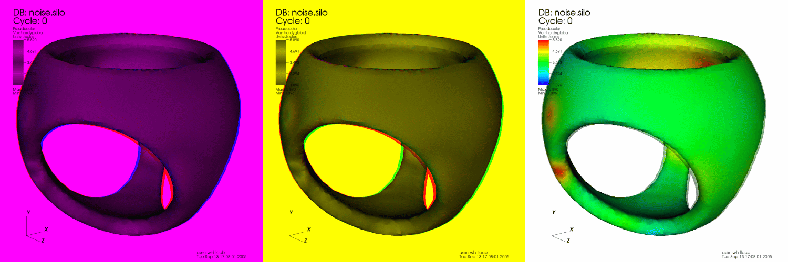
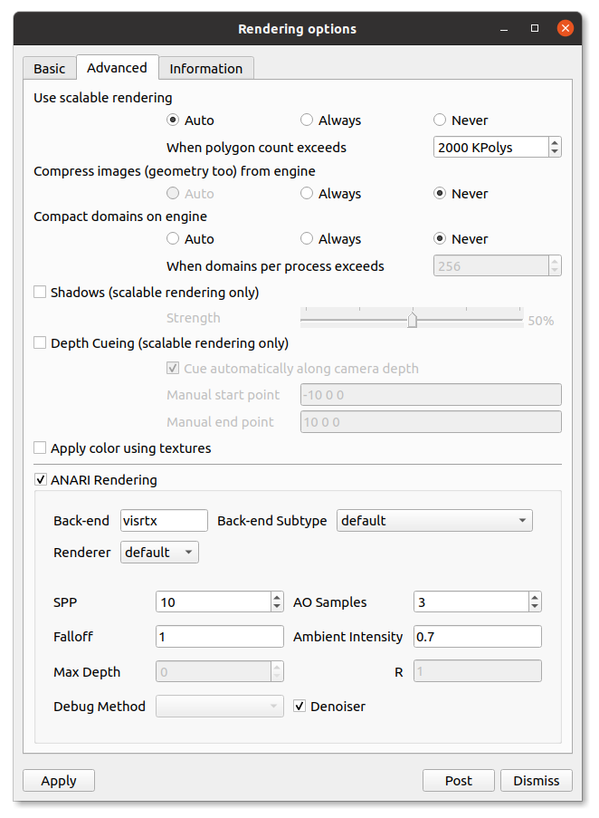
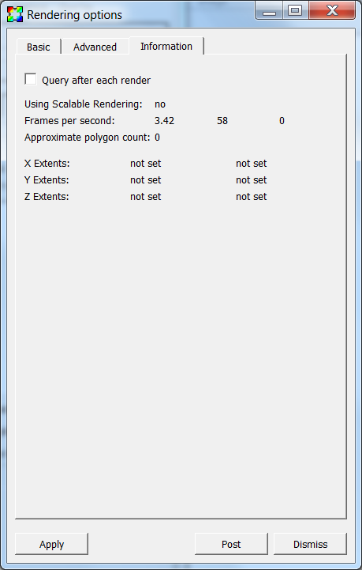

.. _Rendering Options Window:

Rendering Options Window
------------------------

The **Rendering options** window (shown in
:numref:`Figure %s<Preferences-RenderingOptionsBasic>`) contains controls
that set global options that affect how the plots in the active visualization
window are drawn, as well as, look at information related to the performance
of the graphics hardware VisIt_ is running on. The **Rendering options**
window can be brought up by selecting **Rendering** from the **Main** window's
**Preferences** menu. The **Rendering options** window contains three tabs.
The **Basic** tab contains basic rendering options, the **Advanced** tab
contains advanced rendering options, and the **Information** tab contains
information about the rendering performance of the graphics hardware VisIt_
is running on.

Basic Rendering Options
~~~~~~~~~~~~~~~~~~~~~~~

The **Antialiasing**, and **Specular lighting** options are covered in the
:ref:`Making It Pretty<Rendering Options>` chapter.

.. _Preferences-RenderingOptionsBasic:

.. figure:: images/RenderingOptionsBasic.png

    The basic rendering options

Stereo images
"""""""""""""

Stereo images, which are composites of left and right eye images, can
convey additional depth information that cannot be expressed by images
that are generated using a single eye point. VisIt_ provides four forms
of stereo images: red/blue, red/green, interlace, and crystal eyes. A
red/blue stereo image (see :numref:`Figure %s<Preferences-Stereo>`) is
similar to frames from early 3D movies in that it appears stereo only
when using red/blue stereo glasses. Unfortunately, red/blue stereo images
are not very useful for visualization because colors are lost since most
of the color ends up in the magenta range when the red and blue color
channels are merged. Red/green stereo suffers a similar color loss. Interlaced
images alternate lines in the image with left and right eye views so that
squinting makes the image look somewhat 3D. VisIt_'s crystal eyes option
requires the use of special virtual reality goggles for images to appear
to be 3D but this option is by far the best since it allows interactive
frame rates with images that really appear to stand out from the computer
monitor. VisIt_ does not use stereo imaging by default since it makes
images draw slower because an image must be drawn for both the left eye
and the right eye. To enable stereo images, check the **Stereo** check
box. To change the type of stereo images generated, click on either the
**Red/Blue**, **Interlace**, **Crystal Eyes** or **Red/Green** radio boxes
under the **Stereo** check box.

.. _Preferences-Stereo:

    Some various stereo image types

Advanced Rendering Options
~~~~~~~~~~~~~~~~~~~~~~~~~~

The **Shadows**, and **Depth Cueing** options are covered in the
:ref:`Making It Pretty<Rendering Options>` chapter.

.. _Preferences-RenderingOptionsAdvanced:

.. figure:: images/RenderingOptionsAdvanced.png

    The advanced rendering options

.. _ScalableRendering:

Scalable rendering
""""""""""""""""""

VisIt_ typically uses graphics hardware on the local computer to very
quickly draw plots once they have been generated by the compute engine.
This becomes impractical for very large databases because the amount of
memory needed to store the graphics commands that draw the plots quickly
exceeds the amount of memory in the graphics hardware. Large sets of
graphics commands can also degrade performance when they must be shipped
over slow networks from the compute engine to the VisIt_'s viewer. VisIt_
provides a scalable rendering option that can improve both of these
situations by creating the actual plot images, in parallel, on the compute
engine, compressing them, and then transmitting only an image to the
viewer where the image can be displayed.

Scalable rendering can be orders of magnitude faster for large databases
than VisIt_'s conventional image drawing strategy because large databases
are typically processed using a parallel compute engine. When using scalable
rendering with a parallel compute engine, VisIt_ is able to draw small
pieces of the plot on each processor in parallel and then glue the image
together before sending it to the viewer to be displayed. Not only has the
image likely been created faster, but the size of the image is usually on
the order of a megabyte instead of the tens or hundreds of megabytes needed
to transmit graphics commands, which results in faster transmission of the
image to the viewer. The drawback of scalable rendering is that it is
usually not as interactive as graphics hardware because each time the view
is changed or some other change is made to the plots, the image must be
resent to the viewer over the network.

VisIt_ can automatically determine when to stop sending geometry to the
viewer in favor of sending scalably rendered images. The scalable rendering
threshold determines when VisIt_ switches between sending geometry and
doing scalable rendering. The threshold is based on the number of polygons
to be rendered. The scalable rendering threshold can be changed by entering
a new number of polygons into the **When polygon count exceeds** spin box.
The number is specified in thousands of polygons.

It is also possible to have VisIt_ always or never use scalable rendering.
To change the scalable rendering mode, click on either the **Auto**,
**Always** or **Never** radio boxes under the **Use scalable rendering**
label.

Tiled rendering
"""""""""""""""

.. _Preferences-TiledRendering:

VisIt_ will render images in a tiled manner when the image size exceeds the tiled image size.
Tiled rendering is always enabled with a default tile width and height of 2048.
Tiled rendering is always enabled because the underlying rendering library used by VisIt_ stops working properly somewhere between an image width and height of 8192 and 16384.
This avoids that issue.

Tiled rendering is only used when saving images.
It is not used when displaying images on the screen.

There are a few limitations of tiled rendering.

* Anti-aliasing doesn't work properly with tiling.
  When using FXAA (Fast Approximate Anti-Aliasing), each tile will be independently anti-aliased resulting in artifacts along tile boundaries.
  Typically, those artifacts are not visible.
* Points may not extend across tile boundaries when using the "Point" point type.
  All other point types work fine.
* Horizontal or vertical lines that align exactly with tile boundaries may not be visible.
* Points that are exactly on tile boundaries may not be visible.
* Any rendering that involves OSPRay doesn't work properly with tiled rendering.

ANARI Rendering
~~~~~~~~~~~~~~~

.. _Preferences-AnariRenderingOptions:

    ANARI rendering options

If VisIt_ is built with `ANARI <https://www.khronos.org/api/index_2017/anari/>`_ support by 
using the ``--anari`` option when building from source, the **ANARI rendering** section will 
appear in the **Rendering options** window under the **Advanced** tab. Once **Anari Rendering** 
is enabled, all surface rendering will be done using ANARI. This section contains options for 
controlling the ANARI rendering system.

ANARI rendering follows a client-server model: the settings in this window are configured in the GUI, 
but it is the connected :ref:`compute engine<ComputeEngines>` that actually creates the ANARI device 
and performs the rendering. The GUI and viewer never load an ANARI back-end themselves, so this 
feature works even when the machine running the GUI has no ANARI back-ends installed, as is often the 
case when using a remote engine on an HPC cluster. See `ANARI Rendering and the Compute Engine`_ below for details.

Back-end
""""""""

This option allows you to specify any ANARI supported back-end like `NVIDIA VisRTX <https://github.com/NVIDIA/VisRTX/>`_.
The back-end is a library that implements the ANARI API and must be on your library path.
You can specify **environment** if you've exported the **ANARI_LIBRARY** environment variable with the name of theback-end (e.g., ``export ANARI_LIBRARY=visrtx``).
A list of supported back-ends and publicly available applications using ANARI can be found `here <https://github.com/KhronosGroup/ANARI-SDK/>`_.

.. note::
    ANARI back-ends are a software construct.
    Because ANARI abstracts away the details of an entire rendering system, the underlying hardware which a back-end may use is entirely up to the implementation.
    Please read your vendor's back-end documentation to see what parameters are available to configure and what underlying hardware is both available and used to render frames.

Default back-ends searched
'''''''''''''''''''''''''''

The **Back-end** list is built by having the compute engine try to load a known set of ANARI back-end libraries 
and reporting back only the ones that loaded successfully. The compute engine currently checks for the following 
back-ends by their ANARI library name:

* ``helide`` -- the CPU reference back-end included with the ANARI SDK
* ``visrtx`` -- `NVIDIA VisRTX <https://github.com/NVIDIA/VisRTX/>`_, a GPU ray tracing back-end
* ``ospray`` -- `Intel OSPRay <https://github.com/ospray/anari-ospray/>`_

A back-end only appears in the **Back-end** list if its library can actually be found and loaded on the machine 
running the compute engine. Back-ends that are not installed, or whose dependent hardware/driver/SDK is unavailable, 
are silently omitted rather than shown as an error. Each of these names corresponds to a shared library named 
``libanari_library_<name>.so`` on Linux (``.dylib`` on macOS, ``anari_library_<name>.dll`` on Windows).
This lookup depends on the back-ends being found through the system library search paths (or referenced through **ANARI_LIBRARY**, described next).

ANARI_LIBRARY
'''''''''''''

In addition to the back-ends listed above, the compute engine also checks the **ANARI_LIBRARY** environment variable.
If it is set, its value is treated as the name of an additional ANARI library to try loading (for example, ``export ANARI_LIBRARY=barney``), 
using the same library naming convention and search path described above. If that library loads successfully, it 
is added to the **Back-end** list alongside whichever of the built-in known back-ends were also found. It does not 
replace or hide the others. This makes it possible to make a back-end available that is not one of the built-in known 
names, without having to modify or rebuild VisIt_.

.. important::
    **ANARI_LIBRARY** is read by the **compute engine** process, not the GUI or viewer, since the engine is the process 
    that actually loads ANARI back-ends and renders. Setting **ANARI_LIBRARY** in your desktop/GUI environment has no 
    effect. **ANARI_LIBRARY** must be set in the environment the compute engine itself is launched in (for example, in 
    a host profile's launch environment, a job script, or the shell that starts the engine).

Back-end Subtype
""""""""""""""""

This option allows you to specify the subtype of the back-end to use if supported by the back-end.
The **default** option is most common and supported by all of the back-ends.

Renderer
""""""""

This option allows you to specify the renderer to use with the back-end.
Different renderers implement different algorithms, extensions, and support different materials.
Every ANARI back-end offers a **default** renderer.
See the vendor's documentation for details on the available renderers and their capabilities.

Other Options
"""""""""""""

These options are specific to the **Back-end** and **Renderer** you are using and are generated at runtime.
Hovering the mouse over the option label will show you a tooltip with more information.
For more detailed information on the options, please refer to the vendor's documentation.

ANARI Rendering and the Compute Engine
~~~~~~~~~~~~~~~~~~~~~~~~~~~~~~~~~~~~~~

.. _Preferences-AnariRenderingEngine:

Because ANARI abstracts an entire rendering system, its back-end libraries can depend on specific hardware, 
drivers, or SDKs (for example, an NVIDIA GPU and OptiX for the VisRTX back-end).
The GUI and viewer are not guaranteed to have any of this available, particularly when connecting to a remote 
or HPC compute engine from a laptop or workstation, so only the **compute engine** ever creates a real ANARI device.
The GUI and viewer only store and forward your ANARI settings since they do not render with ANARI and do not need 
any ANARI back-ends installed to do so.

This also means that the **Back-end**, **Back-end Subtype**, **Renderer**, and **Other Options** choices offered 
in this window are populated by asking the currently connected compute engine which libraries, subtypes, renderers, 
and parameters it has available, rather than by inspecting the local machine. If you change which compute engine 
you are connected to, these lists reflect the newly connected engine, and may differ from what was available on a 
previously connected engine.

ANARI Rendering with Parallel Engines
~~~~~~~~~~~~~~~~~~~~~~~~~~~~~~~~~~~~~

.. _Preferences-AnariRenderingParallel:

When a :ref:`compute engine<ComputeEngines>` is running in parallel across multiple processors, ANARI rendering follows 
VisIt_'s normal parallel rendering model: each processor renders only the portion of the data it owns, and the resulting 
images are combined into the single image shown in the viewer. Enabling **Anari Rendering** changes how each processor 
draws its local portion of the data, but it does not change how those pieces are combined, so no additional configuration 
is needed to use ANARI rendering in parallel.

A few nuances of this are worth knowing about, especially on clusters where nodes may not be identically configured:

* Each processor independently loads its own ANARI back-end and creates its own ANARI device.
  On GPU-based back-ends (such as VisRTX), this means each processor sharing a GPU also shares that GPU's memory and 
  compute resources. Running many processors per GPU-equipped node can increase memory pressure and reduce performance 
  compared to fewer processors per GPU.
* The **Back-end**, **Back-end Subtype**, **Renderer**, and **Other Options** lists described in `ANARI Rendering and the Compute Engine`_ 
  are populated using information from only the first processor (processor 0) of the parallel engine, even though every 
  processor is capable of reporting this information independently. On a cluster where all nodes are configured identically 
  this makes no difference, but if the engine is running across heterogeneous nodes (for example, only some nodes have the GPU or driver a back-end requires), 
  the options shown in the GUI reflect only processor 0's capabilities and may not be available on every processor.
  If ANARI rendering fails unexpectedly in this situation, verify that the selected back-end is actually available on all 
  nodes the engine is running on, not just the node running processor 0.

Rendering Information
~~~~~~~~~~~~~~~~~~~~~

.. _Preferences-RenderingOptionsInformation:

    The rendering information

Scalable rendering
""""""""""""""""""

The scalable rendering indicates if the compute engine used scalable
rendering to render the image displayed in the viewer. The use of scalable
rendering is indicated next to the **Use Scalable Rendering:** label.

Frames per second
"""""""""""""""""

The frames per second refers to the number of times that VisIt_ can draw
the plots in the visualization window in the course of a second. VisIt_
displays the minimum, average, and maximum frame rates achieved during the
last draw operation, like rotating the image with the mouse. They are
displayed next to the **Frames per second:** label. Some actions that
force a redraw do not cause the information to update. An example of this
is resizing the visualization window. To make VisIt_ update the frame rate
information after each time it draws the plots in the visualization window,
check the **Query after each render** check box.

Polygon count
"""""""""""""

The polygon count refers to the number of polygons used to represent the
plots in the visualization window. VisIt_ displays the polygon count next
to the **Approximate polygon count:** label.

Plot extents
""""""""""""

The plot extents are the minimum and maximum locations of the plot in each
spatial dimension. The plot extents are the smallest bounding box that can
contain the plots in the visualization window. VisIt_ displays the plot
extents for each dimension next to the **X Extents:**, **Y Extents:** and
**Z Extents:** labels.
.
