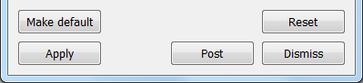

.. _Setting Default Values:

Setting Default Values
----------------------

.. _Preferences-MakeDefault:

  
   The make default button

Some windows have a button called **Make default** that sets the default
attributes for the window. This is typically the case for plot and operator
attribute windows. Other windows that have a **Make default** button include
the **Annotation**, **Lighting**, **Material Reconstruction Options**,
**Mesh Management Options**, **Pick**, **QueryOverTime** and **Interactors**
windows. Setting the attributes with the **Apply** button sets the attributes
for the active plots or operators. Setting the default attributes sets the
attributes for future plots and operators. When saving the settings using
**Save Settings** from the **Options** menu, the default attributes are
saved. An example of a **Make default** button is shown in
:numref:`Figure %s<Preferences-MakeDefault>`.
