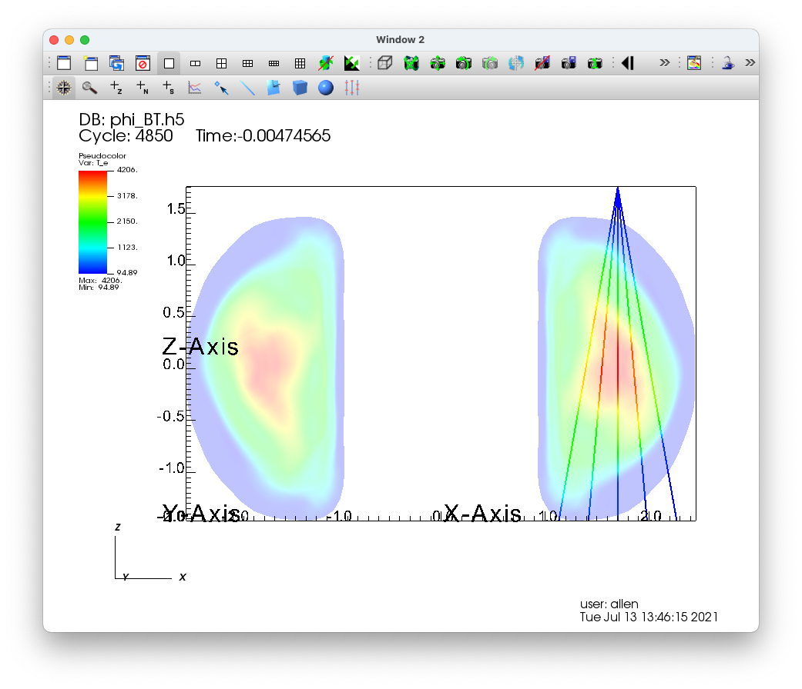

.. _LineSampler:

LineSampler
-----------

One dimensional curves, created using data from 2D or 3D plots, are
popular for analyzing data because they are simple to compare. The
LineSampler operator is similar to the Lineout tool in this regard
except that it will create multiple curves instead of just a single
curve.

As an operator, the user can define a series of "arrays" (e.g. planes)
that consists of one or more "channels" over which the data is
sampled. For each array the orientation of the plane can be
defined. Whereas for each channel its orientation within the plane and
the sampling type and spacing can be defined. For instance, the
sampling can be a series of lines through the data, or a series of
points integrated over time.

Once defined, the operator will produce the appropriate geometry and
sampling regardless of the window dimension. That is for a 3D window
each channel will be drawn showing its 3D position. Similarly for a 2D
window for the Y=0 or the Phi=0 plane. For 1D a window the results
will be displayed as a curve plot in the same way a Lineout curve plot
would be drawn.

The genesis of the Line Sampler operator is from plasma physics and
the synthetic diagnostics performed in fusion simulations in order to
compare against experimental results. As such, the nomenclature is
based on this usage.

LineSampler operator
~~~~~~~~~~~~~~~~~~~~

Before using the LineSampler operator in main plot window set the
"Apply to" to "active window" and uncheck "Apply operators to all plots."
This setting is critical for setting up all of the plots that will use
the LineSampler operator. Once all of the plots are set up, then, and
only then should the settings be changed.

Create a 3D view of the data showing the channels - First, create a
translucent Pseudocolor plot of the data for reference. Next, clone
the plot and add the LineSampler Operator to the plot. Open the
LineSampler operator attribute window.

Main tab
""""""""

Select the "Main" tab, :numref:`Figure %s <LineSampler_MainTab>` to
set up the attributes accordingly.

1. Mesh geometry, which can be Cartesian, Cylindrical or Toroidal,
   determines how the sampling will be done. The most notable
   difference between Cylindrical and Toroidal is coordinate ordering:
   (r, phi, z) vs (r, z, phi).

2. The user can set up an array configuration specifying the geometry
   or manually read in a channel configuration file. The "Geometry"
   and "List" tabs reflect those respective choices.

3. The boundary of the sampling can be based on the data file or using
   a manually specified wall file. The wall file reflects the boundary
   in a 2D slice of the data in the Y=0 or the Phi=0 plane. Any
   sampling outside of the boundary will be disregarded, that is the
   sample ray will be clipped.

   Note currently the wall file format is specific to D3D fusion
   files. The coordinates are displayed in the text box.

4. When using the LineSampler operator, in main plot window one will
   need to set the "Apply to" to "all windows" and check "Apply
   operators to all plots" so that all of the parameters are
   propagated to all of the windows. However, the user may want to
   have a different "Instance" of the operator in order to compare
   different sampling configurations. By setting the "Instance" to 'A'
   for the first, and 'B' for the second the attributes will be
   propagated appropriately to the plots in other windows when using
   the "Apply to all windows" option.

.. _LineSampler_MainTab:

   LineSampler Main Tab

Geometry Tab
""""""""""""

The Geometry tab, :numref:`Figure %s <LineSampler_GeometryTab>` is
active only if the "Array configuration" is set to "Geometry." This
tab allows the user to manually define one or more arrays with one or
more channels.

1. The number of arrays to be created. Each array consists of multiple
   sample channels all in a 2D plane. Multiple arrays can be defined
   in multiple planes.

2. Depending on the "Mesh Geometry" the Y distance or toroidal angle
   (in degrees) between arrays.

3. The projection of the channels, Divergent, Parallel, or a Grid. The
   user can select one of three projections for the channels. For each
   projection one can define the number of channels and their relative
   spacing.

   Divergent tab - For an array divergent channels one selects:

   a. The number of divergent channels.
   b. The relative angle between each channel.

   Parallel tab - For an array of parallel channels one selects:

   a. The number of parallel channels.
   b. The relative distance between each channel.

   Grid tab - For a grid of parallel channels one selects:

   a. The number of channels per column.
   b. The offset between each channel.
   c. The number of rows.
   d. The offset between rows.

For the remaining geometery consult the reference image showing the
attributes.

4. Location of the origin for a divergent array. For a parallel and
   grid array the channels will be centered around the origin.

5. The array is assumed to be in the Y=0 or the Phi=0 plane as such
   one needs to select the axis direction from the origin which will
   be X or Z (Cartesian) or R or Z (cylindrical or toroidal). The
   channel sampling will start at the origin and proceed in hte
   negative axis direction.

6. The array plane may be tilted and well as be rotated. Depending on
   the mesh geometry these are described as a series of offsets
   (Cartesian) or angles (cylindrical or toroidal) and tilts which
   defines a transform to the array plane.

7. The Y offset / Toroidal angle - add an offset to each array.

8. Flip toroidal angle - flips the toroidal angle by negating it.

.. _LineSampler_GeometryTab:

   LineSampler Geometry Tab

List Tab
""""""""

The List tab, :numref:`Figure %s <LineSampler_ListTab>` is active only
if the "Array configuration" is set to "List." This tab allows the
user to read a channel configuration file which defines an array with
one or more channels.

1. The number of arrays to be created. That is each channel
   configuration file is considered to be one array. Multiple arrays
   can be defined in multiple planes.

2. Depending on the "Mesh Geometry" the Y distance or toroidal angle
   between arrays.

3. Read channel configuration file - read a D3D fusion Soft Xray
   channel configuration file. Each point consists of the origin and
   an associated angle and is shown in the Channel list.

   Channel list - single click selects the channel, double click
   selects the channel for editing.

4. Add channel - add a new channel to the list

5. Delete channel - delete the selected channel

6. Delete all channels - delete all channels in the list

7. The Y offset / Toroidal angle - add an offset to each array.

8. Flip toroidal angle - flips the toroidal angle by negating it.

.. _LineSampler_ListTab:

   LineSampler List Tab

Sampling Tab
""""""""""""

The Sampling tab, :numref:`Figure %s <LineSampler_SamplingTab>` sets
up how each channel will be sampled.

Geometry

1. Channel geometry - Currently the sampling geometry is limited to a
   point or along a line. Future work includes cylindrical and cone
   sampling geometries.

2. Linear sampling distance - Sample along each channel using the
   distance specified.

3. Sample volume - For each sample multiple it by a volume.

4. Channel radius - The radius of a channel that is described by a
   cylinder.

5. Sample profile - The sample profile of a channel that is described
   by a cylinder. Either a TopHat or Gaussian profile. If a Gaussian
   profile is selected the standard deviation may be given.

6. Cone divergence - For a cone the divergence of the channel.

Integration

7. Channel integration - When sampling one can sample along the
   channel recording each individual sample or integrate (sum) all of
   the sample values together.

8. Toroidal integration - When sampling toroidally one can sample
   along the circumference recording each sample or integrate all of
   the sample values together.

Toroidal angle sampling

9. Sample - When sampling toroidally one can sample relative to the
   start point or on an absolute basis.

10. Toroidal sample angle - The start, stop, and stride for toroidal
    sampling.

Time sampling

11. When sampling one can sample just the current time step or across
    multiple times steps which becomes the X axis.

12. Time step - The start, stop, and stride for time sampling.

.. _LineSampler_SamplingTab:

   LineSampler Sampling Tab

View Tab
""""""""

The View tab, :numref:`Figure %s <LineSampler_ViewTab>` sets
attributes based on the dimension of the plot.

1. When associating the LineSampler operator with a specific plot, the
   operator needs to know the plot's view dimension in order to
   display the sample data correctly. Normally one would have three
   windows, 1D, 2D, and 3D. The Line Sampler operator would be active
   for the three plots in each window and one would individually set
   this attribute for each.

2. When checked, assures that when the operator attributes are updated
   that the view dimension is not updated to all plots. Should always
   be set to true.

When displaying the resulting sampling as a 1D plot various viewing
parameters can be set.

3. Scale each channel's Y value.

4. For each channel offset the Y value, so that possibly overlapping
   channels are offset.

5. For each array offset the X value, so that possibly overlapping
   arrays are offset.

6. When sampling over time set the X axis to be either the Step,
   Time, or Cycle.

7. The "View geometry" can be restricted to being Points, Lines, or
   Surfaces. Normally each channel is drawn as a line. By setting the
   "View geometry" to "Points," the the actual sample points will be
   drawn.

   Future work includes cylindrical and cone sampling geometries. For
   these cases setting the "View Geometry" to "Lines" the centerline
   of the cone or cylinder would be drawn or if "Points" the actual
   sample points would be drawn.

.. _LineSampler_ViewTab:

   LineSampler View Tab

Once all of the attributes are set one can apply and draw the plots
for the 3D view, :numref:`Figure %s<LineSampler_3DView>`). This view
shows all of the arrays and their channels as a 3D view.

Create a 2D view of the data showing the channels - Clone the 3D
window and add a slice operator to the reference plot. Set the slice
to be in the Y=0 or the Phi=0 plane and apply. This plane is
considered to be the reference plane for the LineSampler operator and
regardless of the Y or Phi of the "base" array it will be projected
into this plane. The "base" array is the first array created, all
other arrays are derived from it. As such, only it is shown in the 2D
view.

For the plot with the LineSampler operator in the View tab set the
View dimension to "Two."  Apply and draw the plots, :numref:`Figure
%s<LineSampler_2DView>`). This view now shows the "base" array and
each channel in it as a 2D view.

Create a 1D view of the channel values - Next clone the 2D window and
delete the plot with the slice operator.

For the plot with the LineSampler operator in the View tab set the
View dimension to "One."  Apply and draw the plot :numref:`Figure
%s<LineSampler_1DView>`). This view now shows each channel from all of
the arrays as series of 1D curves.

All this point all three plots with Linesampler operator are in
sync. To keep them in sync in the main plot window set the "Apply to"
to "all windows" and check "Apply operators to all plots." At this
point if one changes any attribute in the LineSampler operator all of
the plots will be updated. For instance change the number of channels
and apply. All of the plots will be updated.

.. _LineSampler_3DView:

   LineSampler 3D view of toroidal data

.. _LineSampler_2DView:

   LineSampler 2D view of toroidal data

.. _LineSampler_1DView:

   LineSampler 1D view of toroidal data
