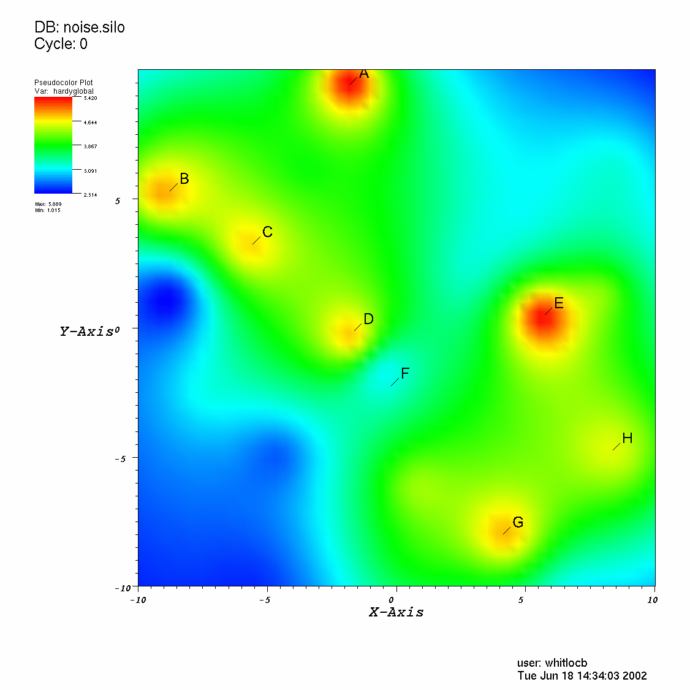
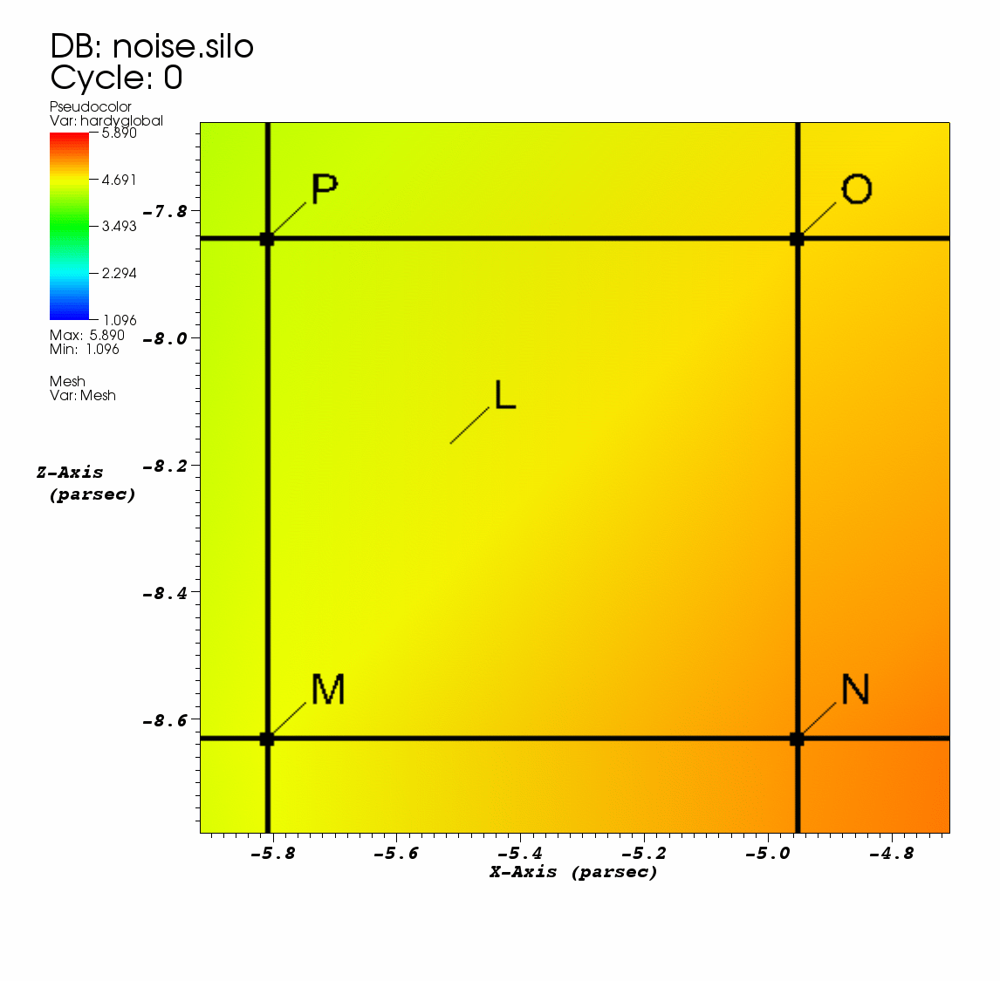
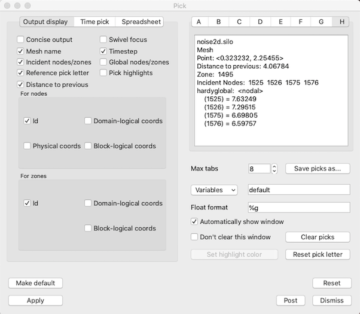

Pick
----

VisIt provides a way to interactively pick values from the visualized data
using the visualization window's Zone Pick and Node Pick modes. When a
visualization window is in one of those pick modes, each mouse click in the
visualization window causes VisIt to find the location and values of selected
variables at the pick point. When VisIt is in Zone pick mode, it finds the
variable values for the zones that you click on. When VisIt is in node pick
mode, similar information is returned but instead of returning information
about the zone that you clicked on, VisIt returns information about the
node closest to the point that you clicked. Pick is an essential tool for
performing data analysis because it can extract exact information from the
database about a point in the visualization.

Pick mode
~~~~~~~~~

You can put the visualization window into one of VisIt's pick modes by
selecting **Zone Pick** or **Node Pick** from the **Popup menu's Mode**
submenu. After the visualization window is in pick mode, each mouse click
causes VisIt to determine the values of selected variables for the zone
that contains the picked point or the node closest to the picked point.
Each picked point is marked with an alphabetic label which starts at A,
cycles through the alphabet and repeats. The pick marker is added to the
visualization window to indicate where pick points have been added in
the past. To clear pick points from the visualization window, select the
**Pick points** option from the **Clear** menu in the **Main Window's Window**
menu. The dimension of the plots in the visualization does not matter when
using pick mode. Both 2D and 3D plots can be picked for values. However,
when using pick mode with 3D plots, only the surface of the plots can be
picked for values. If you want to obtain interior values then you should
use one of the Pick queries or apply operators that expose the interiors
of 3D plots before using pick. An example of the visualization window
with pick points is shown in :numref:`Figure %s <pickviswindow>` and an
example of node pick and zone pick markers is shown in
:numref:`Figure %s <pickpoints>`.

.. _pickviswindow:

   Visualization window with pick points

.. _pickpoints:

   Zone pick marker **L** and node pick markers **M**, **N**, **O**, **P**

Pick Window
~~~~~~~~~~~

Each time a new pick point is added to the visualization window by
clicking on a plot, VisIt extracts information about the pick point
from the plot's database and displays it in the **Pick Window**
(:numref:`Figure %s <pickwindow>`) and the **Output Window**. If the
**Pick Window** does not automatically open after picking, you can
open the **Pick Window** by selecting the **Pick** option from the
**Main Window's Controls** menu.

.. _pickwindow:

   Pick Window

The **Pick Window** mainly consists of a group of tabs, each of which displays
the values from a pick point. The tab label A, B, C, etc. corresponds to the
pick point label in the visualization window. Since there is a fixed number
of tabs in the **Pick Window**, tabs are recycled as the number of pick
points increases. When a pick point is added, the next available tab, which
is usually the tab to the right of the last unused tab, is populated with
the pick information. If the rightmost tab already contains pick information,
the leftmost tab is recycled and the process repeats. To see a complete list
of picked points, open the **Output Window**.

The information displayed in each tab consists of the database name and
timestep, the coordinates of the pick point, the zone/cell that contains
the pick point, the nodes that make up the cell containing the pick point,
and the picked variables. The rest of the **Pick Window** is devoted to
setting options that format the pick output.

Setting the pick variable
"""""""""""""""""""""""""

The **Pick Window** contains a **Variables** text field that allows you
to specify pick variables Most of the time, the value in the text field is
the word "default" which tells VisIt to use the plotted variables as the
pick variables. You can replace the default pick variable by typing one or
more valid variable names, separated by spaces, into the **Variables**
text field. You can also select additional pick variables by selecting a
new variable name from the **Variables** variable button to the left of
the **Variables** text field. When more than one variable is picked,
multiple variables appear in the pick information displayed in the
information tabs.

Concise pick output
"""""""""""""""""""

Pick returns a lot of information when you pick on a plot. The **Pick Window**
usually displays the pick output one item per line, which can end up taking
a lot of vertical space. If you want to condense the information into a
smaller area, click the **Concise output** check box. Sometimes, not all of
the information is relevant for your analysis so VisIt provides options to
hide certain items in the pick output. If you don't want VisIt to display
the name of the picked mesh, turn off the **Show Mesh Name** check box.
If you don't want VisIt to show the time state, turn of the **Show timestep**
check box.

Turning off incident nodes and cells in pick output
"""""""""""""""""""""""""""""""""""""""""""""""""""

When VisIt performs a pick, the default behavior is to show a lot of
information about the cell or node that was picked. This information
usually includes the nodes or cells that were incident to the node or
cell that was picked. The incident nodes and cells are included to give
more information about the neighborhood occupied by the cell or node.
If you want to turn off incident nodes and cells in the pick output,
click off the **Display incident nodes/zones** check box.

Displaying global node and cell numbers
"""""""""""""""""""""""""""""""""""""""

Many large meshes are decomposed into smaller meshes called domains that,
when added together, make up the whole mesh. Each domain typically has its
own range of cell numbers that begin at 0 or 1, depending on the mesh's
cell origin. Any global cell numbering scheme that may have been in place
before the original mesh was decomposed into domains is often lost. However,
some meshes have auxiliary information that allows VisIt to use the original
global node and cell numbers for the domains. If you want the pick output
to contain global node and cell numbers if they are available, click on the
**Display global nodes/zones** check box.

Turning off pick markers for new pick points
""""""""""""""""""""""""""""""""""""""""""""

Some queries that perform picks create pick markers by default, as do VisIt's
regular pick modes. If you want to prevent pick queries from creating pick
markers, click off the **Pick Window's Display reference pick letter**
check box.

Displaying distance to previous
"""""""""""""""""""""""""""""""

The **Pick Window** contains a **Distance to previous** checkbox in the **Output display** tab. If checked, the **Pick** output will contain the Euclidean distance bewteen the current and previous **Pick** points. Note that, when picking zones, the picked point corresponds to the exact point that your mouse lands on the surface of the mesh, which exists within a zone. However, when picking nodes, the picked point is the closest node to where your mouse lands. Therefore, if you're calculating the distance between two node picks, the results will represent the exact distance between the coordinates of those chosen nodes. When calculating the distance between zone picks, the results will represent the distance between your picked points within the zones. You can also calculate the distance between a picked node and a picked zone by performing one after the other.

Returning node information
""""""""""""""""""""""""""

In addition to printing the values of the pick variables, pick can also
display information about the nodes or cells over which the pick variables
are defined. By default, VisIt only returns the integer node indices of
the nodes contained by the picked cell. You can make VisIt return the node
coordinates in other formats by checking the **Id** check box in the
**Display for Nodes** area. The node coordinates can be displayed 4
different ways: Node indices, physical coordinates, domain-logical
coordinates, or block-logical coordinates. Click the check boxes in the
**Display for Nodes** area that correspond to the types of node information
that you want to examine.

Returning zone information
""""""""""""""""""""""""""

The **Pick Window** has controls in its **Display for Zones** area that
allow you to specify how you want VisIt to display zone information. Click
the check boxes that correspond to the types of information that you want
to examine.

Automatically showing the Pick Window
"""""""""""""""""""""""""""""""""""""

When you pick on a plot, VisIt automatically opens the **Pick Window**
to display the results of the pick operation. You can prevent VisIt from
automatically showing the **Pick Window** after a pick operation by turning
off the **Automatically show window** check box in the **Pick Window**.
If the **Pick Window** does not automatically appear after picking then
you can turn on the **Automatically show window** check box.

Picking over time
"""""""""""""""""

Querying over time is normally done using the controls in the **Query Window**
but you can also pick over time to generate curves that show the behavior of
a picked zone or node over time. To pick over time, you must click the
**Create time curve with next pick** check box in the **Pick Window**. Once
that check box is turned on, each pick operation will result in a new Curve
plot that shows the behavior of the most recently picked zone or node over
time.

**Note on performance**: You'll notice that you can either choose to follow
the picked *coordinates* or the picked *element* through time. While each
of these options generates very different results, it's worth keeping in
mind that following the picked *element* will be substantially faster when
working with datasets with large numbers of time steps.
