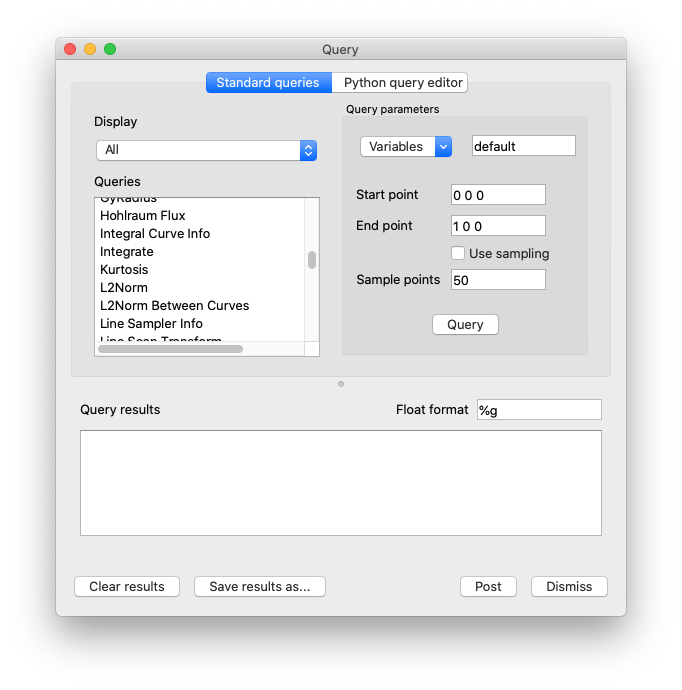
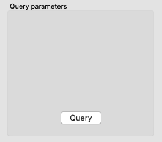
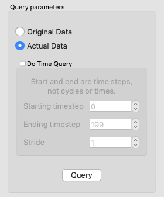
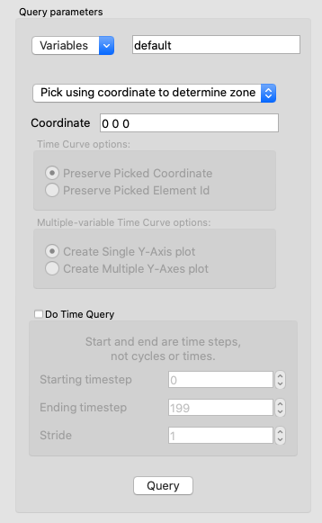
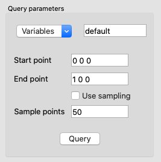
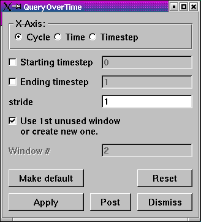
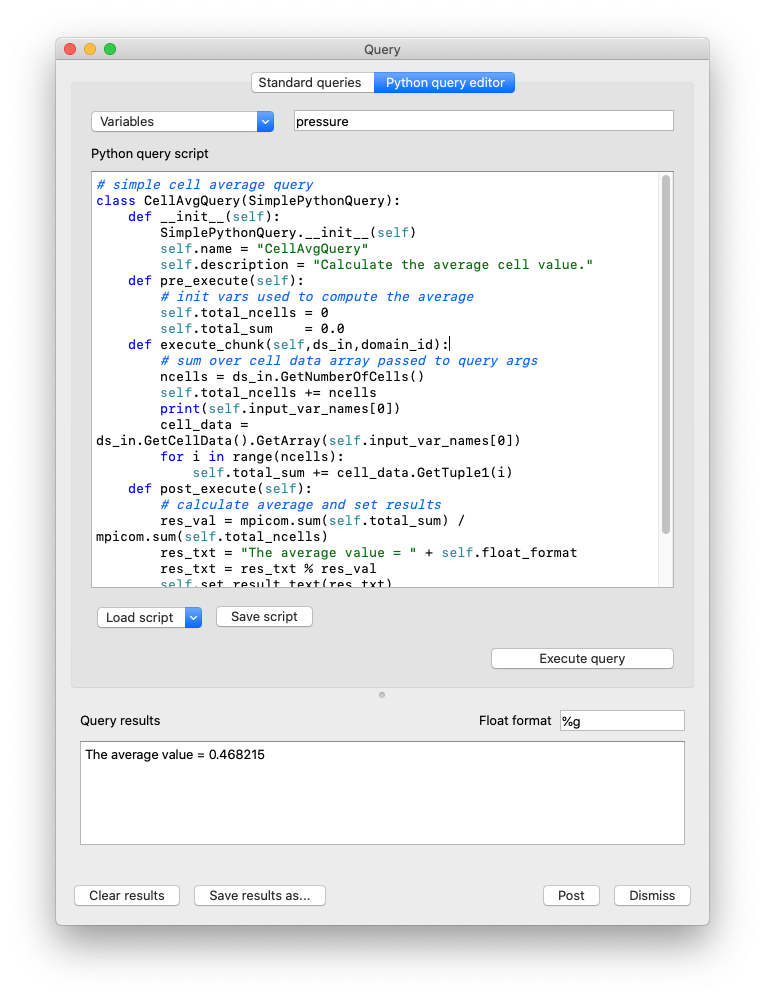

.. |br| raw:: html

    

Query
-----

VisIt allows you to gather quantitative information from the database being
visualized through the use of queries. A query is a type of calculation that
can either return values from the database or values that are calculated
from data in the database. For example, VisIt's Pick and Lineout capabilities
(described later in this chapter) are specialized point and line queries
that print out the values of variables in the database at points or along
lines. In addition to point and line queries, VisIt provides database
queries that return values that are based on all of the data in a database.

Some queries can even be executed for all of the time states in a database
to yield a Curve plot of the query's behavior over time. This feature will
be covered in more detail a little later.

.. _querywindow:

   Query window

VisIt's queries are available in the **Query Window** (shown in
:numref:`Figure %s <querywindow>`), which you can open by clicking the
**Query** option in the **Main Window's Control** menu. The **Query Window**
consists of upper and lower areas where the upper area allows you to select
a query and set its query parameters. The controls for setting a query's
parameters change as required and some queries have no parameters and thus
have no controls for setting parameters. The bottom area of the window
displays the results of the query once VisIt has finished processing it.
The results for new queries are appended to the output from previous queries
until you clear the **Query results** by clicking the **Clear results**
button.

Query types
~~~~~~~~~~~

VisIt's queries can be divided into three types: database queries, point
queries, and line queries. Database queries usually calculate information
for the database as a whole instead of concentrating on a single zone or
node but some Pick-related database queries do concentrate on cells and
nodes. Point queries calculate information for a point in the database
and several types of variable picking queries fall into this category.
Line queries calculate information along a line. Each type of query has
different controls in the **Query parameters** area (see
:numref:`Figure %s <queryparams_line>`) and as you highlight different
queries, the controls in the **Query parameters** area may change.

.. _queryparams_line:

   Query parameters area

Database queries provide a few different interfaces depending on the query.
Many database queries require no additional input so they have no controls
except for the **Query** button. Other database queries ask whether the
query is to be performed with respect to the original data or the actual
data, which is that data that is left in the plot after subsets have been
removed and operators have transformed the data. Finally, some database
queries ask for a specific domain number and zone or node number.

Point queries provide interfaces in the **Query parameters** area that allow
you to enter a 3D point or a screen space point to use as the point for the
query. Line queries provide an interface that lets you specify the start
and end positions of the line as well as the number of sample points to
consider along the length of the line. Nearly all query types allow you to
provide additional variables to query in a **Variables** text field.

.. _built-in_queries:

Built-in queries
~~~~~~~~~~~~~~~~

Database Queries
""""""""""""""""

2D Area
    The 2D area query calculates the area of the 2D plot highlighted in the
    **Plot list** and prints the result to the **Query results**. VisIt can
    produce a Curve plot of this query with respect to time.

3D Surface Area
    The 3D surface area calculates the area of the plot highlighted in the
    **Plot list** and prints the result to the **Query results**. VisIt can
    produce a Curve plot of this query with respect to time.

Connected Component Area
    Performs the same operation as either 2/3D area query except individually
    for each *component* of a disconnected mesh. The query result is a list of
    values, one for each component.

Connected Component Length
    Performs an operation similar to *Connected Component Area* except that it
    works only for 1D components and returns their length. The query result is
    a list of values, one for each component.

Area Between Curves
    The Area Between Curves query calculates the area between 2 curve plots.
    The plots that will serve as input to this query must both be highlighted
    in the **Plot list** or VisIt will issue an error message. Once the area
    has been calculated, the result is printed to the **Query results**.

Centroid
    This query can calculate a centroid (geometric center) or center-of-mass
    of a dataset depending on the plot (and variable) upon which the query is
    performed. On a Pseudocolor plot, the plot's variable will be treated as
    a *density* field. The value of this field at the *center* of each cell
    will be multiplied by the cell's volume to compute a cell-centered mass
    contribution for each cell. If the plot's variable is indeed a true
    density variable, then the result will be the center-of-mass. If the
    plot's variable is not a true density variable (e.g. temperature), the
    result may be nonsensical. If the plot's variable is constant over the
    whole object, the result will be a centroid (geometric center). If the
    query is performed on a Mesh or FilledBoundary plot, constant density will
    be assumed and the result will be a centroid. The results are printed to
    the **Query results**. 

Connected Component Centroid
    Performs the same operation as either *Centroid* query except individually
    for each *component* of a disconnected mesh. The query result is a list of
    values, one for each component.

Chord Length Distribution
    The Chord Length Distribution query calculates a probability density
    function of chord length over a two or three dimensional object. Axially
    symmetric objects (RZ-meshes) are treated as 3D meshes and chords are
    calculated over the revolved, 3D object. A statistical approach, casting
    uniform density, random lines, is used. The result of this query is a
    curve, which is outputted as a separate file. This curve is a probability
    density function over length scale. The name of the resulting file is
    printed to the **Query results**.  

Compactness
    The Compactness query calculates mesh metrics and prints them in the
    **Query results**.

Cycle
    The Cycle query prints the cycle for the plot that is highlighted in the
    **Plot list** to the **Query results**.

Distance from Boundary
    The Distance From Boundary query calculates how much mass is at a given
    distance away from the boundary of a shape. An important distinction for
    this query is that distance from the boundary (for a given point) is not
    defined as the shortest distance to the boundary, but simultaneously as all
    surrounding distances. Axially symmetric objects (RZ-meshes) are treated as
    3D meshes and length scales are calculated over the revolved, 3D object.
    The implementation employs a statistical approach, with the casting of
    uniform density, random lines. The result of this query is a curve, which
    is outputted as a separate file. This curve contains the amount of mass as
    a function of length scale. Integrating the curve between P0 and P1 will
    give the total mass at distance between P0 and P1 (given the interpretation
    above). The name of the resulting file is printed to the **Query results**.

Eulerian
    The Eulerian query calculates the Eulerian number for the mesh that is used
    by the highlighted plot in the Plot list. The results are printed to the
    **Query results**.

Expected Value
    The Expected Value query calculates the integral of :math:`xf(x)dx` for
    some curve f(x). The curve should be highlighted in the **Plot list** and
    prints the result to the **Query results**. This query is intended for
    distribution functions.

Grid Information
    The Grid Information query prints information for each domain in a multi-
    domain mesh. The mesh type is printed as well as the mesh sizes. For
    structured meshes the size information contains the logical mesh dimensions
    (IJK sizes) and for unstructured meshes the size information contains the
    number of nodes and number of cells in the mesh. The query can optionally
    accept a *get_extents* parameter that will cause the spatial extents for
    each domain to be obtained. The query also accepts an optional
    *get_ghosttype* parameter that causes the ghost zone information for each
    domain to be obtained. Both the numerical value and list of or'd values for
    ghost values are obtained. All query outputs are printed to the
    **Queryresults**.

Integrate
    The Integrate query calculates the area under the Curve plot that is
    highlighted in the Plot list and prints the result to the
    **Query results**.

Kurtosis
    The Kurtosis query calculates the kurtosis of a normalized distribution
    function. The normalized distribution function must be represented as a
    Curve plot in VisIt. Kurtosis measures the variability of a distribution by
    comparing the ratios of the fourth and second central moments. The results
    are print to the **Query results**.

L2Norm
    The L2Norm query calculates the L2Norm, or square of the integrated area,
    of a Curve plot. The Curve plot must be highlighted in the **Plot list**.
    The results are printed to the **Query results**.

L2Norm Between Curves
    The L2Norm query takes two Curve plots as input and calculates the L2Norm
    between the 2 curves. Both Curve plots must be highlighted in the
    **Plot list** or VisIt will issue an error message. The results are printed
    to the **Query results**.

Min
    The Min query calculates the minimum value for the variable used by the
    highlighted plot in the **Plot list** and prints the value and the logical
    and physical coordinates where the minimum value was found to the
    **Query results**.

Mass Distribution
    The Mass Distribution query calculates how much mass occurs at different
    length scales over a two or three dimensional object. Axially symmetric
    objects (RZ-meshes) are treated as 3D meshes and length scales are
    calculated over the revolved, 3D object. The implementation employs a
    statistical approach, with the casting of uniform density, random lines.
    The result of this query is a curve, which is outputted as a separate file.
    This curve contains the amount of mass as a function of length scale.
    Integrating the curve between P0 and P1 will give the total mass between
    length scale P0 and length scale P1. The name of the resulting file is
    printed to the **Query results**.

Max
    The Max query calculates the maximum value for the variable used by the
    highlighted plot in the Plot list and prints the value and the logical and
    physical coordinates where the maximum value was found to the
    **Query results**.

MinMax
    The MinMax query calculates the minimum and maximum values for the variable
    used by the highlighted plot in the Plot list and prints the values and
    their logical and physical coordinates in the **Query results**.

Moment of inertia
    This query will calculate the moment of inertia tensor for each cell in a
    three-dimensional dataset. The contribution of each cell is calculated
    assuming its mass all lies at the center of the cell. If the query is
    performed on a Pseudocolor plot, the plot's variable will be assumed to be
    density. If the query is performed on a plot such as a mesh plot or
    FilledBoundary plot, uniform density will be used. The results are printed
    to the **Query results**.

NodeCoords
    The NodeCoords query prints the node coordinates for the specified node and
    prints the values in the **Query results**.

NumNodes
    The NumNodes query prints the number of nodes for the mesh used by the
    highlighted plot in the **Plot list** to the **Query results**.

NumZones
    The NumZones query prints the number of zones for the mesh used by the
    highlighted plot in the **Plot list** to the **Query results**.

Revolved surface area 
    The Revolved surface area query revolves the mesh used by the highlighted
    plot in the **Plot list** about the X-axis and prints the plot's revolved
    surface area to the **Query results**.

Revolved volume
    The Revolved volume area query revolves the mesh used by the highlighted
    plot in the **Plot list** about the X-axis and print's the plot's volume
    to the **Query results**.

Skewness
    The Skewness query calculates the skewness of a normalized distribution
    function. The normalized distribution function must be represented as a
    Curve plot in VisIt. Skewness measures the symmetry of a distribution using
    its second and third central moments. The results are print to the
    **Query results**

Spatial Extents
    The Spatial Extents query calculates the original or actual spatial extents
    for the plot that is highlighted in the **Plot list**. Whether the original
    or actual extents are calculated is determined by setting the options in
    the **Query parameters** area. The spatial extents are printed to the
    **Query results** when the query has finished.

Spherical compactness factor
    This query attempts to measure how spherical a three dimensional shape is.
    The query first determines what the volume of a shape is. It then
    constructs a sphere that has that same volume. Finally, the query positions
    the sphere so that the maximum amount of the original shape is within the
    sphere. The query returns the percentage of the original shape that is
    contained within the sphere. The results are print to the
    **Query results**. VisIt can produce a Curve plot of this query with
    respect to time.

Time
    The Time query prints the time for the plot that is highlighted in the Plot
    list to the **Query results**.

Variable Sum
    The Variable Sum query adds up the variable values for all cells using the
    plot highlighted in the **Plot list** and prints the results to the
    **Query results**. VisIt can produce a Curve plot of this query with
    respect to time.

Connected Component Variable Sum
    Performs the same operation as *Variable Sum* query except individually for
    each *component* of a disconnected mesh. The query result is a list of
    values, one for each component.

Volume
    The Volume query calculates the volume of the mesh used by the plot
    highlighted in the **Plot list** and prints the value to the
    **Query results**. VisIt can use this query to produce a Curve plot of
    volume with respect to time.

Connected Component Volume
    Performs the same operation as *Volume* query except individually for each
    *component* of a disconnected mesh. The query result is a list of values,
    one for each component.

Watertight
    The Watertight query determines if a three-dimensional surface mesh, of the
    plot highlighted in the **Plot list**, is "watertight", meaning that it is
    a closed volume with mesh connectivity such that every edge is incident to
    exactly two faces. This means that no edge can have a duplicate in the
    exact same position. The result of the query is printed in the
    **Query results**.

Weighted Variable Sum
    The Weighted Variable Sum query adds up the variable values, weighted by
    cell size (volume in 3D, area in 2D, length in 1D), for all cells using the
    plot highlighted in the **Plot list** and prints the results to the
    **Query results**. VisIt can produce a Curve plot of this query with respect
    to time.

Connected Component Weighted Variable Sum
    Performs the same operation as *Weighted Variable Sum* query except
    individually for each *component* of a disconnected mesh. The query
    result is a list of values, one for each component.

XRay Image
    Generates a simulated radiograph by tracing rays through a volume using an absorbtivity and emissivity variable.
    The absorbtivity and emmisivity variables must be zone centered and can be either scalar variables or array variables.
    If using an array variable it will generate an image per array variable component.

    The query operates on 2D R-Z meshes and 3D meshes.
    In the case of 2D R-Z meshes, the mesh is revolved around the Z axis.
 
    The query performs the following integration as it traces the rays through the volume.

    .. container:: collapsible

        .. container:: header

            **Show/Hide Code for** XRay Image Query

        .. literalinclude:: ../../../../src/avt/Filters/avtXRayFilter.C
            :language: C++
            :start-after: begin standard integration 
            :end-before: end standard integration

    If the ``divide_emis_by_absorb`` is set, then the following integration is performed.

    .. container:: collapsible

        .. container:: header

            **Show/Hide Code for** Absortivity-Normalized XRay Image Query 

        .. literalinclude:: ../../../../src/avt/Filters/avtXRayFilter.C
            :language: C++
            :start-after: begin absorbtivity-normalized integration
            :end-before: end absorbtivity-normalized integration

    When making a simulated radiograph the emissivity variable must contain non zero values or you will need to specify a background intensity using either *background_intensity* or *background_intensities*.
    If neither of these is the case you will get a very boring all white image.
    A non-zero emissivity variable would correspond to an object emitting radiation and a non zero background intensity would correspond to constant backlit radiation, such as when x raying an object.

    The query takes the following arguments:

    +------+-------------------+----------------------------------------------+
    | *vars*                   | An array of the names of the absorbtivity    |
    |                          | and emissivity variables.                    |
    +------+-------------------+----------------------------------------------+
    | *background_intensity*   | The background intensity if ray tracing      |
    |                          | scalar variables. The default is 0.          |
    +------+-------------------+----------------------------------------------+
    | *background_intensities* | The background intensities if ray tracing    |
    |                          | array variables. The default is 0.           |
    +------+-------------------+----------------------------------------------+
    | *divide_emis_by_absorb*  | Described above.                             |
    +------+-------------------+----------------------------------------------+
    | *output_type*            | The format of the image. The default is PNG. |
    +------+-------------------+----------------------------------------------+
    |      | "bmp" or 0        | BMP image format. This is deprecated as of   |
    |      |                   | VisIt_ 3.4.                                  |
    +------+-------------------+----------------------------------------------+
    |      | "jpeg" or 0 |br|  | JPEG image format.                           |
    |      | (1 prior to       |                                              |
    |      | VisIt_ 3.4)       |                                              |
    +------+-------------------+----------------------------------------------+
    |      | "png" or 1 |br|   | PNG image format.                            |
    |      | (2 prior to       |                                              |
    |      | VisIt_ 3.4)       |                                              |
    +------+-------------------+----------------------------------------------+
    |      | "tif" or 2 |br|   | TIFF image format.                           |
    |      | (3 prior to       |                                              |
    |      | VisIt_ 3.4)       |                                              |
    +------+-------------------+----------------------------------------------+
    |      | "rawfloats" or 3  | File of 32 or 64 bit floating point values   |
    |      | |br| (4 prior to  | in IEEE format.                              |
    |      | VisIt_ 3.4)       |                                              |
    +------+-------------------+----------------------------------------------+
    |      | "bov" or 4 |br|   | BOV (Brick Of Values) format, which consists |
    |      | (5 prior to       | of a text header |br| file describing a      |
    |      | VisIt_ 3.4)       | rawfloats file.                              |
    +------+-------------------+----------------------------------------------+
    |      | "json" or 5 |br|  | Conduit JSON output.                         |
    |      | (6 prior to       |                                              |
    |      | VisIt_ 3.4)       |                                              |
    +------+-------------------+----------------------------------------------+
    |      | "hdf5" or 6 |br|  | Conduit HDF5 output.                         |
    |      | (7 prior to       |                                              |
    |      | VisIt_ 3.4)       |                                              |
    +------+-------------------+----------------------------------------------+
    |      | "yaml" or 7 |br|  | Conduit YAML output.                         |
    |      | (8 prior to       |                                              |
    |      | VisIt_ 3.4)       |                                              |
    +------+-------------------+----------------------------------------------+
    | *output_dir*             | The output directory. The default is "."     |
    +------+-------------------+----------------------------------------------+
    | *family_files*           | A flag indicating if the output files should |
    |                          | be familied. The default is |br| off. If it  |
    |                          | is off then the output file is               |
    |                          | ``output.ext``, where ``ext`` is the file    |
    |                          | |br| extension. If the file exists it will   |
    |                          | overwrite the file. If it is on, then |br|   |
    |                          | the output file is ``outputXXXX.ext``,       |
    |                          | where ``XXXX`` is chosen                     |
    |                          | to be the |br| smallest integer not to       |
    |                          | overwrite any existing files. As of VisIt_   |
    |                          | 3.4, |br| it is recommended to use           |
    |                          | *filename_scheme* in lieu of *family_files*. |
    +------+-------------------+----------------------------------------------+
    | *filename_scheme*        | The naming convention for output filenames.  |
    |                          | This option is available |br| in VisIt_ 3.4, |
    |                          | and is meant to replace the *family_files*   |
    |                          | option. If both |br| are provided,           |    
    |                          | *filename_scheme* will be used.              |
    +------+-------------------+----------------------------------------------+
    |      | "none" or 0       | The default. Output filenames will be of the |
    |      |                   | form ``output.ext``, where |br|              |
    |      |                   | ``ext`` is the file extension. If the        |
    |      |                   | filename already exists, VisIt_ will |br|    |
    |      |                   | overwrite it.                                |
    +------+-------------------+----------------------------------------------+
    |      | "family" or 1     | If on, VisIt_ will attempt to family output  |
    |      |                   | files. Output filenames will be |br| of the  | 
    |      |                   | form ``output.XXXX.ext``, where ``XXXX`` is  |
    |      |                   | chosen to be the smallest |br| integer such  |
    |      |                   | that the filename is unique.                 |
    +------+-------------------+----------------------------------------------+
    |      | "cycle" or 2      | VisIt_ will put cycle information in the     |
    |      |                   | filename. Output filenames will be |br| of   |
    |      |                   | the form ``output.cycle_XXXXXX.ext``, where  |
    |      |                   | ``XXXXXX`` is the cycle number. |br| If      |
    |      |                   | another file exists with this name, VisIt_   |
    |      |                   | will overwrite it.                           |
    +------+-------------------+----------------------------------------------+
    | *image_size*             | The width and height of the image in pixels. |
    |                          | The default is 200 x 200.                    |
    +------+-------------------+----------------------------------------------+
    | *debug_ray*              | The ray index for which to output ray        |
    |                          | tracing information. The default is |br| -1, |
    |                          | which turns it off.                          |
    +------+-------------------+----------------------------------------------+
    | *output_ray_bounds*      | Output the ray bounds as a bounding box in a |
    |                          | VTK file. The default is off. |br| The name  |
    |                          | of the file is ``ray_bounds.vtk``.           |
    +------+-------------------+----------------------------------------------+
    
    When specifying "bov" or "rawfloats" output, the value can be either 32 or 64 bit floating point values.
    The number of bits is determined by the number of bits in the data being processed.

    When specifying "bov" output, 2 files are created for each variable.
    One contains the ``intensity`` and the other the ``path_length``.
    The files are named ``output.XX.bof`` and ``output.XX.bov`` with ``XX`` being a sequence number.
    The ``intensity`` variables are first followed by the ``path_length`` variables in the sequence.
    For example, if the input array variables were composed of 2 scalar variables, the files would be named as follows:

    * output.00.bof
    * output.00.bov - ``intensity`` from the first variable of the array variable.
    * output.01.bof
    * output.01.bov - ``intensity`` from the second variable of the array variable.
    * output.02.bof
    * output.02.bov - ``path_length`` from the first variable of the array variable.
    * output.03.bof
    * output.03.bov - ``path_length`` from the second variable of the array variable.

    The query also takes arguments that specify the orientation of the camera
    in 3 dimensions. This can take 2 forms. The first is a simplified
    specification that gives limited control over the camera and a complete
    specification that matches the 3D image viewing parameters. The simplified
    version consists of:
    
    +--------------+----------------------------------------------------------+
    | *width*      | The width of the image in physical space.                |
    +--------------+----------------------------------------------------------+
    | *height*     | The height of the image in physical space.               |
    +--------------+----------------------------------------------------------+
    | *origin*     | The point in 3D corrensponding to the center of the      |
    |              | image.                                                   |
    +--------------+----------------------------------------------------------+
    | *theta* |br| | The orientation angles. The default is 0. 0. and is      |
    | *phi*        | looking down the Z axis. Theta |br| moves around the     |
    |              | Y axis toward the X axis. Phi moves around the Z axis.   |
    |              | When |br| looking at an R-Z mesh, phi has no effect      |
    |              | because of symmetry.                                     |
    +--------------+----------------------------------------------------------+
    | *up_vector*  | The up vector.                                           |
    +--------------+----------------------------------------------------------+

    If any of the above properties are specified in the parameters it will use
    the simplified version.

    The complete version consists of:

    +------------------+------------------------------------------------------+
    | *focus*          | The focal point. The default is (0., 0., 0.).        |
    +------------------+------------------------------------------------------+
    | *view_up*        | The up vector. The default is (0., 1., 0.).          |
    +------------------+------------------------------------------------------+
    | *normal*         | The view normal. The default is (0., 0., 1.).        |
    +------------------+------------------------------------------------------+
    | *view_angle*     | The view angle. The default is 30. This is only used |
    |                  | if perspective |br| projection is enabled.           |
    +------------------+------------------------------------------------------+
    | *parallel_scale* | The parallel scale, or view height. The default is   |
    |                  | 0.5.                                                 |
    +------------------+------------------------------------------------------+
    | *near_plane*     | The near clipping plane. The default is -0.5.        |
    +------------------+------------------------------------------------------+
    | *far_plane*      | The far clipping plane. The default is 0.5.          |
    +------------------+------------------------------------------------------+
    | *image_pan*      | The image pan in the X and Y directions. The default |
    |                  | is (0., 0.).                                         |
    +------------------+------------------------------------------------------+
    | *image_zoom*     | The absolute image zoom factor. The default is 1.    |
    |                  | A value of 2. zooms the |br| image closer by scaling |
    |                  | the image by a factor of 2 in the X and Y            |
    |                  | directions. |br| A value of 0.5 zooms the image      |
    |                  | further away by scaling the image by a factor |br|   |
    |                  | of 0.5 in the X and Y directions.                    |
    +------------------+------------------------------------------------------+
    | *perspective*    | Flag indicating if doing a parallel or perspective   |
    |                  | projection. |br| 0 indicates parallel projection.    |
    |                  | 1 indicates perspective projection.                  |
    +------------------+------------------------------------------------------+

    Lets look at some examples, starting with some simulated x rays using
    curv2d.silo, which contains a 2D R-Z mesh. Here is a pseudocolor plot
    of the data.

.. figure:: images/xray00.png

    The 2D R-Z data

    Now we'll show the Python code to generate a simulated x ray looking
    down the Z Axis and the resulting image. ::

      params = GetQueryParameters("XRay Image")
      params['image_size'] = (300, 300)
      params['divide_emis_by_absorb'] = 1
      params['width'] = 10.
      params['height'] = 10.
      params['vars'] = ("d", "p")
      Query("XRay Image", params)

.. figure:: images/xray01.png

    The resulting x ray image

    Here is the Python code to generate the same image but looking at it
    from the side. ::

      params = GetQueryParameters("XRay Image")
      params['image_size'] = (300, 300)
      params['divide_emis_by_absorb'] = 1
      params['width'] = 10.
      params['height'] = 10.
      params['theta'] = 90.
      params['phi'] = 0.
      params['vars'] = ("d", "p")
      Query("XRay Image", params)

.. figure:: images/xray02.png

    The resulting x ray image

    Here is the same Python code with the addition of an origin that
    moves the image down and to the right by 1. ::

      params = GetQueryParameters("XRay Image")
      params['image_size'] = (300, 300)
      params['divide_emis_by_absorb'] = 1
      params['width'] = 10.
      params['height'] = 10.
      params['theta'] = 90.
      params['phi'] = 0.
      params['origin'] = (0., 1., 1.)
      params['vars'] = ("d", "p")
      Query("XRay Image", params)

.. figure:: images/xray03.png

    The resulting x ray image

    Now we'll switch to a 3D example using globe.silo. Globe.silo is an
    unstructured mesh consisting of tetrahedra, pyramids, prisms and hexahedra
    forming a globe. Here is an image of the tetrahedra at the center of
    the globe that form 2 cones.

.. figure:: images/xray04.png

    The tetrahedra at the center of the globe

    Here is the Python code for generating an x ray image from the same
    orientation. Note that we have defined some expressions so that the
    x ray image shows some variation. ::

      DefineScalarExpression("u1", 'recenter(((u+10.)*0.01), "zonal")')
      DefineScalarExpression("v1", 'recenter(((v+10.)*0.01*matvf(mat1,1)), "zonal")')
      DefineScalarExpression("v2", 'recenter(((v+10.)*0.01*matvf(mat1,2)), "zonal")')
      DefineScalarExpression("v3", 'recenter(((v+10.)*0.01*matvf(mat1,3)), "zonal")')
      DefineScalarExpression("v4", 'recenter(((v+10.)*0.01*matvf(mat1,4)), "zonal")')
      DefineScalarExpression("w1", 'recenter(((w+10.)*0.01), "zonal")')

      params = GetQueryParameters("XRay Image")
      params['image_size'] = (300, 300)
      params['divide_emis_by_absorb'] = 1
      params['width'] = 4.
      params['height'] = 4.
      params['theta'] = 90.
      params['phi'] = 0.
      params['vars'] = ("w1", "v1")
      Query("XRay Image", params)

.. figure:: images/xray05.png

    The resulting x ray image

    Now we'll look at the pyramids in the center of the globe.

.. figure:: images/xray06.png

    The pyramids at the center of the globe

    Here is the Python code for generating an x ray image from the same
    orientation using the full view specification. The view specification
    was merely copied from the 3D tab on the View window. Note that we
    have created the dictionary from scratch, rather than starting with
    the default ones. This is necessary to use the full view specification. ::

      params = dict(output_type="png")
      params['image_size'] = (300, 300)
      params['divide_emis_by_absorb'] = 1
      params['focus'] = (0., 0., 0.)
      params['view_up'] = (-0.0651, 0.775, 0.628)
      params['normal'] = (-0.840, -0.383, 0.385)
      params['view_angle'] = 30.
      params['parallel_scale'] = 17.3205
      params['near_plane'] = -34.641
      params['far_plane'] = 34.641
      params['image_pan'] = (0., 0.)
      params['image_zoom'] = 8
      params['perspective'] = 0
      params['vars'] = ("w1", "v2")
      Query("XRay Image", params)

.. figure:: images/xray07.png

    The resulting x ray image

    **Conduit output metadata:** The Conduit output types (see the listed output types above for more information) come packaged with metadata in addition to Blueprint-conforming mesh data. 
    Currently, this metadata is stored under the "state" Node in the resulting Conduit tree.
    In addition to "time" and "cycle", there are three categories of metadata: *view parameters*, *query parameters*, and *other metadata*.
    
    **View parameters** can be found under "state/xray_view".
    This metadata represents the view-related values that were used in x ray image query calculations, regardless of whether the simplified or complete view specification was used when calling the query.
    The following is included:

    +--------------------------+----------------------------------------------+
    | *normal*                 | x, y, and z components represent the view    |
    |                          | normal vector that |br| was used in          |
    |                          | the calculations.                            |
    +--------------------------+----------------------------------------------+
    | *focus*                  | x, y, and z components represent the focal   |
    |                          | point that was used |br| in the              |
    |                          | calculations.                                |    
    +--------------------------+----------------------------------------------+
    | *viewUp*                 | x, y, and z components represent the up      |
    |                          | vector that was used |br| in the             |
    |                          | calculations.                                |
    +--------------------------+----------------------------------------------+
    | *viewAngle*              | The view angle, only used in the             |
    |                          | calculations if |br| perspective             |
    |                          | projection was enabled.                      |
    +--------------------------+----------------------------------------------+
    | *parallelScale*          | The parallel scale, or view height, that was |
    |                          | used in the |br| calculations.               |
    +--------------------------+----------------------------------------------+
    | *nearPlane*              | The near plane that was used in the          |
    |                          | calculations.                                |
    +--------------------------+----------------------------------------------+
    | *farPlane*               | The far plane that was used in the           |
    |                          | calculations.                                |
    +--------------------------+----------------------------------------------+
    | *imagePan*               | x and y components represent the image pan   |
    |                          | that was used in |br| the calculations.      |
    +--------------------------+----------------------------------------------+
    | *imageZoom*              | The absolute image zoom factor that was used |
    |                          | in the calculations.                         |
    +--------------------------+----------------------------------------------+
    | *perspective*            | Flag indicating if parallel or perspective   |
    |                          | projection was used. |br| 0 indicates        |
    |                          | parallel projection and 1 indicates          |
    |                          | perspective |br| projection.                 |
    +--------------------------+----------------------------------------------+
    | *perspectiveStr*         | A String representation of the perspective   |
    |                          | parameter. See above |br| for more           |
    |                          | information.                                 |
    +--------------------------+----------------------------------------------+

    **Query parameters** can be found under "state/xray_query".
    This metadata represents the query-related values that were used in the x ray image query calculations.
    This data is available as of VisIt_ 3.3.2.
    The following is included:

    +--------------------------+----------------------------------------------+
    | *divideEmisByAbsorb*     | Flag indicating if emissivity was divided by |
    |                          | absorbtivity in |br| calculations. More      |
    |                          | details can be found above.                  |
    +--------------------------+----------------------------------------------+
    | *divideEmisByAbsorbStr*  | A String representation of the               |
    |                          | divideEmisByAbsorb parameter. |br| See above |
    |                          | for more information.                        |
    +--------------------------+----------------------------------------------+
    | *numXPixels*             | The pixel extent in the X dimension in the   |
    |                          | output image.                                |
    +--------------------------+----------------------------------------------+
    | *numYPixels*             | The pixel extent in the Y dimension in the   |
    |                          | output image.                                |
    +--------------------------+----------------------------------------------+
    | *numBins*                | The number of bins (the Z dimension extent)  |
    |                          | in the output image.                         |
    +--------------------------+----------------------------------------------+
    | *absVarName*             | The name of the absorbtivity variable that   |
    |                          | used in calculations.                        |
    +--------------------------+----------------------------------------------+
    | *emisVarName*            | The name of the emissivity variable that     |
    |                          | used in calculations.                        |
    +--------------------------+----------------------------------------------+

    **Other Metadata** can be found under "state/xray_data".
    This metadata represents values that do not fit into either of the above two categories.
    Many are calculated constants, giving a broader view of the output data.
    This data is available as of VisIt_ 3.3.2.
    The following is included:

    +--------------------------+----------------------------------------------+
    | *image_coords*           | The image coordinates are a coordinate set   |
    |                          | that represent the |br|                      |
    |                          | world-space/physical coordinates of the      |
    |                          | output image. These |br|                     |
    |                          | spatial extents are given by x and y values  |
    |                          | that range from 0 to |br|                    |
    |                          | the number of pixels in the respective x and |
    |                          | y dimensions times |br|                      |
    |                          | the pixel size in those dimensions.          |
    +--------------------------+----------------------------------------------+
    | *detectorWidth*          | The width of the simulated x ray detector    |
    |                          | in physical space.                           |
    +--------------------------+----------------------------------------------+
    | *detectorHeight*         | The height of the simulated x ray detector   |
    |                          | in physical space.                           |
    +--------------------------+----------------------------------------------+
    | *intensityMax*           | The maximum value of the calculated          |
    |                          | intensities.                                 |
    +--------------------------+----------------------------------------------+
    | *intensityMin*           | The minimum value of the calculated          |
    |                          | intensities.                                 |
    +--------------------------+----------------------------------------------+
    | *pathLengthMax*          | The maximum value of the calculated          |
    |                          | path lengths.                                |
    +--------------------------+----------------------------------------------+
    | *pathLengthMin*          | The minimum value of the calculated          |
    |                          | path lengths.                                |
    +--------------------------+----------------------------------------------+

ZoneCenter
    The ZoneCenter query calculates the zone center for a certain cell in the
    database used by the highlighted plot in the Plot list. The cell center is
    printed to the **Query results** and the **Pick Window**.

Point Queries
"""""""""""""

Pick
    In general, the Pick query allows users to query a single zone or node at
    a user specified location in the dataset. There are several options for
    determining how this zone or node is chosen:

    1. **Pick using coordinates**
    2. **Pick using domain and element id**
    3. **Pick using unique element label**

    It's important to make sure that the plot you wish to query is highlighted
    in the **Plot list**. Information from your picked element, when available,
    will appear in both the **Pick Window** and the **Query results** window.
    If querying a 3D dataset, the queried element need not be on the surface
    of the mesh.

    The Pick query also provides the option to generate a curve with respect
    to time, allowing the user to set the start time, stop time, and stride.
    **Note on performance**: when generating a curve over time, users have
    the option to preserve either the picked *coordinate* or the picked *element*.
    While each of these choices will produce very different results, it's worth
    keeping in mind that preserving the picked *element* will be substantially
    faster than preserving the picked *coordinate* when working with datasets
    with large numbers of time steps.

TrajectoryByNode and TrajectoryByZone
    The TrajectoryByNode and TrajectoryByZone queries first perform a Pick
    using domain and element id on their respective elements, and they then generate
    a curve *plotting one variable with respect to another*.
    You'll notice that, next to the **Variables** parameter, there is a text box containing
    default variables **var_for_x** and **var_for_y**. Replace these defaults with your
    desired variables for the query, and the resulting curve will plot your replacement
    for **var_for_x** with respect to **var_for_y**.

Line Queries
""""""""""""

Lineout
    The Lineout query creates a new instance of the highlighted plot in the
    **Plot list**, applies a Lineout operator, and copies the plot to another
    vis window. The properties of the Lineout operator such as the start and
    end points are set using the controls in the **Query parameters area** of
    the **Query Window**. Creating Lineouts in this manner instead of using
    VisIt's interactive lineout allows you to create 1D Curve plots from 3D
    databases.  

Executing a query
~~~~~~~~~~~~~~~~~

VisIt has many queries from which to choose. You can choose the type of query
to execute by clicking on the name of the query in the **Queries list**. The
**Queries list** usually displays the names of all of the queries that VisIt
knows how to execute. If you instead want to view a subset of the queries,
grouped by function, you can make a selection from the **Display as** combo
box. Once you have clicked on a query in the **Query list**, the
**Query parameters** area updates to show the controls that you need to edit
the parameters for the query. In the case of a point query like Pick, the
only parameters you need to specify are the 3D point where VisIt will extract
values and the names of the variables that you want to examine. Once you
specify the query parameters, click the **Query** button to tell VisIt to
process the query. Once VisIt has fulfilled your request, the query results
are displayed in the **Query results** at the bottom of the **Query Window**.

Querying over time
~~~~~~~~~~~~~~~~~~

Many of VisIt's queries can be executed for every time state in the database
used by the queried plot. The results from a query over time is a Curve plot
that plots the query results with respect to time. The **Query parameters**
area contains a **Time Curve** button when the selected query can be plotted
over time. Clicking the **Time Curve** button executes the selected query
for each time state in the database used by the plot highlighted in the
**Plot list**. VisIt then creates a new Curve plot in a new vis window and
uses the query results versus time as the curve data.

.. _queryovertimewindow:

   Query Over Time Window

By default, querying over time will force VisIt to execute the selected
query on every time state in the relevant database. If you want to restrict
the number of time states used when querying over time or if you want to
set some general options that also affect how time curves are created, you
can set additional options in the **Query Over Time Window** (see
:numref:`Figure %s <queryovertimewindow>`). If you want to open the
**Query Over Time Window**, click on the **Query over time** option in the
**Controls** menu in VisIt's **Main Window**.

Querying over a time range
""""""""""""""""""""""""""

You can restrict the range of time states that are considered when VisIt
is performing a query over time if you specify a start or end time state
in the **Query Over Time Window**. To set a starting time state, click the
**Starting timestep** check box and enter a new time state into the adjacent
text field. To set an ending time state, click the **Ending timestep**
check box and enter a new ending time state into the adjacent text field.

In addition to setting the starting and ending time states, you can also
specify a stride so VisIt can skip frames in the middle and consider every
Nth frame instead of every frame. If you want to specify a stride, enter
a new stride into the **Stride** text field in the **Query Over Time Window**
and click the **Apply** button.

Setting the axis title
""""""""""""""""""""""

When VisIt creates a new Curve plot, after having calculated a query over
time, the horizontal axis label is labeled with the database cycles. If you
prefer to think about time in terms of time state or simulation time then
you can change the axis label by clicking one of the following radio buttons
in the **Query Over Time Window** : **Cycle**, **Time**, **Timestep**.

Setting the time curve's destination window
"""""""""""""""""""""""""""""""""""""""""""

When VisIt creates a Curve plot using the results of a query over time,
the Curve plot is placed in a vis window designated for Curve plots. If
there is no vis window into which the Curve plot can be added, VisIt
creates a new vis window to contain the Curve plot. If you want VisIt to
always place the new Curve plot in a specific window, turn off the
**Use 1st unused window or create new one** check box and enter a new
window number into the **Window#** text field. After setting these
options, subsequent Curve plots created by querying over time will be
added to the specified vis window.

Python Queries
~~~~~~~~~~~~~~~~~~~~

Python Queries allow you to use a Python script to define a custom query.
You can use the Python Query tab in the Query Window to create a Python query:

.. _querywindowpython:

   Python Query Editor

In your query you can access and process Python wrapped versions of the VTK
objects that represent your data.
To demonstrate this, here is an example Python Query that computes the
average of a zonal (or cell-centered) field:

::
  
  # simple cell average query
  class CellAvgQuery(SimplePythonQuery):
      def __init__(self):
          SimplePythonQuery.__init__(self)
          self.name = "CellAvgQuery"
          self.description = "Calculate the average cell value."
      def pre_execute(self):
          # init vars used to compute the average
          self.total_ncells = 0
          self.total_sum    = 0.0
      def execute_chunk(self,ds_in,domain_id):
          # sum over cell data array passed to query args
          ncells = ds_in.GetNumberOfCells()
          self.total_ncells += ncells
          cell_data = ds_in.GetCellData().GetArray(self.input_var_names[0])
          for i in range(ncells):
              self.total_sum += cell_data.GetTuple1(i)
      def post_execute(self):
          # calculate average and set results
          res_val = mpicom.sum(self.total_sum) / mpicom.sum(self.total_ncells)
          res_txt = "The average value = " + self.float_format
          res_txt = res_txt % res_val
          self.set_result_text(res_txt)
          self.set_result_value(res_val)
  
  py_filter = CellAvgQuery

This example is from our `pyavt examples. <https://github.com/visit-dav/visit/blob/develop/src/visitpy/pyavt/examples/py_query.py>`_

This example inherits from `SimplePythonQuery`. The base classes of VisIt_'s
Python Filters are defined in `the  pyavt module. <https://github.com/visit-dav/visit/blob/develop/src/visitpy/pyavt/py_src/filters.py>`_

You can select the variables passed to your Query using the Python Query
variable list:

.. _querywindowpythonvars:

   Python Query Variable list

In the script, your class needs to implement four methods:

Constructor : 
   Called to initialize the Python Query Filter object. Use this to call
   the base class constructor and provide a name and description of 
   your custom query.

Pre Execute : ``pre_execute(self)``
   This method is called on all MPI tasks before any domains have been processed.
   Use this to initialize any state needed before parallel execution. 
   In this example we initialize variables used to hold the total field value sum
   and the total number of cells.

Execute Chunk : ``execute_chunk(self,ds_in,domain_id)``
   This method is called to process each domain. When VisIt_ runs with MPI,
   `execute_chunk()` will be called in parallel across MPI tasks. 
   ``ds_in`` is a Python-wrapped VTK object and ``domain_id`` provides 
   the domain id of ``ds_in``. 
   In this example, for each domain we get the field value array and update
   the aggregate sum and the total number of cells.

Post Execute : ``post_execute(self)`` 
   This method is called on all MPI tasks after all domains have been processed. 
   Use this to finalize results after parallel execution. 
   In this example, we use MPI to combine the local results across MPI tasks.

The final aspect required is to bind your new Python Query Filter class to `py_filter`,
this is the name VisIt_ uses to connect your Python script to the
Python Filter Runtime in the engine.

When you run your Python Query, results are presented like any other Query: Displayed in the Query window and can be accessed via VisIt_'s Query output CLI functions.

