.. _XRayQuery:

.. |br| raw:: html

    

X Ray Image Query
-----------------

Generates a simulated radiograph by tracing rays through a volume using an absorbtivity and emissivity variable.
The absorbtivity and emissivity variables must be zone centered and can be either scalar variables or array variables.
If using an array variable, the query will generate an image per array variable component.

The query operates on 2D R-Z meshes and 3D meshes.
In the case of 2D R-Z meshes, the mesh is revolved around the Z axis.

The query performs the following integration as it traces the rays through the volume.

.. container:: collapsible

    .. container:: header

        **Show/Hide Code for** XRay Image Query

    .. literalinclude:: ../../../../src/avt/Filters/avtXRayFilter.C
        :language: C++
        :start-after: begin standard integration 
        :end-before: end standard integration

If the ``divide_emis_by_absorb`` is set, then the following integration is performed.

.. container:: collapsible

    .. container:: header

        **Show/Hide Code for** Absortivity-Normalized XRay Image Query 

    .. literalinclude:: ../../../../src/avt/Filters/avtXRayFilter.C
        :language: C++
        :start-after: begin absorbtivity-normalized integration
        :end-before: end absorbtivity-normalized integration

When making a simulated radiograph the emissivity variable must contain non zero values or you will need to specify a background intensity using either *background_intensity* or *background_intensities*.
If neither of these is the case, you will get an all white image.
A non-zero emissivity variable would correspond to an object emitting radiation and a non zero background intensity would correspond to constant backlit radiation, such as when x raying an object.

Query Arguments
~~~~~~~~~~~~~~~

The query takes a few different kinds of arguments:

Standard Arguments
""""""""""""""""""

TODO

+--------------------------+----------------------------------------------+
| *vars*                   | An array of the names of the absorbtivity    |
|                          | and emissivity variables.                    |
+--------------------------+----------------------------------------------+
| *background_intensity*   | The background intensity if ray tracing      |
|                          | scalar variables. The default is 0.          |
+--------------------------+----------------------------------------------+
| *background_intensities* | The background intensities if ray tracing    |
|                          | array variables. The default is 0.           |
+--------------------------+----------------------------------------------+
| *divide_emis_by_absorb*  | Described above.                             |
+--------------------------+----------------------------------------------+
| *image_size*             | The width and height of the image in pixels. |
|                          | The default is 200 x 200.                    |
+--------------------------+----------------------------------------------+
| *debug_ray*              | The ray index for which to output ray        |
|                          | tracing information. The default is |br| -1, |
|                          | which turns it off.                          |
+--------------------------+----------------------------------------------+
| *output_ray_bounds*      | Output the ray bounds as a bounding box in a |
|                          | VTK file. The default is off. |br| The name  |
|                          | of the file is ``ray_bounds.vtk``.           |
+--------------------------+----------------------------------------------+
| *energy_group_bounds*    | The energy group bounds can be handed off to |
|                          | the query in a list or tuple. |br| The       |
|                          | values will appear in Blueprint output       |
|                          | metadata.                                    |
+--------------------------+----------------------------------------------+

TODO note where these show up in blueprint output w/ link to section

Output Filenames and Directories
++++++++++++++++++++++++++++++++

+------+-------------------+----------------------------------------------+
| *output_dir*             | The output directory. The default is "."     |
+------+-------------------+----------------------------------------------+
| *family_files*           | A flag indicating if the output files should |
|                          | be familied. The default is |br| off. If it  |
|                          | is off then the output file is               |
|                          | ``output.ext``, where ``ext`` is the file    |
|                          | |br| extension. If the file exists it will   |
|                          | overwrite the file. If it is on, then |br|   |
|                          | the output file is ``outputXXXX.ext``,       |
|                          | where ``XXXX`` is chosen                     |
|                          | to be the |br| smallest integer not to       |
|                          | overwrite any existing files. As of VisIt_   |
|                          | 3.4, |br| it is recommended to use           |
|                          | *filename_scheme* in lieu of *family_files*. |
+------+-------------------+----------------------------------------------+
| *filename_scheme*        | The naming convention for output filenames.  |
|                          | This option is available |br| in VisIt_ 3.4, |
|                          | and is meant to replace the *family_files*   |
|                          | option. If both |br| are provided,           |
|                          | *filename_scheme* will be used.              |
+------+-------------------+----------------------------------------------+
|      | "none" or 0       | The default. Output filenames will be of the |
|      |                   | form ``output.ext``, where |br|              |
|      |                   | ``ext`` is the file extension. If the        |
|      |                   | filename already exists, VisIt_ will |br|    |
|      |                   | overwrite it.                                |
+------+-------------------+----------------------------------------------+
|      | "family" or 1     | If on, VisIt_ will attempt to family output  |
|      |                   | files. Output filenames will be |br| of the  | 
|      |                   | form ``output.XXXX.ext``, where ``XXXX`` is  |
|      |                   | chosen to be the smallest |br| integer such  |
|      |                   | that the filename is unique.                 |
+------+-------------------+----------------------------------------------+
|      | "cycle" or 2      | VisIt_ will put cycle information in the     |
|      |                   | filename. Output filenames will be |br| of   |
|      |                   | the form ``output.cycle_XXXXXX.ext``, where  |
|      |                   | ``XXXXXX`` is the cycle number. |br| If      |
|      |                   | another file exists with this name, VisIt_   |
|      |                   | will overwrite it.                           |
+------+-------------------+----------------------------------------------+

TODO note where these show up in blueprint output w/ link to section

Output Types
++++++++++++

+------+-------------------+----------------------------------------------+
| *output_type*            | The format of the image. The default is PNG. |
+------+-------------------+----------------------------------------------+
|      | "bmp" or 0        | BMP image format. This is deprecated as of   |
|      |                   | VisIt_ 3.4.                                  |
+------+-------------------+----------------------------------------------+
|      | "jpeg" or 0 |br|  | JPEG image format.                           |
|      | (1 prior to       |                                              |
|      | VisIt_ 3.4)       |                                              |
+------+-------------------+----------------------------------------------+
|      | "png" or 1 |br|   | PNG image format.                            |
|      | (2 prior to       |                                              |
|      | VisIt_ 3.4)       |                                              |
+------+-------------------+----------------------------------------------+
|      | "tif" or 2 |br|   | TIFF image format.                           |
|      | (3 prior to       |                                              |
|      | VisIt_ 3.4)       |                                              |
+------+-------------------+----------------------------------------------+
|      | "rawfloats" or 3  | File of 32 or 64 bit floating point values   |
|      | |br| (4 prior to  | in IEEE format.                              |
|      | VisIt_ 3.4)       |                                              |
+------+-------------------+----------------------------------------------+
|      | "bov" or 4 |br|   | BOV (Brick Of Values) format, which consists |
|      | (5 prior to       | of a text header |br| file describing a      |
|      | VisIt_ 3.4)       | rawfloats file.                              |
+------+-------------------+----------------------------------------------+
|      | "json" or 5 |br|  | Conduit JSON output.                         |
|      | (6 prior to       |                                              |
|      | VisIt_ 3.4)       |                                              |
+------+-------------------+----------------------------------------------+
|      | "hdf5" or 6 |br|  | Conduit HDF5 output.                         |
|      | (7 prior to       |                                              |
|      | VisIt_ 3.4)       |                                              |
+------+-------------------+----------------------------------------------+
|      | "yaml" or 7 |br|  | Conduit YAML output.                         |
|      | (8 prior to       |                                              |
|      | VisIt_ 3.4)       |                                              |
+------+-------------------+----------------------------------------------+

When specifying "bov" or "rawfloats" output, the value can be either 32 or 64 bit floating point values.
The number of bits is determined by the number of bits in the data being processed.

When specifying "bov" output, 2 files are created for each variable.
One contains the ``intensity`` and the other the ``path_length``.
The files are named ``output.XX.bof`` and ``output.XX.bov`` with ``XX`` being a sequence number.
The ``intensity`` variables are first followed by the ``path_length`` variables in the sequence.
For example, if the input array variables were composed of 2 scalar variables, the files would be named as follows:

* output.00.bof
* output.00.bov - ``intensity`` from the first variable of the array variable.
* output.01.bof
* output.01.bov - ``intensity`` from the second variable of the array variable.
* output.02.bof
* output.02.bov - ``path_length`` from the first variable of the array variable.
* output.03.bof
* output.03.bov - ``path_length`` from the second variable of the array variable.

TODO write about the conduit output types a bit.

Units
+++++

+--------------------------+----------------------------------------------+
| *spatial_units*          | The units of the simulation in the x and y   |
|                          | dimensions.                                  |
+--------------------------+----------------------------------------------+
| *energy_units*           | The units of the simulation in the z         |
|                          | dimension.                                   |
+--------------------------+----------------------------------------------+
| *abs_units*              | The units of the absorbtivity variable       |
|                          | passed to the query.                         |
+--------------------------+----------------------------------------------+
| *emis_units*             | The units of the emissivity variable         |
|                          | passed to the query.                         |
+--------------------------+----------------------------------------------+
| *intensity_units*        | The units of the intensity output.           |
+--------------------------+----------------------------------------------+
| *path_length_units*      | Metadata describing the path length output.  |
+--------------------------+----------------------------------------------+

TODO where do these go? why are these here?
TODO note where these show up in blueprint output w/ link to section(s)

Camera Specification
""""""""""""""""""""

The query also takes arguments that specify the orientation of the camera in 3 dimensions. 
This can take 2 forms. 
The first is a simplified specification that gives limited control over the camera and the second is a complete specification that matches the 3D image viewing parameters. 

Simplified Camera Specification
+++++++++++++++++++++++++++++++

The simplified version consists of:

+--------------+----------------------------------------------------------+
| *width*      | The width of the image in physical space.                |
+--------------+----------------------------------------------------------+
| *height*     | The height of the image in physical space.               |
+--------------+----------------------------------------------------------+
| *origin*     | The point in 3D corrensponding to the center of the      |
|              | image.                                                   |
+--------------+----------------------------------------------------------+
| *theta* |br| | The orientation angles. The default is 0. 0. and is      |
| *phi*        | looking down the Z axis. Theta |br| moves around the     |
|              | Y axis toward the X axis. Phi moves around the Z axis.   |
|              | When |br| looking at an R-Z mesh, phi has no effect      |
|              | because of symmetry.                                     |
+--------------+----------------------------------------------------------+
| *up_vector*  | The up vector.                                           |
+--------------+----------------------------------------------------------+

*If any of the above properties are specified in the parameters, the query will use the simplified version.*

During execution, the simplified camera specification parameters are converted to the complete ones.

Complete Camera Specification
+++++++++++++++++++++++++++++

The complete version consists of:

+------------------+------------------------------------------------------+
| *normal*         | The view normal. The default is (0., 0., 1.).        |
+------------------+------------------------------------------------------+
| *focus*          | The focal point. The default is (0., 0., 0.).        |
+------------------+------------------------------------------------------+
| *view_up*        | The up vector. The default is (0., 1., 0.).          |
+------------------+------------------------------------------------------+
| *view_angle*     | The view angle. The default is 30. This is only used |
|                  | if perspective |br| projection is enabled.           |
+------------------+------------------------------------------------------+
| *parallel_scale* | The parallel scale, or view height. The default is   |
|                  | 0.5.                                                 |
+------------------+------------------------------------------------------+
| *near_plane*     | The near clipping plane. The default is -0.5.        |
+------------------+------------------------------------------------------+
| *far_plane*      | The far clipping plane. The default is 0.5.          |
+------------------+------------------------------------------------------+
| *image_pan*      | The image pan in the X and Y directions. The default |
|                  | is (0., 0.).                                         |
+------------------+------------------------------------------------------+
| *image_zoom*     | The absolute image zoom factor. The default is 1.    |
|                  | A value of 2. zooms the |br| image closer by scaling |
|                  | the image by a factor of 2 in the X and Y            |
|                  | directions. |br| A value of 0.5 zooms the image      |
|                  | further away by scaling the image by a factor |br|   |
|                  | of 0.5 in the X and Y directions.                    |
+------------------+------------------------------------------------------+
| *perspective*    | Flag indicating if doing a parallel or perspective   |
|                  | projection. |br| 0 indicates parallel projection.    |
|                  | 1 indicates perspective projection.                  |
+------------------+------------------------------------------------------+

When a Conduit Blueprint output type is specified, these parameters will appear in the metadata.
See :ref:`View Parameters` for more information.

Calling the Query
"""""""""""""""""

TODO

Conduit Output
~~~~~~~~~~~~~~

The Conduit output types (see :ref:`Output Types` for more information) provide advantages over the other output types and include additional metadata and topologies.

TODO put a picture here

Why Conduit Output?
"""""""""""""""""""

Conduit Blueprint output types were added to the X Ray Image Query to facilitate usability.
Before Conduit Blueprint formats were available as output types, the X Ray Image Query would often produce large numbers of output files, particularly when using the bov or rawfloats output type, which was a popular choice because it provided the raw data.
Alternatively, users could choose one of the image file output types to generate a picture or pictures.
Conduit Blueprint provides the best of both worlds.
Blueprint stores everything in one file.
All of the raw data can be accessed via introspection with Python (see :ref:`Introspecting with Python` for more information).
Additionally, it is simple to generate an image, as the Blueprint output can be read back in to VisIt and visualized (see :ref:`Visualizing with VisIt`).

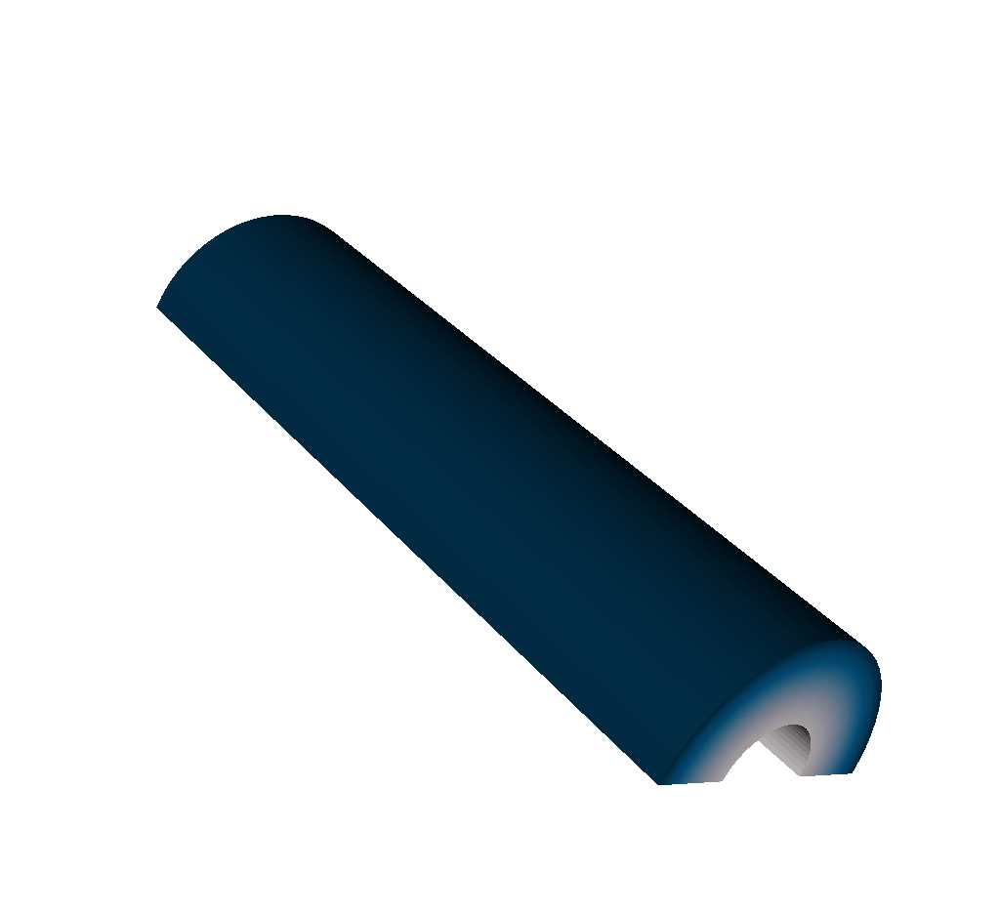

The input mesh.

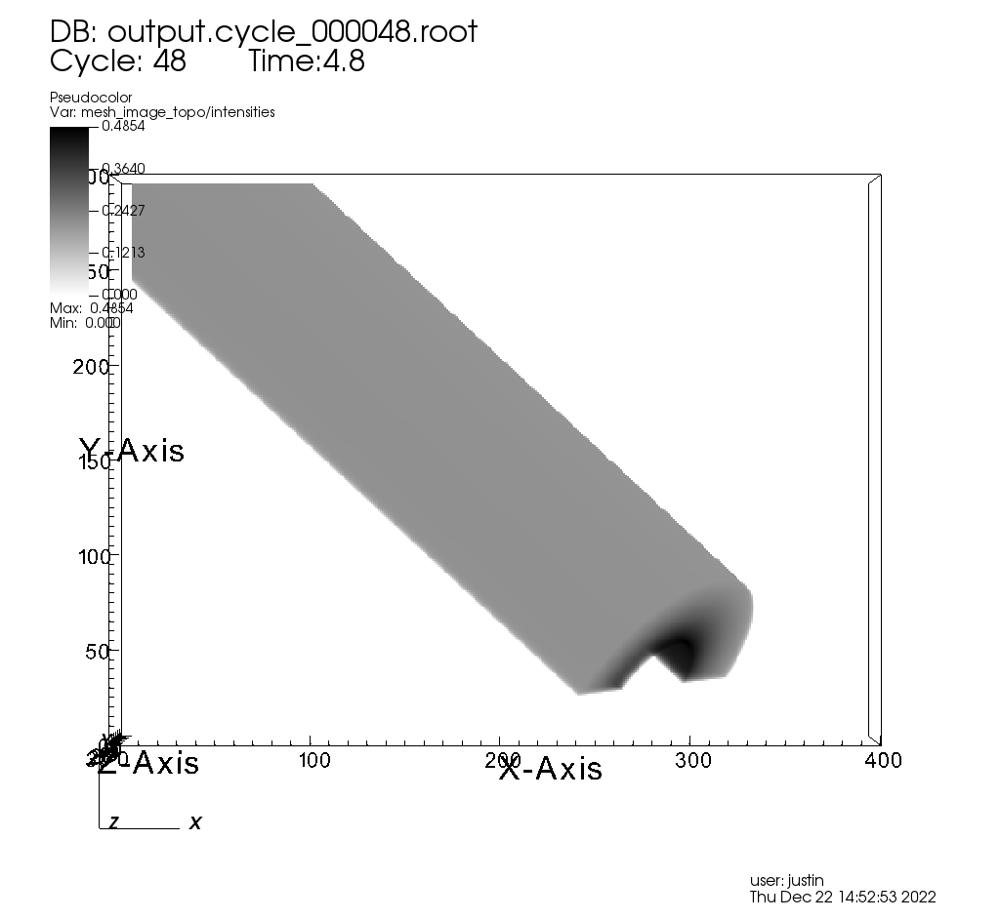

The resulting x ray image from Conduit Blueprint output, visualized by loading said output into VisIt.

We have opted to enrich the Blueprint output (see :ref:`Basic Mesh Output`) with extensive metadata (see :ref:`Metadata`) as well as additional meshes (see :ref:`Imaging Planes and Rays Meshes` and :ref:`Spatial Extents Mesh`) to provide extra context and information to the user. 
These additions should make it easier to troubleshoot unexpected results, make sense of the query output, and pass important information through the query.
Blueprint makes it simple to put all of this information into one file, and just as simple to read that information back out and/or visualize.

Overview of Output
""""""""""""""""""

So what is actually in the Blueprint output?
The Blueprint output provides multiple Blueprint meshes, which are each in turn comprised of a coordinate set, a topology, and fields.
These all live within a Conduit tree, along with metadata.
Using Conduit allows us to package everything in one place for ease of use.

TODO link to conduit blueprint docs and example

Here is a simplified representation of a Conduit tree that is output from the Query: 

::

  state: 
    time: 4.8
    cycle: 48
    xray_view: 
      ...
    xray_query: 
      ...
    xray_data: 
      ...
    domain_id: 0
  coordsets: 
    image_coords: 
      ...
    spatial_coords: 
      ...
    near_plane_coords: 
      ...
    view_plane_coords: 
      ...
    far_plane_coords: 
      ...
    ray_corners_coords: 
      ...
    ray_coords: 
      ...
  topologies: 
    image_topo: 
      ...
    spatial_topo:
      ...
    near_plane_topo: 
      ...
    view_plane_topo: 
      ...
    far_plane_topo: 
      ...
    ray_corners_topo: 
      ...
    ray_topo: 
      ...
  fields: 
    intensities: 
      ...
    path_length: 
      ...
    intensities_spatial: 
      ...
    path_length_spatial: 
      ...
    near_plane_field: 
      ...
    view_plane_field: 
      ...
    far_plane_field: 
      ...
    ray_corners_field: 
      ...
    ray_field: 
      ...

TODO

TODO to learn more about ajkfbdshbjsdugsd, read this section ajdbjfas - just link all the sections so it is easier to find stuff about the output

Basic Mesh Output
"""""""""""""""""

The most important piece of the Blueprint output is the actual query result.
We have taken the image data that comes out of the query and packaged it into a single Blueprint mesh.

The following is the example from :ref:`Overview of Output`, but with the Blueprint mesh representing the query result fully fleshed out: 

::

  state: 
    time: 4.8
    cycle: 48
    xray_view: 
      ...
    xray_query: 
      ...
    xray_data: 
      ...
    domain_id: 0
  coordsets: 
    image_coords: 
      type: "rectilinear"
      values: 
        x: [0, 1, 2, ..., 399, 400]
        y: [0, 1, 2, ..., 299, 300]
        z: [0, 1]
      labels: 
        x: "width"
        y: "height"
        z: "energy_group"
      units: 
        x: "pixels"
        y: "pixels"
        z: "bins"
    spatial_coords: 
      ...
    near_plane_coords: 
      ...
    view_plane_coords: 
      ...
    far_plane_coords: 
      ...
    ray_corners_coords: 
      ...
    ray_coords: 
      ...
  topologies: 
    image_topo: 
      coordset: "image_coords"
      type: "rectilinear"
    spatial_topo: 
      ...
    near_plane_topo: 
      ...
    view_plane_topo: 
      ...
    far_plane_topo: 
      ...
    ray_corners_topo: 
      ...
    ray_topo: 
      ...
  fields: 
    intensities: 
      topology: "image_topo"
      association: "element"
      units: "intensity units"
      values: [0.281004697084427, 0.281836241483688, 0.282898783683777, ..., 0.0, 0.0]
      strides: [1, 400, 120000]
    path_length: 
      topology: "image_topo"
      association: "element"
      units: "path length metadata"
      values: [2.46405696868896, 2.45119333267212, 2.43822622299194, ..., 0.0, 0.0]
      strides: [1, 400, 120000]
    intensities_spatial: 
      ...
    path_length_spatial: 
      ...
    near_plane_field: 
      ...
    view_plane_field: 
      ...
    far_plane_field: 
      ...
    ray_corners_field: 
      ...
    ray_field: 
      ...

TODO include real units for intensities and path length in the example

The 3 constituent parts of the Blueprint mesh output are the coordinate set, ``image_coords``, the topology, ``image_topo``, and the fields, ``intensities`` and ``path_length``.

The ``image_coords`` represent the x and y coordinates of the 2D image, and the z dimension represents the energy group bounds.
In the case of multiple energy groups, previously, the query would have output multiple images, one for each pair of energy group bounds.
In the Blueprint output, this is simplified, and rather than outputting multiple files, each containing one image, we have opted to "stack" the resulting images on top of one another.
This is why the Blueprint output is a 3D mesh, so it can account for multiple energy groups, and place resulting images one on top of another.
Also included in the ``image_coords`` are labels and units for disambiguation purposes.

The ``image_topo`` exists to tell Blueprint that the ``image_coords`` can be viewed as a topology.

The fields, ``intensities`` and ``path_length``, can be thought of as containers for the actual image data.
Each also includes units.
For path length, the ``units`` entry is just a way of including metadata or information about the path length, since path length is unitless.

Metadata
""""""""

The Conduit output types (see :ref:`Output Types` for more information) come packaged with metadata in addition to Blueprint-conforming mesh data.
The ability to send this metadata alongside the output mesh (and other data) is one of the advantages of using Conduit to for outputs from the query.
We hope this metadata helps to make it clear exactly what the query is doing, what information it has available to it, and what the output might look like.

Metadata is stored under the "state" Node in the resulting Conduit tree.
See the example below, which is taken from the example in :ref:`Overview of Output`, but this time with only the metadata fully fleshed out: 

::

  state: 
    time: 4.8
    cycle: 48
    xray_view: 
      normal: 
        x: 0.0
        y: 0.0
        z: 1.0
      focus: 
        x: 0.0
        y: 2.5
        z: 10.0
      viewUp: 
        x: 0.0
        y: 1.0
        z: 0.0
      viewAngle: 30.0
      parallelScale: 5.0
      nearPlane: -50.0
      farPlane: 50.0
      imagePan: 
        x: 0.0
        y: 0.0
      imageZoom: 1.0
      perspective: 1
      perspectiveStr: "perspective"
    xray_query: 
      divideEmisByAbsorb: 0
      divideEmisByAbsorbStr: "no"
      numXPixels: 400
      numYPixels: 300
      numBins: 1
      absVarName: "d"
      emisVarName: "p"
      absUnits: "abs units"
      emisUnits: "emis units"
    xray_data: 
      detectorWidth: 22.3932263237838
      detectorHeight: 16.7949192423103
      intensityMax: 0.491446971893311
      intensityMin: 0.0
      pathLengthMax: 120.815788269043
      pathLengthMin: 0.0
    domain_id: 0
  coordsets: 
    image_coords: 
      ...
    spatial_coords: 
      ...
    near_plane_coords: 
      ...
    view_plane_coords: 
      ...
    far_plane_coords: 
      ...
    ray_corners_coords: 
      ...
    ray_coords: 
      ...
  topologies: 
    image_topo: 
      ...
    spatial_topo:
      ...
    near_plane_topo: 
      ...
    view_plane_topo: 
      ...
    far_plane_topo: 
      ...
    ray_corners_topo: 
      ...
    ray_topo: 
      ...
  fields: 
    intensities: 
      ...
    path_length: 
      ...
    intensities_spatial: 
      ...
    path_length_spatial: 
      ...
    near_plane_field: 
      ...
    view_plane_field: 
      ...
    far_plane_field: 
      ...
    ray_corners_field: 
      ...
    ray_field: 
      ...

There are three top-level items: "time", "cycle", and "domain_id".
The fact that the domain id is present is a side effect of Conduit; all of the output data is single domain and this value has nothing to do with the query.
In addition to the top level items, there are three categories of metadata: *view parameters*, *query parameters*, and *other metadata*.
The following subsections discuss each of these categories in more detail.

View Parameters
+++++++++++++++

View parameters can be found under "state/xray_view".
This metadata represents the view-related values that were used in the x ray image query calculations, regardless of whether the simplified or complete view specification was used when calling the query.
The following is included:

+--------------------------+----------------------------------------------+
| *normal*                 | The x, y, and z components represent the     |
|                          | view normal vector |br| that was used in     |
|                          | the calculations.                            |
+--------------------------+----------------------------------------------+
| *focus*                  | The x, y, and z components represent the     |
|                          | focal point that was |br| used in the        |
|                          | calculations.                                |    
+--------------------------+----------------------------------------------+
| *viewUp*                 | The x, y, and z components represent the up  |
|                          | vector that was |br| used in the             |
|                          | calculations.                                |
+--------------------------+----------------------------------------------+
| *viewAngle*              | The view angle, only used in the             |
|                          | calculations if |br| perspective             |
|                          | projection was enabled.                      |
+--------------------------+----------------------------------------------+
| *parallelScale*          | The parallel scale, or view height, that was |
|                          | used in the |br| calculations.               |
+--------------------------+----------------------------------------------+
| *nearPlane*              | The near plane that was used in the          |
|                          | calculations.                                |
+--------------------------+----------------------------------------------+
| *farPlane*               | The far plane that was used in the           |
|                          | calculations.                                |
+--------------------------+----------------------------------------------+
| *imagePan*               | The x and y components represent the image   |
|                          | pan that was used |br| in the calculations.  |
+--------------------------+----------------------------------------------+
| *imageZoom*              | The absolute image zoom factor that was used |
|                          | in the calculations.                         |
+--------------------------+----------------------------------------------+
| *perspective*            | A flag indicating if parallel or perspective |
|                          | projection was used. |br| 0 indicates        |
|                          | parallel projection and 1 indicates          |
|                          | perspective |br| projection.                 |
+--------------------------+----------------------------------------------+
| *perspectiveStr*         | A String representation of the perspective   |
|                          | parameter. See above |br| for more           |
|                          | information.                                 |
+--------------------------+----------------------------------------------+

An example: ::

  xray_view: 
    normal: 
      x: 0.0
      y: 0.0
      z: 1.0
    focus: 
      x: 0.0
      y: 2.5
      z: 10.0
    viewUp: 
      x: 0.0
      y: 1.0
      z: 0.0
    viewAngle: 30.0
    parallelScale: 5.0
    nearPlane: -50.0
    farPlane: 50.0
    imagePan: 
      x: 0.0
      y: 0.0
    imageZoom: 1.0
    perspective: 1
    perspectiveStr: "perspective"

Query Parameters
++++++++++++++++

Query parameters can be found under "state/xray_query".
This metadata represents the query-related values that were used in the x ray image query calculations.
This data is available as of VisIt_ 3.3.2.
The following is included:

+--------------------------+----------------------------------------------+
| *divideEmisByAbsorb*     | A flag indicating if emissivity was divided  |
|                          | by absorbtivity |br| in the calculations.    |
|                          | More details can be found above.             |
+--------------------------+----------------------------------------------+
| *divideEmisByAbsorbStr*  | A String representation of the               |
|                          | divideEmisByAbsorb parameter. |br| See above |
|                          | for more information.                        |
+--------------------------+----------------------------------------------+
| *numXPixels*             | The pixel extent in the X dimension in the   |
|                          | output image.                                |
+--------------------------+----------------------------------------------+
| *numYPixels*             | The pixel extent in the Y dimension in the   |
|                          | output image.                                |
+--------------------------+----------------------------------------------+
| *numBins*                | The number of bins (the Z dimension extent)  |
|                          | in the output image.                         |
+--------------------------+----------------------------------------------+
| *absVarName*             | The name of the absorbtivity variable that   |
|                          | was used in the calculations.                |
+--------------------------+----------------------------------------------+
| *emisVarName*            | The name of the emissivity variable that     |
|                          | was used in the calculations.                |
+--------------------------+----------------------------------------------+
| *absUnits*               | The units of the absorbtivity variable that  |
|                          | was used in the calculations.                |
+--------------------------+----------------------------------------------+
| *emisUnits*              | The units of the emissivity variable that    |
|                          | was used in the calculations.                |
+--------------------------+----------------------------------------------+

An example: ::

  xray_query: 
    divideEmisByAbsorb: 0
    divideEmisByAbsorbStr: "no"
    numXPixels: 400
    numYPixels: 300
    numBins: 1
    absVarName: "d"
    emisVarName: "p"
    absUnits: "cm^2/g"
    emisUnits: "GJ/cm^2/ster/ns/keV"

Other Metadata
++++++++++++++

Other metadata can be found under "state/xray_data".
These values are calculated constants based on the input parameters and output data.
This data is available as of VisIt_ 3.3.2.
The following is included:

+--------------------------+----------------------------------------------+
| *detectorWidth*          | The width of the simulated x ray detector    |
|                          | in physical space.                           |
+--------------------------+----------------------------------------------+
| *detectorHeight*         | The height of the simulated x ray detector   |
|                          | in physical space.                           |
+--------------------------+----------------------------------------------+
| *intensityMax*           | The maximum value of the calculated          |
|                          | intensities.                                 |
+--------------------------+----------------------------------------------+
| *intensityMin*           | The minimum value of the calculated          |
|                          | intensities.                                 |
+--------------------------+----------------------------------------------+
| *pathLengthMax*          | The maximum value of the calculated          |
|                          | path lengths.                                |
+--------------------------+----------------------------------------------+
| *pathLengthMin*          | The minimum value of the calculated          |
|                          | path lengths.                                |
+--------------------------+----------------------------------------------+

An example: ::

  xray_data: 
    detectorWidth: 22.3932263237838
    detectorHeight: 16.7949192423103
    intensityMax: 0.491446971893311
    intensityMin: 0.0
    pathLengthMax: 120.815788269043
    pathLengthMin: 0.0

The minimum and maximum values that are included for the path length and intensity outputs are useful for quick troubleshooting or sanity checks that the output matches expectations. 
If both maximums and minimums are zero, for example, the simulated detector may not be facing the right way.
In that case, the :ref:`Imaging Planes and Rays Meshes` section may be of some use.

Imaging Planes and Rays Meshes
""""""""""""""""""""""""""""""

One of our goals with the Conduit output types (see :ref:`Output Types` for more information) is to provide rich, easy to understand information about the query to facilitate usability.
To that end, these outputs come packaged with meshes representing the imaging planes specified by the user when calling the query.
Additionally, they also include meshes representing the rays that were used in the ray tracing.
The following subsections discuss both of these in more detail.

Imaging Planes
++++++++++++++

Users can visualize the near, view, and far planes in physical space alongside the meshes used in the ray trace:

.. figure:: images/xray_imaging_planes.png

The imaging planes used by the X Ray Image Query visualized on top of the simulation data.
The near plane is in red, the view plane in transparent orange, and the far plane in blue.

Including this in the output gives a sense of where the camera is looking, and is also useful for checking if parts of the mesh being ray traced are outside the near and far clipping planes.
See the example below, which is taken from the example in :ref:`Overview of Output`, but this time with only the imaging plane meshes fully fleshed out: 

::

  state: 
    time: 4.8
    cycle: 48
    xray_view: 
      ...
    xray_query: 
      ...
    xray_data: 
      ...
    domain_id: 0
  coordsets: 
    image_coords: 
      ...
    spatial_coords: 
      ...
    near_plane_coords: 
      type: "explicit"
      values: 
        x: [-11.1966131618919, 11.1966131618919, 11.1966131618919, -11.1966131618919]
        y: [10.8974596211551, 10.8974596211551, -5.89745962115514, -5.89745962115514]
        z: [-40.0, -40.0, -40.0, -40.0]
    view_plane_coords: 
      type: "explicit"
      values: 
        x: [6.66666686534882, -6.66666686534882, -6.66666686534882, 6.66666686534882]
        y: [-2.5, -2.5, 7.5, 7.5]
        z: [10.0, 10.0, 10.0, 10.0]
    far_plane_coords: 
      type: "explicit"
      values: 
        x: [24.5299468925895, -24.5299468925895, -24.5299468925895, 24.5299468925895]
        y: [-15.8974596211551, -15.8974596211551, 20.8974596211551, 20.8974596211551]
        z: [60.0, 60.0, 60.0, 60.0]
    ray_corners_coords: 
      ...
    ray_coords: 
      ...
  topologies: 
    image_topo: 
      ...
    spatial_topo:
      ...
    near_plane_topo: 
      type: "unstructured"
      coordset: "near_plane_coords"
      elements: 
        shape: "quad"
        connectivity: [0, 1, 2, 3]
    view_plane_topo: 
      type: "unstructured"
      coordset: "view_plane_coords"
      elements: 
        shape: "quad"
        connectivity: [0, 1, 2, 3]
    far_plane_topo: 
      type: "unstructured"
      coordset: "far_plane_coords"
      elements: 
        shape: "quad"
        connectivity: [0, 1, 2, 3]
    ray_corners_topo: 
      ...
    ray_topo: 
      ...
  fields: 
    intensities: 
      ...
    path_length: 
      ...
    intensities_spatial: 
      ...
    path_length_spatial: 
      ...
    near_plane_field: 
      topology: "near_plane_topo"
      association: "element"
      volume_dependent: "false"
      values: 0.0
    view_plane_field: 
      topology: "view_plane_topo"
      association: "element"
      volume_dependent: "false"
      values: 0.0
    far_plane_field: 
      topology: "far_plane_topo"
      association: "element"
      volume_dependent: "false"
      values: 0.0
    ray_corners_field: 
      ...
    ray_field: 
      ...

Just like the :ref:`Basic Mesh Output`, each of the three meshes has three constituent pieces.
For the sake of brevity, we will only discuss the view plane, but the following information also holds true for the near and far planes.
First off is the ``view_plane_coords`` coordinate set, which, as may be expected, contains only four points, representing the four corners of the rectangle.
Next is the ``view_plane_topo``, which tells Conduit to treat the four points in the ``view_plane_coords`` as a quad.
Finally, we have the ``view_plane_field``, which has one value, "0.0". 
This value doesn't mean anything; it is just used to tell Blueprint that the entire quad should be colored the same color.

Rays Meshes
+++++++++++

Having the imaging planes is helpful, but sometimes it can be more useful to have a sense of the view frustum itself.
Users may desire a clearer picture of the simulated x ray detector: where it is in space, exactly what is it looking at, and what is it not seeing?
Enter the rays meshes, or the meshes that contain the rays used to generate the output images/data.

Why are there two?
The first is the ray corners mesh.
This is a Blueprint mesh containing four lines that pass through the corners of the :ref:`Imaging Planes`.
Now the viewing frustum comes into view:

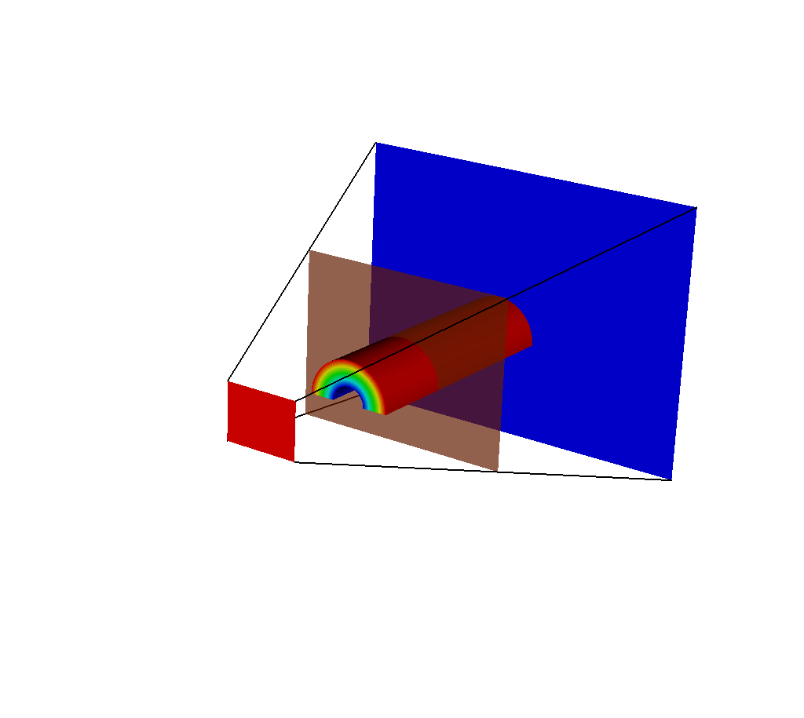

A plot of 5 meshes: the actual mesh that the query used to generate results, the 3 imaging planes, and the ray corners mesh.

The ray corners mesh is useful because no matter the chosen dimensions of the output image, the ray corners mesh always will only contain 4 lines.
Therefore it is cheap to render in a tool like VisIt, and it gives a general sense of what is going on.
But for those who wish to see all of the rays used in the ray trace, the following will be useful.

The second rays mesh provided is the ray mesh, which provides all the rays used in the ray trace, represented as lines in Blueprint.

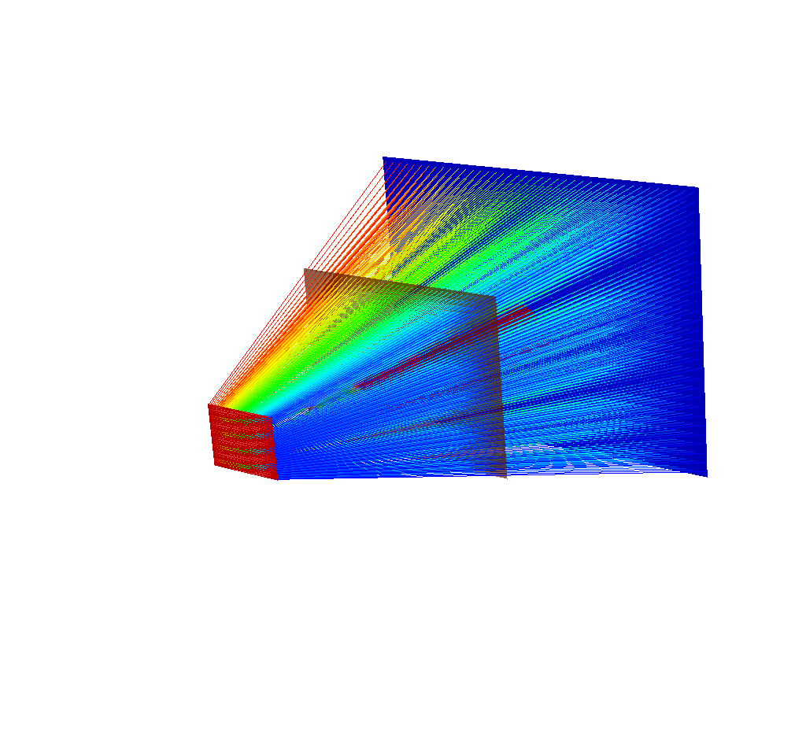

There are 40x30 rays in this image, corresponding to an x ray image output of 40x30 pixels.

Depending on the chosen dimensions of the output image, this mesh can contain thousands of lines.
See the following image, which is the same query as the previous image, but this time with 400x300 pixels.

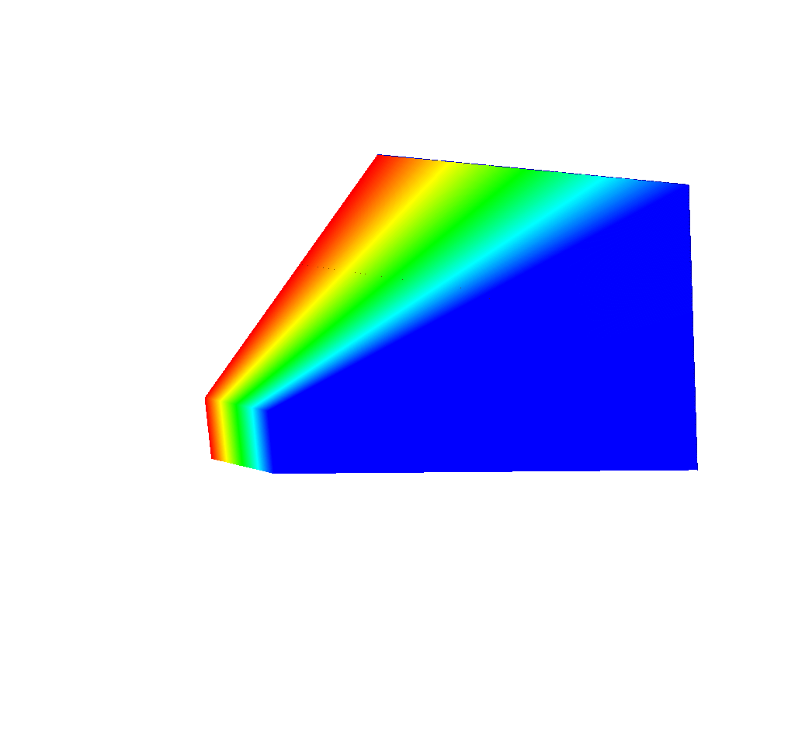

This render is far less useful. Even the imaging planes have been swallowed up, and the input mesh is completely hidden.
There are two solutions to this problem.
The first solution is to temporarily run the query with less rays (i.e. lower the image dimensions) until the desired understanding of what the simulated x ray detector is looking at has been achieved, then switch back to the large number of pixels/rays.
This can be done quickly, as the ray trace is the performance bottleneck for the x ray image query.
Here are examples:

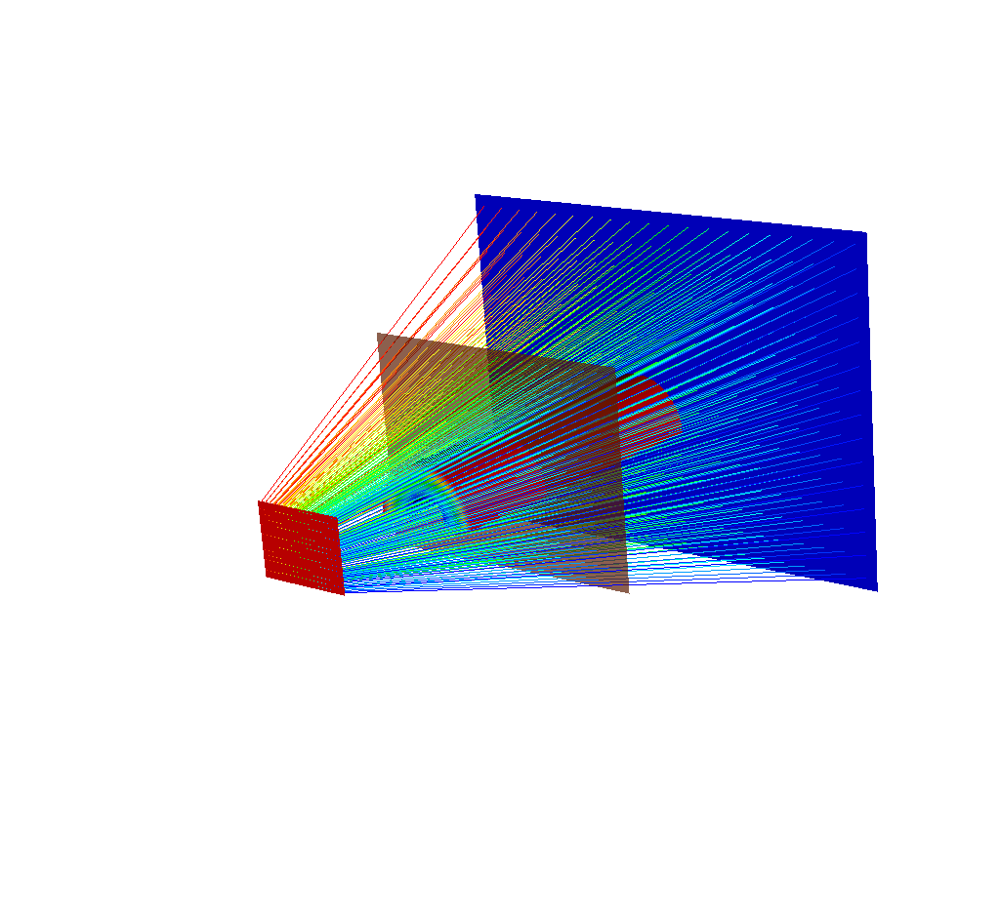

There are 20x15 rays in this image, corresponding to an x ray image output of 20x15 pixels.

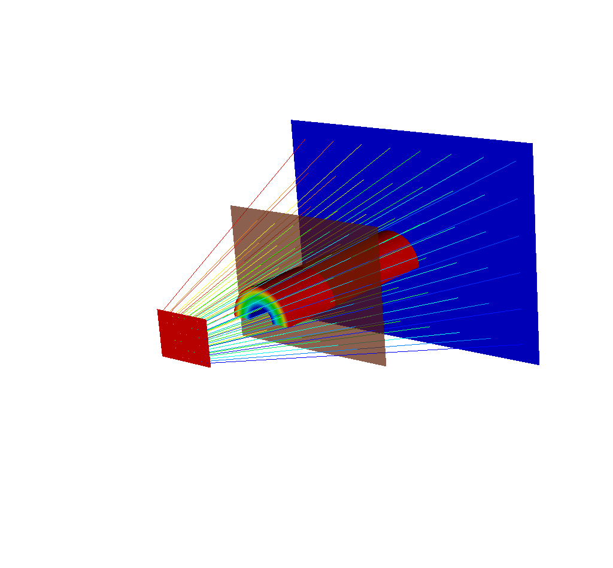

There are 8x6 rays in this image, corresponding to an x ray image output of 8x6 pixels.

These renders are less overwhelming, they can be generated quickly, and they get across a good amount of information.

But there is another option that does not require losing information.
That option is adjusting the opacity of the rays using VisIt.
Here is a view of a different run of the query, this time with the simulated x ray detector to the side of the input mesh.

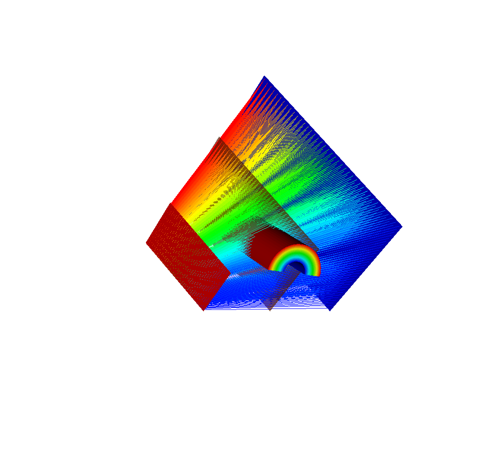

Even with only 40x30 rays, it is already hard to see the input mesh underneath the rays.
With VisIt, it is very easy to adjust the opacity of the rays and make them semitransparent.
Here is the same view but with the opacity adjusted for greater visibility.

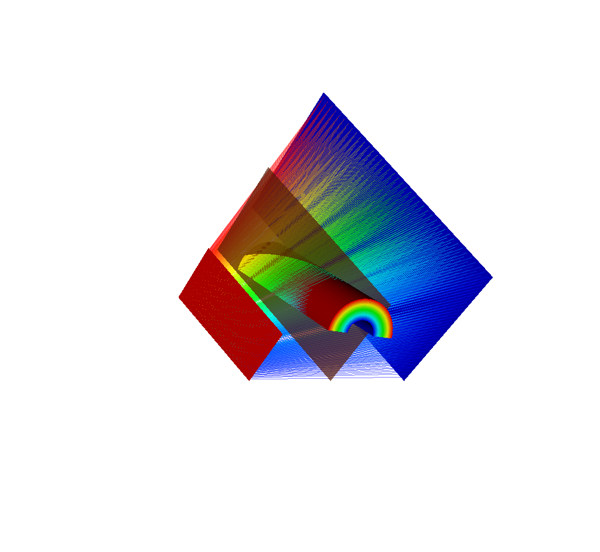

Here is the same view but with 400x300 rays.

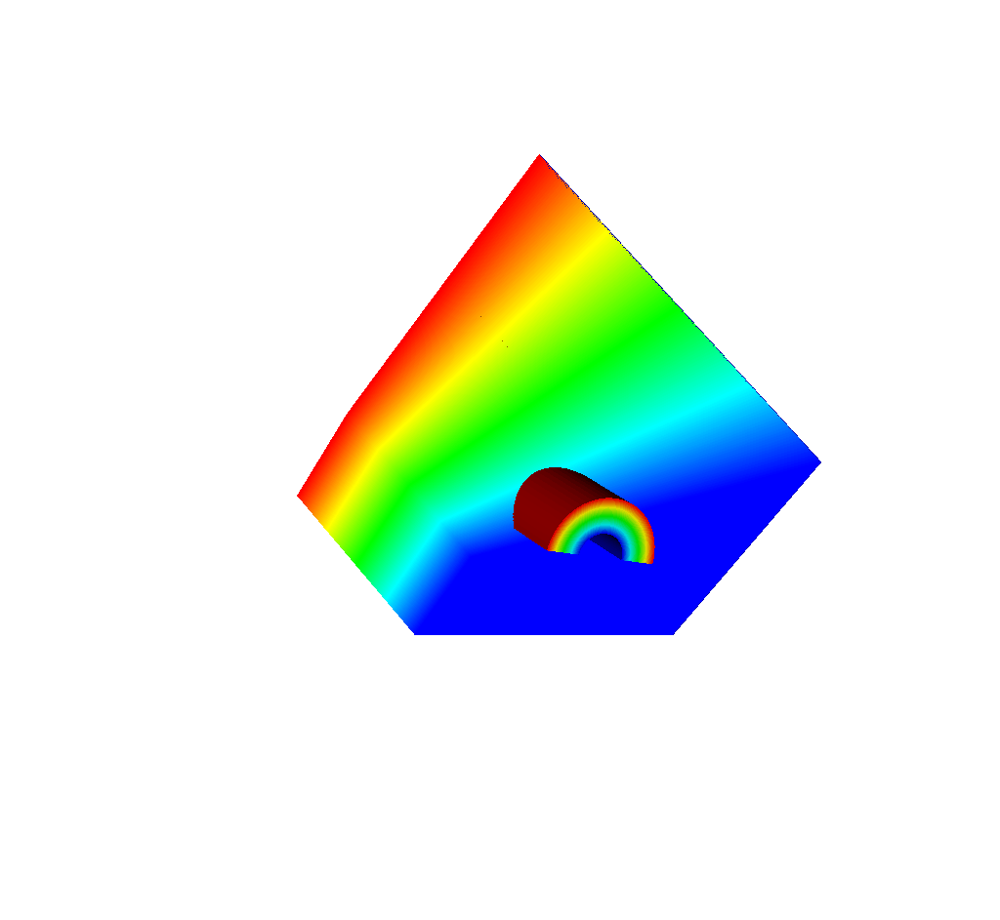

And here is the same view with 400x300 rays but with the ray opacity lowered.

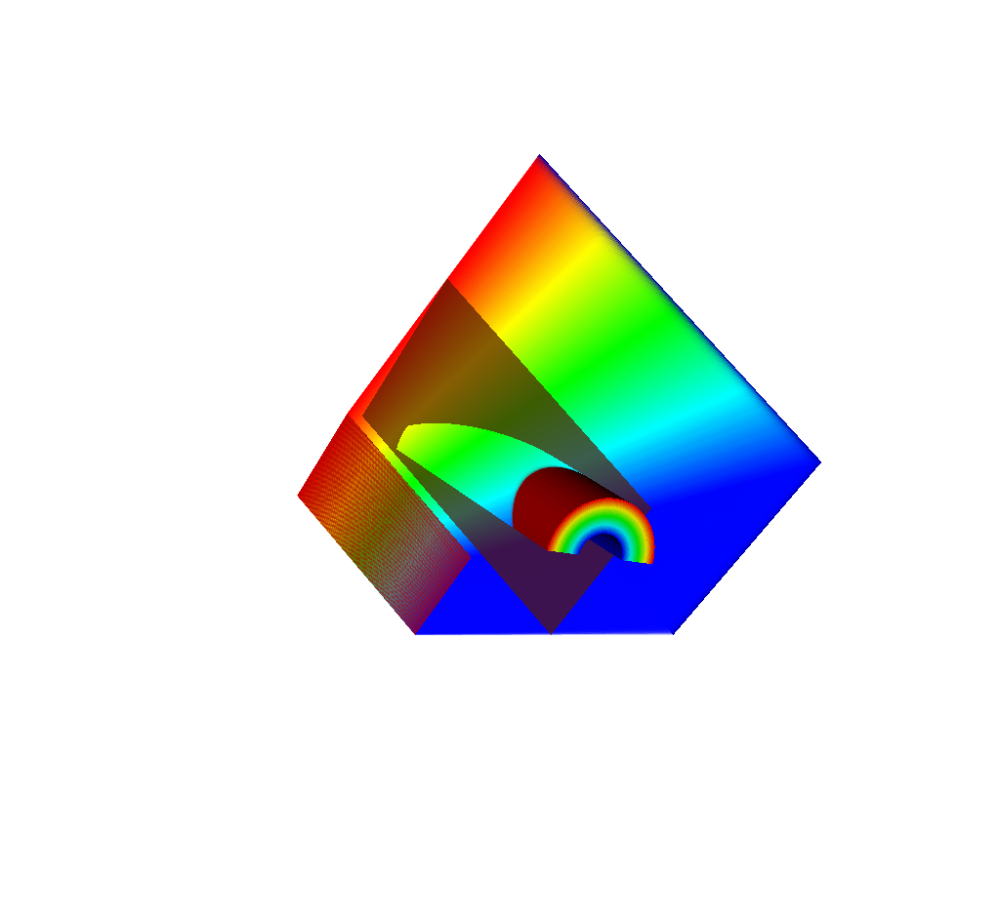

TODO the colors mean nothing

TODO

::

  state: 
    time: 4.8
    cycle: 48
    xray_view: 
      ...
    xray_query: 
      ...
    xray_data: 
      ...
    domain_id: 0
  coordsets: 
    image_coords: 
      ...
    spatial_coords: 
      ...
    near_plane_coords: 
      ...
    view_plane_coords: 
      ...
    far_plane_coords: 
      ...
    ray_corners_coords: 
      type: "explicit"
      values: 
        x: [-11.1966131618919, 24.5299468925895, 11.1966131618919, ..., -11.1966131618919, 24.5299468925895]
        y: [10.8974596211551, -15.8974596211551, 10.8974596211551, ..., -5.89745962115514, 20.8974596211551]
        z: [-40.0, 60.0, -40.0, ..., -40.0, 60.0]
    ray_coords: 
      type: "explicit"
      values: 
        x: [11.1686216289872, 11.1686216289872, 11.1686216289872, ..., 24.4686220253581, 24.4686220253581]
        y: [10.8694680890846, 10.8134850249436, 10.7575019608025, ..., 20.7134850249436, 20.8361347557513]
        z: [-40.0, -40.0, -40.0, ..., 60.0, 60.0]
  topologies: 
    image_topo: 
      ...
    spatial_topo:
      ...
    near_plane_topo: 
      ...
    view_plane_topo: 
      ...
    far_plane_topo: 
      ...
    ray_corners_topo: 
      type: "unstructured"
      coordset: "ray_corners_coords"
      elements: 
        shape: "line"
        connectivity: [0, 1, 2, ..., 6, 7]
    ray_topo: 
      type: "unstructured"
      coordset: "ray_coords"
      elements: 
        shape: "line"
        connectivity: [0, 120000, 1, ..., 119999, 239999]
  fields: 
    intensities: 
      ...
    path_length: 
      ...
    intensities_spatial: 
      ...
    path_length_spatial: 
      ...
    near_plane_field: 
      ...
    view_plane_field: 
      ...
    far_plane_field: 
      ...
    ray_corners_field: 
      topology: "ray_corners_topo"
      association: "element"
      volume_dependent: "false"
      values: [0.0, 0.0, 0.0, 0.0]
    ray_field: 
      topology: "ray_topo"
      association: "element"
      volume_dependent: "false"
      values: [0.0, 1.0, 2.0, ..., 119998.0, 119999.0]

TODO

Pitfalls
++++++++

TODO write about and show pictures for when the view plane is behind the view frustum and thus why the spatial extents mesh will be upside down

Spatial Extents Mesh
""""""""""""""""""""

The final piece of the Blueprint Output is one last mesh, the spatial extents mesh.
This mesh bears great similarity to that of the :ref:`Basic Mesh Output`.
The :ref:`Basic Mesh Output` gives users a picture, in a sense, that was taken by the simulated x ray detector.
That picture lives in image space, where the x and y dimensions are given in pixels, and the z dimension represents the number of energy group bins.

The spatial extents mesh is that same picture that was taken by the simulated x ray detector, but living in physical space.
Instead of the x and y dimensions representing pixels, the x and y dimensions here represent spatial values.
In the example below, these dimensions are in centimeters.
The x and y values run from 0 to the detector width and height values, respectively, that appear in the :ref:`Other Metadata` section of the Blueprint output.
The z dimension represents actual energy group bins.
These are values that were passed in via the query arguments (see :ref:`Standard Arguments` for more information).
In the example below, the z dimension represents Kiloelectron Volts.

Another way to think about the spatial extents mesh is if the basic mesh output was resized and then pasted on top of the near plane mesh (:ref:`Imaging Planes`), you would get the spatial extents mesh (ignoring the z dimension).
The rationale for including this mesh is twofold: 
#. 1) It provides yet another view of the data.
Perhaps seeing the output with spatial coordinates in x and y is more useful than seeing it with pixel coordinates.
If parallel projection is used (:ref:`Complete Camera Specification`), the spatial view of the output is far more useful.
#. 2) This mesh acts as a container for various interesting pieces of data that users may want to pass through the query.
This is the destination for the ``spatial_units`` and ``energy_units`` (:ref:`Units`), which show up under ``coordsets/spatial_coords/units``.
This is also where the energy group bounds (:ref:`Standard Arguments`) appear in the output, under ``coordsets/spatial_coords/values/z``.
If the energy group bounds were not provided by the user, or the provided bounds do not match the actual number of bins used in the ray trace, then there will be a message explaining what went wrong under ``coordsets/spatial_coords/info``, and the z values will go from 0 to n where n is the number of bins.

The following is the example from :ref:`Overview of Output`, but with only the spatial extents mesh fully fleshed out: 

::

  state: 
    time: 4.8
    cycle: 48
    xray_view: 
      ...
    xray_query: 
      ...
    xray_data: 
      ...
    domain_id: 0
  coordsets: 
    image_coords: 
      ...
    spatial_coords: 
      type: "rectilinear"
      values: 
        x: [-0.0, -0.0559830658094596, -0.111966131618919, ..., -22.3372432579744, -22.3932263237838]
        y: [-0.0, -0.0559830641410342, -0.111966128282068, ..., -16.7389361781692, -16.7949192423103]
        z: [3.7, 4.2]
      units: 
        x: "cm"
        y: "cm"
        z: "kev"
      labels: 
        x: "width"
        y: "height"
        z: "energy_group"
    near_plane_coords: 
      ...
    view_plane_coords: 
      ...
    far_plane_coords: 
      ...
    ray_corners_coords: 
      ...
    ray_coords: 
      ...
  topologies: 
    image_topo: 
      ...
    spatial_topo: 
      coordset: "spatial_coords"
      type: "rectilinear"
    near_plane_topo: 
      ...
    view_plane_topo: 
      ...
    far_plane_topo: 
      ...
    ray_corners_topo: 
      ...
    ray_topo: 
      ...
  fields: 
    intensities: 
      ...
    path_length: 
      ...
    intensities_spatial: 
      topology: "spatial_topo"
      association: "element"
      units: "intensity units"
      values: [0.281004697084427, 0.281836241483688, 0.282898783683777, ..., 0.0, 0.0]
      strides: [1, 400, 120000]
    path_length_spatial: 
      topology: "spatial_topo"
      association: "element"
      units: "path length metadata"
      values: [2.46405696868896, 2.45119333267212, 2.43822622299194, ..., 0.0, 0.0]
      strides: [1, 400, 120000]
    near_plane_field: 
      ...
    view_plane_field: 
      ...
    far_plane_field: 
      ...
    ray_corners_field: 
      ...
    ray_field: 
      ...

As can be seen from the example, this view of the output is very similar to the :ref:`Basic Mesh Output`. 
It has all the same components, a coordinate set ``spatial_coords``, a topology ``spatial_topo``, and fields ``intensities_spatial`` and ``path_length_spatial``.
The topology and fields are exact duplicates of those found in the :ref:`Basic Mesh Output`.
The impetus for including the spatial extents mesh was originally to include spatial coordinates as part of the metadata, but later on it was decided that the spatial coordinates should be promoted to be a proper Blueprint coordset.
We then duplicated the existing topology and fields from the :ref:`Basic Mesh Output` so that the spatial extents coordset could be part of a valid Blueprint mesh, and could thus be visualized using VisIt.

Visualizing with VisIt
""""""""""""""""""""""

TODO

Introspecting with Python
"""""""""""""""""""""""""

TODO

Examples
~~~~~~~~

Lets look at some examples, starting with some simulated x rays using
curv2d.silo, which contains a 2D R-Z mesh. Here is a pseudocolor plot
of the data.

.. figure:: images/xray00.png

The 2D R-Z data.

Now we'll show the Python code to generate a simulated x ray looking
down the Z Axis and the resulting image. ::

  params = GetQueryParameters("XRay Image")
  params['image_size'] = (300, 300)
  params['divide_emis_by_absorb'] = 1
  params['width'] = 10.
  params['height'] = 10.
  params['vars'] = ("d", "p")
  Query("XRay Image", params)

.. figure:: images/xray01.png

The resulting x ray image.

Here is the Python code to generate the same image but looking at it
from the side. ::

  params = GetQueryParameters("XRay Image")
  params['image_size'] = (300, 300)
  params['divide_emis_by_absorb'] = 1
  params['width'] = 10.
  params['height'] = 10.
  params['theta'] = 90.
  params['phi'] = 0.
  params['vars'] = ("d", "p")
  Query("XRay Image", params)

.. figure:: images/xray02.png

The resulting x ray image.

Here is the same Python code with the addition of an origin that
moves the image down and to the right by 1. ::

  params = GetQueryParameters("XRay Image")
  params['image_size'] = (300, 300)
  params['divide_emis_by_absorb'] = 1
  params['width'] = 10.
  params['height'] = 10.
  params['theta'] = 90.
  params['phi'] = 0.
  params['origin'] = (0., 1., 1.)
  params['vars'] = ("d", "p")
  Query("XRay Image", params)

.. figure:: images/xray03.png

The resulting x ray image.

Now we'll switch to a 3D example using globe.silo. Globe.silo is an
unstructured mesh consisting of tetrahedra, pyramids, prisms and hexahedra
forming a globe. Here is an image of the tetrahedra at the center of
the globe that form 2 cones.

.. figure:: images/xray04.png

The tetrahedra at the center of the globe.

Here is the Python code for generating an x ray image from the same
orientation. Note that we have defined some expressions so that the
x ray image shows some variation. ::

  DefineScalarExpression("u1", 'recenter(((u+10.)*0.01), "zonal")')
  DefineScalarExpression("v1", 'recenter(((v+10.)*0.01*matvf(mat1,1)), "zonal")')
  DefineScalarExpression("v2", 'recenter(((v+10.)*0.01*matvf(mat1,2)), "zonal")')
  DefineScalarExpression("v3", 'recenter(((v+10.)*0.01*matvf(mat1,3)), "zonal")')
  DefineScalarExpression("v4", 'recenter(((v+10.)*0.01*matvf(mat1,4)), "zonal")')
  DefineScalarExpression("w1", 'recenter(((w+10.)*0.01), "zonal")')

  params = GetQueryParameters("XRay Image")
  params['image_size'] = (300, 300)
  params['divide_emis_by_absorb'] = 1
  params['width'] = 4.
  params['height'] = 4.
  params['theta'] = 90.
  params['phi'] = 0.
  params['vars'] = ("w1", "v1")
  Query("XRay Image", params)

.. figure:: images/xray05.png

The resulting x ray image.

Now we'll look at the pyramids in the center of the globe.

.. figure:: images/xray06.png

The pyramids at the center of the globe.

Here is the Python code for generating an x ray image from the same
orientation using the full view specification. The view specification
was merely copied from the 3D tab on the View window. Note that we
have created the dictionary from scratch, rather than starting with
the default ones. This is necessary to use the full view specification. ::

  params = dict(output_type="png")
  params['image_size'] = (300, 300)
  params['divide_emis_by_absorb'] = 1
  params['focus'] = (0., 0., 0.)
  params['view_up'] = (-0.0651, 0.775, 0.628)
  params['normal'] = (-0.840, -0.383, 0.385)
  params['view_angle'] = 30.
  params['parallel_scale'] = 17.3205
  params['near_plane'] = -34.641
  params['far_plane'] = 34.641
  params['image_pan'] = (0., 0.)
  params['image_zoom'] = 8
  params['perspective'] = 0
  params['vars'] = ("w1", "v2")
  Query("XRay Image", params)

.. figure:: images/xray07.png

The resulting x ray image.
