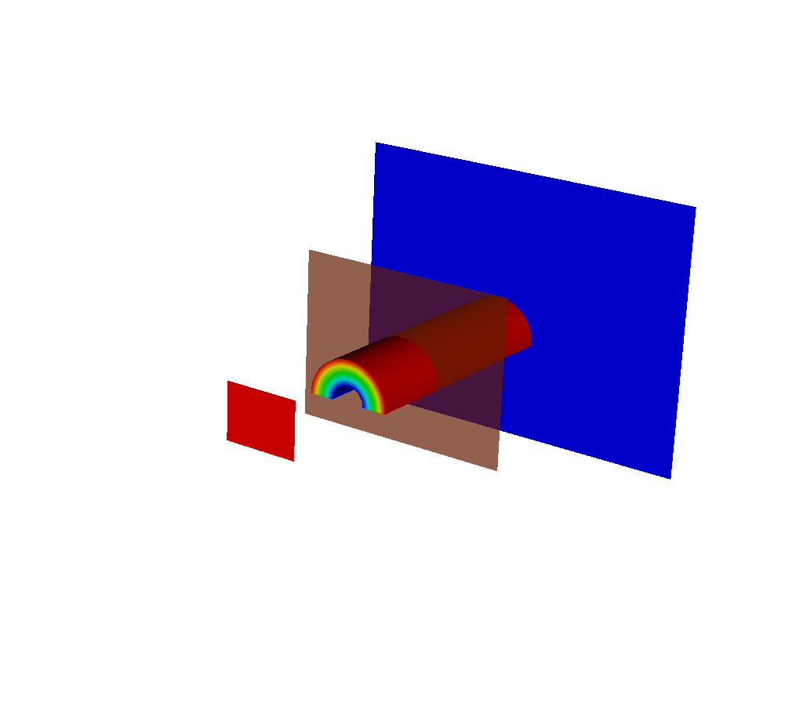

.. _XRayQuery:

.. |br| raw:: html

    

X Ray Image Query
-----------------

Generates a simulated radiograph by tracing rays through a volume using an absorbtivity and emissivity variable.
The absorbtivity and emissivity variables must be zone centered and can be either scalar variables or array variables.
If using an array variable, the query will generate an image per array variable component.

The query operates on 2D R-Z meshes and 3D meshes.
In the case of 2D R-Z meshes, the mesh is revolved around the Z axis.

The query performs the following integration as it traces the rays through the volume.

.. container:: collapsible

    .. container:: header

        **Show/Hide Code for** XRay Image Query

    .. literalinclude:: ../../../../src/avt/Filters/avtXRayFilter.C
        :language: C++
        :start-after: begin standard integration 
        :end-before: end standard integration

If the ``divide_emis_by_absorb`` is set, then the following integration is performed.

.. container:: collapsible

    .. container:: header

        **Show/Hide Code for** Absortivity-Normalized XRay Image Query 

    .. literalinclude:: ../../../../src/avt/Filters/avtXRayFilter.C
        :language: C++
        :start-after: begin absorbtivity-normalized integration
        :end-before: end absorbtivity-normalized integration

When making a simulated radiograph the emissivity variable must contain non zero values or you will need to specify a background intensity using either *background_intensity* or *background_intensities*.
If neither of these is the case, you will get an all white image.
A non-zero emissivity variable would correspond to an object emitting radiation and a non zero background intensity would correspond to constant backlit radiation, such as when x raying an object.

Query Arguments
~~~~~~~~~~~~~~~

The query takes a few different kinds of arguments:

Standard Arguments
""""""""""""""""""

TODO

+--------------------------+----------------------------------------------+
| *vars*                   | An array of the names of the absorbtivity    |
|                          | and emissivity variables.                    |
+--------------------------+----------------------------------------------+
| *background_intensity*   | The background intensity if ray tracing      |
|                          | scalar variables. The default is 0.          |
+--------------------------+----------------------------------------------+
| *background_intensities* | The background intensities if ray tracing    |
|                          | array variables. The default is 0.           |
+--------------------------+----------------------------------------------+
| *divide_emis_by_absorb*  | Described above.                             |
+--------------------------+----------------------------------------------+
| *image_size*             | The width and height of the image in pixels. |
|                          | The default is 200 x 200.                    |
+--------------------------+----------------------------------------------+
| *debug_ray*              | The ray index for which to output ray        |
|                          | tracing information. The default is |br| -1, |
|                          | which turns it off.                          |
+--------------------------+----------------------------------------------+
| *output_ray_bounds*      | Output the ray bounds as a bounding box in a |
|                          | VTK file. The default is off. |br| The name  |
|                          | of the file is ``ray_bounds.vtk``.           |
+--------------------------+----------------------------------------------+
| *energy_group_bounds*    | The energy group bounds can be handed off to |
|                          | the query in a list or tuple. |br| The       |
|                          | values will appear in Blueprint output       |
|                          | metadata.                                    |
+--------------------------+----------------------------------------------+

TODO note where these show up in blueprint output w/ link to section

Output Filenames and Directories
++++++++++++++++++++++++++++++++

+------+-------------------+----------------------------------------------+
| *output_dir*             | The output directory. The default is "."     |
+------+-------------------+----------------------------------------------+
| *family_files*           | A flag indicating if the output files should |
|                          | be familied. The default is |br| off. If it  |
|                          | is off then the output file is               |
|                          | ``output.ext``, where ``ext`` is the file    |
|                          | |br| extension. If the file exists it will   |
|                          | overwrite the file. If it is on, then |br|   |
|                          | the output file is ``outputXXXX.ext``,       |
|                          | where ``XXXX`` is chosen                     |
|                          | to be the |br| smallest integer not to       |
|                          | overwrite any existing files. As of VisIt_   |
|                          | 3.4, |br| it is recommended to use           |
|                          | *filename_scheme* in lieu of *family_files*. |
+------+-------------------+----------------------------------------------+
| *filename_scheme*        | The naming convention for output filenames.  |
|                          | This option is available |br| in VisIt_ 3.4, |
|                          | and is meant to replace the *family_files*   |
|                          | option. If both |br| are provided,           |
|                          | *filename_scheme* will be used.              |
+------+-------------------+----------------------------------------------+
|      | "none" or 0       | The default. Output filenames will be of the |
|      |                   | form ``output.ext``, where |br|              |
|      |                   | ``ext`` is the file extension. If the        |
|      |                   | filename already exists, VisIt_ will |br|    |
|      |                   | overwrite it.                                |
+------+-------------------+----------------------------------------------+
|      | "family" or 1     | If on, VisIt_ will attempt to family output  |
|      |                   | files. Output filenames will be |br| of the  | 
|      |                   | form ``output.XXXX.ext``, where ``XXXX`` is  |
|      |                   | chosen to be the smallest |br| integer such  |
|      |                   | that the filename is unique.                 |
+------+-------------------+----------------------------------------------+
|      | "cycle" or 2      | VisIt_ will put cycle information in the     |
|      |                   | filename. Output filenames will be |br| of   |
|      |                   | the form ``output.cycle_XXXXXX.ext``, where  |
|      |                   | ``XXXXXX`` is the cycle number. |br| If      |
|      |                   | another file exists with this name, VisIt_   |
|      |                   | will overwrite it.                           |
+------+-------------------+----------------------------------------------+

TODO note where these show up in blueprint output w/ link to section

Output Types
++++++++++++

+------+-------------------+----------------------------------------------+
| *output_type*            | The format of the image. The default is PNG. |
+------+-------------------+----------------------------------------------+
|      | "bmp" or 0        | BMP image format. This is deprecated as of   |
|      |                   | VisIt_ 3.4.                                  |
+------+-------------------+----------------------------------------------+
|      | "jpeg" or 0 |br|  | JPEG image format.                           |
|      | (1 prior to       |                                              |
|      | VisIt_ 3.4)       |                                              |
+------+-------------------+----------------------------------------------+
|      | "png" or 1 |br|   | PNG image format.                            |
|      | (2 prior to       |                                              |
|      | VisIt_ 3.4)       |                                              |
+------+-------------------+----------------------------------------------+
|      | "tif" or 2 |br|   | TIFF image format.                           |
|      | (3 prior to       |                                              |
|      | VisIt_ 3.4)       |                                              |
+------+-------------------+----------------------------------------------+
|      | "rawfloats" or 3  | File of 32 or 64 bit floating point values   |
|      | |br| (4 prior to  | in IEEE format.                              |
|      | VisIt_ 3.4)       |                                              |
+------+-------------------+----------------------------------------------+
|      | "bov" or 4 |br|   | BOV (Brick Of Values) format, which consists |
|      | (5 prior to       | of a text header |br| file describing a      |
|      | VisIt_ 3.4)       | rawfloats file.                              |
+------+-------------------+----------------------------------------------+
|      | "json" or 5 |br|  | Conduit JSON output.                         |
|      | (6 prior to       |                                              |
|      | VisIt_ 3.4)       |                                              |
+------+-------------------+----------------------------------------------+
|      | "hdf5" or 6 |br|  | Conduit HDF5 output.                         |
|      | (7 prior to       |                                              |
|      | VisIt_ 3.4)       |                                              |
+------+-------------------+----------------------------------------------+
|      | "yaml" or 7 |br|  | Conduit YAML output.                         |
|      | (8 prior to       |                                              |
|      | VisIt_ 3.4)       |                                              |
+------+-------------------+----------------------------------------------+

When specifying "bov" or "rawfloats" output, the value can be either 32 or 64 bit floating point values.
The number of bits is determined by the number of bits in the data being processed.

When specifying "bov" output, 2 files are created for each variable.
One contains the ``intensity`` and the other the ``path_length``.
The files are named ``output.XX.bof`` and ``output.XX.bov`` with ``XX`` being a sequence number.
The ``intensity`` variables are first followed by the ``path_length`` variables in the sequence.
For example, if the input array variables were composed of 2 scalar variables, the files would be named as follows:

* output.00.bof
* output.00.bov - ``intensity`` from the first variable of the array variable.
* output.01.bof
* output.01.bov - ``intensity`` from the second variable of the array variable.
* output.02.bof
* output.02.bov - ``path_length`` from the first variable of the array variable.
* output.03.bof
* output.03.bov - ``path_length`` from the second variable of the array variable.

TODO write about the conduit output types a bit.

Units
+++++

+--------------------------+----------------------------------------------+
| *spatial_units*          | The units of the simulation in the x and y   |
|                          | dimensions.                                  |
+--------------------------+----------------------------------------------+
| *energy_units*           | The units of the simulation in the z         |
|                          | dimension.                                   |
+--------------------------+----------------------------------------------+
| *abs_units*              | The units of the absorbtivity variable       |
|                          | passed to the query.                         |
+--------------------------+----------------------------------------------+
| *emis_units*             | The units of the emissivity variable         |
|                          | passed to the query.                         |
+--------------------------+----------------------------------------------+
| *intensity_units*        | The units of the intensity output.           |
+--------------------------+----------------------------------------------+
| *path_length_units*      | Metadata describing the path length output.  |
+--------------------------+----------------------------------------------+

TODO where do these go? why are these here?
TODO note where these show up in blueprint output w/ link to section(s)

Camera Specification
""""""""""""""""""""

The query also takes arguments that specify the orientation of the camera in 3 dimensions. 
This can take 2 forms. 
The first is a simplified specification that gives limited control over the camera and the second is a complete specification that matches the 3D image viewing parameters. 

Simplified
++++++++++

The simplified version consists of:

+--------------+----------------------------------------------------------+
| *width*      | The width of the image in physical space.                |
+--------------+----------------------------------------------------------+
| *height*     | The height of the image in physical space.               |
+--------------+----------------------------------------------------------+
| *origin*     | The point in 3D corrensponding to the center of the      |
|              | image.                                                   |
+--------------+----------------------------------------------------------+
| *theta* |br| | The orientation angles. The default is 0. 0. and is      |
| *phi*        | looking down the Z axis. Theta |br| moves around the     |
|              | Y axis toward the X axis. Phi moves around the Z axis.   |
|              | When |br| looking at an R-Z mesh, phi has no effect      |
|              | because of symmetry.                                     |
+--------------+----------------------------------------------------------+
| *up_vector*  | The up vector.                                           |
+--------------+----------------------------------------------------------+

*If any of the above properties are specified in the parameters, the query will use the simplified version.*

During execution, the simplified camera specification parameters are converted to the complete ones.

Complete
++++++++

The complete version consists of:

+------------------+------------------------------------------------------+
| *normal*         | The view normal. The default is (0., 0., 1.).        |
+------------------+------------------------------------------------------+
| *focus*          | The focal point. The default is (0., 0., 0.).        |
+------------------+------------------------------------------------------+
| *view_up*        | The up vector. The default is (0., 1., 0.).          |
+------------------+------------------------------------------------------+
| *view_angle*     | The view angle. The default is 30. This is only used |
|                  | if perspective |br| projection is enabled.           |
+------------------+------------------------------------------------------+
| *parallel_scale* | The parallel scale, or view height. The default is   |
|                  | 0.5.                                                 |
+------------------+------------------------------------------------------+
| *near_plane*     | The near clipping plane. The default is -0.5.        |
+------------------+------------------------------------------------------+
| *far_plane*      | The far clipping plane. The default is 0.5.          |
+------------------+------------------------------------------------------+
| *image_pan*      | The image pan in the X and Y directions. The default |
|                  | is (0., 0.).                                         |
+------------------+------------------------------------------------------+
| *image_zoom*     | The absolute image zoom factor. The default is 1.    |
|                  | A value of 2. zooms the |br| image closer by scaling |
|                  | the image by a factor of 2 in the X and Y            |
|                  | directions. |br| A value of 0.5 zooms the image      |
|                  | further away by scaling the image by a factor |br|   |
|                  | of 0.5 in the X and Y directions.                    |
+------------------+------------------------------------------------------+
| *perspective*    | Flag indicating if doing a parallel or perspective   |
|                  | projection. |br| 0 indicates parallel projection.    |
|                  | 1 indicates perspective projection.                  |
+------------------+------------------------------------------------------+

When a Conduit Blueprint output type is specified, these parameters will appear in the metadata.
See :ref:`View Parameters` for more information.

Calling the Query
"""""""""""""""""

TODO

Conduit Output
~~~~~~~~~~~~~~

The Conduit output types (see the listed output types above for more information) include additional metadata and topologies.

Why Conduit Output?
"""""""""""""""""""

TODO

Overview of Output
""""""""""""""""""

Here is a simplified representation of a Conduit tree that is output from the Query: ::

  state: 
    time: 4.8
    cycle: 48
    xray_view: 
      ...
    xray_query: 
      ...
    xray_data: 
      ...
    domain_id: 0
  coordsets: 
    image_coords: 
      ...
    near_plane_coords: 
      ...
    view_plane_coords: 
      ...
    far_plane_coords: 
      ...
  topologies: 
    image_topo: 
      ...
    near_plane_topo: 
      ...
    view_plane_topo: 
      ...
    far_plane_topo: 
      ...
  fields: 
    intensities: 
      ...
    path_length: 
      ...
    near_plane_field: 
      ...
    view_plane_field: 
      ...
    far_plane_field: 
      ...

TODO

Standard Mesh Output
""""""""""""""""""""

TODO

Metadata
""""""""

The Conduit output types (see the listed output types above for more information) come packaged with metadata in addition to Blueprint-conforming mesh data. 
Currently, this metadata is stored under the "state" Node in the resulting Conduit tree.
In addition to "time" and "cycle", there are three categories of metadata: *view parameters*, *query parameters*, and *other metadata*.

TODO make note about domain_id

View Parameters
+++++++++++++++

View parameters can be found under "state/xray_view".
This metadata represents the view-related values that were used in the x ray image query calculations, regardless of whether the simplified or complete view specification was used when calling the query.
The following is included:

+--------------------------+----------------------------------------------+
| *normal*                 | The x, y, and z components represent the     |
|                          | view normal vector |br| that was used in     |
|                          | the calculations.                            |
+--------------------------+----------------------------------------------+
| *focus*                  | The x, y, and z components represent the     |
|                          | focal point that was |br| used in the        |
|                          | calculations.                                |    
+--------------------------+----------------------------------------------+
| *viewUp*                 | The x, y, and z components represent the up  |
|                          | vector that was |br| used in the             |
|                          | calculations.                                |
+--------------------------+----------------------------------------------+
| *viewAngle*              | The view angle, only used in the             |
|                          | calculations if |br| perspective             |
|                          | projection was enabled.                      |
+--------------------------+----------------------------------------------+
| *parallelScale*          | The parallel scale, or view height, that was |
|                          | used in the |br| calculations.               |
+--------------------------+----------------------------------------------+
| *nearPlane*              | The near plane that was used in the          |
|                          | calculations.                                |
+--------------------------+----------------------------------------------+
| *farPlane*               | The far plane that was used in the           |
|                          | calculations.                                |
+--------------------------+----------------------------------------------+
| *imagePan*               | The x and y components represent the image   |
|                          | pan that was used |br| in the calculations.  |
+--------------------------+----------------------------------------------+
| *imageZoom*              | The absolute image zoom factor that was used |
|                          | in the calculations.                         |
+--------------------------+----------------------------------------------+
| *perspective*            | A flag indicating if parallel or perspective |
|                          | projection was used. |br| 0 indicates        |
|                          | parallel projection and 1 indicates          |
|                          | perspective |br| projection.                 |
+--------------------------+----------------------------------------------+
| *perspectiveStr*         | A String representation of the perspective   |
|                          | parameter. See above |br| for more           |
|                          | information.                                 |
+--------------------------+----------------------------------------------+

An example: ::

  xray_view: 
    normal: 
      x: 0.0
      y: 0.0
      z: 1.0
    focus: 
      x: 0.0
      y: 2.5
      z: 10.0
    viewUp: 
      x: 0.0
      y: 1.0
      z: 0.0
    viewAngle: 30.0
    parallelScale: 5.0
    nearPlane: -50.0
    farPlane: 50.0
    imagePan: 
      x: 0.0
      y: 0.0
    imageZoom: 1.0
    perspective: 1
    perspectiveStr: "perspective"

Query Parameters
++++++++++++++++

Query parameters can be found under "state/xray_query".
This metadata represents the query-related values that were used in the x ray image query calculations.
This data is available as of VisIt_ 3.3.2.
The following is included:

+--------------------------+----------------------------------------------+
| *divideEmisByAbsorb*     | A flag indicating if emissivity was divided  |
|                          | by absorbtivity |br| in the calculations.    |
|                          | More details can be found above.             |
+--------------------------+----------------------------------------------+
| *divideEmisByAbsorbStr*  | A String representation of the               |
|                          | divideEmisByAbsorb parameter. |br| See above |
|                          | for more information.                        |
+--------------------------+----------------------------------------------+
| *numXPixels*             | The pixel extent in the X dimension in the   |
|                          | output image.                                |
+--------------------------+----------------------------------------------+
| *numYPixels*             | The pixel extent in the Y dimension in the   |
|                          | output image.                                |
+--------------------------+----------------------------------------------+
| *numBins*                | The number of bins (the Z dimension extent)  |
|                          | in the output image.                         |
+--------------------------+----------------------------------------------+
| *absVarName*             | The name of the absorbtivity variable that   |
|                          | was used in the calculations.                |
+--------------------------+----------------------------------------------+
| *emisVarName*            | The name of the emissivity variable that     |
|                          | was used in the calculations.                |
+--------------------------+----------------------------------------------+
| *absUnits*               | The units of the absorbtivity variable that  |
|                          | was used in the calculations.                |
+--------------------------+----------------------------------------------+
| *emisUnits*              | The units of the emissivity variable that    |
|                          | was used in the calculations.                |
+--------------------------+----------------------------------------------+

An example: ::

  xray_query: 
    divideEmisByAbsorb: 0
    divideEmisByAbsorbStr: "no"
    numXPixels: 400
    numYPixels: 300
    numBins: 1
    absVarName: "d"
    emisVarName: "p"
    absUnits: "cm^2/g"
    emisUnits: "GJ/cm^2/ster/ns/keV"

Other Metadata
++++++++++++++

Other metadata can be found under "state/xray_data".
These values are calculated constants based on the input parameters and output data.
This data is available as of VisIt_ 3.3.2.
The following is included:

+--------------------------+----------------------------------------------+
| *detectorWidth*          | The width of the simulated x ray detector    |
|                          | in physical space.                           |
+--------------------------+----------------------------------------------+
| *detectorHeight*         | The height of the simulated x ray detector   |
|                          | in physical space.                           |
+--------------------------+----------------------------------------------+
| *intensityMax*           | The maximum value of the calculated          |
|                          | intensities.                                 |
+--------------------------+----------------------------------------------+
| *intensityMin*           | The minimum value of the calculated          |
|                          | intensities.                                 |
+--------------------------+----------------------------------------------+
| *pathLengthMax*          | The maximum value of the calculated          |
|                          | path lengths.                                |
+--------------------------+----------------------------------------------+
| *pathLengthMin*          | The minimum value of the calculated          |
|                          | path lengths.                                |
+--------------------------+----------------------------------------------+

An example: ::

  xray_data: 
    image_coords: 
      values:
        x: [-0.0, -0.0559830665588379, -0.111966133117676, ..., -22.3372440338135, -22.3932266235352]
        y: [-0.0, -0.0559830628335476, -0.111966125667095, ..., -16.7389354705811, -16.7949199676514]
        z: [3.7, 4.2]
      units:
        x: "cm"
        y: "cm"
        z: "kev"
      labels:
        x: "width"
        y: "height"
        z: "energy_group"
    detectorWidth: 22.3932263237838
    detectorHeight: 16.7949192423103
    intensityMax: 0.491446971893311
    intensityMin: 0.0
    pathLengthMax: 120.815788269043
    pathLengthMin: 0.0

The minimum and maximum values that are included for the path length and intensity outputs are useful for quick troubleshooting or sanity checks that the output matches expectations. 
If both maximums and minimums are zero, for example, the simulated detector may not be facing the right way.
In that case, the following section may be of some use.

Imaging Planes and Rays Meshes
""""""""""""""""""""""""""""""

The Conduit output types (see the listed output types above for more information) come packaged with topologies for the imaging planes. 
In addition to the ray tracing results, you can visualize the near, view, and far planes in physical space alongside your simulation data.
These can be found under the *coordsets*, *topologies*, and *fields* branches.

   The imaging planes used by the X Ray Image Query visualized on top of the simulation data.
   The near plane is in red, the view plane in transparent orange, and the far plane in blue.

TODO

Spatial Extents Mesh
""""""""""""""""""""

TODO this is all wrong

+--------------------------+----------------------------------------------+
| *image_coords/values/x*  | The image coordinates are a coordinate set   |
| |br|                     | that represent the |br|                      |
| *image_coords/values/y*  | world-space/physical coordinates of the      |
|                          | output image. These |br|                     |
|                          | spatial extents are given by x and y values  |
|                          | that range from 0 to |br|                    |
|                          | the number of pixels in the respective x and |
|                          | y dimensions times |br|                      |
|                          | the pixel size in those dimensions.          |
+--------------------------+----------------------------------------------+
| *image_coords/values/z*  | The z values of the image coordinates        |
|                          | represent the energy |br|                    |
|                          | group bounds that were provided via the      |
|                          | *energy_group_bounds* |br|                   |
|                          | argument. If they were not provided or there |
|                          | were too many or too |br|                    |
|                          | few values provided, there will be a string  |
|                          | of text in place of |br|                     |
|                          | the z values explaining why the values are   |
|                          | not present.                                 |
+--------------------------+----------------------------------------------+
| *image_coords/labels*    | Labels describing what the dimensions        |
|                          | represent.                                   |
+--------------------------+----------------------------------------------+
| *image_coords/units*     | Units for each of the dimensions.            |
+--------------------------+----------------------------------------------+

TODO

Visualizing with VisIt
""""""""""""""""""""""

TODO

Introspecting with Python
"""""""""""""""""""""""""

TODO

Examples
~~~~~~~~

Lets look at some examples, starting with some simulated x rays using
curv2d.silo, which contains a 2D R-Z mesh. Here is a pseudocolor plot
of the data.

.. figure:: images/xray00.png

The 2D R-Z data.

Now we'll show the Python code to generate a simulated x ray looking
down the Z Axis and the resulting image. ::

  params = GetQueryParameters("XRay Image")
  params['image_size'] = (300, 300)
  params['divide_emis_by_absorb'] = 1
  params['width'] = 10.
  params['height'] = 10.
  params['vars'] = ("d", "p")
  Query("XRay Image", params)

.. figure:: images/xray01.png

The resulting x ray image.

Here is the Python code to generate the same image but looking at it
from the side. ::

  params = GetQueryParameters("XRay Image")
  params['image_size'] = (300, 300)
  params['divide_emis_by_absorb'] = 1
  params['width'] = 10.
  params['height'] = 10.
  params['theta'] = 90.
  params['phi'] = 0.
  params['vars'] = ("d", "p")
  Query("XRay Image", params)

.. figure:: images/xray02.png

The resulting x ray image.

Here is the same Python code with the addition of an origin that
moves the image down and to the right by 1. ::

  params = GetQueryParameters("XRay Image")
  params['image_size'] = (300, 300)
  params['divide_emis_by_absorb'] = 1
  params['width'] = 10.
  params['height'] = 10.
  params['theta'] = 90.
  params['phi'] = 0.
  params['origin'] = (0., 1., 1.)
  params['vars'] = ("d", "p")
  Query("XRay Image", params)

.. figure:: images/xray03.png

The resulting x ray image.

Now we'll switch to a 3D example using globe.silo. Globe.silo is an
unstructured mesh consisting of tetrahedra, pyramids, prisms and hexahedra
forming a globe. Here is an image of the tetrahedra at the center of
the globe that form 2 cones.

.. figure:: images/xray04.png

The tetrahedra at the center of the globe.

Here is the Python code for generating an x ray image from the same
orientation. Note that we have defined some expressions so that the
x ray image shows some variation. ::

  DefineScalarExpression("u1", 'recenter(((u+10.)*0.01), "zonal")')
  DefineScalarExpression("v1", 'recenter(((v+10.)*0.01*matvf(mat1,1)), "zonal")')
  DefineScalarExpression("v2", 'recenter(((v+10.)*0.01*matvf(mat1,2)), "zonal")')
  DefineScalarExpression("v3", 'recenter(((v+10.)*0.01*matvf(mat1,3)), "zonal")')
  DefineScalarExpression("v4", 'recenter(((v+10.)*0.01*matvf(mat1,4)), "zonal")')
  DefineScalarExpression("w1", 'recenter(((w+10.)*0.01), "zonal")')

  params = GetQueryParameters("XRay Image")
  params['image_size'] = (300, 300)
  params['divide_emis_by_absorb'] = 1
  params['width'] = 4.
  params['height'] = 4.
  params['theta'] = 90.
  params['phi'] = 0.
  params['vars'] = ("w1", "v1")
  Query("XRay Image", params)

.. figure:: images/xray05.png

The resulting x ray image.

Now we'll look at the pyramids in the center of the globe.

.. figure:: images/xray06.png

The pyramids at the center of the globe.

Here is the Python code for generating an x ray image from the same
orientation using the full view specification. The view specification
was merely copied from the 3D tab on the View window. Note that we
have created the dictionary from scratch, rather than starting with
the default ones. This is necessary to use the full view specification. ::

  params = dict(output_type="png")
  params['image_size'] = (300, 300)
  params['divide_emis_by_absorb'] = 1
  params['focus'] = (0., 0., 0.)
  params['view_up'] = (-0.0651, 0.775, 0.628)
  params['normal'] = (-0.840, -0.383, 0.385)
  params['view_angle'] = 30.
  params['parallel_scale'] = 17.3205
  params['near_plane'] = -34.641
  params['far_plane'] = 34.641
  params['image_pan'] = (0., 0.)
  params['image_zoom'] = 8
  params['perspective'] = 0
  params['vars'] = ("w1", "v2")
  Query("XRay Image", params)

.. figure:: images/xray07.png

The resulting x ray image.
