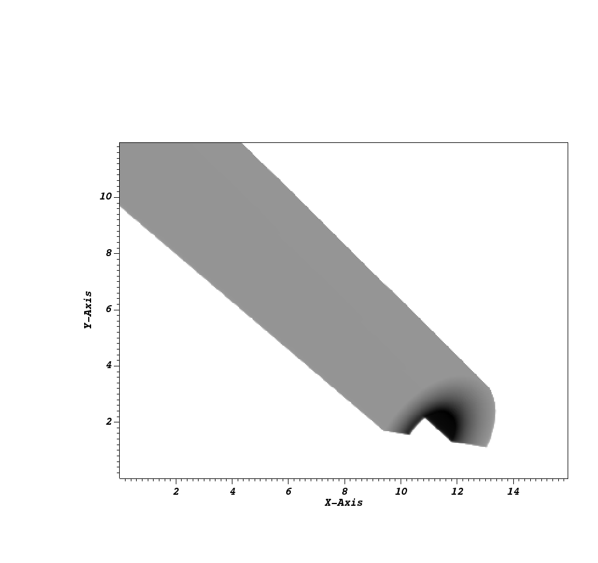
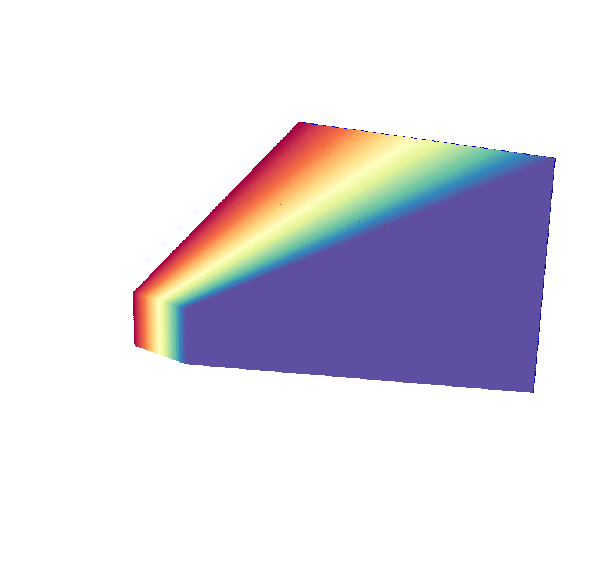
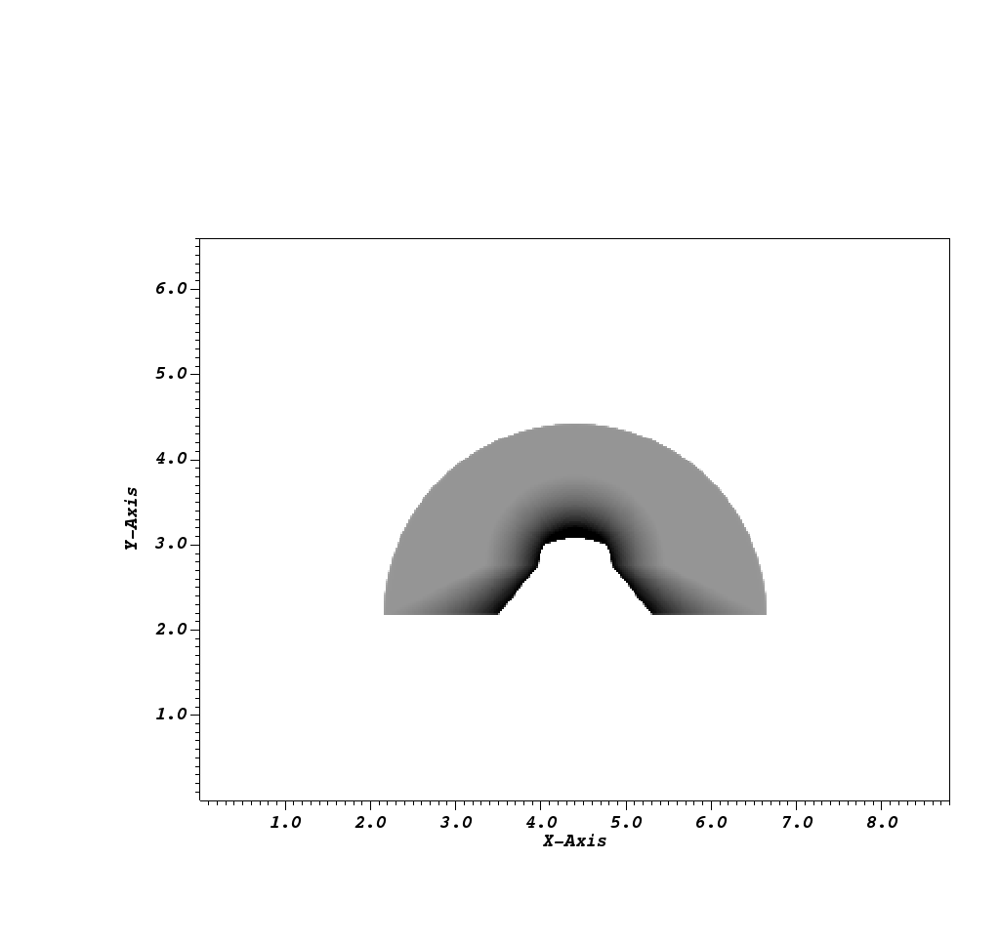
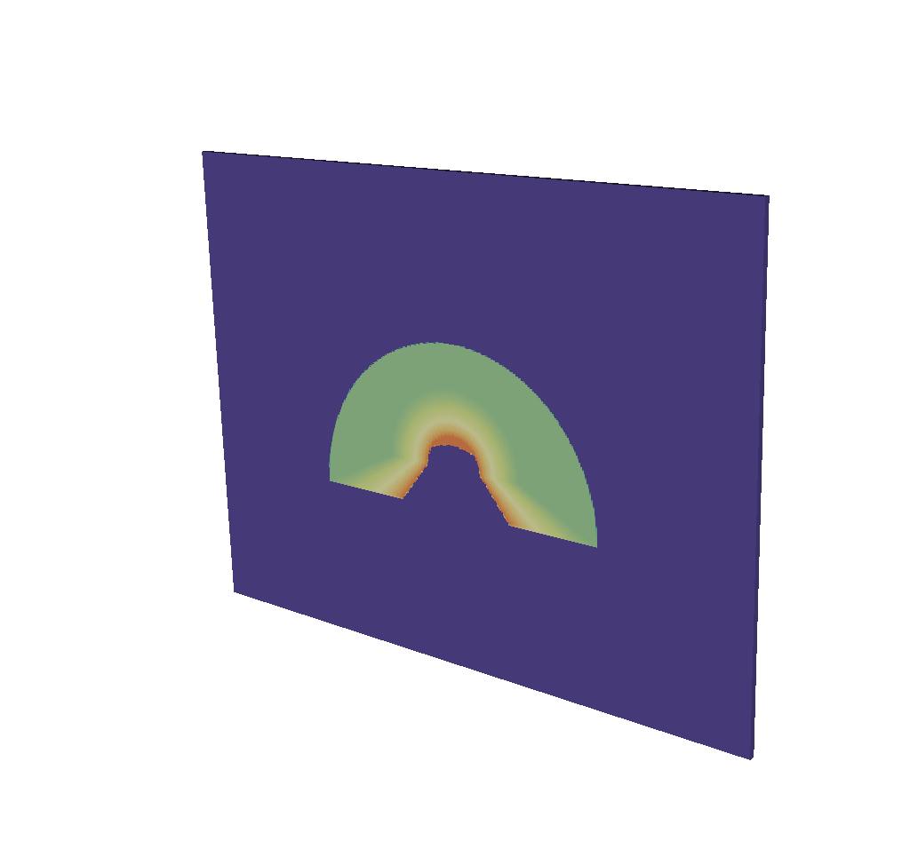
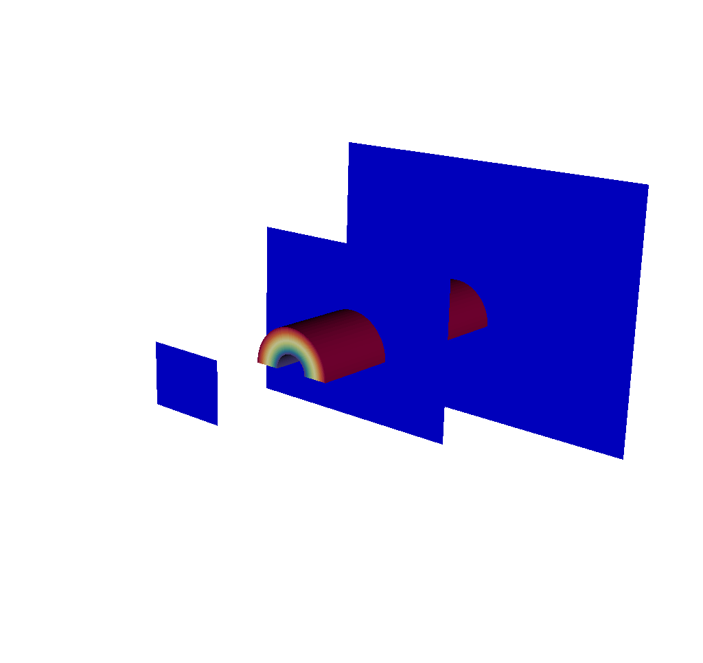

.. _XRayQuery:

.. |br| raw:: html

    

X Ray Image Query
-----------------

.. contents:: :local:

Introduction
~~~~~~~~~~~~

The X Ray Image Query computes the attenuation and self-emission for radiation passing through an object. 
The xray query can be used for EUV radiation and, in some cases, for optical light. 
The attenuation is used when simulating a radiograph (an xray of a broken bone is a radiograph). 
If the object is hot enough, it emits xrays and the self-emission is of interest. 

The query tracks rays through a grid of zone-centered opacities (absorbtivities) and emissivities. 
The absorbtivity and emissivity variables must be zone-centered and can be either scalar variables (special case) or array variables.
The opacity and emissivity in each zone is a function of radiation energy and rays are tracked for all energies. 
The rays are regularly spaced in the image plane and the query generates an image per radiation energy. 

The inputs to the query are usually generated by a computer simulation of the temporal evolution of an object. 
The simulation records the opacity and emissivity at a set of times. 
The images produced by the query can be convolved with the spatial, spectral, and temporal response of an (xray) detector in a post-processing step. 
The simulated data can be compared with data recorded during an experiment to see if the simulation is accurate. 

The query operates on 2D R-Z meshes and 3D meshes. 
In the case of 2D R-Z meshes, the mesh is revolved around the Z-axis and the rays are tracked in 3 dimensions.

The query performs the following integration as it traces the rays through the volume.

.. container:: collapsible

    .. container:: header

        **Show/Hide Code for** XRay Image Query

    .. literalinclude:: ../../../../src/avt/Filters/avtXRayFilter.C
        :language: C++
        :start-after: begin standard integration 
        :end-before: end standard integration

In this code snippet, ``a`` represents the absorbtivity, and ``e`` represents the emissivity.

If the ``divide_emis_by_absorb`` is set, then the following integration is performed.

.. container:: collapsible

    .. container:: header

        **Show/Hide Code for** Absorbtivity-Normalized X Ray Image Query 

    .. literalinclude:: ../../../../src/avt/Filters/avtXRayFilter.C
        :language: C++
        :start-after: begin absorbtivity-normalized integration
        :end-before: end absorbtivity-normalized integration

When the goal of the query is to generate a radiograph, the user supplies a background intensity (using either *background_intensity* or *background_intensities*; see :ref:`Standard_Arguments`) and sets the emissivity arrays to zero. 
The self-emission image produced by the query is then a radiograph. 

When the goal of the query is to generate a self-emission image, the emissivities should be non-zero and a background intensity should not be supplied.

Sometimes the goal of an experiment is to generate a radiograph, but the object is hot enough that self-emission might "wash out" the radiograph. 
In this case, the emissivities should be non-zero and the background intensity should be supplied. 
The background intensity can then be adjusted until the radiograph is not washed out.

Query Arguments
~~~~~~~~~~~~~~~

The query takes a few different kinds of arguments:

.. _Standard_Arguments:

Standard Arguments
""""""""""""""""""

The standard arguments have to do with the query execution, output, debugging, and passing through metadata.

+--------------------------+----------------------------------------------+
| *vars*                   | An array of the names of the absorbtivity    |
|                          | and emissivity variables.                    |
+--------------------------+----------------------------------------------+
| *background_intensity*   | The background intensity if ray tracing      |
|                          | scalar variables. The default is 0.          |
+--------------------------+----------------------------------------------+
| *background_intensities* | The background intensities if ray tracing    |
|                          | array variables. The default is 0.           |
+--------------------------+----------------------------------------------+
| *divide_emis_by_absorb*  | Described above. The default is 0.           |
+--------------------------+----------------------------------------------+
| *image_size*             | The width and height of the image in pixels. |
|                          | The default is 200 x 200.                    |
+--------------------------+----------------------------------------------+
| *debug_ray*              | The ray index for which to output ray        |
|                          | tracing information. The default is |br| -1, |
|                          | which turns it off.                          |
+--------------------------+----------------------------------------------+
| *output_ray_bounds*      | Output the ray bounds as a bounding box in a |
|                          | VTK file. The default is 0 |br| (off). The   |
|                          | name of the file is ``ray_bounds.vtk``.      |
+--------------------------+----------------------------------------------+
| *energy_group_bounds*    | The energy group bounds can be handed off to |
|                          | the query in a list or tuple. |br| The       |
|                          | values will appear in the Spatial Extents    |
|                          | Mesh in the Blueprint output.                |
+--------------------------+----------------------------------------------+

If using the :ref:`Conduit_Output`, many of these arguments will appear in the output in a few different places.
The ``vars`` will show up as ``abs_var_name`` and ``emis_var_name`` under the :ref:`Query_Parameters` section of the :ref:`XRay_Metadata`.
``divide_emis_by_absorb`` shows up under the :ref:`Query_Parameters` section of the :ref:`XRay_Metadata`.
``image_size`` shows up as ``num_x_pixels`` and ``num_y_pixels`` under the :ref:`Query_Parameters` section of the :ref:`XRay_Metadata`.
The ``energy_group_bounds`` appear under the ``spatial_coords`` in the :ref:`Spatial_Extents_Meshes`.

Output Filenames and Directories
++++++++++++++++++++++++++++++++

+------+-------------------+----------------------------------------------+
| *output_dir*             | The output directory. The default is "."     |
+------+-------------------+----------------------------------------------+
| *family_files*           | A flag indicating if the output files should |
|                          | be familied. The default is |br| off. If it  |
|                          | is off then the output file is               |
|                          | ``output.ext``, where ``ext`` is the file    |
|                          | |br| extension. If the file exists it will   |
|                          | overwrite the file. If it is on, then |br|   |
|                          | the output file is ``outputXXXX.ext``,       |
|                          | where ``XXXX`` is chosen                     |
|                          | to be the |br| smallest integer not to       |
|                          | overwrite any existing files. As of VisIt_   |
|                          | 3.4, |br| it is recommended to use           |
|                          | *filename_scheme* in lieu of *family_files*. |
+------+-------------------+----------------------------------------------+
| *filename_scheme*        | The naming convention for output filenames.  |
|                          | This option is available |br| in VisIt_ 3.4, |
|                          | and is meant to replace the *family_files*   |
|                          | option. If both |br| are provided,           |
|                          | *filename_scheme* will be used.              |
+------+-------------------+----------------------------------------------+
|      | "none" or 0       | The default. Output filenames will be of the |
|      |                   | form ``output.ext``, where |br|              |
|      |                   | ``ext`` is the file extension. If the        |
|      |                   | filename already exists, VisIt_ will |br|    |
|      |                   | overwrite it.                                |
+------+-------------------+----------------------------------------------+
|      | "family" or 1     | If on, VisIt_ will attempt to family output  |
|      |                   | files. Output filenames will be |br| of the  | 
|      |                   | form ``output.XXXX.ext``, where ``XXXX`` is  |
|      |                   | chosen to be the smallest |br| integer such  |
|      |                   | that the filename is unique.                 |
+------+-------------------+----------------------------------------------+
|      | "cycle" or 2      | VisIt_ will put cycle information in the     |
|      |                   | filename. Output filenames will be |br| of   |
|      |                   | the form ``output.cycle_XXXXXX.ext``, where  |
|      |                   | ``XXXXXX`` is the cycle number. |br| If      |
|      |                   | another file exists with this name, VisIt_   |
|      |                   | will overwrite it.                           |
+------+-------------------+----------------------------------------------+

.. _Output_Types:

Output Types
++++++++++++

+------+-------------------+----------------------------------------------+
| *output_type*            | The format of the image. The default is PNG. |
+------+-------------------+----------------------------------------------+
|      | "bmp" or 0        | BMP image format. This is deprecated as of   |
|      |                   | VisIt_ 3.4.                                  |
+------+-------------------+----------------------------------------------+
|      | "jpeg" or 0 |br|  | JPEG image format.                           |
|      | (1 prior to       |                                              |
|      | VisIt_ 3.4)       |                                              |
+------+-------------------+----------------------------------------------+
|      | "png" or 1 |br|   | PNG image format.                            |
|      | (2 prior to       |                                              |
|      | VisIt_ 3.4)       |                                              |
+------+-------------------+----------------------------------------------+
|      | "tif" or 2 |br|   | TIFF image format.                           |
|      | (3 prior to       |                                              |
|      | VisIt_ 3.4)       |                                              |
+------+-------------------+----------------------------------------------+
|      | "rawfloats" or 3  | File of 32 or 64 bit floating point values   |
|      | |br| (4 prior to  | in IEEE format.                              |
|      | VisIt_ 3.4)       |                                              |
+------+-------------------+----------------------------------------------+
|      | "bov" or 4 |br|   | BOV (Brick Of Values) format, which consists |
|      | (5 prior to       | of a text header |br| file describing a      |
|      | VisIt_ 3.4)       | rawfloats file.                              |
+------+-------------------+----------------------------------------------+
|      | "json" or 5 |br|  | Conduit JSON output.                         |
|      | (6 prior to       |                                              |
|      | VisIt_ 3.4)       |                                              |
+------+-------------------+----------------------------------------------+
|      | "hdf5" or 6 |br|  | Conduit HDF5 output.                         |
|      | (7 prior to       |                                              |
|      | VisIt_ 3.4)       |                                              |
+------+-------------------+----------------------------------------------+
|      | "yaml" or 7 |br|  | Conduit YAML output.                         |
|      | (8 prior to       |                                              |
|      | VisIt_ 3.4)       |                                              |
+------+-------------------+----------------------------------------------+

When specifying "bov" or "rawfloats" output, the value can be either 32 or 64 bit floating point values.
The number of bits is determined by the number of bits in the data being processed.

When specifying "bov" output, 2 files are created for each variable.
One contains the ``intensity`` and the other the ``path_length``.
The files are named ``output.XX.bof`` and ``output.XX.bov`` with ``XX`` being a sequence number.
The ``intensity`` variables are first followed by the ``path_length`` variables in the sequence.
For example, if the input array variables were composed of 2 scalar variables, the files would be named as follows:

* output.00.bof
* output.00.bov - ``intensity`` from the first variable of the array variable.
* output.01.bof
* output.01.bov - ``intensity`` from the second variable of the array variable.
* output.02.bof
* output.02.bov - ``path_length`` from the first variable of the array variable.
* output.03.bof
* output.03.bov - ``path_length`` from the second variable of the array variable.

The Conduit output types provide a plethora of extra features; to learn more see :ref:`Conduit_Output`.

.. _XRay_Units:

Units
+++++

Units of various quantities can be passed through the query.
None of these values are used in any calculations the query does to arrive at its output; all are optional.
These units appear in the :ref:`Conduit_Output` in a few different places.

+--------------------------+----------------------------------------------+
| *spatial_units*          | The units of the simulation in the x and y   |
|                          | dimensions.                                  |
+--------------------------+----------------------------------------------+
| *energy_units*           | The units of the simulation in the z         |
|                          | dimension.                                   |
+--------------------------+----------------------------------------------+
| *abs_units*              | The units of the absorbtivity variable       |
|                          | passed to the query.                         |
+--------------------------+----------------------------------------------+
| *emis_units*             | The units of the emissivity variable         |
|                          | passed to the query.                         |
+--------------------------+----------------------------------------------+
| *intensity_units*        | The units of the intensity output.           |
+--------------------------+----------------------------------------------+
| *path_length_info*       | Metadata describing the path length output.  |
+--------------------------+----------------------------------------------+

The ``spatial_units`` and ``energy_units`` appear in the :ref:`Spatial_Extents_Meshes`.
The ``abs_units`` and the ``emis_units`` appear in the :ref:`Query_Parameters` section of the :ref:`XRay_Metadata`.
The ``intensity_units`` and the ``path_length_info`` appear in the :ref:`Basic_Mesh_Output` under the fields.

.. _Camera_Specification:

Camera Specification
""""""""""""""""""""

The query also takes arguments that specify the orientation of the camera in 3 dimensions. 
This can take 2 forms. 
The first is a simplified specification that gives limited control over the camera and the second is a complete specification that matches the 3D image viewing parameters. 

.. _Simplified_Camera_Specification:

Simplified Camera Specification
+++++++++++++++++++++++++++++++

The simplified version consists of:

+--------------+----------------------------------------------------------+
| *width*      | The width of the image in physical space. The default is |
|              | 1.0.                                                     |
+--------------+----------------------------------------------------------+
| *height*     | The height of the image in physical space. The default   |
|              | is 1.0.                                                  |
+--------------+----------------------------------------------------------+
| *origin*     | The point in 3D corresponding to the center of the       |
|              | image.                                                   |
+--------------+----------------------------------------------------------+
| *theta* |br| | The orientation angles. The default is 0. 0. and is      |
| *phi*        | looking down the Z axis. Theta |br| moves around the     |
|              | Y axis toward the X axis. Phi moves around the Z axis.   |
|              | When |br| looking at an R-Z mesh, phi has no effect      |
|              | because of symmetry.                                     |
+--------------+----------------------------------------------------------+
| *up_vector*  | The up vector.                                           |
+--------------+----------------------------------------------------------+

*If any of the above properties are specified in the parameters, the query will use the simplified version.*

During execution, the simplified camera specification parameters are converted to the complete ones.

.. _Complete_Camera_Specification:

Complete Camera Specification
+++++++++++++++++++++++++++++

The complete version consists of:

+------------------+------------------------------------------------------+
| *normal*         | The view normal. The default is (0., 0., 1.).        |
+------------------+------------------------------------------------------+
| *focus*          | The focal point. The default is (0., 0., 0.).        |
+------------------+------------------------------------------------------+
| *view_up*        | The up vector. The default is (0., 1., 0.).          |
+------------------+------------------------------------------------------+
| *view_angle*     | The view angle. The default is 30. This is only used |
|                  | if perspective |br| projection is enabled.           |
+------------------+------------------------------------------------------+
| *parallel_scale* | The parallel scale, or view height. The default is   |
|                  | 0.5.                                                 |
+------------------+------------------------------------------------------+
| *near_plane*     | The near clipping plane. The default is -0.5.        |
+------------------+------------------------------------------------------+
| *far_plane*      | The far clipping plane. The default is 0.5.          |
+------------------+------------------------------------------------------+
| *image_pan*      | The image pan in the X and Y directions. The default |
|                  | is (0., 0.).                                         |
+------------------+------------------------------------------------------+
| *image_zoom*     | The absolute image zoom factor. The default is 1.    |
|                  | A value of 2. zooms the |br| image closer by scaling |
|                  | the image by a factor of 2 in the X and Y            |
|                  | directions. |br| A value of 0.5 zooms the image      |
|                  | further away by scaling the image by a factor |br|   |
|                  | of 0.5 in the X and Y directions.                    |
+------------------+------------------------------------------------------+
| *perspective*    | Flag indicating if doing a parallel or perspective   |
|                  | projection. |br| 0 indicates parallel projection.    |
|                  | 1 indicates perspective projection.                  |
+------------------+------------------------------------------------------+

When a Conduit Blueprint output type is specified, these parameters will appear in the metadata.
See :ref:`View_Parameters` for more information.

Calling the Query
"""""""""""""""""

There are a couple ways to call the X Ray Image Query, with their own nuances.

The first is the old style argument passing:

::

   Query("XRay Image", 
      output_type, 
      output_dir, 
      divide_emis_by_absorb, 
      origin_x,
      origin_y,
      origin_z,
      theta, 
      phi, 
      width, 
      height, 
      image_size_x, 
      image_size_y, 
      vars)

   # An example
   Query("XRay Image", "hdf5", ".", 1, 0.0, 2.5, 10.0, 0, 0, 10., 10., 400, 300, ("d", "p"))

This way of calling the query makes use of the :ref:`Simplified_Camera_Specification`.

It is recommended to instead use the standard way of calling the query, using a dictionary to store the arguments.
Here is an example:

::

   params = dict()
   params["image_size"] = (400, 300)
   params["output_type"] = "hdf5"
   params["focus"] = (0., 2.5, 10.)
   params["perspective"] = 1
   params["near_plane"] = -25.
   params["far_plane"] = 25.
   params["vars"] = ("d", "p")
   params["parallel_scale"] = 10.
   Query("XRay Image", params)

Of course, one could use this to set up the parameters instead:

::

   params = GetQueryParameters("XRay Image")

However, this will force the :ref:`Simplified_Camera_Specification` to be used, since it includes default arguments for *all* of the various arguments, and if *any* of the :ref:`Simplified_Camera_Specification` arguments are present, they will override those of the :ref:`Complete_Camera_Specification`.

Examples
~~~~~~~~

Let's look at some examples, starting with some simulated x rays using
curv2d.silo, which contains a 2D R-Z mesh. Here is a pseudocolor plot
of the data.

.. figure:: images/xray00.png

   The 2D R-Z data.

Now we will show the Python code to generate a simulated x ray looking
down the Z Axis and the resulting image. ::

  params = GetQueryParameters("XRay Image")
  params['image_size'] = (300, 300)
  params['divide_emis_by_absorb'] = 1
  params['width'] = 10.
  params['height'] = 10.
  params['vars'] = ("d", "p")
  Query("XRay Image", params)

.. figure:: images/xray01.png

   The resulting x ray image.

Here is the Python code to generate the same image but looking at it
from the side. ::

  params = GetQueryParameters("XRay Image")
  params['image_size'] = (300, 300)
  params['divide_emis_by_absorb'] = 1
  params['width'] = 10.
  params['height'] = 10.
  params['theta'] = 90.
  params['phi'] = 0.
  params['vars'] = ("d", "p")
  Query("XRay Image", params)

.. figure:: images/xray02.png

   The resulting x ray image.

Here is the same Python code with the addition of an origin that
moves the image down and to the right by 1. ::

  params = GetQueryParameters("XRay Image")
  params['image_size'] = (300, 300)
  params['divide_emis_by_absorb'] = 1
  params['width'] = 10.
  params['height'] = 10.
  params['theta'] = 90.
  params['phi'] = 0.
  params['origin'] = (0., 1., 1.)
  params['vars'] = ("d", "p")
  Query("XRay Image", params)

.. figure:: images/xray03.png

   The resulting x ray image.

Now we will switch to a 3D example using globe.silo. Globe.silo is an
unstructured mesh consisting of tetrahedra, pyramids, prisms and hexahedra
forming a globe. Here is an image of the tetrahedra at the center of
the globe that form 2 cones.

   The tetrahedra at the center of the globe.

Here is the Python code for generating an x ray image from the same
orientation. Note that we have defined some expressions so that the
x ray image shows some variation. ::

  DefineScalarExpression("u1", 'recenter(((u+10.)*0.01), "zonal")')
  DefineScalarExpression("v1", 'recenter(((v+10.)*0.01*matvf(mat1,1)), "zonal")')
  DefineScalarExpression("v2", 'recenter(((v+10.)*0.01*matvf(mat1,2)), "zonal")')
  DefineScalarExpression("v3", 'recenter(((v+10.)*0.01*matvf(mat1,3)), "zonal")')
  DefineScalarExpression("v4", 'recenter(((v+10.)*0.01*matvf(mat1,4)), "zonal")')
  DefineScalarExpression("w1", 'recenter(((w+10.)*0.01), "zonal")')

  params = GetQueryParameters("XRay Image")
  params['image_size'] = (300, 300)
  params['divide_emis_by_absorb'] = 1
  params['width'] = 4.
  params['height'] = 4.
  params['theta'] = 90.
  params['phi'] = 0.
  params['vars'] = ("w1", "v1")
  Query("XRay Image", params)

.. figure:: images/xray05.png

   The resulting x ray image.

Now we will look at the pyramids in the center of the globe.

.. figure:: images/xray06.png

   The pyramids at the center of the globe.

Here is the Python code for generating an x ray image from the same
orientation using the full view specification. The view specification
was merely copied from the 3D tab on the View window. Note that we
have created the dictionary from scratch, rather than starting with
the default ones. This is necessary to use the full view specification. ::

  params = dict(output_type="png")
  params['image_size'] = (300, 300)
  params['divide_emis_by_absorb'] = 1
  params['focus'] = (0., 0., 0.)
  params['view_up'] = (-0.0651, 0.775, 0.628)
  params['normal'] = (-0.840, -0.383, 0.385)
  params['view_angle'] = 30.
  params['parallel_scale'] = 17.3205
  params['near_plane'] = -34.641
  params['far_plane'] = 34.641
  params['image_pan'] = (0., 0.)
  params['image_zoom'] = 8
  params['perspective'] = 0
  params['vars'] = ("w1", "v2")
  Query("XRay Image", params)

.. figure:: images/xray07.png

   The resulting x ray image.

The next example illustrates use of one of the :ref:`Conduit_Output` types.

::

   # A test file
   OpenDatabase("testdata/silo_hdf5_test_data/curv3d.silo")

   AddPlot("Pseudocolor", "d")
   DrawPlots()

.. figure:: images/xray_examples_bp1.png

   Our input mesh.

We call the query as usual, although there are a few extra arguments we can provide that are used for generating the Conduit output in particular.

::

   params = dict()
   params["image_size"] = (400, 300)
   params["output_type"] = "hdf5"
   params["focus"] = (0., 2.5, 10.)
   params["perspective"] = 1
   params["near_plane"] = -25.
   params["far_plane"] = 25.
   params["vars"] = ("d", "p")
   params["parallel_scale"] = 10.

   # ENERGY GROUP BOUNDS
   params["energy_group_bounds"] = [2.7, 6.2]

   # UNITS
   params["spatial_units"] = "cm"
   params["energy_units"] = "kev"
   params["abs_units"] = "cm^2/g"
   params["emis_units"] = "GJ/cm^2/ster/ns/keV"
   params["intensity_units"] = "intensity units"
   params["path_length_info"] = "transmission"
   
   Query("XRay Image", params)

To look at the raw data from the query, we run this code:

::

   import conduit
   xrayout = conduit.Node()

   conduit.relay.io.blueprint.load_mesh(xrayout, "output.root")

   print(xrayout["domain_000000"])

This yields the following data overview.
See :ref:`Introspecting_with_Python` for a deeper dive into viewing and extracting the raw data from the :ref:`Conduit_Output`.

TODO

::

   state: 
     time: 4.8
     cycle: 48
     xray_view: 
       normal: 
         x: 0.0
         y: 0.0
         z: 1.0
       focus: 
         x: 0.0
         y: 2.5
         z: 10.0
       view_up: 
         x: 0.0
         y: 1.0
         z: 0.0
       view_angle: 30.0
       ... ( skipped 4 children )
       image_zoom: 1.0
       perspective: 1
       perspective_str: "perspective"
     xray_query: 
       divide_emis_by_absorb: 0
       divide_emis_by_absorb_str: "no"
       num_x_pixels: 400
       num_y_pixels: 300
       ... ( skipped 2 children )
       emis_var_name: "p"
       abs_units: "abs units"
       emis_units: "emis units"
     xray_data: 
       detector_width: 8.80338743415454
       detector_height: 6.60254037884486
       intensity_max: 0.491446971893311
       intensity_min: 0.0
       path_length_max: 129.857009887695
       path_length_min: 0.0
       image_topo_order_of_domain_variables: "xyz"
     domain_id: 0
   coordsets: 
     image_coords: 
       type: "rectilinear"
       values: 
         x: [0, 1, 2, ..., 399, 400]
         y: [0, 1, 2, ..., 299, 300]
         z: [0, 1]
       labels: 
         x: "width"
         y: "height"
         z: "energy_group"
       units: 
         x: "pixels"
         y: "pixels"
         z: "bins"
     spatial_coords: 
       type: "rectilinear"
       values: 
         x: [0.0, 0.0220084685853863, 0.0440169371707727, ..., 8.78137896556915, 8.80338743415454]
         y: [0.0, 0.0220084679294829, 0.0440169358589658, ..., 6.58053191091538, 6.60254037884486]
         z: [2.7, 6.2]
       units: 
         x: "cm"
         y: "cm"
         z: "kev"
       labels: 
         x: "width"
         y: "height"
         z: "energy_group"
     spatial_energy_reduced_coords: 
       type: "rectilinear"
       values: 
         x: [0.0, 0.0220084685853863, 0.0440169371707727, ..., 8.78137896556915, 8.80338743415454]
         y: [0.0, 0.0220084679294829, 0.0440169358589658, ..., 6.58053191091538, 6.60254037884486]
       labels: 
         x: "width"
         y: "height"
       units: 
         x: "cm"
         y: "cm"
     near_plane_coords: 
       type: "explicit"
       values: 
         x: [4.40169371707727, -4.40169371707727, -4.40169371707727, 4.40169371707727]
         y: [-0.801270189422432, -0.801270189422432, 5.80127018942243, 5.80127018942243]
         z: [-15.0, -15.0, -15.0, -15.0]
     ... ( skipped 1 child )
     far_plane_coords: 
       type: "explicit"
       values: 
         x: [22.264973744318, -22.264973744318, -22.264973744318, 22.264973744318]
         y: [-14.1987298105776, -14.1987298105776, 19.1987298105776, 19.1987298105776]
         z: [35.0, 35.0, 35.0, 35.0]
     ray_corners_coords: 
       type: "explicit"
       values: 
         x: [4.40169371707727, 22.264973744318, -4.40169371707727, ..., 4.40169371707727, 22.264973744318]
         y: [-0.801270189422432, -14.1987298105776, -0.801270189422432, ..., 5.80127018942243, 19.1987298105776]
         z: [-15.0, 35.0, -15.0, ..., -15.0, 35.0]
     ray_coords: 
       type: "explicit"
       values: 
         x: [-4.39068948278457, -4.39068948278457, -4.39068948278457, ..., 22.2093113099572, 22.2093113099572]
         y: [-0.790265955457691, -0.768257487528208, -0.746249019598725, ..., 19.0317425124718, 19.1430673778756]
         z: [-15.0, -15.0, -15.0, ..., 35.0, 35.0]
   topologies: 
     image_topo: 
       coordset: "image_coords"
       type: "rectilinear"
     spatial_topo: 
       coordset: "spatial_coords"
       type: "rectilinear"
     spatial_energy_reduced_topo: 
       coordset: "spatial_energy_reduced_coords"
       type: "rectilinear"
     near_plane_topo: 
       type: "unstructured"
       coordset: "near_plane_coords"
       elements: 
         shape: "quad"
         connectivity: [0, 1, 2, 3]
     ... ( skipped 1 child )
     far_plane_topo: 
       type: "unstructured"
       coordset: "far_plane_coords"
       elements: 
         shape: "quad"
         connectivity: [0, 1, 2, 3]
     ray_corners_topo: 
       type: "unstructured"
       coordset: "ray_corners_coords"
       elements: 
         shape: "line"
         connectivity: [0, 1, 2, ..., 6, 7]
     ray_topo: 
       type: "unstructured"
       coordset: "ray_coords"
       elements: 
         shape: "line"
         connectivity: [0, 120000, 1, ..., 119999, 239999]
   fields: 
     intensities: 
       topology: "image_topo"
       association: "element"
       units: "intensity units"
       values: [0.0, 0.0, 0.0, ..., 0.0, 0.0]
       strides: [1, 400, 120000]
     path_length: 
       topology: "image_topo"
       association: "element"
       units: "path length metadata"
       values: [0.0, 0.0, 0.0, ..., 0.0, 0.0]
       strides: [1, 400, 120000]
     intensities_spatial: 
       topology: "spatial_topo"
       association: "element"
       units: "intensity units"
       values: [0.0, 0.0, 0.0, ..., 0.0, 0.0]
       strides: [1, 400, 120000]
     path_length_spatial: 
       topology: "spatial_topo"
       association: "element"
       units: "path length metadata"
       values: [0.0, 0.0, 0.0, ..., 0.0, 0.0]
       strides: [1, 400, 120000]
     ... ( skipped 4 children )
     far_plane_field: 
       topology: "far_plane_topo"
       association: "element"
       volume_dependent: "false"
       values: 0.0
     ray_corners_field: 
       topology: "ray_corners_topo"
       association: "element"
       volume_dependent: "false"
       values: [0.0, 0.0, 0.0, 0.0]
     ray_field: 
       topology: "ray_topo"
       association: "element"
       volume_dependent: "false"
       values: [0.0, 1.0, 2.0, ..., 119998.0, 119999.0]

The next thing we may want to do is to visualize an x ray image using VisIt_.
The :ref:`Visualizing_with_VisIt` section goes into more detail on this subject, so for now we will only visualize the :ref:`Basic_Mesh_Output`.

::

   # Have VisIt open the Conduit output from the query
   OpenDatabase("output.root")
   
   # Give ourselves a clean slate for ensuing visualizations
   DeleteAllPlots()

   # Add a pseudocolor plot of the intensities
   AddPlot("Pseudocolor", "mesh_image_topo/intensities")
   DrawPlots()

   # Change the color table to be xray
   PseudocolorAtts = PseudocolorAttributes()
   PseudocolorAtts.colorTableName = "xray"
   SetPlotOptions(PseudocolorAtts)

Running this code yields the following image:

.. figure:: images/xray_examples_bp2.png

   The resulting x ray image, visualized using VisIt.

.. _Conduit_Output:

Conduit Output
~~~~~~~~~~~~~~

The `Conduit <https://llnl-conduit.readthedocs.io/en/latest/>`_ output types (see :ref:`Output_Types` for more information) provide advantages over the other output types and include additional metadata and topologies.
These output types were added in VisIt_ 3.3.0, and many of the features discussed here have been added since then.

Why Conduit Output?
"""""""""""""""""""

Conduit `Blueprint <https://llnl-conduit.readthedocs.io/en/latest/blueprint.html>`_ output types were added to the X Ray Image Query primarily to facilitate usability and convenience.
Before Conduit Blueprint formats were available as output types, the X Ray Image Query would often produce large numbers of output files, particularly when using the bov or rawfloats output type, which was a popular choice because it provided the raw data.
Alternatively, users could choose one of the image file output types to generate a picture or pictures.
Conduit Blueprint provides the best of both worlds.
Everything is stored in one file, and all of the raw data can be accessed via :ref:`Introspecting_with_Python`.
Additionally, it is simple to generate an image, as the Blueprint output can be read back in to VisIt and visualized (see :ref:`Visualizing_with_VisIt`).

   An input mesh.

   The resulting x ray image from Conduit Blueprint output, visualized by plotting with VisIt.

We have opted to enrich the Blueprint output (see :ref:`Basic_Mesh_Output`) with extensive metadata (see :ref:`XRay_Metadata`) as well as additional meshes (see :ref:`Imaging_Planes_and_Rays_Meshes`, :ref:`Spatial_Extents_Meshes`, and :ref:`1D_Spectra_Curves`) to provide extra context and information to the user. 
These additions should make it easier to troubleshoot unexpected results, make sense of the query output, and pass important information through the query.
Blueprint makes it simple to put all of this information into one file, and just as simple to read that information back out and/or visualize.

One of the main reasons for adding the Conduit output was to make it far easier to troubleshoot strange query results.
See the :ref:`XRay_Troubleshooting` section to learn what kinds of questions the Conduit output can be used to answer.

.. _Overview_of_Output:

Overview of Output
""""""""""""""""""

So what is actually in the `Blueprint <https://llnl-conduit.readthedocs.io/en/latest/blueprint.html>`_ output?
The Blueprint output provides multiple Blueprint meshes, which are each in turn comprised of a coordinate set, a topology, and fields.
These all live within a Conduit tree, along with metadata.
Using Conduit allows us to package everything in one place for ease of use.

Here is a simplified representation of a Conduit tree that is output from the Query: 

::

  state: 
    time: 4.8
    cycle: 48
    xray_view: 
      ...
    xray_query: 
      ...
    xray_data: 
      ...
    domain_id: 0
  coordsets: 
    image_coords: 
      ...
    spatial_coords: 
      ...
    spatial_energy_reduced_coords: 
      ...
    spectra_coords: 
      ...
    near_plane_coords: 
      ...
    view_plane_coords: 
      ...
    far_plane_coords: 
      ...
    ray_corners_coords: 
      ...
    ray_coords: 
      ...
  topologies: 
    image_topo: 
      ...
    spatial_topo:
      ...
    spatial_energy_reduced_topo: 
      ...
    spectra_topo: 
      ...
    near_plane_topo: 
      ...
    view_plane_topo: 
      ...
    far_plane_topo: 
      ...
    ray_corners_topo: 
      ...
    ray_topo: 
      ...
  fields: 
    intensities: 
      ...
    path_length: 
      ...
    intensities_spatial: 
      ...
    path_length_spatial: 
      ...
    intensities_spatial_energy_reduced: 
      ...
    path_length_spatial_energy_reduced: 
      ...
    intensities_spectra: 
      ...
    path_length_spectra: 
      ...
    near_plane_field: 
      ...
    view_plane_field: 
      ...
    far_plane_field: 
      ...
    ray_corners_field: 
      ...
    ray_field: 
      ...

There are multiple Blueprint meshes stored in this tree, as well as extensive metadata.
Each piece of the Conduit output will be covered in more detail in ensuing parts of the documentation.
To learn more about what lives under the ``state`` branch, see the :ref:`XRay_Metadata` section.
To learn more about the coordinate sets, topologies, and fields, see the :ref:`Basic_Mesh_Output`, :ref:`Imaging_Planes_and_Rays_Meshes`, :ref:`Spatial_Extents_Meshes`, and :ref:`1D_Spectra_Curves` sections.

.. _Basic_Mesh_Output:

Basic Mesh Output
"""""""""""""""""

LEFT_OFF_HERE

The most important piece of the Blueprint output is the actual query result.
We have taken the image data that comes out of the query and packaged it into a single Blueprint mesh.

   The basic mesh output visualized using VisIt.

The following is the example from :ref:`Overview_of_Output`, but with the Blueprint mesh representing the query result fully realized: 

::

  state: 
    time: 4.8
    cycle: 48
    xray_view: 
      ...
    xray_query: 
      ...
    xray_data: 
      ...
    domain_id: 0
  coordsets: 
    image_coords: 
      type: "rectilinear"
      values: 
        x: [0, 1, 2, ..., 399, 400]
        y: [0, 1, 2, ..., 299, 300]
        z: [0, 1]
      labels: 
        x: "width"
        y: "height"
        z: "energy_group"
      units: 
        x: "pixels"
        y: "pixels"
        z: "bins"
    spatial_coords: 
      ...
    spatial_energy_reduced_coords: 
      ...
    spectra_coords: 
      ...
    near_plane_coords: 
      ...
    view_plane_coords: 
      ...
    far_plane_coords: 
      ...
    ray_corners_coords: 
      ...
    ray_coords: 
      ...
  topologies: 
    image_topo: 
      coordset: "image_coords"
      type: "rectilinear"
    spatial_topo: 
      ...
    spatial_energy_reduced_topo: 
      ...
    spectra_topo: 
      ...
    near_plane_topo: 
      ...
    view_plane_topo: 
      ...
    far_plane_topo: 
      ...
    ray_corners_topo: 
      ...
    ray_topo: 
      ...
  fields: 
    intensities: 
      topology: "image_topo"
      association: "element"
      units: "intensity units"
      values: [0.281004697084427, 0.281836241483688, 0.282898783683777, ..., 0.0, 0.0]
      strides: [1, 400, 120000]
    path_length: 
      topology: "image_topo"
      association: "element"
      units: "path length metadata"
      values: [2.46405696868896, 2.45119333267212, 2.43822622299194, ..., 0.0, 0.0]
      strides: [1, 400, 120000]
    intensities_spatial: 
      ...
    path_length_spatial: 
      ...
    intensities_spatial_energy_reduced: 
      ...
    path_length_spatial_energy_reduced: 
      ...
    intensities_spectra: 
      ...
    path_length_spectra: 
      ...
    near_plane_field: 
      ...
    view_plane_field: 
      ...
    far_plane_field: 
      ...
    ray_corners_field: 
      ...
    ray_field: 
      ...

The 3 constituent parts of the Blueprint mesh output are the coordinate set, ``image_coords``, the topology, ``image_topo``, and the fields, ``intensities`` and ``path_length``.

The ``image_coords`` represent the x and y coordinates of the 2D image, and the z dimension represents the energy group bounds.
In the case of multiple energy groups, previously, the query would have output multiple images, one for each pair of energy group bounds.
In the Blueprint output, this is simplified; rather than outputting multiple files, each containing one image, we have opted to "stack" the resulting images on top of one another.
This is why the Blueprint output is a 3D mesh; this way, it can account for multiple energy groups, and place resulting images one on top of another.
Also included in the ``image_coords`` are labels and units for disambiguation purposes.

The ``image_topo`` exists to tell Blueprint that the ``image_coords`` can be viewed as a topology.

The fields, ``intensities`` and ``path_length``, can be thought of as containers for the actual image data.
Each also includes units.
For path length, the ``units`` entry is just a way of including metadata or information about the path length, since path length is unitless.

To visualize this mesh with VisIt, see :ref:`Visualizing_with_VisIt`.

.. _XRay_Metadata:

Metadata
""""""""

The Conduit output types (see :ref:`Output_Types` for more information) come packaged with metadata in addition to Blueprint-conforming mesh data.
The ability to send this metadata alongside the output mesh (and other data) is one of the advantages of using Conduit for outputs from the query.
We hope this metadata helps to make it clear exactly what the query is doing, what information it has available to it, and what the output might look like.
To extract the metadata from the Blueprint output, see :ref:`Introspecting_with_Python`.

Metadata is stored under the ``state`` Node in the resulting Conduit tree.
See the example below, which is taken from the example in :ref:`Overview_of_Output`, but this time with only the metadata fully realized: 

::

  state: 
    time: 4.8
    cycle: 48
    xray_view: 
      normal: 
        x: 0.0
        y: 0.0
        z: 1.0
      focus: 
        x: 0.0
        y: 2.5
        z: 10.0
      view_up: 
        x: 0.0
        y: 1.0
        z: 0.0
      view_angle: 30.0
      parallel_scale: 5.0
      near_plane: -50.0
      far_plane: 50.0
      image_pan: 
        x: 0.0
        y: 0.0
      image_zoom: 1.0
      perspective: 1
      perspective_str: "perspective"
    xray_query: 
      divide_emis_by_absorb: 0
      divide_emis_by_absorb_str: "no"
      num_x_pixels: 400
      num_y_pixels: 300
      num_bins: 1
      abs_var_name: "d"
      emis_var_name: "p"
      abs_units: "cm^2/g"
      emis_units: "GJ/cm^2/ster/ns/keV"
    xray_data: 
      detector_width: 22.3932263237838
      detector_height: 16.7949192423103
      intensity_max: 0.491446971893311
      intensity_min: 0.0
      path_length_max: 120.815788269043
      path_length_min: 0.0
      image_topo_order_of_domain_variables: "xyz"
    domain_id: 0
  coordsets: 
    ...
  topologies: 
    ...
  fields: 
    ...

There are three top-level items: ``time``, ``cycle``, and ``domain_id``.
The fact that the ``domain_id`` is present is a side effect of Conduit; all of the output data is single domain and this value has nothing to do with the query.
In addition to the top level items, there are three categories of metadata: :ref:`View_Parameters`, :ref:`Query_Parameters`, and :ref:`Other_Metadata`.
The following subsections discuss each of these categories in more detail.

.. _View_Parameters:

View Parameters
+++++++++++++++

View parameters can be found under "state/xray_view".
This metadata represents the view-related values that were used in the x ray image query calculations.
Remember from the section on :ref:`Camera_Specification` options that if the :ref:`Simplified_Camera_Specification` is used, the parameters are converted to the :ref:`Complete_Camera_Specification` during execution.
Hence the values output here correspond to those in the :ref:`Complete_Camera_Specification`, as these are the values that were actually used by the query when calculating results.
The following is included:

+--------------------------+----------------------------------------------+
| *normal*                 | The x, y, and z components represent the     |
|                          | view normal vector |br| that was used in     |
|                          | the calculations.                            |
+--------------------------+----------------------------------------------+
| *focus*                  | The x, y, and z components represent the     |
|                          | focal point that was |br| used in the        |
|                          | calculations.                                |    
+--------------------------+----------------------------------------------+
| *view_up*                | The x, y, and z components represent the up  |
|                          | vector that was |br| used in the             |
|                          | calculations.                                |
+--------------------------+----------------------------------------------+
| *view_angle*             | The view angle, only used in the             |
|                          | calculations if |br| perspective             |
|                          | projection was enabled.                      |
+--------------------------+----------------------------------------------+
| *parallel_scale*         | The parallel scale, or view height, that was |
|                          | used in the |br| calculations.               |
+--------------------------+----------------------------------------------+
| *near_plane*             | The near plane that was used in the          |
|                          | calculations.                                |
+--------------------------+----------------------------------------------+
| *far_plane*              | The far plane that was used in the           |
|                          | calculations.                                |
+--------------------------+----------------------------------------------+
| *image_pan*              | The x and y components represent the image   |
|                          | pan that was used |br| in the calculations.  |
+--------------------------+----------------------------------------------+
| *image_zoom*             | The absolute image zoom factor that was used |
|                          | in the calculations.                         |
+--------------------------+----------------------------------------------+
| *perspective*            | A flag indicating if parallel or perspective |
|                          | projection was used. |br| 0 indicates        |
|                          | parallel projection and 1 indicates          |
|                          | perspective |br| projection.                 |
+--------------------------+----------------------------------------------+
| *perspective_str*        | A String representation of the perspective   |
|                          | parameter. See above |br| for more           |
|                          | information.                                 |
+--------------------------+----------------------------------------------+

An example: ::

  xray_view: 
    normal: 
      x: 0.0
      y: 0.0
      z: 1.0
    focus: 
      x: 0.0
      y: 2.5
      z: 10.0
    view_up: 
      x: 0.0
      y: 1.0
      z: 0.0
    view_angle: 30.0
    parallel_scale: 5.0
    near_plane: -50.0
    far_plane: 50.0
    image_pan: 
      x: 0.0
      y: 0.0
    image_zoom: 1.0
    perspective: 1
    perspective_str: "perspective"

To extract this metadata from the Blueprint output, see :ref:`Introspecting_with_Python`.

.. _Query_Parameters:

Query Parameters
++++++++++++++++

Query parameters can be found under "state/xray_query".
This metadata represents the query-related values that were used in the x ray image query calculations.
This data is available as of VisIt_ 3.3.2.
The following is included:

+-----------------------------+----------------------------------------------+
| *divide_emis_by_absorb*     | A flag indicating if emissivity was divided  |
|                             | by absorbtivity |br| in the calculations.    |
|                             | More details can be found above.             |
+-----------------------------+----------------------------------------------+
| *divide_emis_by_absorb_str* | A String representation of the               |
|                             | divide_emis_by_absorb parameter. |br| See    |
|                             | above for more information.                  |
+-----------------------------+----------------------------------------------+
| *num_x_pixels*              | The pixel extent in the X dimension in the   |
|                             | output image.                                |
+-----------------------------+----------------------------------------------+
| *num_y_pixels*              | The pixel extent in the Y dimension in the   |
|                             | output image.                                |
+-----------------------------+----------------------------------------------+
| *num_bins*                  | The number of bins (the Z dimension extent)  |
|                             | in the output image.                         |
+-----------------------------+----------------------------------------------+
| *abs_var_name*              | The name of the absorbtivity variable that   |
|                             | was used in the calculations.                |
+-----------------------------+----------------------------------------------+
| *emis_var_name*             | The name of the emissivity variable that     |
|                             | was used in the calculations.                |
+-----------------------------+----------------------------------------------+
| *abs_units*                 | The units of the absorbtivity variable that  |
|                             | was used in the calculations.                |
+-----------------------------+----------------------------------------------+
| *emis_units*                | The units of the emissivity variable that    |
|                             | was used in the calculations.                |
+-----------------------------+----------------------------------------------+

An example: ::

  xray_query: 
    divide_emis_by_absorb: 0
    divide_emis_by_absorb_str: "no"
    num_x_pixels: 400
    num_y_pixels: 300
    num_bins: 1
    abs_var_name: "d"
    emis_var_name: "p"
    abs_units: "cm^2/g"
    emis_units: "GJ/cm^2/ster/ns/keV"

To extract this metadata from the Blueprint output, see :ref:`Introspecting_with_Python`.

.. _Other_Metadata:

Other Metadata
++++++++++++++

Other metadata can be found under "state/xray_data".
These values are calculated constants based on the input parameters and output data.
This data is available as of VisIt_ 3.3.2.
The following is included:

+----------------------------------------+----------------------------------------------+
| *detector_width*                       | The width of the simulated x ray detector    |
|                                        | in physical space.                           |
+----------------------------------------+----------------------------------------------+
| *detector_height*                      | The height of the simulated x ray detector   |
|                                        | in physical space.                           |
+----------------------------------------+----------------------------------------------+
| *intensity_max*                        | The maximum value of the calculated          |
|                                        | intensities.                                 |
+----------------------------------------+----------------------------------------------+
| *intensity_min*                        | The minimum value of the calculated          |
|                                        | intensities.                                 |
+----------------------------------------+----------------------------------------------+
| *path_length_max*                      | The maximum value of the calculated          |
|                                        | path lengths.                                |
+----------------------------------------+----------------------------------------------+
| *path_length_min*                      | The minimum value of the calculated          |
|                                        | path lengths.                                |
+----------------------------------------+----------------------------------------------+
| *image_topo_order_of_domain_variables* | The intensities and path length field data   |
|                                        | can be indexed as 3D |br|                    |
|                                        | arrays, even though they are stored in       |
|                                        | flattened 1D arrays. |br|                    |
|                                        | The 3D striding calculation can be fully     |
|                                        | determined using the |br|                    |
|                                        | shape of the coordinate set the fields are   |
|                                        | associated with and |br|                     |
|                                        | an optional field-specific stride array. The |
|                                        | default case fast |br|                       |
|                                        | varies the first coordinate (x), then the    |
|                                        | second (y), and |br|                         |
|                                        | finally the third (z). The optional          |
|                                        | field-specific stride info |br|              |
|                                        | enables arbitrary striding patterns. We      |
|                                        | provide striding |br|                        |
|                                        | info for these fields, however the X Ray     |
|                                        | Image Query always |br|                      |
|                                        | writes data using the ``xyz`` (fast to slow) |
|                                        | default strides. |br|                        |
|                                        | ``image_topo_order_of_domain_variables``     |
|                                        | provides this information |br|               |
|                                        | as a string, hardcoded to be "xyz", that     |
|                                        | reflects this.                               |
+----------------------------------------+----------------------------------------------+

An example: ::

  xray_data: 
    detector_width: 22.3932263237838
    detector_height: 16.7949192423103
    intensity_max: 0.491446971893311
    intensity_min: 0.0
    path_length_max: 120.815788269043
    path_length_min: 0.0
    image_topo_order_of_domain_variables: "xyz"

The minimum and maximum values that are included for the path length and intensity outputs are useful for quick :ref:`XRay_Troubleshooting` or sanity checks that the output matches expectations. 
If both maximums and minimums are zero, for example, the simulated detector may not be facing the right way.
In that case, the :ref:`Imaging_Planes_and_Rays_Meshes` section may be of some use.

To extract this metadata from the Blueprint output, see :ref:`Introspecting_with_Python`.

.. _Imaging_Planes_and_Rays_Meshes:

Imaging Planes and Rays Meshes
""""""""""""""""""""""""""""""

One of our goals with the Conduit output types (see :ref:`Output_Types` for more information) is to provide rich, easy to understand information about the query to facilitate usability.
To that end, these outputs come packaged with meshes representing the imaging planes specified by the user when calling the query.
Additionally, they also include meshes representing the rays that were used in the ray tracing.
The following subsections discuss both of these in more detail.
To visualize these meshes with VisIt, see :ref:`Visualizing_with_VisIt`.

.. _Imaging_Planes:

Imaging Planes
++++++++++++++

Users can visualize the near, view, and far planes in physical space alongside the meshes used in the ray trace:

   The imaging planes used by the X Ray Image Query visualized on top of the simulation data.
   The near plane is in red, the view plane in transparent orange, and the far plane in blue.

Including this in the output gives a sense of where the camera is looking, and is also useful for checking if parts of the mesh being ray traced are outside the near and far clipping planes.
See the example below, which is taken from the example in :ref:`Overview_of_Output`, but this time with only the imaging plane meshes fully realized: 

::

  state: 
    time: 4.8
    cycle: 48
    xray_view: 
      ...
    xray_query: 
      ...
    xray_data: 
      ...
    domain_id: 0
  coordsets: 
    image_coords: 
      ...
    spatial_coords: 
      ...
    spatial_energy_reduced_coords: 
      ...
    spectra_coords: 
      ...
    near_plane_coords: 
      type: "explicit"
      values: 
        x: [-11.1966131618919, 11.1966131618919, 11.1966131618919, -11.1966131618919]
        y: [10.8974596211551, 10.8974596211551, -5.89745962115514, -5.89745962115514]
        z: [-40.0, -40.0, -40.0, -40.0]
    view_plane_coords: 
      type: "explicit"
      values: 
        x: [6.66666686534882, -6.66666686534882, -6.66666686534882, 6.66666686534882]
        y: [-2.5, -2.5, 7.5, 7.5]
        z: [10.0, 10.0, 10.0, 10.0]
    far_plane_coords: 
      type: "explicit"
      values: 
        x: [24.5299468925895, -24.5299468925895, -24.5299468925895, 24.5299468925895]
        y: [-15.8974596211551, -15.8974596211551, 20.8974596211551, 20.8974596211551]
        z: [60.0, 60.0, 60.0, 60.0]
    ray_corners_coords: 
      ...
    ray_coords: 
      ...
  topologies: 
    image_topo: 
      ...
    spatial_topo: 
      ...
    spatial_energy_reduced_topo: 
      ...
    spectra_topo: 
      ...
    near_plane_topo: 
      type: "unstructured"
      coordset: "near_plane_coords"
      elements: 
        shape: "quad"
        connectivity: [0, 1, 2, 3]
    view_plane_topo: 
      type: "unstructured"
      coordset: "view_plane_coords"
      elements: 
        shape: "quad"
        connectivity: [0, 1, 2, 3]
    far_plane_topo: 
      type: "unstructured"
      coordset: "far_plane_coords"
      elements: 
        shape: "quad"
        connectivity: [0, 1, 2, 3]
    ray_corners_topo: 
      ...
    ray_topo: 
      ...
  fields: 
    intensities: 
      ...
    path_length: 
      ...
    intensities_spatial: 
      ...
    path_length_spatial: 
      ...
    intensities_spatial_energy_reduced: 
      ...
    path_length_spatial_energy_reduced: 
      ...
    intensities_spectra: 
      ...
    path_length_spectra: 
      ...
    near_plane_field: 
      topology: "near_plane_topo"
      association: "element"
      volume_dependent: "false"
      values: 0.0
    view_plane_field: 
      topology: "view_plane_topo"
      association: "element"
      volume_dependent: "false"
      values: 0.0
    far_plane_field: 
      topology: "far_plane_topo"
      association: "element"
      volume_dependent: "false"
      values: 0.0
    ray_corners_field: 
      ...
    ray_field: 
      ...

Just like the :ref:`Basic_Mesh_Output`, each of the three meshes has three constituent pieces.
For the sake of brevity, we will only discuss the view plane, but the following information also holds true for the near and far planes.
First off is the ``view_plane_coords`` coordinate set, which, as may be expected, contains only four points, representing the four corners of the rectangle.
Next is the ``view_plane_topo``, which tells Conduit to treat the four points in the ``view_plane_coords`` as a quad.
Finally, we have the ``view_plane_field``, which has one value, "0.0". 
This value doesn't mean anything; it is just used to tell Blueprint that the entire quad should be colored the same color.

.. _Rays_Meshes:

Rays Meshes
+++++++++++

Having the imaging planes is helpful, but sometimes it can be more useful to have a sense of the view frustum itself.
Users may desire a clearer picture of the simulated x ray detector: where is it in space, exactly what is it looking at, and what is it not seeing?
Enter the rays meshes, or the meshes that contain the rays used to generate the output images/data.

Why are there two?
The first is the ray corners mesh.
This is a Blueprint mesh containing four lines that pass through the corners of the :ref:`Imaging_Planes`.
Now the viewing frustum is visible:

   A plot of 5 meshes: the actual mesh that the query used to generate results, the 3 imaging planes, and the ray corners mesh.

The ray corners mesh is useful because no matter the chosen dimensions of the output image, the ray corners mesh always will only contain 4 lines.
Therefore it is cheap to render in a tool like VisIt, and it gives a general sense of what is going on.
But for those who wish to see all of the rays used in the ray trace, the following will be useful.

The second rays mesh provided is the ray mesh, which provides all the rays used in the ray trace, represented as lines in Blueprint.
A note of caution: depending on how many rays are used in the ray trace, this mesh could be expensive to render, hence the inclusion of the ray corners mesh.

   There are 40x30 rays in this image, corresponding to an x ray image output of 40x30 pixels.

Depending on the chosen dimensions of the output image, this mesh can contain thousands of lines.
See the following image, which is the same query as the previous image, but this time with 400x300 pixels.

   There are 400x300 rays in this image, corresponding to an x ray image output of 400x300 pixels.

This render is far less useful. Even the imaging planes have been swallowed up, and the input mesh is completely hidden.
There are a couple quick solutions to this problem.
**The first solution** is to temporarily run the query with less rays (i.e. lower the image dimensions) until the desired understanding of what the simulated x ray detector is looking at has been achieved, then switch back to the large number of pixels/rays.
This can be done quickly, as the ray trace is the performance bottleneck for the x ray image query.
Here are examples:

   There are 20x15 rays in this image, corresponding to an x ray image output of 20x15 pixels.

   There are 8x6 rays in this image, corresponding to an x ray image output of 8x6 pixels.

These renders are less overwhelming, they can be generated quickly, and they get across a good amount of information.
But there is another option that does not require losing information.

**The second solution** is adjusting the opacity of the rays using VisIt.
Here is a view of a different run of the query, this time with the simulated x ray detector to the side of the input mesh.

   There are 40x30 rays in this image, corresponding to an x ray image output of 40x30 pixels. 
   This is a view of a different run of the query from the images shown thus far.

Even with only 40x30 rays, it is already hard to see the input mesh underneath the rays.
With VisIt, it is very easy to adjust the opacity of the rays and make them semitransparent.
Here is the same view but with the opacity adjusted for greater visibility.

.. figure:: images/XRay_Query_imaging_planes_and_transparent_rays_40x30_side.png

   The 40x30 rays have had their opacity lowered for greater visibility.

Here is the same view but with 400x300 rays.

   There are 400x300 rays in this image, corresponding to an x ray image output of 40x30 pixels.
   The rays totally obscure the geometry.

And here is the same view with 400x300 rays but with the ray opacity lowered.

   The 400x300 rays have had their opacity lowered for greater visibility.

Hopefully it is clear at this point that there are multiple ways of looking at the rays that are used in the ray trace.

Now we will take a look at another example inspired by the example in :ref:`Overview_of_Output`, but this time with only the rays meshes fully realized: 

::

  state: 
    time: 4.8
    cycle: 48
    xray_view: 
      ...
    xray_query: 
      ...
    xray_data: 
      ...
    domain_id: 0
  coordsets: 
    image_coords: 
      ...
    spatial_coords: 
      ...
    spatial_energy_reduced_coords: 
      ...
    spectra_coords: 
      ...
    near_plane_coords: 
      ...
    view_plane_coords: 
      ...
    far_plane_coords: 
      ...
    ray_corners_coords: 
      type: "explicit"
      values: 
        x: [-11.1966131618919, 24.5299468925895, 11.1966131618919, ..., -11.1966131618919, 24.5299468925895]
        y: [10.8974596211551, -15.8974596211551, 10.8974596211551, ..., -5.89745962115514, 20.8974596211551]
        z: [-40.0, 60.0, -40.0, ..., -40.0, 60.0]
    ray_coords: 
      type: "explicit"
      values: 
        x: [11.1686216289872, 11.1686216289872, 11.1686216289872, ..., 24.4686220253581, 24.4686220253581]
        y: [10.8694680890846, 10.8134850249436, 10.7575019608025, ..., 20.7134850249436, 20.8361347557513]
        z: [-40.0, -40.0, -40.0, ..., 60.0, 60.0]
  topologies: 
    image_topo: 
      ...
    spatial_topo: 
      ...
    spatial_energy_reduced_topo: 
      ...
    spectra_topo: 
      ...
    near_plane_topo: 
      ...
    view_plane_topo: 
      ...
    far_plane_topo: 
      ...
    ray_corners_topo: 
      type: "unstructured"
      coordset: "ray_corners_coords"
      elements: 
        shape: "line"
        connectivity: [0, 1, 2, ..., 6, 7]
    ray_topo: 
      type: "unstructured"
      coordset: "ray_coords"
      elements: 
        shape: "line"
        connectivity: [0, 120000, 1, ..., 119999, 239999]
  fields: 
    intensities: 
      ...
    path_length: 
      ...
    intensities_spatial: 
      ...
    path_length_spatial: 
      ...
    intensities_spatial_energy_reduced: 
      ...
    path_length_spatial_energy_reduced: 
      ...
    intensities_spectra: 
      ...
    path_length_spectra: 
      ...
    near_plane_field: 
      ...
    view_plane_field: 
      ...
    far_plane_field: 
      ...
    ray_corners_field: 
      topology: "ray_corners_topo"
      association: "element"
      volume_dependent: "false"
      values: [0.0, 0.0, 0.0, 0.0]
    ray_field: 
      topology: "ray_topo"
      association: "element"
      volume_dependent: "false"
      values: [0.0, 1.0, 2.0, ..., 119998.0, 119999.0]

The Blueprint mesh setup may be familiar by now after reading the other sections, particularly the :ref:`Basic_Mesh_Output` section, so we will only mention here that for each ray mesh, there are the usual three components, a coordinate set, a topology, and a field.
The topology tells Blueprint that the shapes in question are lines, which is how we represent the rays.

The final topic of note in this section ties in to the following questions: Why are the rays all different colors? What do the colors mean?
The answer is that the colors mean nothing, and the color choices are entirely arbitrary.
These colors come from the field values under ``fields/ray_field``, which run from 0 to *n*, where *n* is the number of rays.
We found that if all the rays were the same color, the resulting render was much harder to visually parse.
Of course, rendering the rays as one color is still an option.
With VisIt, one need only draw a Mesh Plot of the ``mesh_ray_topo`` as opposed to a Pseudocolor Plot of the ``mesh_ray_topo/ray_field``.

.. _Spatial_Extents_Meshes:

Spatial Extents Meshes
""""""""""""""""""""""

The final pieces of the Conduit Output are two more meshes, the spatial extents mesh and the spatial energy reduced mesh.

   The Spatial Extents Mesh visualized using VisIt.

   The Spatial Energy Reduced Mesh visualized using VisIt.

The first of these two is the Spatial Extents Mesh, which bears great similarity to that of the :ref:`Basic_Mesh_Output`.
The :ref:`Basic_Mesh_Output` gives users a picture, in a sense, that was taken by the simulated x ray detector.
That picture lives in image space, where the x and y dimensions are given in pixels, and the z dimension represents the number of energy group bins.

The spatial extents mesh is the same picture that was taken by the simulated x ray detector, but living in physical space.
Instead of the x and y dimensions representing pixels, the x and y dimensions here represent spatial values.
In the example below, these dimensions are in centimeters.
The x and y values run from 0 to the detector width and height values, respectively, that appear in the :ref:`Other_Metadata` section of the Blueprint output.
The z dimension represents actual energy group bins.
These are values that were passed in via the query arguments (see :ref:`Standard_Arguments` for more information).
In the Blueprint example below, the z dimension represents Kiloelectron Volts.

Another way to think about the spatial extents mesh is if the basic mesh output was resized and then pasted on top of the near plane mesh (:ref:`Imaging_Planes`), you would get the spatial extents mesh (ignoring the z dimension).
The rationale for including this mesh is twofold: 

1. It provides yet another view of the data. Perhaps seeing the output with spatial coordinates in x and y is more useful than seeing it with pixel coordinates. If parallel projection is used (:ref:`Complete_Camera_Specification`), the spatial view of the output is far more useful.
2. This mesh acts as a container for various interesting pieces of data that users may want to pass through the query. This is the destination for the ``spatial_units`` and ``energy_units`` (:ref:`XRay_Units`), which show up under ``coordsets/spatial_coords/units``. This is also where the energy group bounds (:ref:`Standard_Arguments`) appear in the output, under ``coordsets/spatial_coords/values/z``.

If the energy group bounds were not provided by the user, or the provided bounds do not match the actual number of bins used in the ray trace, then there will be a message explaining what went wrong under ``coordsets/spatial_coords/info``, and the z values will go from 0 to *n* where *n* is the number of bins.

The other mesh that is included, the Spatial Energy Reduced Mesh, is a simplification of the Spatial Extents Mesh.
We collapse the information in the Spatial Extents Mesh into 2D by taking, for each x and y element (or pixel), the field value (either intensities or path lengths) to be the sum of the field values along the z axis scaled by the corresponding energy bin widths, if they are provided by the user.

The following is the example from :ref:`Overview_of_Output`, but with only the spatial extents meshes fully realized: 

::

  state: 
    time: 4.8
    cycle: 48
    xray_view: 
      ...
    xray_query: 
      ...
    xray_data: 
      ...
    domain_id: 0
  coordsets: 
    image_coords: 
      ...
    spatial_coords: 
      type: "rectilinear"
      values: 
        x: [-0.0, -0.0559830658094596, -0.111966131618919, ..., -22.3372432579744, -22.3932263237838]
        y: [-0.0, -0.0559830641410342, -0.111966128282068, ..., -16.7389361781692, -16.7949192423103]
        z: [3.7, 4.2]
      units: 
        x: "cm"
        y: "cm"
        z: "kev"
      labels: 
        x: "width"
        y: "height"
        z: "energy_group"
    spatial_energy_reduced_coords: 
      type: "rectilinear"
      values: 
        x: [-0.0, -0.0559830658094596, -0.111966131618919, ..., -22.3372432579744, -22.3932263237838]
        y: [-0.0, -0.0559830641410342, -0.111966128282068, ..., -16.7389361781692, -16.7949192423103]
      units: 
        x: "cm"
        y: "cm"
      labels: 
        x: "width"
        y: "height"
    spectra_coords: 
      ...
    near_plane_coords: 
      ...
    view_plane_coords: 
      ...
    far_plane_coords: 
      ...
    ray_corners_coords: 
      ...
    ray_coords: 
      ...
  topologies: 
    image_topo: 
      ...
    spatial_topo: 
      coordset: "spatial_coords"
      type: "rectilinear"
    spatial_energy_reduced_topo: 
      coordset: "spatial_energy_reduced_coords"
      type: "rectilinear"
    spectra_topo: 
      ...
    near_plane_topo: 
      ...
    view_plane_topo: 
      ...
    far_plane_topo: 
      ...
    ray_corners_topo: 
      ...
    ray_topo: 
      ...
  fields: 
    intensities: 
      ...
    path_length: 
      ...
    intensities_spatial: 
      topology: "spatial_topo"
      association: "element"
      units: "intensity units"
      values: [0.281004697084427, 0.281836241483688, 0.282898783683777, ..., 0.0, 0.0]
      strides: [1, 400, 120000]
    path_length_spatial: 
      topology: "spatial_topo"
      association: "element"
      units: "path length metadata"
      values: [2.46405696868896, 2.45119333267212, 2.43822622299194, ..., 0.0, 0.0]
      strides: [1, 400, 120000]
    intensities_spatial_energy_reduced: 
      topology: "spatial_energy_reduced_topo"
      association: "element"
      values: [0.70251174271, 0.7045906037, 0.7072469592, ..., 0.0, 0.0]
    path_length_spatial_energy_reduced: 
      topology: "spatial_energy_reduced_topo"
      association: "element"
      values: [6.16014242172, 6.12798333168, 6.09556555748, ..., 0.0, 0.0]
    intensities_spectra: 
      ...
    path_length_spectra: 
      ...
    near_plane_field: 
      ...
    view_plane_field: 
      ...
    far_plane_field: 
      ...
    ray_corners_field: 
      ...
    ray_field: 
      ...

As can be seen from the example, this view of the output is very similar to the :ref:`Basic_Mesh_Output`. 
It has all the same components, a coordinate set ``spatial_coords``, a topology ``spatial_topo``, and fields ``intensities_spatial`` and ``path_length_spatial``.
The topology and fields are exact duplicates of those found in the :ref:`Basic_Mesh_Output`.
The Spatial Energy Reduced Mesh is similar, but notable in the sense that it is missing the z dimension.

The impetus for including the spatial extents mesh was originally to include spatial coordinates as part of the metadata, but later on it was decided that the spatial coordinates should be promoted to be a proper Blueprint coordset.
We then duplicated the existing topology and fields from the :ref:`Basic_Mesh_Output` so that the spatial extents coordset could be part of a valid Blueprint mesh, and could thus be visualized using VisIt.

   The spatial extents mesh looks very similar to the basic mesh output.
   It is in 3D and the z dimension represents the energy group bounds, which in this example run from 0 to 12.

To visualize this mesh with VisIt, see :ref:`Visualizing_with_VisIt`. To extract the spatial extents data from the Blueprint output, see :ref:`Introspecting_with_Python`.

Pitfalls
""""""""

Despite all of these features being added to the X Ray Image Query to facilitate usability, there are still cases where confusion can arise.
One such case is where the spatial extents mesh can appear to be upside down.
Consider the following:

   An input mesh, imaging planes, and ray corners, viewed from the side.

If we adjust the query so that the near plane is further away (say maybe from -15 to -35), we will see this:

   The same set of plots as before, except this time the near plane has been moved back.

   Another view of this situation.

The near plane has passed out of the view frustum. 
This is because the view frustum is determined by the ``view_angle`` argument (see :ref:`Complete_Camera_Specification`).
In this case, the query is using the default value of 30 degrees, and because the near plane is far enough back, it is outside the frustum.

So what does this mean for the other query results?
It means that while we'd expect our Spatial Extents Mesh (:ref:`Spatial_Extents_Meshes`) to look like this:

   The spatial extents mesh as we'd expect to see from running the query.

It will actually look like this:

   The upside-down spatial extents mesh that we actually get from running the query.

Why is the mesh upside-down?
The spatial extents mesh is upside-down because the simulated x ray detector is upside down.
Previously, in the :ref:`Spatial_Extents_Meshes` section we described the spatial extents mesh as though we had taken the :ref:`Basic_Mesh_Output`, resized it, and pasted it on top of the near plane.
That is exactly what is happening here.
The spatial extents mesh is upside down because the near plane is upside down.

Here are the same images as above, but this time, in each one, the upper right corner of each imaging plane is marked in green:

   An input mesh, imaging planes, and ray corners, viewed from the side.
   Note the upper right corner of each imaging plane is marked in green.

If we adjust the query so that the near plane is further away (say maybe from -15 to -35), we will see this:

   The same set of plots as before, except this time the near plane has been moved back.
   Note the upper right corner of each imaging plane is marked in green.
   For the near plane (red), the upper right corner is not where we would expect.

   Another view of this situation.
   Note the upper right corner of each imaging plane is marked in green.
   The upper right corner for the near plane (red) is on the bottom left because the near plane is reflected across the x and y axes.

Following the ray corners, we see that the upper right corner for the near plane is actually on the bottom left, because the whole near plane has been reflected to accommodate the fact that it is behind the frustum.
This explains why the spatial extents mesh appears upside down; it is actually reflected across the x and y axes.

.. _Visualizing_with_VisIt:

Visualizing with VisIt
""""""""""""""""""""""

One of the advantages of using one of the :ref:`Conduit_Output` types is that it is easy to both look at the raw data and generate x ray images.
This section will cover generating x ray images using VisIt as well as visualizing the other components of the :ref:`Conduit_Output`.

The later Python code examples assume that the following has already been run:

::

   # The file containing the mesh I wish to ray trace
   OpenDatabase("testdata/silo_hdf5_test_data/curv3d.silo")

   # The query requires a plot to be visible
   AddPlot("Pseudocolor", "d")
   DrawPlots()

   # Call the query
   params = dict()
   params["image_size"] = (400, 300)
   # One of the Blueprint output types
   params["output_type"] = "hdf5"
   params["focus"] = (0., 2.5, 10.)
   params["perspective"] = 1
   params["near_plane"] = -25.
   params["far_plane"] = 25.
   params["vars"] = ("d", "p")
   # Dummy values to demonstrate functionality
   params["energy_group_bounds"] = [2.7, 6.2]
   params["parallel_scale"] = 10.
   Query("XRay Image", params)

   # Open the file that was output from the query.
   # In this case it is called "output.root"
   OpenDatabase("output.root")

Once the query has been run, to visualize each constituent part of the output, follow these steps in Python:

Visualizing the Basic Mesh Output
+++++++++++++++++++++++++++++++++

::

   # Make sure we have a clean slate for ensuing visualizations.
   DeleteAllPlots()

   # Add a pseudocolor plot of the intensities
   AddPlot("Pseudocolor", "mesh_image_topo/intensities")
   
   # Alternatively add a plot of the path length instead
   # AddPlot("Pseudocolor", "mesh_image_topo/path_length")

   DrawPlots()

   A visualization of the basic mesh output.

To make the output look like an x ray image, it is simple to change the color table.

::

   # Make sure the plot you want to change the color of is active
   PseudocolorAtts = PseudocolorAttributes()
   PseudocolorAtts.colorTableName = "xray"
   SetPlotOptions(PseudocolorAtts)

   A visualization of the basic mesh output using the x ray color table.

Visualizing the Imaging Planes
++++++++++++++++++++++++++++++

To simply render the :ref:`Imaging_Planes` on top of your simulation data we will do the following:

::

   # Make sure we have a clean slate for ensuing visualizations.
   DeleteAllPlots()

   # First we wish to make sure that the input mesh is visible
   ActivateDatabase("testdata/silo_hdf5_test_data/curv3d.silo")
   AddPlot("Pseudocolor", "d")
   DrawPlots()

   # Then we want to go back to the output file and visualize the imaging planes
   ActivateDatabase("output.root")
   AddPlot("Pseudocolor", "mesh_near_plane_topo/near_plane_field")
   AddPlot("Pseudocolor", "mesh_view_plane_topo/view_plane_field")
   AddPlot("Pseudocolor", "mesh_far_plane_topo/far_plane_field")
   DrawPlots()

   A visualization of the input mesh along with the imaging planes.

This will color the imaging planes all the same color.
To make them distinct colors like in all the examples throughout this documentation, we can do the following:

::

   # Make the plot of the near plane active
   SetActivePlots(1)
   PseudocolorAtts = PseudocolorAttributes()
   # We invert the color table so that it is a different color from the far plane
   PseudocolorAtts.invertColorTable = 1
   SetPlotOptions(PseudocolorAtts)

   # Make the plot of the view plane active
   SetActivePlots(2)
   PseudocolorAtts = PseudocolorAttributes()
   PseudocolorAtts.colorTableName = "Oranges"
   PseudocolorAtts.invertColorTable = 1
   PseudocolorAtts.opacityType = PseudocolorAtts.Constant  # ColorTable, FullyOpaque, Constant, Ramp, VariableRange
   # We lower the opacity so that the view plane does not obstruct our view of anything.
   PseudocolorAtts.opacity = 0.7
   SetPlotOptions(PseudocolorAtts)

   # leave the far plane as is

   A visualization of the input mesh along with the imaging planes, where they have had their colors adjusted.

Visualizing the Rays Meshes
+++++++++++++++++++++++++++

For the sake of visual clarity, as we visualize the :ref:`Rays_Meshes`, we will build on the imaging planes visualization from above.
To visualize the ray corners, it is a simple matter of doing the following:

::

   # This plots the ray corners mesh
   AddPlot("Mesh", "mesh_ray_corners_topo")

   # Alternatively, we could plot the dummy field that is included, but 
   # plotting just the mesh will make sure the plot is in black, which
   # looks better with the colors we are using to paint the imaging planes.
   # AddPlot("Pseudocolor", "mesh_ray_corners_topo/ray_corners_field")

   DrawPlots()

   # The next few lines of code make the rays appear thicker for visual clarity.
   MeshAtts = MeshAttributes()
   MeshAtts.lineWidth = 1
   SetPlotOptions(MeshAtts)

   A visualization of the input mesh, the imaging planes, and the ray corners.

Now we will visualize all of the rays.

::

   AddPlot("Pseudocolor", "mesh_ray_topo/ray_field")
   DrawPlots()

   A visualization of the input mesh, the imaging planes, the ray corners, and the rays.

As discussed in the :ref:`Rays_Meshes` section, this picture is not very helpful, so we will reduce the opacity for greater visual clarity:

::

   PseudocolorAtts = PseudocolorAttributes()
   PseudocolorAtts.opacityType = PseudocolorAtts.Constant  # ColorTable, FullyOpaque, Constant, Ramp, VariableRange
   PseudocolorAtts.opacity = 0.5
   SetPlotOptions(PseudocolorAtts)

   A visualization of the input mesh, the imaging planes, the ray corners, and the rays, with their opacity adjusted.

See the :ref:`Rays_Meshes` section for more tips for making sense of the rays.

Visualizing the Spatial Extents Meshes
++++++++++++++++++++++++++++++++++++++

Visualizing the :ref:`Spatial_Extents_Meshes` should be very similar to visualizing the :ref:`Basic_Mesh_Output`.

First we render the spatial extents mesh:

::

   # Make sure we have a clean slate for ensuing visualizations.
   DeleteAllPlots()

   # Add a pseudocolor plot of the intensities
   AddPlot("Pseudocolor", "mesh_spatial_topo/intensities_spatial")
   
   # Alternatively add a plot of the path length instead
   # AddPlot("Pseudocolor", "mesh_spatial_topo/path_length_spatial")

   DrawPlots()

   A visualization of the spatial extents mesh.

To make the output look like an x ray image, it is simple to change the color table.

::

   # Make sure the plot you want to change the color of is active
   PseudocolorAtts = PseudocolorAttributes()
   PseudocolorAtts.colorTableName = "xray"
   SetPlotOptions(PseudocolorAtts)

   A visualization of the spatial extents mesh using the x ray color table.

And then we render the spatial energy reduced mesh:

::

   # Make sure we have a clean slate for ensuing visualizations.
   DeleteAllPlots()

   # Add a pseudocolor plot of the intensities
   AddPlot("Pseudocolor", "mesh_spatial_energy_reduced_topo/intensities_spatial_energy_reduced")
   
   # Alternatively add a plot of the path length instead
   # AddPlot("Pseudocolor", "mesh_spatial_energy_reduced_topo/intensities_spatial_energy_reduced")

   DrawPlots()

   # Change to x ray color table

   # Make sure the plot you want to change the color of is active
   PseudocolorAtts = PseudocolorAttributes()
   PseudocolorAtts.colorTableName = "xray"
   SetPlotOptions(PseudocolorAtts)

   A visualization of the spatial energy reduced mesh using the x ray color table.

.. _Introspecting_with_Python:

Introspecting with Python
"""""""""""""""""""""""""

We have covered visualizing every component of the :ref:`Conduit_Output` in the :ref:`Visualizing_with_VisIt` section; now we will demonstrate how to access the raw data using Python.

Getting a General Overview of the Output
++++++++++++++++++++++++++++++++++++++++

See :ref:`Overview_of_Output` for a visual of what the resulting Conduit tree looks like.
First, we will get everything set up.

::

   # make sure we import conduit
   import conduit

   # this node will be the destination for our output
   xrayout = conduit.Node()

   # actually perform the load
   conduit.relay.io.blueprint.load_mesh(xrayout, "output.root")

Now we are ready to begin extracting data.
To produce a Conduit tree like that of the example in :ref:`Overview_of_Output`, Conduit provides some simple tools:

::

   # To print a condensed overview of the output
   print(xrayout["domain_000000"])

   # This is the same as
   # print(xrayout["domain_000000"].to_summary_string())

   # These will only print subsets of children, and for each child
   # only a subset of leaf array values so as to not overwhelm the screen.

   # The following will print the entirety of the output...
   # including every coordinate and field value,
   # so use with caution.
   print(xrayout["domain_000000"].to_yaml())

These simple features can be used not just on the root of the Conduit tree, but everywhere.
We will see these used repeatedly in ensuing examples.

One other useful tool for interrogating a Conduit tree is the ``childnames()`` function.
We can use ``xrayout.childnames()`` to see the names of all the top-level children as a list.
In this case, calling ``xrayout.childnames()`` would produce ``['state', 'coordsets', 'topologies', 'fields']``.
We can call ``childnames()`` on any of the children of ``xrayout`` (``xrayout["state"].childnames()``, for example) to further investigate the layers of the tree.

Additionally, it is possible to iterate through the children of a Conduit node using this:

::

   for child in xrayout.children():
      print(child.name(), child.node())

In general, children are not always named.
For our purposes with the X Ray Image Query, they always will be.
A node can behave like a python dictionary or a python list; for the latter, index access is possible.

Accessing the Basic Mesh Output Data
++++++++++++++++++++++++++++++++++++

To get a sense of what the :ref:`Basic_Mesh_Output` looks like, we can run the following:

::

   print("image_coords")
   print(xrayout["domain_000000/coordsets/image_coords"])

   print("image_topo")
   print(xrayout["domain_000000/topologies/image_topo"])

   print("intensities")
   print(xrayout["domain_000000/fields/intensities"])
   print("path_length")
   print(xrayout["domain_000000/fields/path_length"])

This produces...

::

   image_coords

   type: "rectilinear"
   values: 
     x: [0, 1, 2, ..., 399, 400]
     y: [0, 1, 2, ..., 299, 300]
     z: [0, 1]
   labels: 
     x: "width"
     y: "height"
     z: "energy_group"
   units: 
     x: "pixels"
     y: "pixels"
     z: "bins"

   image_topo

   coordset: "image_coords"
   type: "rectilinear"

   intensities

   topology: "image_topo"
   association: "element"
   units: "intensity units"
   values: [0.0, 0.0, 0.0, ..., 0.0, 0.0]
   strides: [1, 400, 120000]

   path_length

   topology: "image_topo"
   association: "element"
   units: "path length metadata"
   values: [0.0, 0.0, 0.0, ..., 0.0, 0.0]
   strides: [1, 400, 120000]

Note that the long arrays are condensed for the sake of readability.
If we wanted to see the entirety of the arrays, we could run ``print(myconduitnode.to_yaml())`` instead of ``print(myconduitnode)``.

To actually extract the :ref:`Basic_Mesh_Output` data and not just see it, we can run the following:

::

   # Extract the actual x values, label, and units
   xvals = xrayout["domain_000000/coordsets/image_coords/values/x"]
   xlabel = xrayout["domain_000000/coordsets/image_coords/labels/x"]
   xunits = xrayout["domain_000000/coordsets/image_coords/units/x"]
   # Extracting the same for y and z is similar

   # Extract units and values for the intensity output
   intensity_units = xrayout["domain_000000/fields/intensities/units"]
   intensity_values = xrayout["domain_000000/fields/intensities/values"]
   # Extracting the same for path_length is similar

These variables can be printed, manipulated, iterated over, etc.

Accessing the Metadata
++++++++++++++++++++++

Again, to get an overview of the :ref:`XRay_Metadata`, it is simple to print the ``state`` branch:

::

   # get an overview of the metadata
   print(xrayout["domain_000000/state"])

   # see all the metadata
   print(xrayout["domain_000000/state"].to_yaml())

The following code extracts each of the values.
First is top level :ref:`XRay_Metadata`:

::

   time = xrayout["domain_000000/state/time"]
   cycle = xrayout["domain_000000/state/cycle"]

Next up is :ref:`View_Parameters`:

::

   normalx = xrayout["domain_000000/state/xray_view/normal/x"]
   normaly = xrayout["domain_000000/state/xray_view/normal/y"]
   normalz = xrayout["domain_000000/state/xray_view/normal/z"]

   focusx = xrayout["domain_000000/state/xray_view/focus/x"]
   focusy = xrayout["domain_000000/state/xray_view/focus/y"]
   focusz = xrayout["domain_000000/state/xray_view/focus/z"]

   view_upx = xrayout["domain_000000/state/xray_view/view_up/x"]
   view_upy = xrayout["domain_000000/state/xray_view/view_up/y"]
   view_upz = xrayout["domain_000000/state/xray_view/view_up/z"]

   view_angle = xrayout["domain_000000/state/xray_view/view_angle"]
   parallel_scale = xrayout["domain_000000/state/xray_view/parallel_scale"]
   near_plane = xrayout["domain_000000/state/xray_view/near_plane"]
   far_plane = xrayout["domain_000000/state/xray_view/far_plane"]

   image_panx = xrayout["domain_000000/state/xray_view/image_pan/x"]
   image_pany = xrayout["domain_000000/state/xray_view/image_pan/y"]

   image_zoom = xrayout["domain_000000/state/xray_view/image_zoom"]
   perspective = xrayout["domain_000000/state/xray_view/perspective"]
   perspective_str = xrayout["domain_000000/state/xray_view/perspective_str"]

Then :ref:`Query_Parameters`:

::

   divide_emis_by_absorb = xrayout["domain_000000/state/xray_query/divide_emis_by_absorb"]
   divide_emis_by_absorb_str = xrayout["domain_000000/state/xray_query/divide_emis_by_absorb_str"]
   num_x_pixels = xrayout["domain_000000/state/xray_query/num_x_pixels"]
   num_y_pixels = xrayout["domain_000000/state/xray_query/num_y_pixels"]
   num_bins = xrayout["domain_000000/state/xray_query/num_bins"]
   abs_var_name = xrayout["domain_000000/state/xray_query/abs_var_name"]
   emis_var_name = xrayout["domain_000000/state/xray_query/emis_var_name"]
   abs_units = xrayout["domain_000000/state/xray_query/abs_units"]
   emis_units = xrayout["domain_000000/state/xray_query/emis_units"]

And finally, :ref:`Other_Metadata`:

::

   detector_width = xrayout["domain_000000/state/xray_data/detector_width"]
   detector_height = xrayout["domain_000000/state/xray_data/detector_height"]
   intensity_max = xrayout["domain_000000/state/xray_data/intensity_max"]
   intensity_min = xrayout["domain_000000/state/xray_data/intensity_min"]
   path_length_max = xrayout["domain_000000/state/xray_data/path_length_max"]
   path_length_min = xrayout["domain_000000/state/xray_data/path_length_min"]
   image_topo_order_of_domain_variables = xrayout["domain_000000/state/xray_data/image_topo_order_of_domain_variables"]

Accessing the Spatial Extents Meshes Data
+++++++++++++++++++++++++++++++++++++++++

Because the :ref:`Spatial_Extents_Meshes` share a lot in common with the :ref:`Basic_Mesh_Output`, we will only cover here how to extract some of the unique values.

::

   # Extract the actual x, y, and z values
   spatial_xvals = xrayout["domain_000000/coordsets/spatial_coords/values/x"]
   spatial_yvals = xrayout["domain_000000/coordsets/spatial_coords/values/y"]
   energy_group_bounds = xrayout["domain_000000/coordsets/spatial_coords/values/z"]

   # Extract the x label
   spatial_xlabel = xrayout["domain_000000/coordsets/spatial_coords/labels/x"]
   # Extracting the same for y and z is similar

   # Extract the spatial and energy units
   spatial_xunits = xrayout["domain_000000/coordsets/spatial_coords/units/x"]
   spatial_yunits = xrayout["domain_000000/coordsets/spatial_coords/units/y"]
   energy_units = xrayout["domain_000000/coordsets/spatial_coords/units/z"]

Accessing Everything Else
+++++++++++++++++++++++++

All of the other data stored in the Conduit output can be accessed in the same way.
To get a general sense of what is stored in particular branches of the tree, it is a simple matter of running ``print(myconduitnode)`` to quickly get an overview.

.. _XRay_Troubleshooting:

Troubleshooting
"""""""""""""""

Now that we have explored the Conduit Blueprint output in detail, we can use it to troubleshoot unexpected or strange query results.

Is my image blank?
++++++++++++++++++

This question can be answered without even examining the image (or in the case of the Blueprint output, a render of the :ref:`Basic_Mesh_Output`).
It is as simple as checking if the minimum and maximum values for the intensities and path length are zero.
See :ref:`Other_Metadata` for more information.
These values can be pulled out of the Conduit output with ease, using the following:

::

   import conduit
   mesh = conduit.Node()

   # In this case, "output.root" is the name of the Blueprint file
   # that was output from the query.
   conduit.relay.io.blueprint.load_mesh(mesh, "output.root")

   # We extract the values from the node.
   intensity_max = mesh["domain_000000/state/xray_data/intensity_max"]
   intensity_min = mesh["domain_000000/state/xray_data/intensity_min"]
   path_length_max = mesh["domain_000000/state/xray_data/path_length_max"]
   path_length_min = mesh["domain_000000/state/xray_data/path_length_min"]

   print("intensity_max = " + str(intensity_max))
   print("intensity_min = " + str(intensity_min))
   print("path_length_max = " + str(path_length_max))
   print("path_length_min = " + str(path_length_min))

Yielding:

::

   intensity_max = 0.49144697189331055
   intensity_min = 0.0
   path_length_max = 129.8570098876953
   path_length_min = 0.0

If the maximums were also equal to zero, then the image would be blank.
Hence, it is possible to quickly programmatically check if the image is blank, without any need for taking the time to look at the image.
See :ref:`Introspecting_with_Python` for more information about extracting data from the query output.

Why is my image blank? 
++++++++++++++++++++++

Is the camera facing the right way?
Are the near and far clipping planes in good positions?

This line of questioning can be quickly answered by visualizing the :ref:`Imaging_Planes_and_Rays_Meshes`.

::

   # Make sure the mesh used in the query is already rendered.

   # In this case, "output.root" is the name of the Blueprint file
   # that was output from the query.
   OpenDatabase("output.root")

   # Add pseudocolor plots of each of the imaging planes.
   AddPlot("Pseudocolor", "mesh_far_plane_topo/far_plane_field")
   AddPlot("Pseudocolor", "mesh_view_plane_topo/view_plane_field")
   AddPlot("Pseudocolor", "mesh_near_plane_topo/near_plane_field")

   # Add a mesh plot of the ray corners.
   AddPlot("Mesh", "mesh_ray_corners_topo")

   DrawPlots()

Running this code using VisIt should result in renders like those shown in :ref:`Imaging_Planes_and_Rays_Meshes`.
To make the planes different colors, use VisIt's color table controls, or see :ref:`Visualizing_with_VisIt`.

   An example of what could be going wrong. The simulated detector is not positioned correctly.

The simulated x ray detector is situated at the near plane, looking in the direction of the view plane, and seeing nothing after the far plane.
Once the imaging planes and ray corners have been visualized, it is clear to see where the camera is looking, and if the near and far clipping planes are appropriately placed.
See the text on visualizing the rays and imaging planes in :ref:`Visualizing_with_VisIt`.

Where are the rays intersecting my geometry?
++++++++++++++++++++++++++++++++++++++++++++

Answering this question is similarly simple.
We will want to visualize the :ref:`Rays_Meshes` on top of our input mesh.

::

   # Make sure the mesh used in the query is already rendered.

   # In this case, "output.root" is the name of the Blueprint file
   # that was output from the query.
   OpenDatabase("output.root")

   # Add pseudocolor plots of each of the imaging planes.
   # These help to add clarity to our final render.
   AddPlot("Pseudocolor", "mesh_far_plane_topo/far_plane_field")
   AddPlot("Pseudocolor", "mesh_view_plane_topo/view_plane_field")
   AddPlot("Pseudocolor", "mesh_near_plane_topo/near_plane_field")

   # Add a mesh plot of the rays.
   AddPlot("Pseudocolor", "mesh_ray_topo/ray_field")

   DrawPlots()

Running this code using VisIt should result in renders like those shown in :ref:`Rays_Meshes`.
Use the tips and tricks shown in that section to gain greater clarity for answering this question.
See the text on visualizing the rays and imaging planes in :ref:`Visualizing_with_VisIt`.

   An example render made using the above code.

What information is the query using to create the output?
+++++++++++++++++++++++++++++++++++++++++++++++++++++++++

See :ref:`Introspecting_with_Python` for information on how to extract and view the :ref:`XRay_Metadata`, which contains the information the query uses to create the output.

The fields in the Conduit Output are 1D. How can I reshape them to be 3D?
+++++++++++++++++++++++++++++++++++++++++++++++++++++++++++++++++++++++++

The following code examples will take resultant data (the intensity values, in this case) from the X Ray Image Query and reshape it to be 3D.

::

   import conduit
   
   def fetch_coordset_dims(data):
       cset_vals = data.fetch_existing("coordsets/image_coords/values")
       # fetch rectilinear coordset dims
       nx = cset_vals.fetch_existing("x").dtype().number_of_elements()
       ny = cset_vals.fetch_existing("y").dtype().number_of_elements()
       nz = cset_vals.fetch_existing("z").dtype().number_of_elements()
       # # if you would like to see the labels for these axes, this is 
       # # how you can access them:
       # cset_lbls = data.fetch_existing("coordsets/image_coords/labels")
       # print(cset_lbls.fetch_existing("x"))
       # print(cset_lbls.fetch_existing("y"))
       # print(cset_lbls.fetch_existing("z"))
       return nx, ny, nz
   
   def fetch_topology_dims(data):
       # rectilinear topology have one less element in each 
       # logical dim than the coordset
       cnx, cny, cnz = fetch_coordset_dims(data)
       return cnx - 1, cny - 1, cnz - 1
   
   def fetch_reshaped_field_values(data, field_name):
       nx, ny, nz = fetch_topology_dims(data)
       vals = data.fetch_existing("fields/" + field_name + "/values").value()
       return vals.reshape(nz, ny, nx)

We know that we should reshape in this order because x varies the fastest, then y, and then z.
To verify this, we can examine the ``image_topo_order_of_domain_variables`` metadata (more information on that here: :ref:`Other_Metadata`) which records in which order the axes vary.
For the X Ray Image Query, this will always be x, then y, then z, so ``xrayout["domain_000000/state/xray_data/image_topo_order_of_domain_variables"] == "xyz"`` always.

Now that we have set everything up, let's call the functions we created:

::

   # read xray blueprint output
   n = conduit.Node()

   # the output file is in this case called "output.root"
   conduit.relay.io.blueprint.load_mesh(n, "output.root")
   
   # the node with our data is domain 0 -- or the first child
   data = n[0] # the same could be done with data = 'n["domain_000000"]'

   # the same could be done for "path_length"
   intensity_vals = fetch_reshaped_field_values(data, "intensities")
   
   print("1D intensities")
   print(data["fields/intensities/values"])

   print("3D intensity shape")
   print(intensity_vals.shape)

   print("3D intensities")
   print(intensity_vals)

This produces the following:

::

   1D intensities
   [0.         0.         0.         0.         0.         0.20180537
    0.20180535 0.         0.         0.         0.         0.
    0.         0.         0.         0.         0.         0.20180537
    0.20180535 0.         0.         0.         0.         0.        ]

   3D intensity shape
   (2, 3, 4)

   3D intensities
   [[[0.         0.         0.         0.        ]
     [0.         0.20180537 0.20180535 0.        ]
     [0.         0.         0.         0.        ]]

    [[0.         0.         0.         0.        ]
     [0.         0.20180537 0.20180535 0.        ]
     [0.         0.         0.         0.        ]]]

The number of values is so small because I picked an image size of 4x3 pixels and 2 energy groups to demonstrate this.

