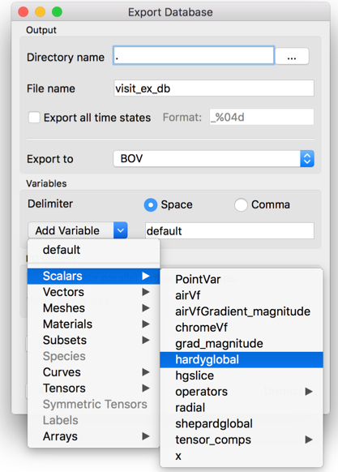

.. _exporting_databases:

Exporting databases
-------------------

Plot geometry can be saved to a handful of geometric formats by saving the
plots in the window to a format such as VTK. Often saving the plot geometry,
which only consists of the visible faces required to draw the plot, is not
enough. When interfacing VisIt to other tools you may want to save out the
database in a different file format. For instance, you
might plot a 3D database and want to export actual 3D cells for the entire
database instead of just the externally visible geometry. You might also
want to save out additional variables that you did not plot. VisIt allows
this kind of data export via the **Export Database Window** , shown in
:numref:`Figure %s<export_db_1>` .

.. _export_db_1:

   
   Export Database Window

You can find the **Export Database Window** in the **Main Window's File**
menu. To save a database, you must first have opened a database and created
a plot. Note that the data transformations applied by plots or operators will
affect the data that you export. This allows you to alter the data using
sophisticated chains of operators before you export it for use in another tool.

Exporting variables
~~~~~~~~~~~~~~~~~~~

.. _export_db_2:

   
   Variables menu

The **Export Database Window** allows you to export a subset of the variables
for your active plot's database by letting you specify which variables are to
be exported. To choose which variables should be exported, you can type the
names of the variables to export into the **Variables** text field or you can
select from the available variables in the **Variables** menu depicted in 
:numref:`Figure %s<export_db_2>` . You can select as many variables as you
want from the menu. Each time you select a variable from the **Variables**
menu, VisIt will append it to the list of variables to be exported.

Choosing an export file format
~~~~~~~~~~~~~~~~~~~~~~~~~~~~~~

The **Export Database Window** lists the names of the database reader plugins
that can also write data back into their native file formats. A small handful
of the total number of database plugins currently support this feature but in
the future most formats will support this capability more fully, making VisIt
not only a powerful visualization tool but a powerful database conversion tool.

You can try to use any of the supported export formats to export your data but
some of the file formats may not be able to accept certain types of data. The
Silo_ file format can safely export any type of data that you may want to export.
If you want to export data to other applications and the data must be stored in
an ASCII file that contains columns of data, you might want to choose the Xmdv
file format. If you want to choose a specific database plugin to export your
data files, make a selection from the **Export to** menu shown in
:numref:`Figure %s<export_db_3>` .

.. _export_db_3:

   
   Export file types

Export Options
~~~~~~~~~~~~~~

Some export formats support various options. Those options will be presented
in a dialog box when the **Export** button is pressed in the
**Export Database Window**. For example, shown below are some options for
exporting to the Silo_ database.

.. _export_options_example:

   
   Export options example (for Silo)

If VisIt has been compiled with HDF5 support, Silo_'s export options will include
the ability to select either the ``PDB`` or ``HDF5`` driver. The ``Checksums``
check-box indicates where the Silo_ library should compute checksums on the exported
data. In addition, the **DBSetCompression()** option text box is for specifying a
compression string to be used in Silo_'s ``DBSetCompression()`` method before
exporting data.

When the meaning of an export option is not clear, try also pressing the **Help**
button in **Export options for XXX writer** window to get more information.
