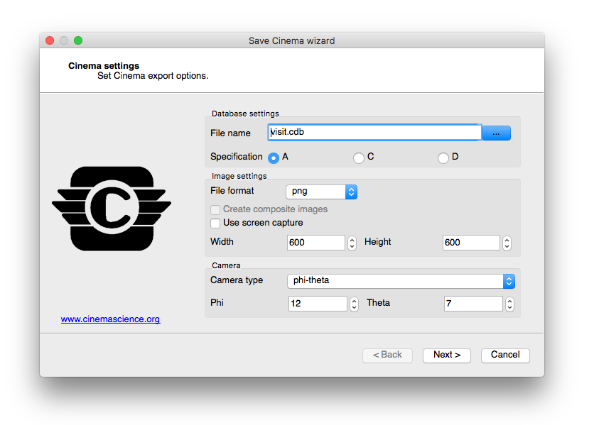
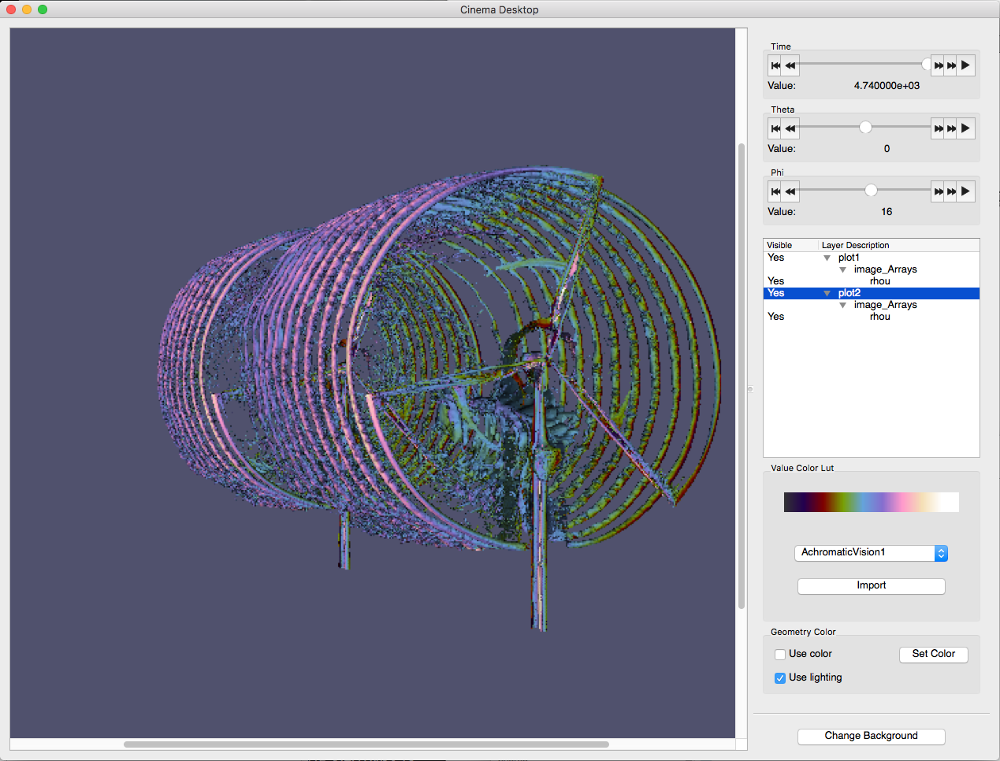
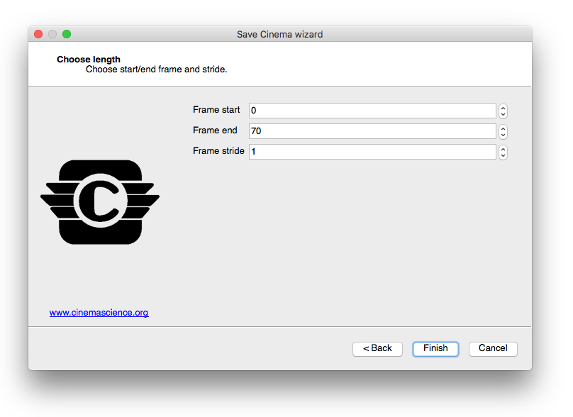

Saving Cinema
-------------

VisIt lets you save Cinema databases in addition to saving images and movies of 
your plots. A Cinema database is an image-based proxy for large scale data that
lets you explore the data using far fewer computational resources. Where 
post-processing full data might take a supercomputer, exploring a Cinema database
can be done on a tablet. Cinema databases consist of images that are indexed by
a JSON file or CSV file. The index file is used by the Cinema viewer (available at
`www.cinemascience.org <http://www.cinemascience.org/>`_) to determine a set of 
parameters that can be changed by 
the user. These parameters are used to look up corresponding image files for 
display in the Cinema viewer. For example, Cinema databases typically allow 
the user to navigate through time using a time parameter. Cinema databases also
can be saved using a spherical camera that is described by phi and theta parameters
to let the user see the plots from various camera angles. It is possible to create
Cinema databases in situ using Libsim so Cinema databases can be created
incrementally as a simulation runs. This section introduces
the **Save Cinema** wizard and explains how to create Cinema databases from within
VisIt's GUI.

.. _save_cinema_wizard_1:

   
   Save Cinema wizard (screen 1)

The **Save Cinema** wizard (see :numref:`Figure %s<save_cinema_wizard_1>`) is
available in the **Main Window's Files** menu. The **Save Cinema** wizard's
purpose is to let you set the options that are used to take the current 
visualizations and produce a Cinema database. Progress through the screens using
the **Next** button until the last screen is reached. Clicking **Cancel** at any 
time will close the wizard. Clicking the **Finish** button will tell VisIt to
produce a Cinema database with the current settings.

Choosing filename
~~~~~~~~~~~~~~~~~

Cinema databases are stored as a directory structure containing various nested 
directories with image files and an index file. When saving a Cinema database,
you must pick the name of the top level directory under which all other files
will be saved. The **Save Cinema** wizard contains a **File name** selection
control that lets you select the name of the Cinema ".cdb" directory. The control
can accept file names that are typed in and clicking the **...** button opens a
filename selection window that permits a new filename to be selected.

Choosing specification
~~~~~~~~~~~~~~~~~~~~~~

Cinema databases are described by specifications that dictate the format and 
allowable contents for the files that they contain. There are currently 3 Cinema
specifications in use: A, C, D.

Specification A describes a Cinema database format
that contains image files (PNG, TIFF, etc.) that are associated with various
user-defined parameters such as time or camera angles in the case of a phi-theta
camera. This specification is compatible with any of the VisIt plots since images
of the currently set up visualizations are saved.
Specification C describes a Cinema database format that adheres to a different
directory structure over specification A and can contain composite images. Composite
images are comprised of 3 separate files: a PNG file containing a luminance image,
a ZLib-compressed file containing the Z-buffer, and a ZLib-compressed file 
containing a rendering of actual scalar values for the plot.
Specification D is similar to specification A except that it uses a CSV file to
associate image files with a set of parameters, enabling sparse sets of images.

The **Save Cinema** wizard contains a set of A, C, D radio buttons to let you
choose the most appropriate specification for the type of Cinema database to 
be created.

Image settings
~~~~~~~~~~~~~~

The **Save Cinema** wizard contains controls for image settings such as the
file format, image width/height, and whether to use screen capture. The 
**File format** control lets you select the image file format to be used.
Several pixel-based image file formats are available such as BMP, PNG, TIFF,
and when available EXR. OpenEXR is a format from ILM that can store various
image channels and data in multiple layers that can be composited later. Support
for OpenEXR is optionally compiled into VisIt. The **Width** and **Height** 
controls allow the output image width and height to be specified when screen
capture is not in use by setting the **Use screen capture** controls. This 
permits VisIt to save images in a custom size as opposed to saving images 
based on the current visualization window's size. Note that using screen 
capture is faster for normal images since it does not require VisIt to
re-render the visualizations. 

Composite images
~~~~~~~~~~~~~~~~

Specification C Cinema databases support saving composite images which consist
of a luminance image, a Z image, and a scalar image. The luminance image is
a gray scale image that indicates the lighting used in the scene and it is 
saved as a PNG image or other pixel format image. The Z image is contains the
Z-buffer for the luminance image, stored as a buffer of 32-bit floating point
values that have been ZLib-compressed and written to a raw binary file. The scalar
image is stored the same as the Z buffer image but it contains float values
that correspond to the actual scalars that were rendered in the visualization.
The scalar values are used in the Cinema viewer to dynamically recolor the 
scene at render time. Composite images are most appropriate for surface-based
VisIt plots that employ a continuous color table, such as the Pseudocolor plot.
Composite images can be enabled by turning on the
**Create composite images** check box in the **Save Cinema** wizard when
specification C is used. When this setting is in effect, each VisIt plot will
be saved to a separate "layer" in the Cinema database so it can be composited
into the scene at will. :numref:`Figure %s<save_cinema_wizard_2>` shows multiple
VisIt plots that have been saved as separate layers to a composite image
specification C Cinema database that enables layers to be turned on and
off at view time.

.. _cinemaviewer:

   
   Cinema viewer with composite layers

Choosing Camera type
~~~~~~~~~~~~~~~~~~~~

Cinema databases support multiple camera types. VisIt's Cinema export supports
static cameras and phi-theta cameras. A static camera corresponds to the view
that is currently in effect in the visualization and when it is used, all time
states in the Cinema database will be viewed from that camera orientation. A
phi-theta camera defines 2 angles, phi and theta, that define the view direction
as in a spherical coordinate system. When a phi-theta camera is used, the
Cinema export will save the visualization from a multitude of different camera
orientations. This allows the user later in the Cinema viewer to interactively
rotate around the object much as though the object was live instead of just
a collection of image frames. The camera type can be selected using the 
**Camera type** control in the **Save Cinema** wizard and either static or 
phi-theta cameras can be selected. When a phi-theta camera is selected, the
number of camera angles in the phi and theta dimensions can be set using
the **Phi** and **Theta** controls.

Frame settings
~~~~~~~~~~~~~~

The second tab in the **Save Cinema** wizard 
(see :numref:`Figure %s<save_cinema_wizard_2>`) contains controls that select the
range and stride of time states that will be included in the Cinema database. Use
the **Frame start** controls to select the beginning time state for the Cinema 
database. A value of zero corresponds to the first time state. Use the 
**Frame end** controls to set the last time state that will be included in the
Cinema database. Finally, use the **Frame stride** controls to set the stride
that will be used between the start and end time states, which is useful when
making shorter preview databases that vary over time but do not include all 
time states.

.. _save_cinema_wizard_2:

   
   Save Cinema wizard (screen 2)

Saving Cinema from Libsim
~~~~~~~~~~~~~~~~~~~~~~~~~
It is possible to use VisIt's Libsim to directly save Cinema databases in situ 
from an instrumented simulation. This means that the Cinema database can be generated
incrementally as the simulation runs, making it possible to periodically check
in on the simulation by viewing the Cinema database. To add Cinema support to
a simulation instrumented with Libsim, there are 3 calls that need to be made. 
First, the simulation must call ``VisItBeginCinema``, which passes the parameters 
that describe the Cinema database format and returns a handle to a Cinema object.
Next, the simulation must call ``VisItSaveCinema`` to make Libsim generate and
add the appropriate images to the Cinema database, taking into account the type
of camera being used. The ``VisItSaveCinema`` function can be called repeatedly
to add new time states to the Cinema database. It is the simulation's responsibility
to make Libsim calls that set up VisIt plots or restore a session so there are
plots when ``VisItSaveCinema`` is called. Finally, the simulation must call
``VisItEndCinema`` to close out the Cinema database context and free associated
memory. A working example can be found in the 
`batch simulation example <https://github.com/visit-dav/visit/blob/develop/src/tools/data/DataManualExamples/Simulations/batch.c>`_
in VisIt's simulation directory. The overall call structure for creating a Cinema 
database looks something like this: ::

  visit_handle h = VISIT_INVALID_HANDLE;
  visit_handle hvar = VISIT_INVALID_HANDLE;
  double time_value = 0.;
  VisItBeginCinema(&h, "visit.cdb", VISIT_CINEMA_SPEC_A, 0,
                   VISIT_IMAGEFORMAT_PNG, 800, 800,
                   VISIT_CINEMA_CAMERA_PHI_THETA, 12, 7,
                   hvar);

  while(1) /* Simulation main loop */
  {
      /* Compute... */

      VisItSaveCinema(h, time_value);

  }

  VisItEndCinema(h);

The above code example will generate a Cinema database using the plots that have
been set up elsewhere using Libsim. Since Cinema output may sometimes serve
as the only simulation data product, it can be useful to save out additional
variables. The last argument to ``VisItBeginCinema`` is a handle to a name
list object. When the handle is set to ``VISIT_INVALID_HANDLE``, there is 
no name list and the argument does nothing. If instead, the name list is
created and filled with a list of variable names from the simulation, the
VisIt plots will have their variables changed to the variables in the name
list and Libsim will generate a Cinema database with images for each 
variable. The variable becomes a parameter in the Cinema viewer. A name list
object is created and populated like this: ::

  visit_handle hvar;
  VisIt_NameList_alloc(&hvar);
  VisIt_NameList_addName(hvar, "pressure");
  VisIt_NameList_addName(hvar, "rho");
  VisIt_NameList_addName(hvar, "energy");
