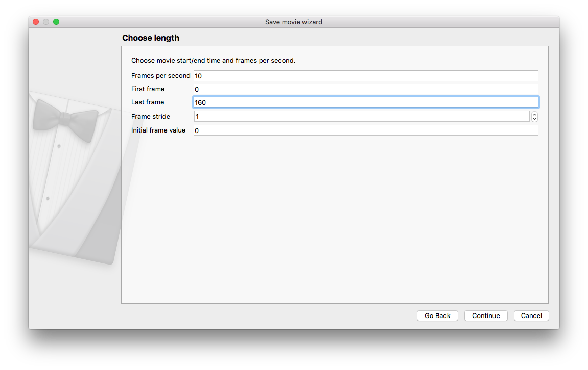
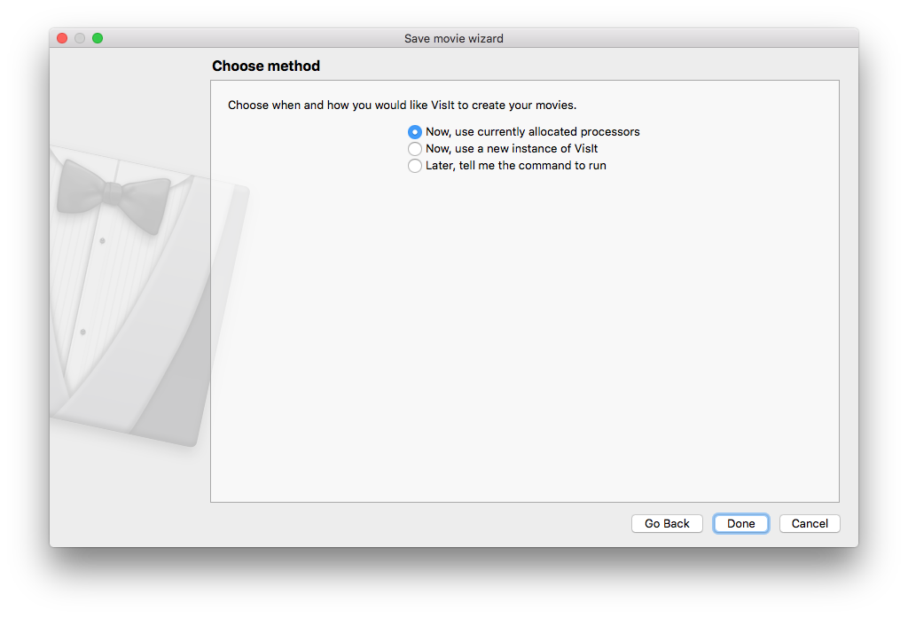
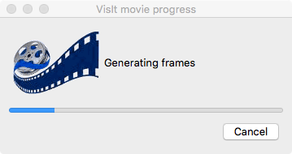
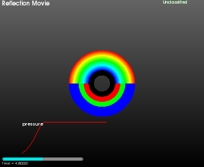

.. _SavingMovies:

Saving movies
-------------

In addition to allowing you to save images of your visualization window for the current time state, VisIt_ also allows you to save movies and sets of images for your visualizations that vary over time.
There are multiple methods for saving movies with VisIt_.
This section introduces the Save movie wizard and explains how to use it to create movies from within VisIt_'s GUI.
The :ref:`Animation` chapter explains some auxiliary methods that can be used to create movies.

.. _save_movie_wizard_1:

   
   Save movie wizard (screen 1)

The **Save movie wizard** (see :numref:`Figure %s<save_movie_wizard_1>`) is available in the **Main Window's Files** menu.
The **Save movie wizard's** purpose is to lead you through a set of simple questions that allow VisIt_ to gather the information required to create movies of your visualizations.
For example, the **Save movie wizard** asks which image and movie formats you want to generate, where you want to store the movies, what you want to call the movies, etc.
Each of these questions appears on a separate screen in the **Save movie wizard** and once you answer the question on the current screen, clicking the **Next (Continue for macOS)** button advances you to the next screen.
You can cancel saving a movie at any time by clicking on the **Cancel** button.
If you advance to the last screen in the **Save movie wizard** then you have successfully provided all of the required information that VisIt_ needs to make your movie.
Clicking the **Finish** button at that point invokes VisIt_'s movie-making script to make the movie.
If you want to make subsequent movies, you can choose to use the settings for the movies that you just made or you can choose to create a new movie and provide new information.

Choosing movie formats
~~~~~~~~~~~~~~~~~~~~~~

.. _save_movie_wizard_2:

   
   Save movie wizard (screen 2)

The **Save movie wizard's** second screen, shown in :numref:`Figure %s<save_movie_wizard_2>`, allows you to pick the types of movies that you want to create.
You can select as many image and movie formats as you want and you can even specify multiple resolutions of the same movie.
VisIt_ allows you to order multiple versions of your movie because it is often easier to create different versions of the movie all at once as opposed to doing it later once it is discovered that you need a new version to play on a laptop computer or a tiled display wall.

The **Save movie wizard's** second screen is divided vertically into two main areas.
On the left you will find the **Format and resolution** area, which displays the format and resolution for the current movie.
On the right, you will find the **Output** area, which lists the formats and resolutions for all of the movies that you have ordered.
By default no movie formats are present in the **Output** area's list of movies.
You cannot proceed to the next screen until you add at least one movie format to the list of movies in the **Output** area.

To add a movie format to the list of movies in the **Output** area, first choose the desired movie format from the **Format** combo box in the **Format and resolution** area.
Next, choose the movie resolution.
The movie resolution can be specified in terms of the visualization window's current size or it can be specified in absolute pixels.
The default movie resolution uses the visualization window's current size with a scale of 1.
You can change the scale to shrink or grow the movie while keeping the visualization window's current aspect ratio.
If you want to specify an absolute pixel size for the movie, click on the **Specify movie size** radio button and type the desired movie width and height into the **Width** and\ **Height** text fields.
Note that if you specify a width and height that causes the movie's shape to differ from the visualization window's shape, you might want to double-check that the view used for the visualization window's plots does not change appreciably.

The **Save movie wizard** allows you to create stereo movies if you check the **Stereo movie** box and select a stereo type from the **Stereo type** drop-down menu.
The default is to create non-stereo movies because stereo movies are not widely supported. 

.. note:: "Streaming movie" format is an LLNL format

The only movie format that VisIt_ produces that is compatible with stereo movies is the "Streaming movie" format, which is an LLNL format commonly used for tiled displays.
The "Streaming movie" format can support stereo movies where the image will flicker between left and right eye versions of the movie, causing a stereo effect if you view the movie using suitable liquid-crystal goggles.
The stereo option has no effect when used with other movie formats.
However, if you choose to save a stereo movie in any of VisIt_'s supported image formats, VisIt_ will save images for the left eye and images for the right eye.
You can then take the left and right images into your favorite stereo movie creation software to create your own stereo movie.

Once you have selected the desired movie format, width, and height, click on the right-arrow button that separates the **Format and resolution** area from the **Output** area.
Clicking the right-arrow button adds your movie to the list of movies that you want to make.
Once you have at least one movie in the **Output** area, the screen's Next button will become active.
Click the **Next** button to go to the next screen in the **Save movie wizard**

Choosing movie length
~~~~~~~~~~~~~~~~~~~~~

.. _save_movie_wizard_3:

   Save movie wizard (screen 3)

It is possible to specify the range of time states to use for the movie, as well as specify a stride if you have too many time states saved (see :numref:`Figure %s<save_movie_wizard_3>`).
The wizard will automatically set the range of time states.

Choosing the movie name
~~~~~~~~~~~~~~~~~~~~~~~

.. _save_movie_wizard_4:

   
   Save movie wizard (screen 4)

Once you have specified options that tell VisIt_ what kinds of movies that you want to make, you must provide the base name and location for your movies.
By default, movies are saved to the directory in which you started VisIt_.
If you want to specify an alternate directory, you can either type in a new directory path into the **Output directory** text field (see :numref:`Figure %s<save_movie_wizard_4>`) or you can select a directory from the **Choose directory** dialog box activated by clicking on the *"..."* button.

The base filename for the movie is the name that is prepended to all of the movies that you generate.
When generating multiple movies with differing resolutions, the movie resolution is often encoded into the filename.
VisIt_ may generate many different movies with different names but they will all share the same base filename that you provided by typing into the **Base filename** text field.

Choosing e-mail notification
~~~~~~~~~~~~~~~~~~~~~~~~~~~~

.. _save_movie_wizard_5:

   
   Save movie wizard (screen 5)

If you want to be notified by e-mail when the movie creation is complete, then select the **Yes** option and enter the appropriate e-mail address (see :numref:`Figure %s<save_movie_wizard_5>`).
By default, no e-mail notification is sent once the movie creation is complete. 

Choosing movie generation method
~~~~~~~~~~~~~~~~~~~~~~~~~~~~~~~~

.. _save_movie_wizard_6:

   
   Save movie wizard (screen 6)

After all movie options are specified, VisIt_ prompts you how you would like your movie made.
At this point, you can click the **Finish**/**Done** button to make VisI_t start generating your movie.
You can change how VisIt_ creates your movie by clicking a different movie generation method on the **Save movie wizard's** sixth screen, shown in Figure :numref:`Figure %s<save_movie_wizard_6>`.

The default option for movie creation allows VisIt_ to use your current VisIt_ session to make your movies.
This has the advantage that it uses your current compute engine and allocated processors, which makes movie generation start immediately.
When you use this movie generation method, VisIt_ will launch its command line interface (CLI) and execute Python movie-making scripts in order to generate your movie.
This means that you have both the VisIt_ GUI and CLI controlling the viewer.
If you use this movie generation method, you will be able to watch your movie as it is generated.
You can track the movie's progress using the **Movie progress dialog** , shown in :numref:`Figure %s<save_movie_progress>`.
The downside to using your currently allocated processors is that movie generation takes over your VisIt_ session until the movie is complete.
If you want to regain control over your VisIt_ session, effectively cancelling the movie generation process, you can click the **Movie progress dialog's** **Cancel** button.  

.. _save_movie_progress:

   
   Movie progress dialog

The second movie generation method will cause VisIt_ to save out a session file containing every detail about your visualization so it can be recreated by a new instance of VisIt_.
This method works well if you want to create a movie without sacrificing your current VisIt_ session but you cannot watch the movie as it is generated and you may have to wait for the second instance's compute engine to be scheduled to run.
The last movie generation option simply makes VisIt_ display the command that you would have to type at a command prompt in order to make VisIt_ generate a movie of your current visualizations.

Templated movies
~~~~~~~~~~~~~~~~

Movie templates enable you to create a set of viewports and map the contents of various visualization windows to those viewports, also incorporating simple movie transitions.

To create a movie template, you can open the Save movie wizard as you normally would.
Instead of choosing New simple movie, choose New template movie.
VisIt will load custom user interface pages for the chosen movie template.

.. _savemovietemplate1:

 
   Movie type selection page

You can choose to use an existing template, edit an existing template, or create a new template.

.. _savemovie_existingtemplate:

   
   Template choice.

Existing Movie Templates
""""""""""""""""""""""""

.. _CurveOverlayTemplate:

Curve Overlay Movie Template
^^^^^^^^^^^^^^^^^^^^^^^^^^^^

The **Curve Overlay** template lets you create regular plots and in a separate viewport, create a curve plot that completes as the movie advances in time.

You will need: A 2D or 3D time-varying dataset and a Curve file containing the curve that will be animated.

If you use a 3D dataset, you will want to make sure that you set the view to something appropriate and that you position the 3D plot in the upper portion of the vis window.
The 2D curve plot will be composited into the bottom part of the window.

.. _curveoverlay_preview:

   
   Curve Overlay preview.

:numref:`Figure %s<curveoverlay_options>` shows the options for the 2D/3D plots:

* Select your time varying database.
* Select the plot and variable that you want to plot.
* Adjust title and colors.

.. _curveoverlay_options:

   
   Curve Overlay 2D/3D plot options

Select the curve file that contains the curve you want to animate as shown in 
:numref:`Figure %s<curveoverlay_options2>`.

.. _curveoverlay_options2:

   
   Curve Overlay Curve plot options

The rest of the **Save Movie wizard** pages for the **Curve Overlay** template are the same as for all movies described previously.

.. _curveoverlay_frame:

   
   Frame from a Curve Overlay template movie

:numref:`Figure %s<curveoverlay_frame>` shows a frame from a **Curve Overlay** movie.

.. _ReflectedCurveOverlayTemplate:

Reflected Curve Overlay Movie Template
^^^^^^^^^^^^^^^^^^^^^^^^^^^^^^^^^^^^^^

The **Reflected Curve Overlay** template shows two plots in one viewport.
One of the plots is reflected from the other's position.
Similar to **Curve Overlay**, a Curve plot is shown in another viewport.

.. _reflected_curveoverlay_preview:

   
   Curve Overlay preview.

:numref:`Figure %s<reflected_curveoverlay_plot_options>` shows the options for the 2D/3D plots:

* Select the first time varying database.
* Select the plot and variable that you want to plot.
* Select the second time varying database (it can be the same as the first).
* Select the plot and variable that you want to plot.
* Adjust title and colors.

.. _reflected_curveoverlay_plot_options:

   
   Reflected Curve Overlay 2D/3D plot options

The options for the Curve plot portion are the same as used by the **Curve Overlay** template.

The rest of the Save Movie wizard pages for the **Reflected Curve Overlay** template are the same as for all movies described previously.

.. _reflected_curveoverlay_frame:

   
   Frame from a Reflected Curve Overlay template movie

.. _Slice3DTemplate:

Slice 3D Movie Template
^^^^^^^^^^^^^^^^^^^^^^^

The **Slice 3D** movie template animates a slice plane through all three dimensions of a 3D dataset before fading to black.

.. _slice3d_preview:

   Slice 3D template preview.

The next page (:numref:`Figure %s<slice3d_options>`) lets you fill in details such as which dataset will be sliced.
You can also set visualization title and colors.

.. _slice3d_options:

   Slice 3D parameters.

This movie template ends with a fade to black sequence.
You can set the duration of this sequence as well as the colors used as shown in :numref:`Figure %s<slice3d_fade_options>`.
   
.. _slice3d_fade_options:

   Slice 3D fade sequence options.

Creating new Templates
""""""""""""""""""""""

.. _savemovie_createtemplate:

   
   Creating a new template

.. _SidebySideMovie:

Side by Side Movie
^^^^^^^^^^^^^^^^^^
To make a side by side movie you can use the **Create template** option.
Before saving the movie with this template, you must set up the plots that you want to make in multiple vis windows, as shown in :numref:`Figure %s<sidebyside_plots>`.

.. _sidebyside_plots:

   
   Setting up plots for Side by Side movie generation.

Since you are creating a new movie template, you first must set up the movie viewports.
You can create many viewports and the viewports can be adjacent or can overlap (e.g. picture in picture).
When viewports overlap, you can make the top viewports semi-transparent, make a background color transparent, or even add drop shadows.
There are some existing layouts if you don't want to get fancy.
Select the **Side by Side** layout and VisIt will create 2 viewports next to one another.

.. _sidebyside_layout_selection:

   
   Selecting Side by Side layout.

.. _sidebyside_viewports:

   
   The Side by Side viewports.

After you create movie viewports, you must map sequences of images to the viewports.
These can be produced from the plots in your vis windows or transitions such as fades, etc.
For a side by side movie, you will want to map the image sequence produced from vis window 1 to movie viewport 1.
You will also map the image sequence from vis window 2 to movie viewport 2.
If you had more vis windows, you could map more than one vis window to a movie viewport.
When more than one vis window is mapped to a single viewport, the movie will have the animation form the first vis window followed by the animation from the second vis window and so on for all the vis windows mapped to that viewport.
It is possible to add transition effects in between sequences or after sequences so that you can include some simple animation effects in your movies.

**Tip**: If you wanted to show side by side plots that advance through time and then switch to another plot and do the animation over again, you could set up 4 vis windows and then map 2 vis windows to each movie viewport.

.. _sidebyside_window_to_viewport_mapping:

   Mapping Windows to viewports.

For the time being, you will not save the movie template but simply use it.

.. _sidebyside_savetemplate:

   Save template page.
  
Now that you have set up the movie template, the rest of the screens in the Save movie wizard are the normal screens that gather input about which movie formats you would like to save.
Note that for a side by side movie, you will want to override the image size so that you do not get a square movie but rather 2 square images next to one another.
Use an image size where the width is 2x the height: 1000x500 or some other image size.

.. _sidebyside_imagesize:

 
   Choose image size where width is 2x height.

The result from this movie template will be a side by side MPEG movie that contains the plots from vis window 1 and vis window 2. 
