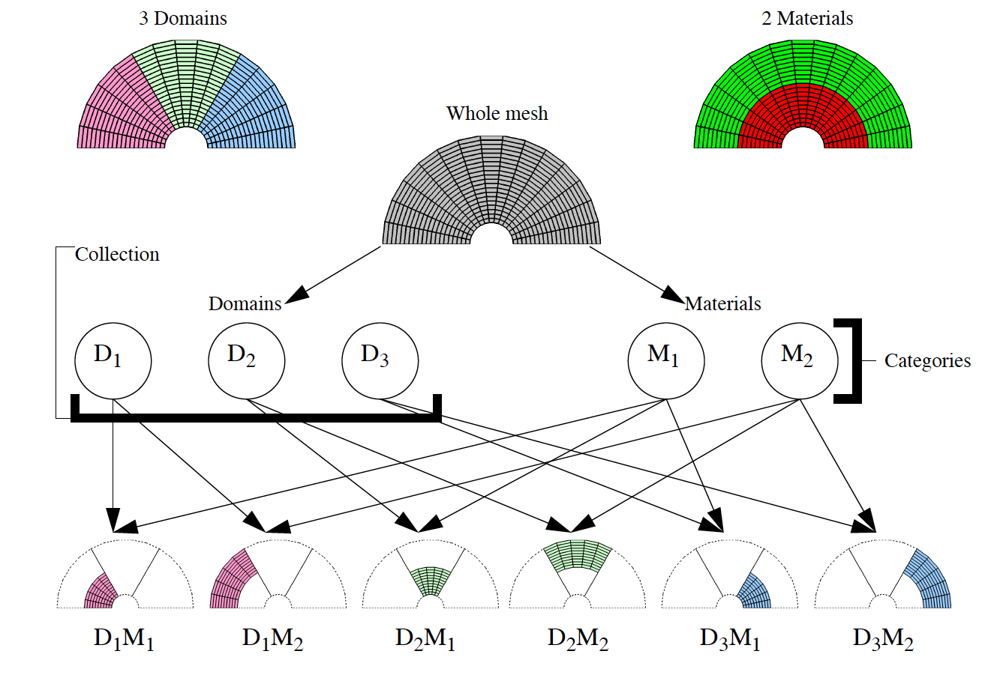

.. _Subset Inclusion Lattice:

Subset Inclusion Lattice
------------------------

VisIt relates all possible subsets in a database using what is called a
:term:`Subset Inclusion Lattice` (SIL). Ultimately the subsets in a database are
cells that can be grouped into different categories such as material
region, domain, patch, refinement level, etc. Each category has some
number of possible values when taken together form a collection. A
collection lets you group the subsets that have different values but
are still part of the same category. For example, the mesh shown in
:numref:`Figure %s <subset1a>` is broken down into domain and material
categories and there are 3 domain subsets in the domain category.
VisIt uses the SIL to remove pieces of a database from a plotted
visualization by turning off bottom level subsets that are arrived at
through turning off members in various collections or turning off entire
collections. When various subsets have been turned off in a SIL, the
collective on/off state for each subset is known as a SIL restriction.

.. _subset1a:

   Whole mesh divided up into domains and materials
