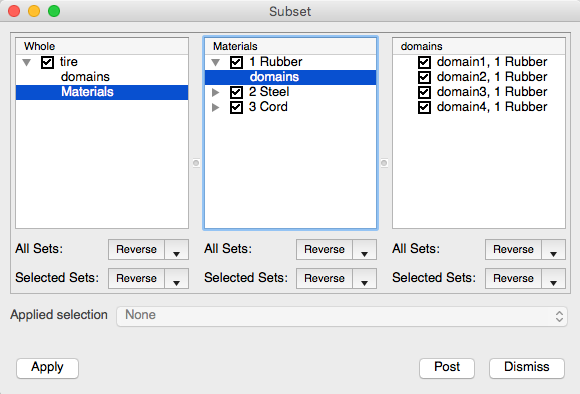
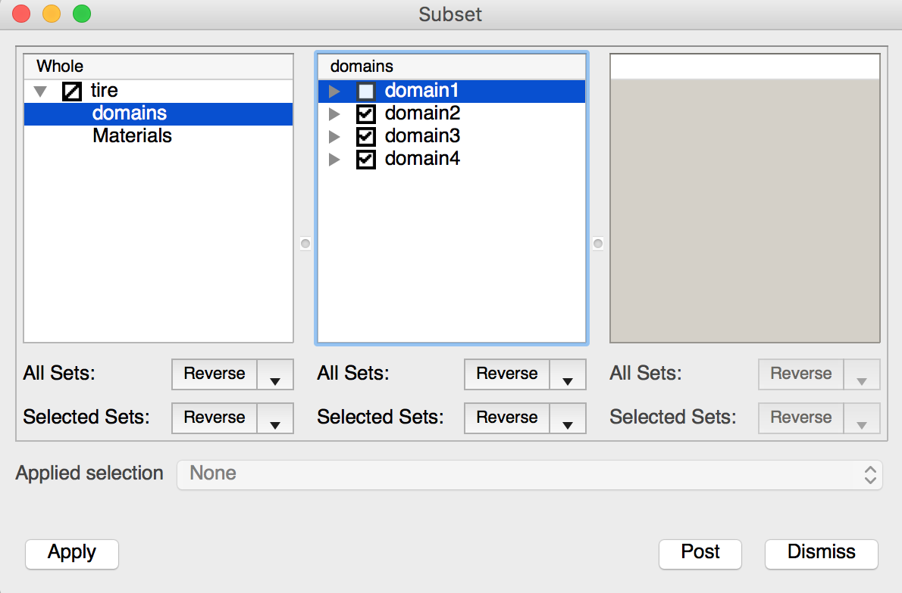
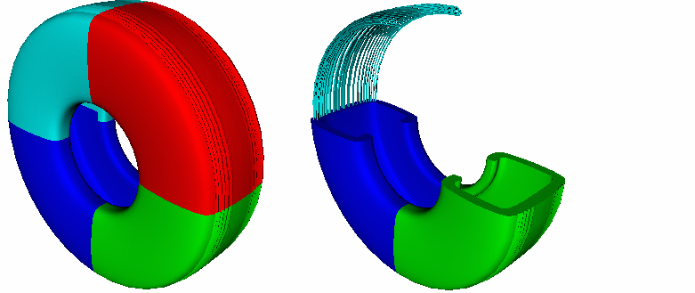
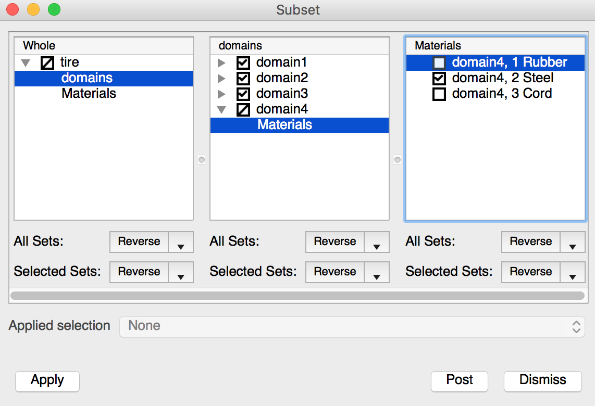

.. _Using the Subset Window:

Using the Subset Window
-----------------------

Users can open the **Subset Window**, shown in
:numref:`Figure %s <subsetwindow>`, by clicking on the **Subset** option in the
**Main Window's Controls** menu or by clicking on the **Subset**
Venn Diagram-looking icon next to the name of a plot in the **Plot list**.
VisIt's **Subset Window** shows the relationships between subsets and provides
controls that allow users to turn subsets on and off.

.. _subsetwindow:

   Subset window

The **Subset Window** initially has three panels that display the sets
associated with mesh of the currently active plot. The window will grow
more panels to the right, when necessary as the subset structure of a
mesh is browsed. Each successive panel shows the *next* level of subsets
in the mesh. The leftmost panel contains the top level (e.g. *whole*) set for
the whole mesh of the currently active plot. The top level or *whole* set,
which includes all subsets in the mesh, is usually decomposed into the various
kinds of subsets described in the section
:ref:`What is a subset? <What is a subset>`. For example, it
can be decomposed by material, processor domain, etc. The various ways in
which a database can be decomposed are called *subset categories*. The subset
categories will vary depending on how the data producer(s) create the
database(s). 

Browsing subsets
~~~~~~~~~~~~~~~~

To browse the subsets for a database, users must first have created a plot.
Once a plot is created and selected, open the **Subset Window**. The left
panel in the **Subset Window** contains the database's top level set and
may also list some subset categories. Some simple databases don't include
any subset and so VisIt will not show any subsets for them. To start browsing
the available subsets, users can click on one of the subset categories to
display the subsets in that category. For instance, clicking on a "Material"
subset category will list all of the mesh's materials in the next panel to
the right. The materials are subsets of the top level set. Double clicking on
a set or clicking on an expand arrow lists any subset categories that can be
used to further break down the set.

Changing a :term:`SIL` restriction
~~~~~~~~~~~~~~~~~~~~~~~~~~~~~~~~~~

Each set in the **Subset Window** has a small check box next to it that
allows users to turn the set on or off. The check box not only displays
whether a set is on or off, but it also displays whether or not a set
is partially on. When a set is partially on, it means that at least one
(but not all) of the subsets it contains is turned on. When a set is
partially on, its check box shows a small slash instead of a check or an
empty box. Uncheck the check box next to a set name to turn the set off.

Suppose a user has a database that contains 4 domains, numbered 1 through 4.
If the user wants to turn off the subset named "domain1", first click on the
"domains" category to list the subsets in that category. Next, click the check
box next to the subset name "domain1" and click the **Apply** button. The
result of this operation, shown in :numref:`Figure %s <subset1>`,
removes the "domain1" subset from the visualization. Note that the
**Subset Window** "domain1" set's check box is unchecked and the top
level set's check box has a slash through it to show that some subsets
are turned off.

.. _subset1:

.. figure:: images/subset1.png

   Removing one subset.

.. _subsetwindow2:

   Subset window with one subset removed.

Creating complex subsets
~~~~~~~~~~~~~~~~~~~~~~~~

When visualizing a database, it is often useful to look at *combinations*
of subsets. Suppose a user has a database that has two subset categories:
"Materials", and "Domains" and that the user wants to turn off the
"domain1" subset but also wants to turn off a material in the
"domain4" subset. Users can do this by clicking on the "Domains" category and
then unchecking the "domain1" check box in the second panel. Now, to turn
off a material in the "domain4" subset, the user clicks on the "domains"
category in the left panel. Next, double-click on the "domain4" subset in the
second panel. Select the "Materials" subset category in the second panel to make
the third panel list the materials that can be removed from the "domain4"
subset. Turning off a couple materials from the list in the third panel
will only affect the "domain4" subset. An example of a complex subset
selection is shown in :numref:`Figure %s<subset2>` and the state of the
**Subset window** is shown in :numref:`Figure %s <subsetwindow3>`.

.. _subset2:

   Example of a complex subset.

.. _subsetwindow3:

   Subset window for complex subset example.

Turning multiple sets on and off
~~~~~~~~~~~~~~~~~~~~~~~~~~~~~~~~

When databases contain large numbers of subsets, it is convenient to turn
many of them on and off at the same time. Users can select ranges of subsets
by clicking on the name of a subset using the left mouse button and dragging
the mouse up or down to other subsets in the list while still holding down
the left mouse button. Alternatively, users can click on a subset to select
it and then click on another subset while holding down the *Shift*
key to select all of the subsets in the middle. Finally, users can select a
group of multiple nonconsecutive subsets by holding down the *Ctrl* key
while clicking on the subsets to be selected.

Once a group of subsets has been selected, the buttons at the bottom of the
pane can be used to adjust the selection in various ways. The top button
applies an action to all of the sets in the pane regardless of how they have
been selected. The bottom button applies an action to only the subsets that
have been selected. Each action button has three possible actions: Turn on,
Turn off, and Reverse. Users can change the action for an action button by
clicking on the down-arrow button to its right and selecting one of the
**Turn on**, **Turn off**, and **Reverse** menu options. When the **Turn on** 
action is used, the appropriate subsets will be turned on. When the
**Turn off** action is used, they will be turned off. When the **Reverse**
action is used, the on/off state of the sets will be reversed (or toggled).
