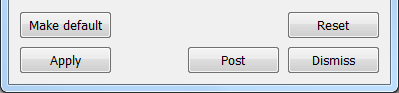

.. _The Main Window:

The Main Window
---------------

VisIt_'s **Main** window, shown in :numref:`Figure %s <Intro-MainWindow>`,
contains three main areas: the file area, the plot area and the notepad area.
The file area contains controls for working with sources and selecting the
current time state. The plot area contains controls for creating and modifying
plots and operators. The notepad area is a region where frequently used
windows may be posted for quick and convenient access.

.. _Intro-MainWindow:

   VisIt_'s Main window

.. _Intro_Posting_a_window:

Posting a window
~~~~~~~~~~~~~~~~

Each time a window posts to the notepad area, a new tab is created in
the notepad and the posted window's contents are added to the new tab.
Clicking on a tab in the notebook displays a posted window so that it
can be used.

.. _Intro-PostedWindow:

    An unposted and posted window

Postable windows have a **Post** button to post the window. Clicking on the
**Post** button hides the window and adds its controls to a new tab in the
notepad area. Posting windows allows you to have several windows active at
the same time without cluttering the screen. When a window is posted, its
**Post** button turns to an **UnPost** button that, when clicked, removes
the posted window from the **Notepad** area and displays the window in its
own window. :numref:`Figure %s <Intro-PostedWindow>` shows an example of a
window with a **Post** button and also shows the same window when it is
posted to the notepad area.

Using the main menu
~~~~~~~~~~~~~~~~~~~

VisIt_'s **Main** menu contains seven menu options that allow you to access
many of VisIt_'s most useful features. Each menu option displays a submenu
when you click it. The options in the submenus perform an action such as
saving an image. Menu options that contain a name followed by ellipsis open
another VisIt_ window. Some menu options have keyboard shortcuts that activate
windows. The **File** menu contains options that deal with files and
simulations. The **Controls** menu contains options that open VisIt_ windows
that, for the most part, set the look and feel of VisIt_'s visualization
windows. The **Options** menu contains options that allow you to set the
appearance of the GUI, manage host profiles, manage VisIt_ plugins, set
various preferences and save VisIt_'s settings to a configuration file.
The **Windows** menu contains controls that manage visualization windows.
The **PlotAtts** and **OpAtts** menus allow access for setting the attributes
of all the plots and operators. The **Help** menu provides options for
viewing online help, VisIt_'s copyright agreement, and release notes which
describe the major enhancements and fixes in each new version of VisIt_.
The options for each menu except for the plot and operator attribute menus
are shown in :numref:`Figure %s <Intro-MainMenus>` and will be described
in detail later in this manual.

.. _Intro-MainMenus:

   VisIt_'s main menus

The **Main** menu and the **Plots** and **Operators** menus are merged in
the macOS version of VisIt_ because macOS applications always have all menus in
the system menu along the top of the display.

Viewing status messages
~~~~~~~~~~~~~~~~~~~~~~~ 

VisIt_ informs the user of its progress as it creates a visualization. As
work is completed, status messages are displayed in the bottom of the
**Main** window in the status bar. In addition to status messages, VisIt_
sometimes displays error or warning messages. These messages are displayed
in the **Output** window, shown in :numref:`Figure %s <Intro-OutputIndicator>`.
To open the **Output** window, click the **Output** indicator in the
lower, right hand corner of the **Main** window. When the **Output** window
contains an unread message, the **Output** indicator changes colors from
blue to red.

.. _Intro-OutputIndicator:

   The output window and output indicator

Applying settings
~~~~~~~~~~~~~~~~~

When using one of VisIt_'s control windows, you must click the **Apply**
button for the new settings to take effect. All control windows have an
**Apply** button in the lower left corner of the window. By default, new
settings are not applied until the **Apply** button is clicked because it is
more efficient to make several changes and then apply them at once. VisIt_ has
a mode called **Auto apply** that makes all changes in settings take place
immediately. **Auto apply** is not enabled by default because it can cause
plots to be regenerated each time settings change and for the database sizes
for which VisIt_ is designed, auto apply may not always make sense. If you
prefer to have new settings apply immediately, you can enable auto apply by
clicking on the **Auto apply** check box in the upper, right hand corner of
the **Main** window. If **Auto apply** is enabled, you do not have to
click the **Apply** button to apply changes.

.. _Intro-AutoApply:

   The Apply button and Auto apply check box
