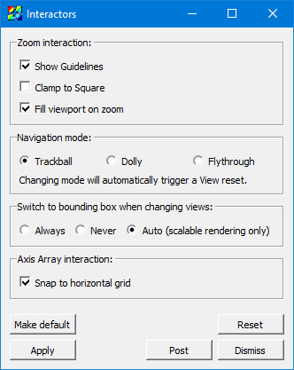

.. _Interactor settings:

Interactor settings
-------------------

Some window modes such as Zoom mode and Navigate mode have certain interactor properties that you can set. 
Interactor properties influence how user interaction is fed to the controls in the different window modes.
For example, you can set zoom interactor settings that clamp a zoom rectangle to a square or fill the viewport when zooming. 
VisIt provides the **Interactors window** so you can set properties for window modes that have interactor properties. 
The **Interactors window** is shown in :numref:`Figure %s <interactors>`.

.. _interactors:

   Interactors window

Zoom interactor settings
~~~~~~~~~~~~~~~~~~~~~~~~

The zoom interactor settings are mostly used when the vis window is in zoom mode. 
When the vis window is in zoom mode, clicking in the vis window will anchor a point that becomes one of the corners of a zoom rectangle.
When you release the mouse, the point over which the mouse was released becomes the opposite corner of the zoom rectangle. 
VisIt's default behavior is to show guidelines that extend from the edges of the zoom rectangle to the edges of the plots' bounding box when the vis window is in 2D mode. 
If you want to turn off the guidelines, click off the **Show Guidelines** check box in the **Interactors window**.

When sweeping out a zoom rectangle in zoom mode, VisIt allows you to draw a rectangle of any proportion. 
The relative shape of the zoom rectangle, in turn, influences the shape of the viewport drawn in the vis window. 
If you hold down the *Shift* key while sweeping out the zoom rectangle, VisIt will constrain the shape of the zoom rectangle to a square. 
If you want VisIt to always force a square zoom rectangle so that you don't have to use the *Shift* key, you can click on the **Clamp to Square** check box, click **Apply** in the **Interactors window** and save your settings.

Using the **Clamp to Square** zoom mode is a good way to maximize the amount of the vis window that is used when you zoom in on plots and when the vis window is in zoom mode. 
When the vis window is in navigate mode, the middle mouse button also effects a zoom. 
By default, zooming with the middle mouse button zooms into the plots but keeps the same vis window viewport which may, depending on the aspect ratio of the plots, not make the best use of the vis window's pixels. 
Fortunately, you can turn on the **Fill viewport on zoom** check box to force middle mouse zooming to also enlarge the viewport to its largest possible size in order to make better use of the vis window's pixels.

Navigation styles
~~~~~~~~~~~~~~~~~

When VisIt displays 3D plots, there are a few navigation styles from which you can choose by clicking on the following radio buttons in the **Interactors window**: **Trackball**, **Dolly**, and **Flythrough**.  
The default navigation style for 3D plots is: Trackball and it allows you to interactively rotate plots and move around them but it keeps the camera at a fixed distance from the plots and while it can get infinitely close to plots when you zoom in, it can never touch them or go inside of them. 
The Dolly navigation style behaves like the trackball style except that the when the camera zooms, it is actually moved. 
The Flythrough navigation style moves the camera and allows you to fly into plots and out the other side.
Changing navigation modes will automatically cause a view Reset, due to the differing ways the camera is handled in each mode.
