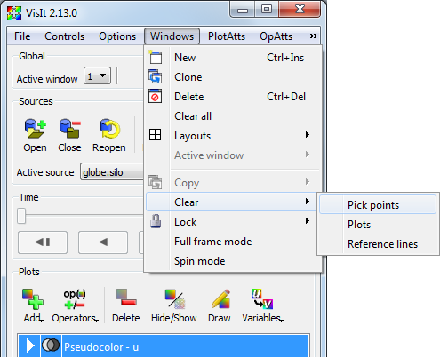
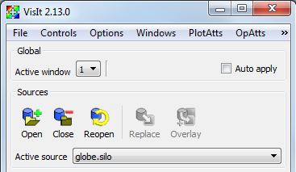
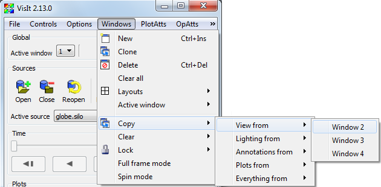
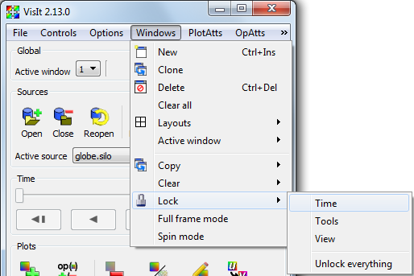

.. _Managing vis windows:

Managing vis windows
--------------------

VisIt allows you to create up to 16 vis windows and to manage those vis
windows, VisIt provides controls to add vis windows, remove vis windows or
alter their layout. The controls for managing vis windows are located in the
**Main Window's Windows** menu (see :numref:`Figure %s <popupmenuwindowmenu>`),
as well as in the vis window's **Toolbars** and **Popup menu**.

.. _popupmenuwindowmenu:

.. figure:: images/popupmenuwindowmenu.png

   Window menu

Adding a new vis window
~~~~~~~~~~~~~~~~~~~~~~~

You can add a new vis window in a few different ways, the first of which is
by selecting the **New** option from the **Main Window's Windows** menu. You
can also click on the **New window icon** in the vis window's **Toolbar** or
you can select the **New window** option from the **Windows** submenu in the
vis window's **Popup menu** to add a new vis window. When you add a new
window, it will be sized according to the window layout so if you have only
a single, large vis window, the new vis window will also be large. You can
change the window layout to shrink the vis windows so that they both fit on
the screen. Vis windows are numbered 1 to 16 so the new window will have
the first available number for which there is not already a window. If you
have windows 1, 2, and 4, vis window 3 would be created by adding a new
window. Adding a new window also makes the new window the active window.

A new vis window can also be added by cloning the active window. You
can clone the active window by selecting the Clone option from the
**Main Window's Windows** menu or you can click the **Clone window icon**
in the vis window's **Toolbar**. When you clone the active window, VisIt
creates a new window as if you had clicked the Add option but it also
copies the plots, annotations, and lighting from the active window so
that the new window is identical in appearance to the active window. When
plots are copied to the new cloned window, they have not yet been
generated so their plot list entries in the **Plot list** are green. You
can force the plots to be generated by clicking the **Draw** button in
the **Main Window**.

Deleting a vis window
~~~~~~~~~~~~~~~~~~~~~

There are four ways to delete a vis window. The first way is to select the
**Delete** option from the **Main Window's Windows** menu. When you delete
a window in this manner, the active window gets deleted and VisIt makes
the window with the smallest number the new active window. The second way
to delete a window is to click on the **close window button** in the
window decorations provided by the windowing system. The window decorations'
appearance varies based on the platform and windowing system used to run
VisIt, but the button used to close windows is commonly a button with an
X in it. An example of a **close window button** is shown in
:numref:`Figure %s <closebutton>`.

.. _closebutton:

   Window decorations with close button

The third way to delete a vis window is to click on the **Delete window icon**
in the vis window's **Toolbar**. The fourth way to delete a vis window is to
use the **Delete** option in the vis window's **Popup menu**. When you use
the **Toolbar** or the **Popup menu** to delete a window, the window does not
need to be the active window as when other controls are used.

Clearing plots from vis windows
~~~~~~~~~~~~~~~~~~~~~~~~~~~~~~~

The **Main Window's Windows** menu provides a **Clear all** option that you
can use to clear the plots from all vis windows. Selecting this option does
not delete the plots from a vis window's plot list but it does clear the
plots so they have to be regenerated by VisIt's compute engine. You can also
clear the plots for just the active window by selecting the **Plots** option
from the **Clear** submenu in the **Main Window's Windows** menu (see
:numref:`Figure %s <windowclearmenu>`). You might find clearing plots useful
when you want to make several changes to plot attributes because, unlike
plots that are already generated, setting attributes of cleared plots does
not force them to regenerate when you change their attributes.

In addition to clearing plots, you can also clear pick points and
reference lines from a vis window. A pick point is a marker that VisIt
adds to a vis window when you click on a plot in pick mode. The marker
indicates the location of the pick point. A reference line is a line
that you draw in a vis window when it is in lineout mode. You can clear
a vis window's pick points or reference lines, by selecting the
**Pick points** or **Reference lines** options from the **Clear** submenu
in the **Main Window's Windows** menu.

.. _windowclearmenu:

   Clear menu

Changing window layouts
~~~~~~~~~~~~~~~~~~~~~~~

VisIt uses different window layouts to organize vis windows so they all fit
on the screen. Changing the window layout typically resizes all of the
vis windows and moves them into a tiled formation. If there are not enough
vis windows to complete the desired layout, VisIt creates new vis windows
until the layout is complete. You can change the layout selecting a new
layout from the **Layouts** menu located in the **Main Window's Windows** menu
or you can click on a layout icon in the vis window's **Toolbar**.

Setting the active window
~~~~~~~~~~~~~~~~~~~~~~~~~

VisIt has the concept of an active window that is the window to which
new plots are added. You can change the active window by selecting a
window number from the **Active window** menu located near the top of
the **Main Window**. Setting the active window updates the GUI so that
it displays the state for the new active window. The **Active window**
menu is shown in :numref:`Figure %s <activewindow>`. You can also set
the active window using the **Active window** submenu in the
**Main Window's Windows** menu or you can click on the **Active window icon**
in the vis window's **Toolbar**.

.. _activewindow:

   Active window menu

Copying window attributes
"""""""""""""""""""""""""

VisIt allows you to copy window attributes and plots from one window to
another when you have more than one window. This can be useful when you
are comparing plots generated from similar databases. The **Copy** menu,
shown in :numref:`Figure %s <windowcopymenu>`, contains options to copy
the view, lighting, annotations, plots, or everything from other from other
vis windows. Under each option, the **Copy** menu provides a list of
available vis windows from which attributes can be copied so, for example,
if you have two windows and you want to copy the view from vis window 1
into vis window 2, you can select the **Window 2** option from the
**View from** submenu. The list of available windows depends on the vis
windows that you have created. You can copy the lighting from one window
to another window by using the **Lighting from** submenu or you can use
the **Annotations from** or **Plots from** to copy the annotations or
plots, respectively. If you make a selection from the **Everything from**
submenu, all attributes and plots are copied into the active vis window.

.. _windowcopymenu:

   Copy menu

Locking vis windows together
""""""""""""""""""""""""""""

When you use VisIt to do side by side comparisons of databases, you may
find is useful to lock vis windows together. Vis windows can be locked
together in time so that when you change the active database timestep in
one database, as when viewing an animation, all vis windows that are locked
in time switch to the same database timestep. You can lock vis windows
together in time by selecting the **Time** option from the **Lock** menu
(see :numref:`Figure %s <windowlockmenu>`) in the **Main Window's Windows**
menu. Any number of windows can be locked together in time and you can turn
off time locking at any time.

.. _windowlockmenu:

   Lock menu

You can also lock interactive tools together so that updating a tool in
one window updates the tool in other windows that have enabled tool locking.
This can be useful when you have sliced a database using the plane tool
in more than one window and you want to be able to change the slice using
plane tool in either window and have it affect the other vis windows. You
can enable tool locking by selecting the **Tools** option from the **Lock**
menu.

In addition to locking vis windows in time, or locking their tools together,
you can also lock vis windows' views together so that when you change the
view in one vis window, other vis windows get the same view. When you change
the view in a vis window that has view locking enabled, the view only
effects other vis windows that also have view locking enabled and have plots
of the same dimension. That is, when you change the view of a vis window
that contains 3D plots, it will only have an effect on other locked vis
windows if they have 3D plots. Vis windows that contain 2D plots are not
affected by changing the view of a vis window containing 3D plots and
vice-versa. When you enable view locking, the vis window snaps to the view
used by other vis windows with locked views or it stays the same if no
other vis windows have locked views. To enable view locking, select the
**View** option from the **Lock** menu or click on the **Lock view**
**icon** in the vis window's **Toolbar**.
