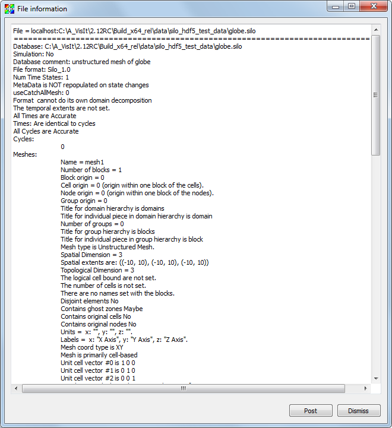

.. _File Information Window:

File Information Window
-----------------------

This **File Information Window**, shown in :numref:`Figure %s<fiw_image>`, 
displays information about the currently open file. The **File Information 
Window** is opened by choosing the **Files information** option from the 
**Main Window's File** menu. The window displays the names and properties of 
the open file's meshes, scalar variables, vector variables, and materials. 
The window updates each time the active file changes such as when switching 
between plots in the **Active plot list** or opening a new file using the 
controls in the **File panel**.

.. _fiw_image:

   File Information Window
