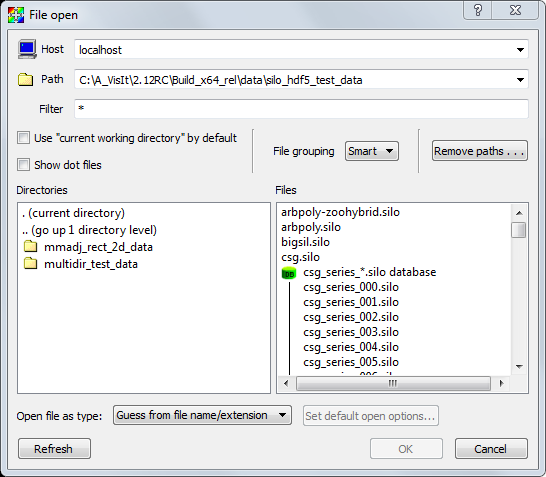

.. _File Open Window:

File Open Window
---------------------

The **File Open Window** allows you to select files and simulations by browsing 
file system either on your local computer or the remote computer of your 
choice. You can open the **File Open Window** by choosing the **Open** option 
from the **Sources** section of the main GUI panel (shown in 
:numref:`Figure %s<sources_image>`), or by Choosing the **Open File** option 
from the **File** dropdown menu.  When the window opens, its current directory 
is set to the current working directory or a directory from VisIt's preferences.
See :numref:`Figure %s<fow_image>`.

.. _sources_image:

.. figure:: images/sources_mainguipanel.png

   Main gui panel showing Sources section

.. _fow_image:

   File Open Window

Changing hosts
~~~~~~~~~~~~~~

One of VisIt's strengths is its ability to operate on files that exist on 
remote computers. The default host is: "localhost", which is a name understood 
by the system to be the name of your local computer. To access the files on a 
remote computer, you must provide the name of the remote computer in the
**Host** text field by either typing the name of a remote computer and pressing
the Enter key or by selecting a remote computer from the list of recently 
visited hosts. To access the list of recently visited hosts, click on the 
down-arrow at the far right of the **Host** text field.

Changing the host will cause VisIt to launch a database server on the specified 
computer so you can access files there. Note that if you do not have an account
on the remote computer, or if VisIt is not installed there, you will not be 
able to access files. Also note that VisIt may prompt you for a password to 
authenticate your access to the remote computer. To set up password-less 
access to remote computers, refer to :ref:`SettingUpPasswordlessSSH`.

Once a database server is running on the remote computer, its file system 
appears in the directory and file lists. The host name for each computer you 
access is added to the list of recently visited computers so that you may 
switch easily to computers you have recently accessed. If you installed VisIt 
with the provided network configurations then the list of recently visited 
computers also contains the hosts from the host profiles, which are covered 
later in this document.

Changing directories
~~~~~~~~~~~~~~~~~~~~

To select data files, you must often change the active directory. This can be 
done in two ways. The first way is to enter the entire directory path into the
**Path** text field and press Enter. You can use UNIX shell symbols, like the
"~" for your home directory, or the "../" to go up one directory from your 
current directory. The directory conventions used depend on the type of 
computer being accessed. A MS Windows computer expects directories to be 
specified with a disk drive and a path with back slashes 
(e.g. ``C:\temp\data``) while a UNIX computer expects directories with forward 
slashes (e.g.  ``/usr/local/data``). Keep the type of computer in mind when 
entering a path. After a path has been typed into the **Path** text field, 
VisIt will attempt to change directories using the specified path. If VisIt 
cannot change to the specified directory, the **Output Window** will appear 
with an error message and the **Path** text field will revert to the last 
accepted value. Another way to change directories is to double click the mouse 
on any of the entries in the directory list. Note that as you change 
directories, the contents of the **File list** change to reflect the files in 
the current directory. You can immediately return to any recently visited 
directory by selecting a directory from the **Path** text field's pull-down 
menu.

Default directory
~~~~~~~~~~~~~~~~~

By default, VisIt looks for files in the current directory. This is often 
useful in a UNIX environment where VisIt is launched from a command line shell
in a directory where database files are likely to be located. When VisIt is 
set to look for files in the current directory, the 
**Use "current working directory" by default** check box is set. If all of 
your databases are located in a central directory that rarely changes, it is 
worthwhile to uncheck the check box, change directories to your data directory, 
and save settings so the next time VisIt runs, it will look for files in your 
data directory.

Changing filters
~~~~~~~~~~~~~~~~

A filter is a pattern that is applied to the files in the **File list** to 
determine whether or not they should show up in the list. This mechanism allows 
the user to exclude many files from the list based on a naming convention, 
which is useful since VisIt's data files often share some part of their names.

The **Filter** text field controls the filter used to display files in the file 
list. Changing the filter will often change the **File list** as files are 
shown or hidden. The **Filter** text field accepts standard UNIX C-Shell 
pattern matching, where, for example, a "*" matches filter ("*") shows all 
files in the **File list**. Note that you can specify more than one filter 
provided you separate them with a space.

Virtual databases
~~~~~~~~~~~~~~~~~

A virtual database is a time-varying database that VisIt artificially creates 
out of smaller, single time step databases that have related filenames. 
Virtual databases allow you to access time-varying data without having to 
first create a ``.visit`` ``:ref:`Need a reference to .visit files`` file. The 
files that are grouped into a virtual database are determined by the file 
filter. That is, only files that match the file filter are considered for 
grouping into virtual databases. You can change the definition of a virtual 
database by changing the file filter.  A virtual database appears in the file 
list as a set of filenames that are grouped under a single filename that 
contains the "*" wildcard character. (:numref:`Figure %s <fgon_image>`) When you click on
any of the filenames in the virtual database, the entire database is selected.

You can tell VisIt to not automatically create virtual databases by selecting 
the ``Off`` option in the **File grouping** pull-down menu. When automatic file 
grouping is turned off, no files are grouped into virtual databases and groups 
of files that make up a time-varying database will not be recognized as such 
without a ``.visit`` file.  See :numref:`Figure %s <fgoff_image>`.

.. _fgon_image:

   File grouping turned on (Smart setting)

.. _fgoff_image:

   File grouping turned off

VisIt has two levels of automatic file grouping. The default level is Smart 
file grouping, which enables automatic file grouping but has extra rules that 
prevent certain groups of files from being grouped into virtual databases. If 
you find that Smart file grouping does not provide the virtual databases that 
you expect, you can back the file grouping mode down to On or turn it off 
entirely.

Refreshing the file list
~~~~~~~~~~~~~~~~~~~~~~~~

Scientific simulations often write out new data files as they run. The
**Refresh** button makes VisIt re-read the current directory to pick up any 
new files added by a running simulation. If the active source is a virtual 
database whose definition was changed by refreshing the file list, then VisIt 
will close and reopen the active source so information about new time states 
is made available.

Clearing out recently visited paths
~~~~~~~~~~~~~~~~~~~~~~~~~~~~~~~~~~~

The **File Open Window** maintains a list of all of the paths that have ever
been visited and adds those paths to the recently visited paths list, which 
can be accessed by clicking on the down-arrow at the far right of the
**Paths** text field. When you click on a path in the recently visited paths 
list, VisIt sets the database server's path to the selected path retrieves the 
list of files in that directory. If you visit many paths, the list of recently 
visited paths can become quite long. Click the **File Open Window's 
Remove Paths** button to activate the **Remove Recent Paths** window. The
**Remove Recent Paths** window allows you to select paths from the recently 
visited paths list and remove them from the list. The **Remove Recent Paths**
window is shown in :numref:`Figure %s<rrp_image>`.

.. _rrp_image:

   Remove recent paths window

Connecting to a running simulation
~~~~~~~~~~~~~~~~~~~~~~~~~~~~~~~~~~

Computer simulations often take weeks or months to complete and it is often 
necessary to visualize data from the simulation before it has completed in 
order to diagnose potential problems. VisIt comes with a simulation interface 
library that can be linked into your serial or parallel simulation application 
in order to provide hooks so VisIt can plot data from your running simulation. 
When instrumented with the VisIt simulation interface library, your simulation 
can periodically check for incoming VisIt connections. When VisIt successfully 
connects to your simulation, all of your simulation variables are available for 
plotting without having to write plot files to disk. During the time that VisIt 
is connected, your simulation acts as a VisIt compute engine in addition to its 
regular responsibilities. You can pause the simulation while using VisIt to 
interact with the data or you can choose to have the simulation continue and 
push new data to VisIt for plotting. For more information about instrumenting 
your simulation code with the VisIt simulation library interface, see the
`Getting Data Into VisIt 
<https://visit-dav.github.io/visit-website/pdfs/GettingDataIntoVisIt2.0.0.pdf?#page=151>`_
manual.

VisIt currently treats simulations as though they were ordinary files. When 
the VisIt simulation interface library is enabled in your application, it 
writes a special file with a ``.sim2`` extension to the ``.visit/simulations``
directory in your home directory (``%Documents%\VisIt\simulations`` 
on Windows).  Each ``.sim2`` file encodes the time and date it was created 
into the file name so you can distinguish between multiple simulations that 
VisIt can potentially open. A ``.sim2`` file contains information that VisIt 
needs in order to connect via sockets to your simulation.  If you want to 
connect to a simulation, you must select the ``.sim2`` files 
corresponding to the simulations to which you want to connect.
(:numref:`Figure %s<fow_sim_image>`).  Once that is done, connecting to a 
simulation is the same as opening any other disk file.

.. _fow_sim_image:

.. figure:: images/OpenASimulation.png

   Accessing a simulation using the File Open Window
